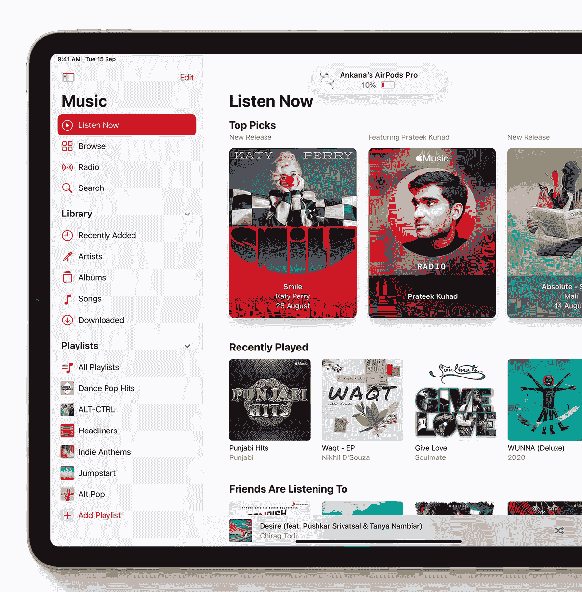
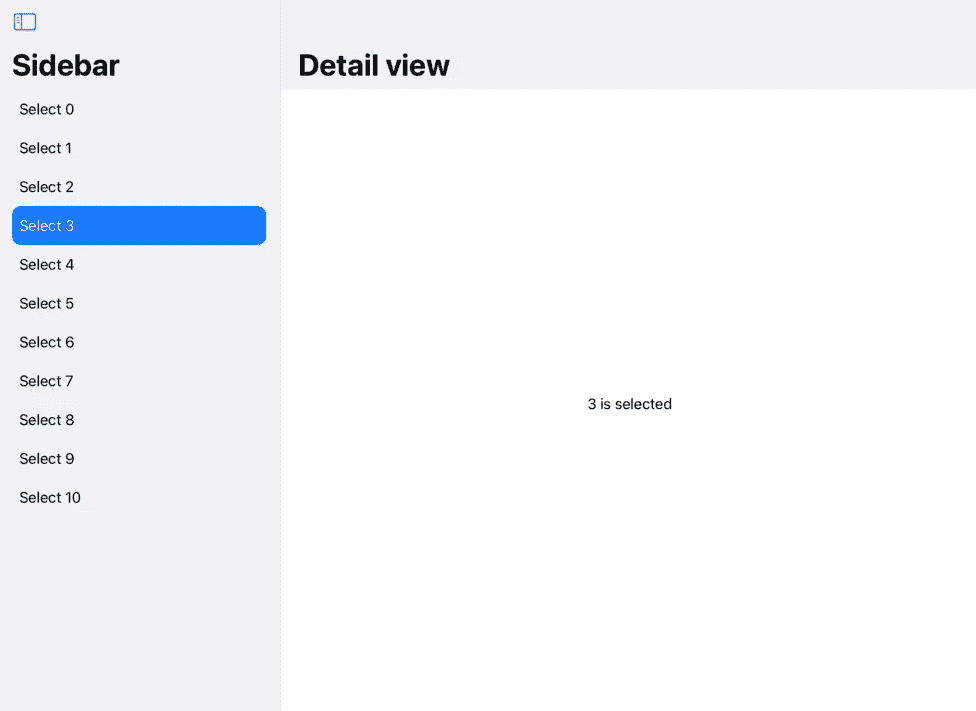
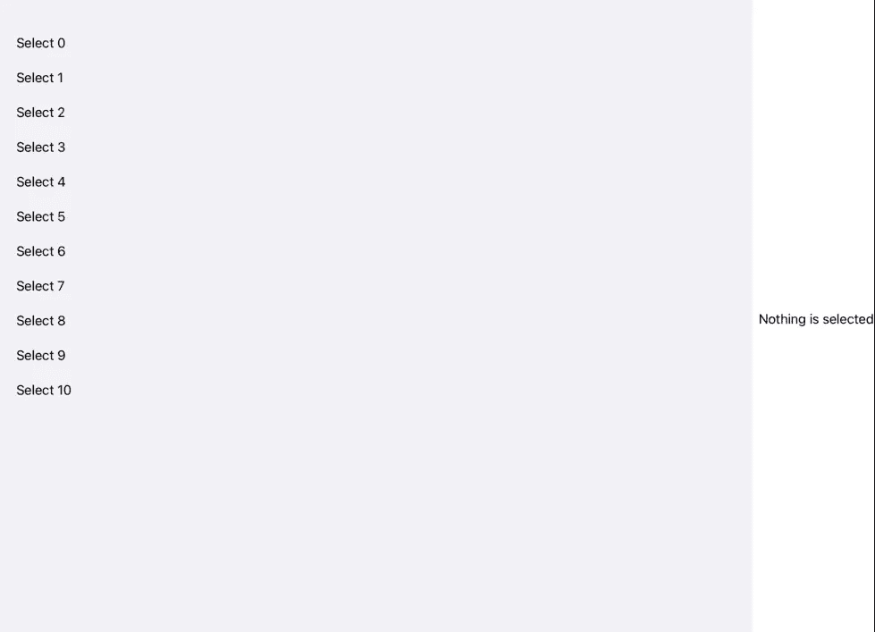
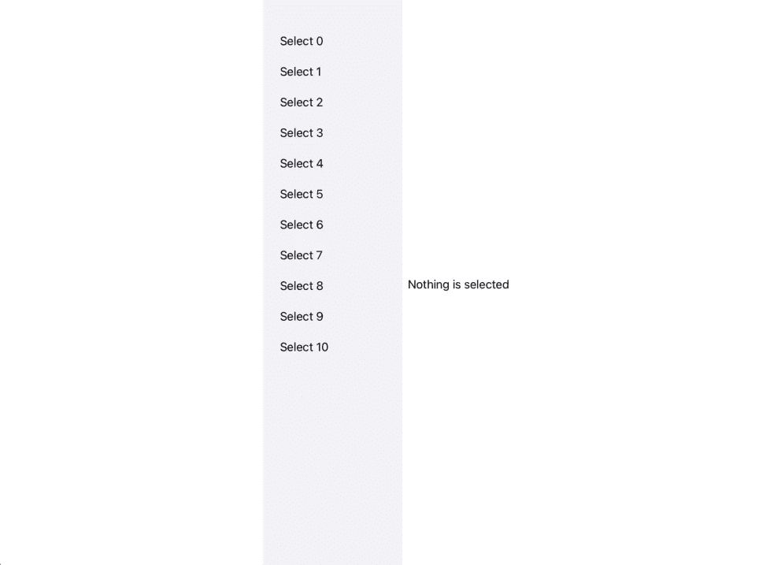
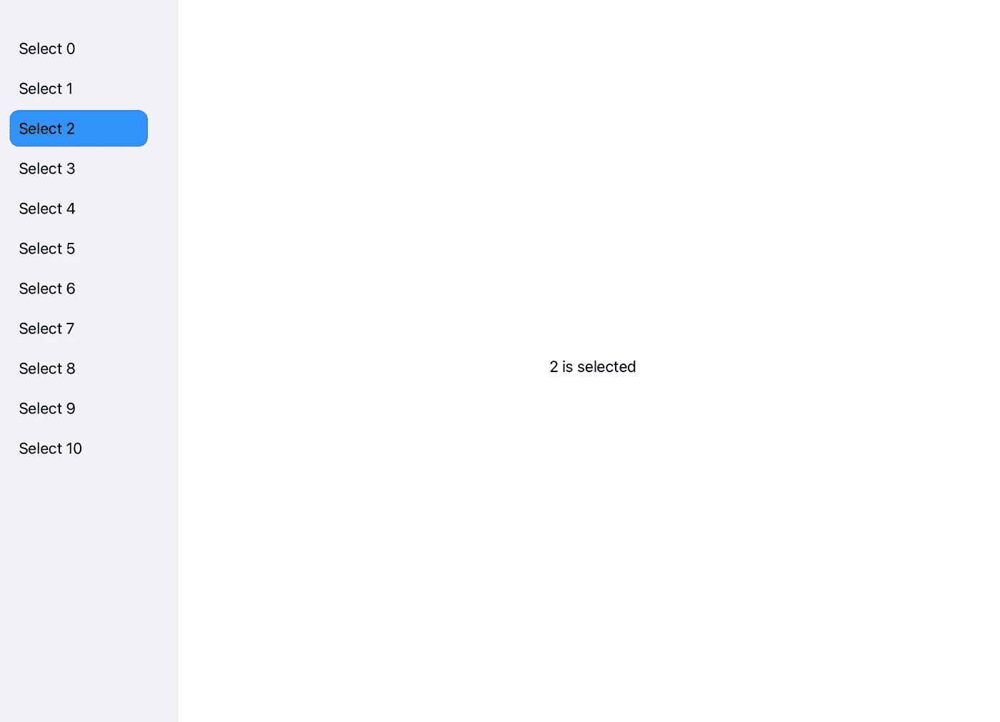

# 在没有 NavigationView 的 SwiftUI 中使用侧栏

> 原文：<https://betterprogramming.pub/using-sidebar-in-swiftui-without-a-navigationview-94f4181c09b>

## 了解 SwiftUI 的新侧边栏

苹果展示其音乐应用的侧边栏

SwiftUI 真的很容易和快速的原型 UI。许多开发者用不同的措辞表达了这种观点。

但是 SwiftUI 如何应对现实项目的复杂需求呢？目前，它的生产时间只有一年多一点，我们在 App Store 中找不到很多 SwiftUI 应用。

但是，如果有任何构建和发布 SwiftUI 应用的好时机，那就是现在。

声明:你的应用的最低目标需要是 iOS 13。

尽管 SwiftUI 的大部分产品特性只在 iOS 14 中提供，但你可以为 iOS 13 构建一个不错的应用，当用户更新时，它会变得非常出色。

以许多应用程序中集合视图的常见需求为例。你可以在 iOS 14 中使用新的惰性网格，并下降到`VStack`和`HStack`的组合，正如 Paul 在本文[中为 iOS 13](https://www.hackingwithswift.com/quick-start/swiftui/how-to-position-views-in-a-grid-using-lazyvgrid-and-lazyhgrid)所解释的。此外，如果你的要求可以使用列表来满足，那么在 iOS 13 中使用它。

但是如果您的需求很复杂，或者您想稍微调整一下默认行为，您可能会发现这很困难。今天我们将处理一个这样的场景，我希望对默认行为进行一些调整。在接下来的几周里，我们会看到更多。

`SidebarListStyle`是今年推出的，让你很容易在应用中获得默认的侧边栏行为。

就这几行，你就可以在一个漂亮的主细节布局中得到侧边栏的默认行为。

带有默认行为的边栏

你得到了很多现成的东西:一个带有间隔列表项的侧边栏，没有分隔符，一个很好的选择指示，以及一个切换侧边栏可见性的按钮。如果您为列表项使用新的`Label`，图像将出现在`accentColor`中。太酷了，只用了几行代码！现在我的要求是有侧边栏和细节视图，但我不希望它们在一个`NavigationView`内。听起来很简单，对吧？让我们试试。

对 SplitView 使用 HStack

输出是…

这不是我期望从上面的代码中看到的。但是 SwiftUI 视图对环境做出反应；你可以说 SwiftUI 视图依赖于环境。我们得到了没有分隔符的间隔列表项，但没有选择，因此点击时没有高亮显示，我们需要以所需的大小框住视图。

我不知道为什么移除`NavigationLink`会停止`List`选择的工作。你可以通过给`Text`增加一个`onTapGesture`来让它工作。列表中的`selection`参数不再需要。您可以使用`frame`修改器来固定侧边栏的宽度。

这次让我们碰碰运气。

同样，这不是我所期望的，但是 SwiftUI 完美地完成了它的工作。我们可以通过在`detailView`前后添加一个`Spacer()`来轻松解决这个问题。

该功能工作正常，因此您可以轻按任何项目来选择它。但是没有哪个项目当前被选择的视觉指示。为了突出显示选择，添加一个带有`accentColor`的`background`。

这是最终的输出。

期望的结果

下面是获得该输出的代码。

我们使用了一个`HStack`和一个`contentShape`修饰符，这样点击列表项的任何地方都可以进行选择。

这不是完美的解决方案，但这是可行的。我花了一些心理准备来公开分享可行的解决方案，而不是一直等待完美的解决方案。

编码快乐！