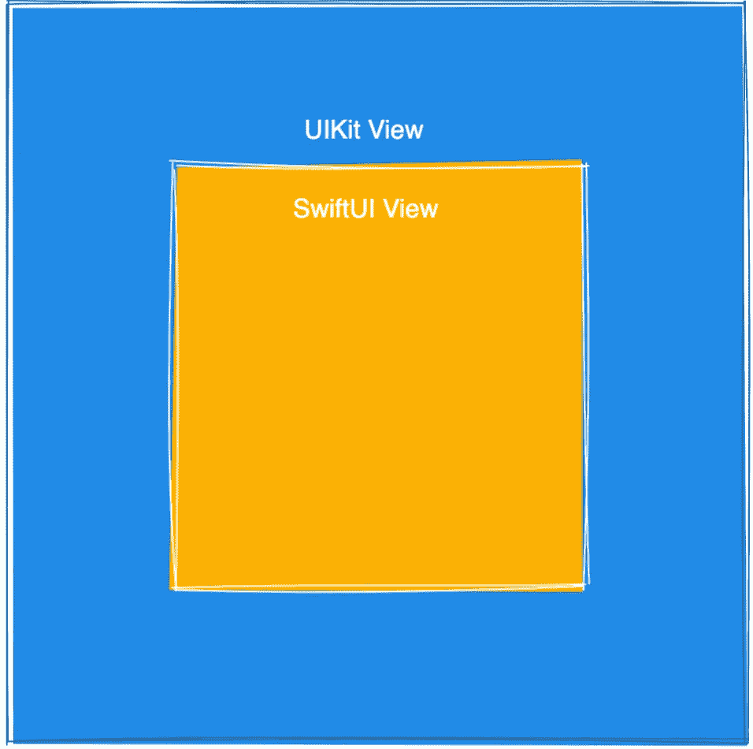
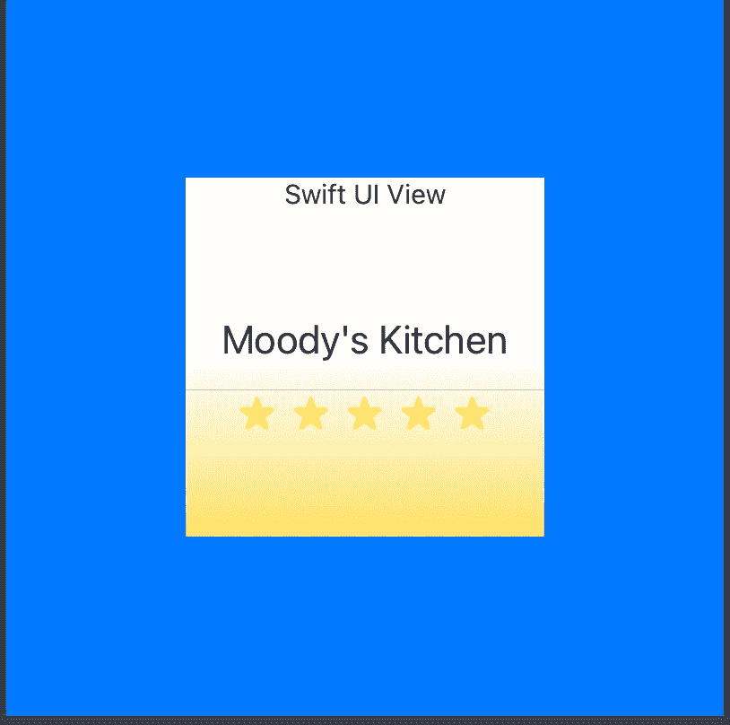

# 如何在 UIKit 视图中使用 SwiftUI 视图

> 原文：<https://betterprogramming.pub/using-swiftui-view-inside-a-uikit-view-efd44e06f10c>

## 看一看有前途的 iOS 16 新功能

自从 SwiftUI 随 iOS 13 推出以来，它就开始在 iOS 开发者中流行起来。

许多应用程序已经开始采用它。除了 SwiftUI，还有很多应用程序主要是使用传统的 UIKit 框架编写的。

可能无法很快用 SwiftUI 取代这些应用。但是有可能在现有 UIKit 代码的基础上实现一些新特性，让团队获得信心并熟悉 SwiftUI。

这是一个简单的概述，介绍了如何在一个 **UIKit** 视图中使用一个 **SwiftUI** 视图，旁边还有一个非常简单的例子，可以在 Xcode 游乐场运行(上面的 Xcode 13 &)

# 结果呢

代码片段的最终结果如下所示。

外部视图(UIKit)为系统蓝色，内嵌 SwiftUI 视图！

# 创建 UIKit 视图

首先创建一个`UIKit`视图，其中包含一个占位符子视图。`UIKit`视图有一个系统蓝色背景。我们在中心插入一个子视图，作为显示 SwiftUI 视图的占位符视图。

# 创建 SwiftUI 视图

接下来，定义一个 SwiftUI 视图。该视图在一个`ZStack`视图内的堆栈中呈现了一个`LinearGradient`、`Text`、`Divider`视图组件和一些系统映像。

# 使用 UIHostingViewController 作为桥

最后，通过将 SwiftUI 视图包含在 UIKit 视图中，将所有这些整合在一起。这里的关键是使用 SwiftUI 提供的`UIHostingViewController`作为 UIKit 和 SwiftUI 之间的桥梁。我们用一个`rootView`来初始化它。

`UIHostingViewController`可以直接使用，如果需要更好的控制，也可以将其子类化。然后它将允许访问 API，在那里我们可以控制视图生命周期方法，如`viewWillAppear`、`viewDidAppear`等等。

完整的例子可以在这里找到[。](https://gist.github.com/mvemjsun/72b3c9834c2be76a53720d6efbc93119)

# 参考

[https://developer.apple.com/xcode/swiftui/](https://developer.apple.com/xcode/swiftui/)

[https://developer . apple . com/documentation/swift ui/uihostingcontroller](https://developer.apple.com/documentation/swiftui/uihostingcontroller)

【https://developer.apple.com/tutorials/swiftui】

# 结论

即使您一直在使用 Swift 和 UIKit 进行开发，SwiftUI 中也有很多东西需要学习。对诸如函数式反应式编程(FRP)、数据绑定和视图状态等思想和概念的理解是需要探索的一部分。

来自苹果的教程是一个很好的入门资源，将会覆盖很多领域。在课程结束时，您将能够理解 SwiftUI 所提供的功能以及如何实施其中的许多知识。