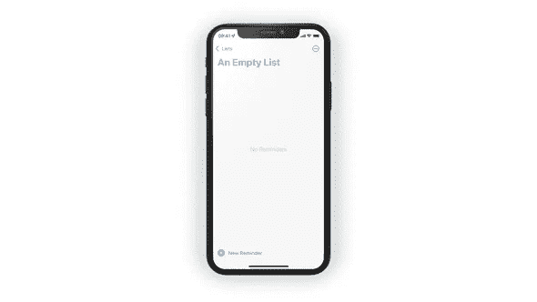
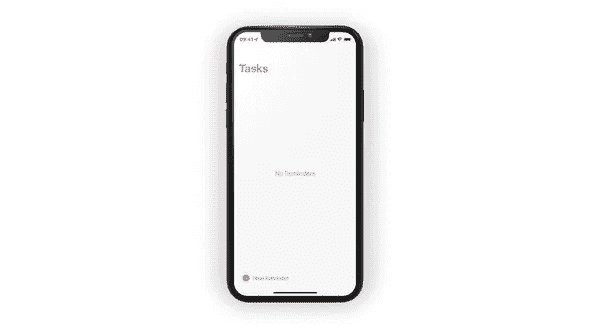

# 使用 SwiftUI 视图修饰符显示空状态

> 原文：<https://betterprogramming.pub/using-swiftui-view-modifiers-to-display-empty-state-5145f220de56>

## 创建有意义的空状态


图片由作者根据科幻符号绘制

空态是 UX 的一个[重要方面——这是用户第一次打开你的应用时看到的，俗话说，没有第二次机会留下第一印象——所以最好是好的。向用户展示一个有意义的空状态会让他们感到受欢迎，这是你教育他们如何开始使用应用程序的一个好机会。](https://www.toptal.com/designers/ux/empty-state-ux-design)

到目前为止，Make It So 没有显示有意义的空状态，在本文中，我们将研究实现这一点的几个选项。

# 我们将要建造的

首先，让我们来看看苹果的提醒应用程序(因为这是我们试图复制的应用程序):



苹果提醒应用中的空状态

实现空状态的一个简单方法是使用 Xcode 的 *Make Conditional* 重构( *CMD +在一个视图上点击*，然后选择 *Make Conditional* )。这会将视图包装在一个`if ... else`语句中，并将整个结构包装在一个`VStack`语句中:

不算太坏，但是这给我们的视图代码增加了视觉噪声——让我们看看是否可以改进这一点。

# 使用 ViewModifier 管理空状态

视图修饰符是 SwiftUI 的主要特性之一，它使编写 SwiftUI 代码成为一种愉快的体验。如果没有视图修饰符，配置视图的唯一方式就是它们的初始化器，这会导致非常糟糕的开发体验。

多亏了视图修改器，我们可以像这样配置视图:

代替这个(假设的代码):

在调用点，用于向视图添加空状态的视图修饰符可能如下所示:

让我们来看看如何建立这个。视图修改器通常由两部分组成:视图修改器本身，以及使其更易于使用的扩展。让我们从视图修改器开始。

所有视图修改器都可以通过`body`功能的`content: Content`参数访问他们操作的视图。此外，我们还声明了两个属性:

*   `isEmpty`让呼叫者表明是否显示空状态
*   `emptyContent`是一个闭包，当`isEmpty`为`true`时，它返回我们想要显示的视图

要在视图上使用这个修饰符，我们必须编写以下代码:

这看起来不太用户友好。

# 添加扩展以改善开发人员的体验

让我们在`View`上定义一个扩展，让它更容易使用:

现在我们可以像预期的那样使用视图修改器了。这是 Make It So 的主列表视图，应用了视图修改器:



你可以在[这个 GitHub repo](https://github.com/peterfriese/MakeItSo/tree/develop) 的 [develop](https://github.com/peterfriese/MakeItSo/tree/develop) 分支中找到 Make It So 的源代码，包括视图修改器。

感谢阅读！

```
**Want to Connect With the Author?**If you’re interested in following along with the further development of the app, [subscribe to my newsletter](https://www.getrevue.co/profile/peterfriese), [follow this Twitter thread](https://twitter.com/peterfriese/status/1453467058302291975) — and feel free to join the conversation!*Originally published at* [*https://peterfriese.dev*](https://peterfriese.dev/swiftui-empty-state/)*.*
```