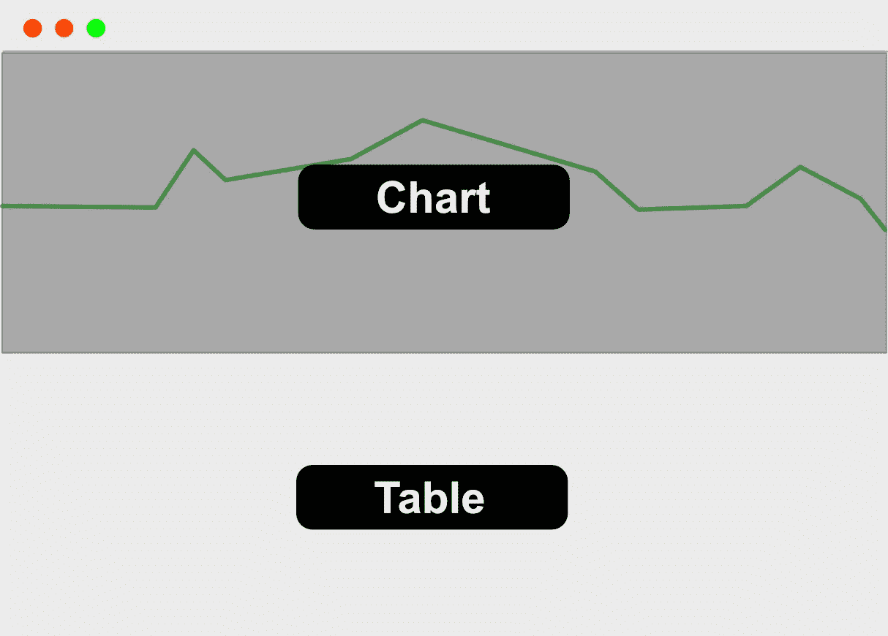
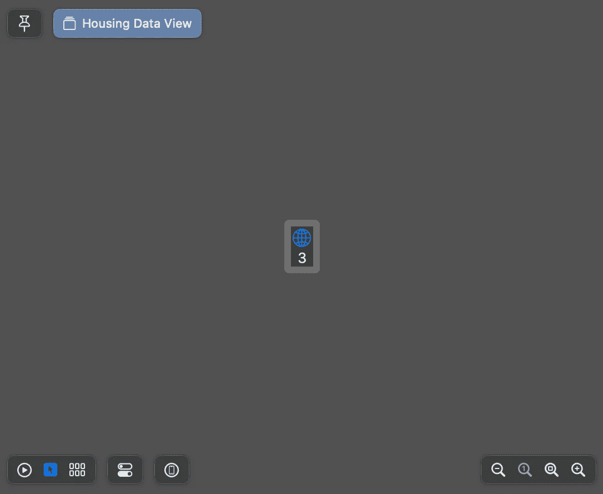
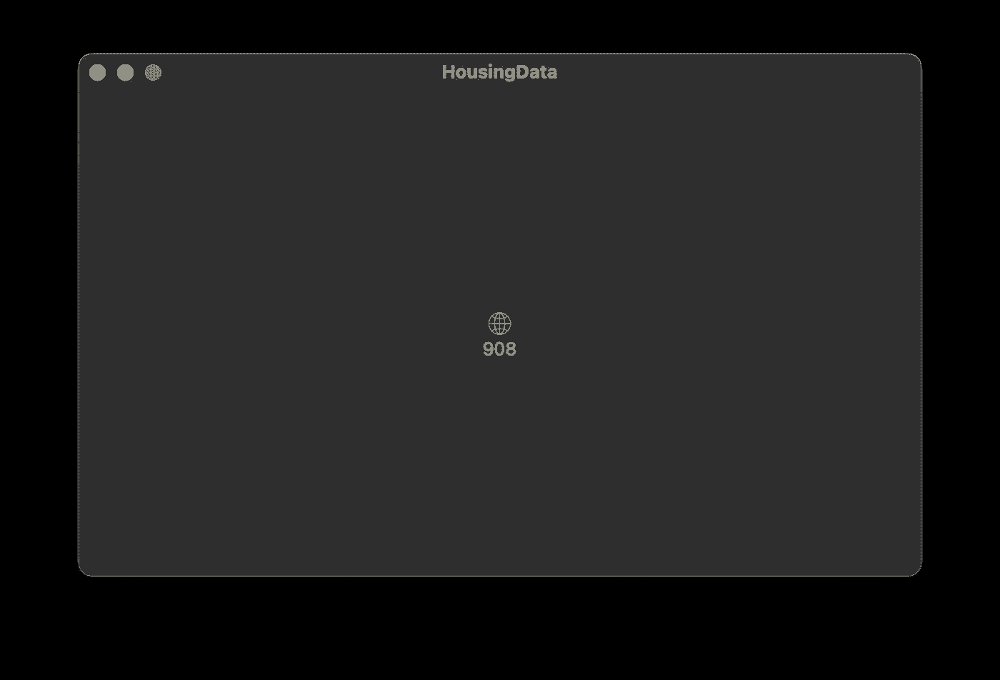
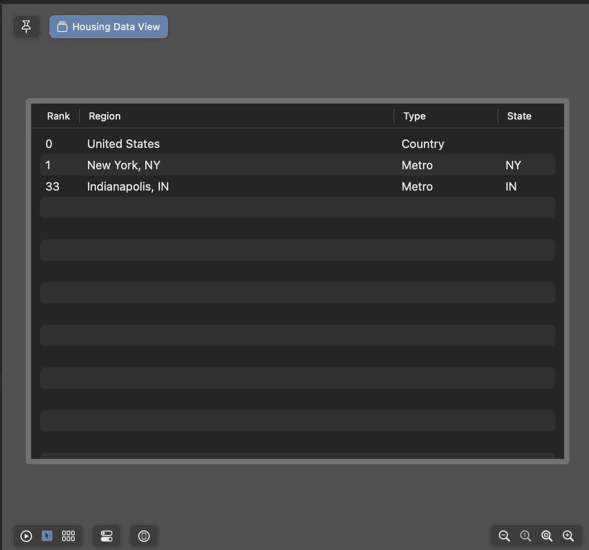
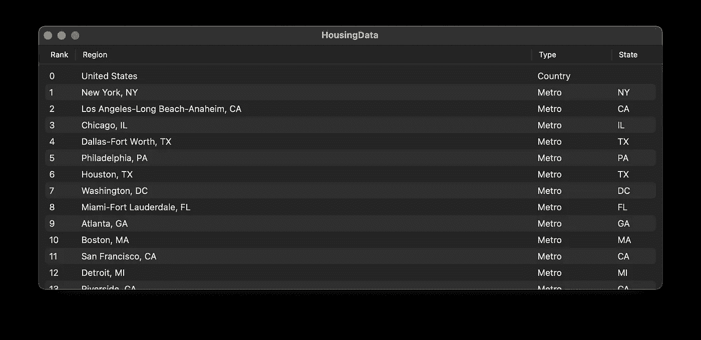

# 如何使用 SwiftUI 表格和图表在 macOS 中显示住房数据

> 原文：<https://betterprogramming.pub/using-table-from-swiftui-4-to-display-housing-data-ace1b1c616d9>

## 利用 SwiftUI 4 的强大功能


在之前的一篇文章中，我写了一个 CSV 解析器。一个示例应用程序用于解析从 Zillow 检索的住房数据。在接下来的几章中，我们将编写一个应用程序来显示表格和图表中的数据。

我会把它分成小块。第一章是关于数据解析。第 2 章将介绍 SwiftUI 表类。第 3 章将全部关于 SwiftUI 图表。

# 第 1 章:概述和模型

## 挑战

住房数据很大。编写本文时的 CSV 是 909 行 x 265 列。我们的想法是看看 SwiftUI 在处理大数据时有什么限制。目标是只使用 SwiftUI，不使用 UIKit。

在此过程中，我们将讨论 SwiftUI 表格和图表的局限性，并围绕它们进行设计。

## 快速规范和设计

目标是能够选择不同的住房区域，并在图表上进行比较。住房区域将以表格形式呈现，图表数据将用于 SwiftUI 4 的图表。我们将保持设计的简单性，在表格上方有一个图表。



所有数据都将从 Zillow 的住房数据中检索。我们将逐月观察美国和主要大都市地区的房屋定价中值。

这个项目将需要 macOS Ventura 和最新的 XCode 14 测试版。在撰写本文时，两者都处于测试阶段。

## Xcode 项目

1.  打开 XCode 14。
2.  使用单元测试创建一个新的 SwiftUI 项目。

## 添加 CSV 解析器

在上一篇文章中，我写了一个命令行 CSV 解析器。我已经把它变成了一个名为 EasyCVS 的包，可以用来解析 CSV 文件。要添加包，请执行以下操作:

1.  从文件菜单中选择添加包
2.  将 https://github.com/scottandrew/EasyCSV.git 放入搜索框
3.  按“添加包”。

## 逗号分隔值（csv）文件格式

```
RegionID,SizeRank,RegionName,RegionType,StateName,2018-01-31,...
102001,0,United States,Country,,271600.0,...
394913,1,"New York, NY",Msa,NY,517967.0,...
753899,2,"Los Angeles-Long Beach-Anaheim, CA",Msa,CA,798670.0,...
```

*   第 0 行是列标题。数据从第 1 行开始。
*   列 0 =区域 id 的整数
*   第 1 列=尺寸等级的整数
*   第 2 列=字符串形式的区域名称
*   第 3 列=字符串形式的区域类型
*   第 4 列=字符串形式的州名或 null
*   第 5 列到最后一列是表示中间价格的 double 值或 null。

## 价格数据

创建`PriceData.swift`文件来存储数据的中间价格和日期。如果没有数据，可以有空列，因此`value`属性需要是可选的。

`PriceData`需要是`Identifiable`，这样对于一个系列来说才是唯一的。所以这个日期将被用作我们的身份证。

## 区域数据

创建`RegionData.swift`并添加以下代码:

区域数据将有助于定义表中的行。每个地区的`PriceData`将被绘制成图表。初始化器将获取一行数据，并从头部获取日期数组。

有一个`ColumnIndex`枚举来定义行中值的索引。注意这里有一个`firstDate`的索引，这是用于价格数据的第一列的索引。最棘手的部分是将日期映射到中间价格。

为了创建`PriceData`数组，我们从`dateStartIndex`中取值到数据数组的末尾。我们将使用`zip`来组合这些值，然后将结果映射到一个`PriceData`结构。

字符串上的`.toDouble`和`.toInt`调用在这里是为了方便。助手将尝试从字符串创建一个`Int`或`Double`。如果失败，将引发错误。用以下代码创建一个`String+Utility.swift`文件:

## HousingDataParser

需要一个小的解析引擎来处理从数据行(字符串数组)到数组`HousingData`的转换。

创建一个具有两个函数的`RegionDataParser.swift`文件`parse(url:)`将用于解析数据。`extractDataColumns(from)`将用于创建与日期匹配的值，并为区域创建值数组。

代码中有趣的是第一列 0 是标题。我们想从标题中提取日期。如果我们缺少日期，或者不能解析日期，就会抛出一个错误。假设 CSV 中有相同数量的日期和中值。

## 解析器的单元测试

解析器需要用一些样本数据进行测试。我从 Zillow 下载了一些[样本数据](https://files.zillowstatic.com/research/public_csvs/zhvi/Metro_zhvi_uc_sfr_tier_0.33_0.67_sm_sa_month.csv?t=1660691326)来使用。我将该文件重命名为 TestData.json。

1.  解析文件
2.  验证区域的数量。
3.  验证包含一些空列的两个区域。
4.  验证每行中值的数量。

# 第 2 章:数据模型和表

## 预览数据

要使图表与预览一起工作，我们需要一些数据。我将创建一个包含住房数据子集的本地 CSV 文件。

1.  右键单击项目树中的`Preview Content`文件夹
2.  从模板选取器的另一个组中选择“空”。
3.  将文件命名为 PreviewData.csv
4.  复制 TestData.csv 文件的前两行。
5.  从 TestData.csv 的数据中复制 Indianapolis。这有空列，所以它是很好的预览数据。

## 视图模型

我将使用一个 light `ViewModel`来包装我们的解析器并管理我们的数据加载。视图应该是关于查看获取的数据。有几个目标:

*   我们希望从 Zillow 异步加载最新数据。
*   我们想让视图模型在 SwifUI 的预览中表现良好。

我将创建一个新的`HousingDataModel.swift`文件:

1.  将类包装在`@MainActor`属性中，这保证了发布的数据通知发生在主线程上。
2.  检查代码是否在 SwiftUI 预览中运行。如果是，我们将加载预览 CSV 文件。否则，从互联网加载数据。
3.  以保证加载最新的数据。URL 的`t`参数是今天的纪元日期(自 1970 年以来的日期),为整数。`TimeInterval`是一个`Double`来对它进行类型转换，我将从`Double`创建一个`Int`

## 住房数据视图(第一遍)

我将在视图中快速浏览第一遍，以确保解析工作正常。在此之前，我们需要确保我们可以在应用程序中接收来自互联网的数据。

1.  导航到住房数据目标
2.  在*签名&功能*面板中，勾选*传出连接(客户端)*复选框。

我要把`ContentView`改名为`HousingDataView`。

1.  打开`ContentView.swift`文件。
2.  选择`ContentView`类名并点击右键。
3.  从上下文菜单中选择*重构- >重命名*。
4.  HousingDataView 类型

这将重命名`ContentView.swift`文件和视图结构。现在我想清理预览类以保持一致性。将`ContentView_Preview`重命名为`HousingDataView_Preview`

我将保留示例代码，但更改“Hello World”文本字段，使其显示已解析的行数。

1.  观察`HousingModel`的变化
2.  用解析的行数替换“Hello World”文本
3.  当视图被加载时，使用`.task`修饰符来异步加载我们的数据。出现错误时，将显示“哎呀”。这很快就会得到解决。

现在，当预览视图时，将显示 3。当应用程序运行时，数据加载后，该值将更新为 908。



SwiftUI 预览



运行应用程序

## SwiftUI 表

从 SwiftUI 3 开始，表就在 SwiftUI 中了。SwiftUI 中表的限制是它们限于 10 列。因此，我们不能构建显示所有列的滚动电子表格视图。为了解决这个限制，应用程序将在表中显示等级、地区名称、地区类型和州。

表包含一组使用 TableColumnBuilder 构建的列。如果值为`String`或支持`StringProtocol`，则 TableColumns 可以直接链接到 RegionData 属性。如果该值是可选的或者不符合`StringProtocol`，则需要创建一个视图。

1.  对于非可选的字符串数据，创建一个直接指向行区域中的属性的表列。
2.  对于区域的类型(枚举)和等级(整数),插入带有给定值的文本字段。我们可以在这里返回任何 SwiftUI 视图。
3.  对于可选的状态，需要插入一个带有值或空文本的文本视图。即使没有数据，列中也必须有视图。
4.  除“名称”列之外的所有列都有一个设定的宽度。

由于“预览”设置为处理数据，因此该表显示在带有 3 个测试行的“预览”中。



SwiftUI 预览

运行该应用程序将允许您滚动浏览所有区域数据。



运行应用程序

## 处理抛出的错误

在本文的开头，我用打印“oops”的打印语句处理了数据获取中的任何错误。我认为显示一般性错误的警告会更好。

首先，我将添加一个新的私有状态变量来触发警报的可见性。

当捕捉到错误时，`.task`修改器需要将`showError`标志设置为真。仅仅设置布尔值就可以了，因为 SwiftUI 保证视图的`body`构建在主线程上。

为了显示警告，我将在`VStack`中添加一个`.alert`修饰符。这将只显示一个基本的警告，并在单击“确定”按钮时消除它。

完整的`HousingDataView`视图现在看起来如下:

# 第 3 章:图表和拆分视图

## 一点重构

为了稍微清理一下代码，我将把列表和图表代码移到两个视图构建器中。

打开`HousingDataView.swift`文件，我将创建一个新的`table`视图构建器，并将表创建代码移入其中。

我还将创建一个空的`chart`视图构建器，暂时返回一个简单的`Rectangle`。

我将把这些放在一个`VSplitView.`中，这允许用户通过上下拖动分割器的条来控制可以看到多少胶带和图形。我将用包含对`chart`和`table`的调用的`VSplitView`来替换`VStack`。

## 表格选择和焦点

我无法在图表中显示所有 900 多行。当试图在线图中绘制大量数据集时，图表将无法读取，SwiftUI 会崩溃。为了解决这个问题，我将选择的数量限制为 10 个。我将添加一个状态变量来收集选定的条目 id。

这里一个有趣的问题是选择是在一个集合中，而不是在一个数组中。因此，当添加新项目时，选择的顺序可以改变。没有简单的方法可以解决这个问题，不需要大量的预订，因为`Set`是一个有序的集合。我想尽可能简单。

我需要告诉表在哪里存储选择。我将选择指向`$selectedItems`,这样每当一个项目的选择改变时，表格将更新所选择的项目集。

在加载之后，我想做的另一件事是确保表成为焦点视图，并且第一项被选中。首先，我将添加一个焦点状态变量。

表格需要一个`focused`视图修饰符，它根据`inFocus`标志告诉视图它的焦点状态。这里是完成的`Table`。

下载完数据后，我将更新`VSplitView`上的`task`修饰符来选择列表中的第一项，并使表格成为焦点视图。

## 图表

我将创建一个简单的折线图，只画出所选行的点。需要记住的一点是，行存储在一个集合中，这是 Swift UI 的表所要求的。因为集合是一个无序的集合，所以画线的顺序可能会改变。

我将在一个`if`语句中包装矩形，检查是否有实际数据。如果没有数据，我将返回一个 300 单位高的空的`Rectangle`。否则，我将放入一个带有一些填充的图表，并将最小和理想高度设置为 300 个单位。

对于每一个选定的项目，我会映射每个金额。X 值是数据的月份和年份。Y 值将是平均房价。我将让 swift UI 根据行的城市自动给每一行和图例值着色。

## 限制数量选择

在文章的顶部，我说我想将选择的项目限制在 10 个。我需要存储用户试图选择 10 个以上项目时可以使用的最后选择的行。我将向`HousingDataModel`添加一个公共的`lastSelection`属性

在`VStack`的结尾，我会添加一个修饰符，当`selectedItems`改变时会被调用。逻辑很简单:

*   如果所选项目计数小于或等于 10，则将该选择存储为模型中的最后一个选择。
*   如果选择的项目计数大于 10，我将选择恢复到保存在模型中的最后一个集合。

现在运行应用程序将从 Zillow 加载最新数据，并在我们的表中绘制所选行。如果您看到选择的顺序与挑选的顺序不匹配，请记住，这是因为表选择存储在一个无序的集合中，其顺序没有保证。

# 结论

即使有表格和图表的限制。运行一个简单的应用程序很容易，它可以下载数据，在一个有多个选择的表格中显示数据，并在图表中绘制数值。最终的项目可以在 [GitHub](https://github.com/scottandrew/HousingData.git) 上找到。