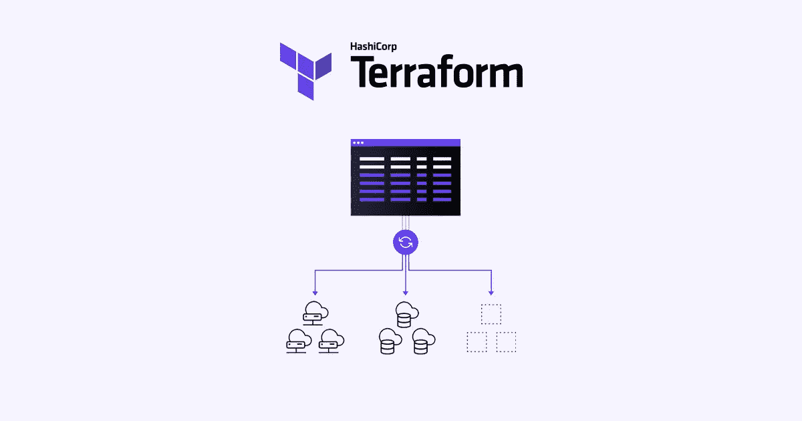
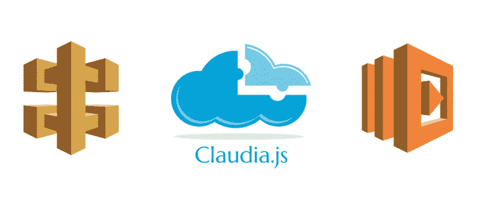

# 将 Terraform 与 AWS 圣杯一起使用

> 原文：<https://betterprogramming.pub/using-terraform-with-aws-chalice-54dca10a72bd>

## 如何利用 Terraform 和 AWS 圣杯的力量

如果您曾经需要通过代码创建基础设施，那么您可能听说过 [Terraform](https://www.terraform.io/) ，“一种安全有效地构建、更改和管理基础设施的工具”



([https://www . hashi corp . com/products/terra form/infra structure-as-code](https://www.hashicorp.com/products/terraform/infrastructure-as-code))

尽管 AWS 为类似的目的提供了 [CloudFormation](https://aws.amazon.com/cloudformation) ，但 Terraform 提供了一个更加优雅的解决方案，并且由于该工具的可用性和易于阅读的代码，越来越受到许多开发人员的青睐。

许多 AWS 产品都有功能强大、易于使用的库和工具，这些库和工具构建于其上，使开发和部署变得更加容易。这样的工具包括 [Claudia API Builder](https://github.com/claudiajs/claudia-api-builder) 和 [AWS Chalice](https://github.com/aws/chalice) ，它们分别支持在 Nodejs 和 Python 中的 AWS 上创建无服务器应用。



([https://Ivan jov . com/building-server less-API-with-Claudia-API-builder/](https://ivanjov.com/building-serverless-api-with-claudia-api-builder/))

那么，当开发人员想要使用 Terraform 来管理他们的基础设施**和**利用这些工具的能力来创建无服务器应用时，会发生什么呢？

# 选项 1:一切使用 Terraform

一个解决方案是使用 Chalice 创建一个[部署包](https://chalice.readthedocs.io/en/latest/topics/packaging.html)，并通过您的 Terraform 配置部署它。这将需要您手动配置 Lambda 函数、API 网关端点，可能还有您希望使用的任何授权器——所有这些都是 Chalice 自动完成的。

当我遇到这个问题时，我觉得这个解决方案牺牲了很多 Chalice 设计提供的好处。如果你想了解这种方法的细节，请点击这里查看。

# 方案二:两者并用！

相反，我们可以利用 Terraform 的本机功能与 Chalice 进行交互，为您提供两种工具的最佳功能。

该解决方案围绕 Terraform 的[本地文件](https://www.terraform.io/docs/providers/local/r/file.html)资源和`[local-exec](https://www.terraform.io/docs/provisioners/local-exec.html)` [供应器](https://www.terraform.io/docs/provisioners/local-exec.html)展开，前者使您能够生成文件，后者使您能够在创建资源后调用本地可执行文件。

总之，这些工具允许我们创建一个地形配置来生成和部署一个圣杯配置:

这里发生了一些事情:

1.  `chalice_config`资源读取一个`base-config.json`，并插入变量`user_pool_name`和`user_pool_arn`。我在这个例子中使用的`base-config.json`如下:

如你所见，这只是使用 Terraform 中的变量填充了`environment_variables` 。

2.第一个`local-exec`置备程序调用

```
rm -r .chalice/deployed && chalice deploy
```

这只是删除任何旧的部署配置，然后调用`[chalice deploy](https://github.com/aws/chalice#deploying)`。这是将您的代码实际部署到 AWS 并创建基础设施的步骤。

3.第二个`local-exec`置备程序不会被使用，直到你调用`[terraform destroy](https://www.terraform.io/docs/commands/destroy.html)`。当你想摆脱你的地形基础设施时，你不会想留下所有的圣杯基础设施。因此，我们称类似的圣杯命令为`chalice delete`。

注意:

*   如果你根本不需要改变你的配置文件，你可以跳过第一步。
*   示例代码可能需要一些修改，因为它假设您的 Chalice 应用程序在同一目录中。在我的配置中，文件结构如下所示:

```
.
+-- terraform_config/
|   +-- chalice_app/
|   |   +-- .chalice/
|   |   |   +-- base-config.json
|   |   +-- app.py
|   +-- configuration.tf
|   +-- variables.tf
```

# Tada！就是这样！

这就是全部了！

您不必担心 IAM 策略、Lambda 配置、API 网关授权器和阶段，或者其他任何东西——Chalice 为您做了这一切。

更好的是，如果您需要创建其他基础设施，您也可以使用 Terraform 来完成！您可以在一个文件中部署一个 Chalice 无服务器应用程序，创建一个 Cognito 用户池，并创建一个 S3 桶。

# 资源

*   [示例地形脚本](https://gist.github.com/hsyyid/24d27024b89ca5bf5a6a39c747dfdf4e)
*   [基本圣杯配置](https://gist.github.com/hsyyid/5c0272cc2d2bf5935e7d55fe72347459)