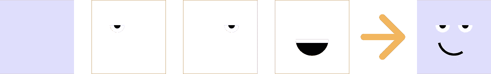
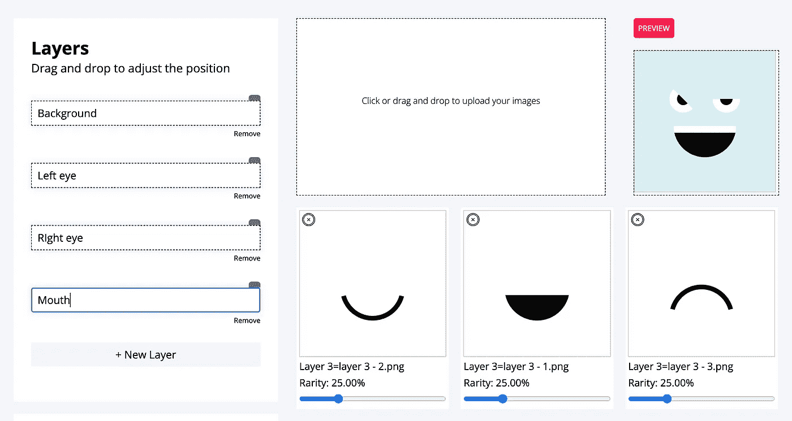

# 使用 Canvas API 通过 Node.js 生成 NFT 集合

> 原文：<https://betterprogramming.pub/using-the-canvas-api-to-generate-an-nft-collection-with-nodejs-add56035c40f>

## 先睹为快 NFTooze 项目



NFT 集合通常指的是从同一组单独的可组合特征生成的一组 NFT，如眼睛、鼻子和做脸的嘴。

生成这些图像的简单逻辑是使用 Canvas API 将每个图像从后向前绘制为一个层，将 Canvas 导出为一个图像，清除，并使用不同的特征集重复相同的过程。

这个实现来自于我构建的一个小平台，它使用相应的元数据生成 NFT 集合，没有代码，名为 [**NFTooze**](https://nftooze.com)



安装和导入软件包

```
npm i canvas file-saver jszip
```

为了能够保存生成的图像，我们需要再安装两个包，`file-saver`保存单个文件，`jszip`为整个集合创建一个 zip 文件夹。

在安装和导入包之后，我们将创建一个**引擎类**，它将保存集合生成所需的不同方法。

`size`变量代表我们画布的`width`和`height`，它们对于每张用于合成的图像应该是相同的。

我们的类变量包含我们需要声明的类型。

每个图层都代表一个由多幅图像组成的 NFT，正如你在上面的定义中看到的那样。

我们需要一个构造函数和其他一些方法来实例化或设置我们的类变量。

画完 NFT 后，我们需要使用上下文的方法`clearRect`清空画布:

绘制图像是最重要的步骤之一，这是通过从图像路径加载图像，并使用`ctx.drawImage`将其绘制到画布上来实现的:

一旦图像被绘制到画布上，它就可以导出为 png。对于这一步，我们需要两个方法，`generateNFT`从 images 数组中逐个绘制所有图像，而`saveFileToZip`将每个生成的 NFT 添加到集合中。

为了保存在画布上绘制的图像，我们将使用`canvas.toBlob`方法获取要传递给`jszip`的 blob，然后调用`this.clearCanvas`来释放画布以进行新的绘制。

最后，为了导出和下载我们的 zip 文件，我们已经向其中添加了图像，我们必须从`jszip`调用`generateAsync`方法

## 生成图层

上述过程没有显示如何从一组特征生成层，因为这可以通过特定的算法来完成。一种基本的方法可以是所有特征的笛卡儿积，这将产生一个数组的数组，每个数组是构成单个 NFT 的一组独特的特征。

让我们向类中添加一个方法，该方法接受一组层，并返回具有不同唯一组合的层的数组。

# 下一步是什么？

查看 [NFTooze](https://nftooze.com) 项目的 [GitHub 库](https://github.com/gracelungu/nft-generator)，看看用前端应用程序生成 NFT 集合所需的其他代码部分。