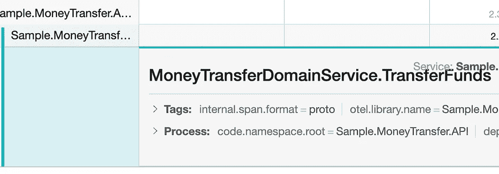
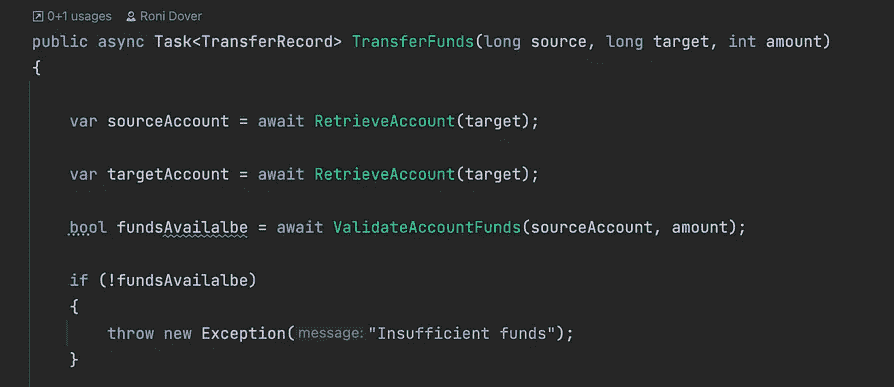
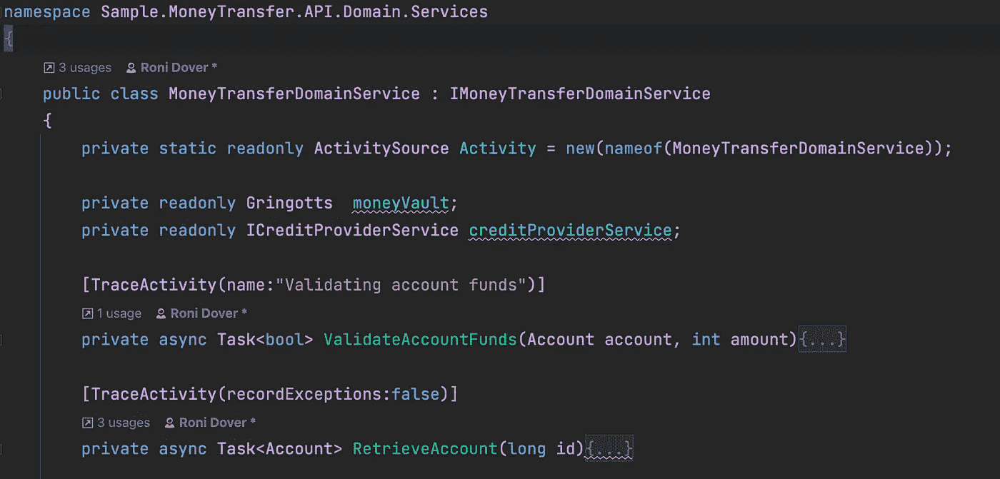
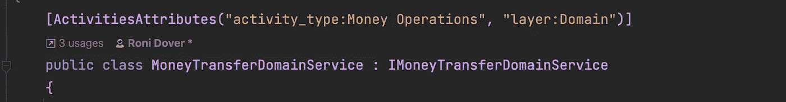
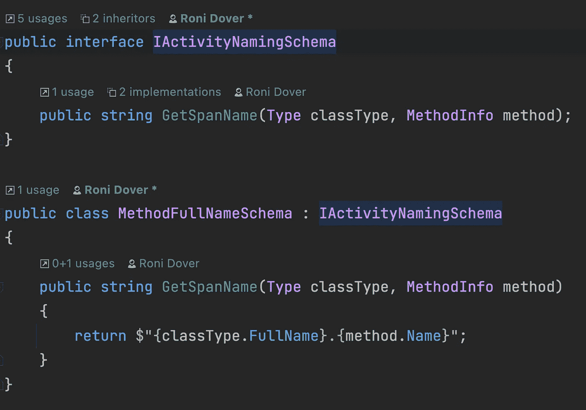

# 使用装饰器模式进行自动检测。使用 Otel 跟踪的. Net 类

> 原文：<https://betterprogramming.pub/using-the-decorator-pattern-to-auto-instrument-net-classes-with-otel-tracing-781bf2be62ff>

## 装饰者如何帮助 OpenTelemetry tracing 仪器保持干燥


作者图片

。NET 在最近的版本中明确地包含了 OpenTelemetry。它支持使用内置系统定义轨迹和跨度。诊断类极大地简化了检测代码的任务。我唯一吹毛求疵的抱怨。NET 实现是一种术语混乱，它试图通过背离标准的 OTEL 命名法来制造这种混乱。

例如，开放式遥测跨度在中称为“活动”。NET，而“ActivitySource”通常被称为“追踪器”。“如果不在基本实体的特定语言命名之间来回转换，OpenTelemetry 就已经够混乱的了。

最近，我有机会做一些样本项目，这时另一件事引起了我的注意:我注意到我是如何重复地复制/粘贴 span/activities 的样板设置代码的。实际上，确保将这些声明包含在代码的关键区域中需要一定的原则。

让问题更复杂的是，我似乎总是错过最关键的部分——可能是因为我在处理它们时，脑子里都是实际的代码决策，所以忘记了复制粘贴的仪式。

下面您可以看到`Span` / `Activity`所需的样板文件:

命名跨度也可能是一个恼人的打发时间。维护一致的 span 命名和粒度通常感觉像是分类学中的一项练习。为了简化起见，如果我设法使它足够清晰和有描述性，我通常会将 span 名称设置为与封闭方法名称相同。

[装饰模式](https://en.wikipedia.org/wiki/Decorator_pattern#:~:text=In%20object%2Doriented%20programming%2C%20the,objects%20from%20the%20same%20class.)可以帮助解决这些问题，并提供一种简单优雅的方式将操作与 OTEL 活动包装在一起。此外，通过将与创建范围相关的逻辑从应用程序域类中分离出来，我们可以更容易地更改、管理和标准化跟踪的跨应用程序方面。

当然，装饰者也有他们的开销和限制，我绝对不推荐使用低级类或者非常短的性能敏感操作的装饰者。

在这篇文章中，我们将介绍在一个[示例](https://github.com/digma-ai/OpenTelemetry.Instrumentation.Digma)ASP.NET 核心 MVC 应用程序中创建一个`Decorator`来处理不同服务方法的创建活动或 OTEL 跨度的步骤。如果你只是想在你的代码中使用这个`Decorator`并且不太关心进程，它也已经被添加到 Digma open telemetry helper[Nuget 包](https://www.nuget.org/packages/OpenTel.Instrumentation.Digma/)中，并在 [this](https://github.com/digma-ai/OpenTelemetry.Instrumentation.Digma#tracingdecorator) repo 中维护。

# 使用 DispatchProxy 创建基本跟踪装饰器

的。NET DispatchProxy 类，允许我们通过创建实现接口的代理对象来为任何接口创建通用包装器。它通常用于分离出与被调用的代码相关的特定问题，如日志记录、缓存等。

我们将创建一个`DispatchProxy`的子类，命名为`TracingDecorator`。与基类类似，我们将使用一个静态构造函数，它接受对象来修饰和实例化我们的代理对象:

注意，作为初始对象配置的一部分，我们设置了一些基本的对象参数，包括对修饰对象的引用，以及我们将用来创建新的`Activity`实例的`ActivitySource`对象。

最后，我们需要覆盖`DispatchProxy` `Invoke`方法，每当在代理对象上执行一个接口方法时，就会调用这个方法。我们的实现将调用委托给修饰对象，并用一个`Activity`包装整个操作。

我们可以为我们创建的活动使用任何命名约定。在这种情况下，我们将使用修饰的对象类型和方法名创建一个完全限定名(我们将在后面进行改进)。最后，我们确保在重新抛出之前将任何异常记录为活动事件，以免干扰正常的处理流程。

# 使用装饰器

现在我们差不多已经有了一个初始版本，我们可以通过包装一个应用程序类来测试它。对于这个例子，我使用了手头的一个用于 OTEL 的示例应用程序。我选择装饰一个域服务，因为对于装饰者来说，这似乎是一个足够安全的用例。作为一个高级构造，它对轻微的性能下降不敏感，这可能也被请求已经经历的许多不同的层和抽象所掩盖。

使用我们上面定义的静态构造函数，初始化非常简单:

```
IMoneyTransferDomainService decoratedInstance = TraceDecorator<IMoneyTransferDomainService>.Create(domainServiceInstance)
```

如果你用的是。NET DI 框架，但是，用我们新的修饰代理简单地覆盖注册对象会容易得多。有多种方法可以实现这种改变。我发现的最简单的一个是使用优秀的 [Scrutor](https://github.com/khellang/Scrutor) Nuget 包。Scrutor 提供了一个叫做`Decorate`的方便的扩展方法，这正是我们所需要的。代码如下所示:

基本上，我们替换了`ServiceCollection`中的当前映射，这样它将使用我们修饰的实例。我们传递一个工厂 lambda，它接受原始的未修饰对象(在它已经被初始化并且它的依赖项已经被注入之后),并为同一个接口提供了`TracingDecorator`代理。

如果我们现在重新运行应用程序，并从其中一个方法中删除用于跟踪的样板代码，我们将能够看到它是如何被我们的`TracingDecorator`类自动检测的:



# 改进我们的初始实现:记录异常、支持自定义 Span 名称等等

为了使我们的装饰器不那么死板，我们将添加一些属性，允许我们定制它行为的某些方面。例如，用户可能希望使用不同的`Activity`名，或者明确定义异常记录行为。

首先，我们将定义一个包含所需信息的属性:

接下来，我们可以更改装饰器实现来检索属性值并使用它们:

现在，通过在修饰类上设置正确的属性值，我们可以很容易地定义我们希望我们的跨度如何表现:



更干净的实现，以标准化的方式消除了不必要的重复和更好的跟踪处理。

# 进一步的改进

在这个例子中，我发现自己很想给`TracingDecorator`添加额外的有用功能，包括:

*   定义是自动检测所有接口方法还是只检测那些标有`TraceActivity`属性的接口方法的能力。
*   能够在接口上全局设置 span 属性，并将它们自动注入该接口的每个 span。



*   定义一个`ISpanNamingSchema`接口，允许用一个标准的命名模式来设置装饰器，这个命名模式可能不同于我们上面实现的默认模式。



# 你还有什么要补充的？

你可以在[Digma open telemetry repository](https://github.com/digma-ai/OpenTelemetry.Instrumentation.Digma)中找到完整的源代码。让我看看这是否对你的项目有用！此外，如果有任何你觉得有用的功能，请随时联系或打开 Github 上的问题或 PR。

如果你对 OTEL 和可观察性感兴趣，我已经写了一些关于这个主题的其他帖子，特别是关于如何在开发中利用 OTEL，你可以在这里找到[这里](/the-observant-developer-part-1-1939d53fd5a4)和[这里](/improving-code-design-with-opentelemetry-a-practical-guide-a08e6440c24d)。

```
**Want to Connect?**You can reach me, Roni Dover, on Twitter at @doppleware.Follow my open source project for continuous feedback at [https://github.com/digma-ai/digma](https://github.com/digma-ai/digma).
```