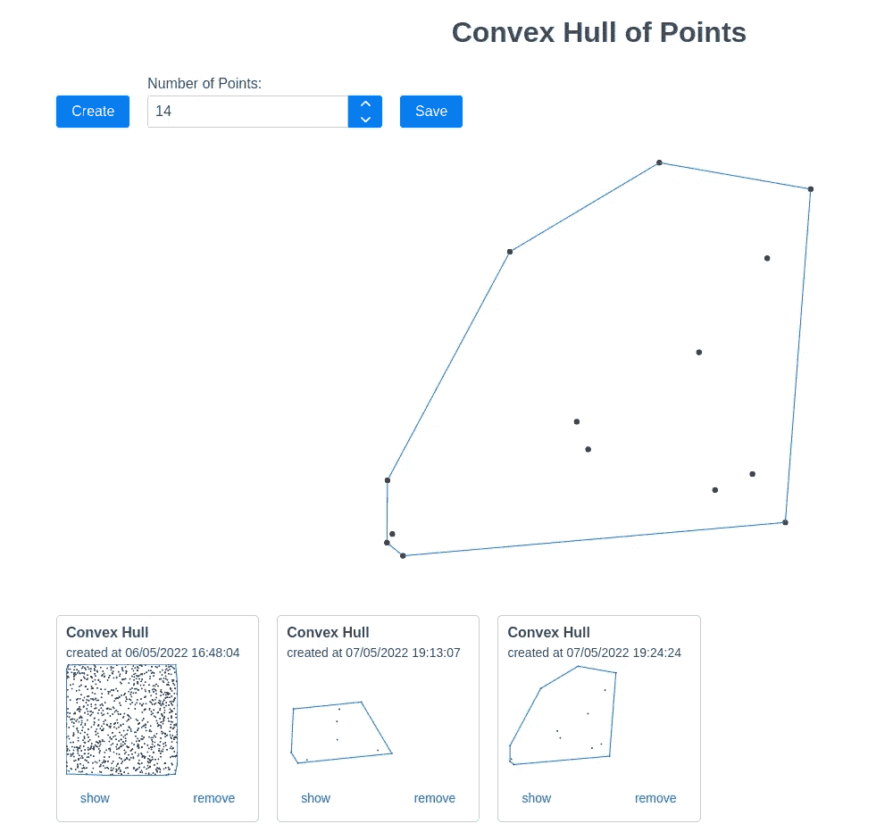

# 将 Diesel ORM 用于 Rocket 应用程序

> 原文：<https://betterprogramming.pub/using-the-diesel-orm-for-a-web-app-with-rocket-90e610f6a6cf>

## 向 Rust powered 框架添加数据库


在我之前的一个故事中(见这里的)，我们看到了一个使用 [Rocket framework](https://rocket.rs/) 实现小型 web 应用的例子。

这个 web 应用程序托管了客户端应用程序的资产，并提供了一个小的 API。现在，我们将通过添加一个数据库( [PostgreSQL](https://www.postgresql.org/) )和名为 [Diesel](https://diesel.rs/) 的 ORM 来扩展它。此外，我们将研究如何通过 docker-compose 将所有这些捆绑在一起，作为一个可共享的 web 应用程序。

## 总体目标:

让我们在这里总结一下我们计划添加应用程序的哪些部分。请记住，到目前为止，我们的应用程序提供了一个端点，允许计算一组给定点的凸包。

让我们补充以下内容:

1.  允许保存来自上述端点的结果
2.  允许`GET`所有结果，以便在用户界面上列出它们
3.  允许到`DELETE`结果
4.  允许给`UPDATE`一个结果的显示名称

# 设置

当然，在开发这个时，一个有用的东西是在后台运行一个 PostgreSQL DB。您不需要在系统上本地安装任何软件，只需使用一个已配置的 docker 映像:

```
docker pull postgres:14.2docker run --name postgres -e POSTGRES_PASSWORD=mysecretpassword POSTGRES_USER=convexhull -p 5432:5432 -d postgres:14.2
```

您可以使用 14.2 以外的任何版本，甚至可以将这个术语保留为默认的`:latest`。

上面用用户`convexhull`和密码`mysecretpassword`创建了一个名为`convexhull`的 PostgreSQL 数据库。它在端口`5432`运行，该端口被映射到某个本地端口。

Diesel ORM 附带了一个 CLI，我建议将其安装在本地。为此，您可能首先需要在您的系统上安装以下 PostgreSQL 客户端:`libpq-dev`

之后，您可以使用`cargo`安装 CLI:

```
cargo install diesel_cli --no-default-features --features postgres
```

有了所有这些，从项目文件夹中您可以运行

```
diesel setup
```

这将一个文件`diesel.toml`和一个迁移文件夹放到我们的项目中。迁移文件夹包含两个文件，`up.sql`和`down.sql`。这些文件用于将数据库从一个版本迁移到另一个版本，或者反向迁移。所以，总的约定是，所有产生`up.sql`的东西都要还原到`down.sql`里。

# SQL 模式

每个在大型项目中管理过数据库的人都知道，这一切都是为了创建好的 SQL 模式，尽可能少地使用必要的索引。我们的模式将保持较小，以讲授 Diesel 背后的原理。首先，我们将告诉 Diesel 为我们的模式生成迁移文件:

```
diesel migrate generate convex_hulls
```

这将在文件夹`migrations/XXX_convex_hulls`中生成相应的预定`up/down.sql`文件。我们将向`up.sql`添加以下数据定义:

```
CREATE TABLE convex_hulls (
    "id" INTEGER PRIMARY KEY GENERATED BY DEFAULT AS IDENTITY,
    "name" TEXT,
    "created" TIMESTAMP NOT NULL    
);CREATE TABLE points(
    "id" INTEGER PRIMARY KEY GENERATED BY DEFAULT AS IDENTITY,
    "input" JSON NOT NULL, 
    "output" JSON NOT NULL,
    "convex_hull_id" INTEGER NOT NULL REFERENCES convex_hulls ON DELETE CASCADE
);
```

并且到`down.sql`:

```
DROP TABLE IF EXISTS points;
DROP TABLE IF EXISTS convex_hulls;
```

所以，一个`ConvexHull`可能有一个`Point`与之相关联。

现在，我们可以通过键入以下命令来指示 Diesel 运行迁移:

```
diesel migration run
```

并通过以下方式重做(以防万一):

```
diesel migration redo
```

在开发过程中，您会发现每次更改数据模型时都在使用后一种注释。与此同时，一个名为`schema.rs`的文件保持最新状态。正在被创造出来。值得看一看这个文件，以了解迁移脚本是否会产生预期的映射。这里定义的资源旨在从代码中提供对表名、列等的引用。因此，这样的名字永远不会被硬编码，并且被编译器保护起来防止输入错误！

# 在应用程序中使用 Diesel

为了使用 Diesel，我们首先必须将以下依赖项添加到我们的`Cargo.toml`中:

```
[dependencies]
serde = { version = "1.0.136", features = ["derive"] }
rocket = { version = "0.5.0-rc.1", features= ["json"] }
**diesel = { version = "1.4.4", features = ["postgres", "serde_json"] }
serde_json = { version = "1.0.48", features = ["preserve_order"]}
dotenv = "0.15.0"
diesel_migrations = "1.4.0"**
```

此外，我们需要创建一个包含以下内容的`.env`文件:

```
DB_HOST=localhostPOSTGRES_PASSWORD=mysecretpasswordPOSTGRES_USER=convexhullDATABASE_URL=postgres://${POSTGRES_USER}:${POSTGRES_PASSWORD}@${DB_HOST}/convexhull
```

Diesel 在启动应用程序时加载这些值，并使用上面的特定条目连接到我们的数据库。

# 添加 CRUD 端点

我们将要添加到 Rocket 服务器的端点将如下所示:

鉴于我们在之前的相关[文章](/implementing-a-web-app-with-rocket-5e56c7e484a0)中提供的解释，这并不新鲜。

通常，所有这些端点都必须注册为路由:

如您所见，端点利用了文件`models.rs`中声明的资源类型，并委托给`convex_hull_service`提供的方法。这两个问题都将在接下来解决。

# 添加数据库实体

数据库实体在`models.rs`中定义，内容如下:

再来一点。

首先，对于`ConvexHull`和`Point`都存在一个对应的`NewConvexHull` resp。`NewPoint`结构。这些在类型定义中略有延迟，用于存储新的实例。而且，前者衍生出`Queryable`，后者衍生出`Insertable`。这允许使用这些实体分别检索数据。插入数据。除此之外，我们通过使用`#[table_name = ...]`宏将相应的表名映射到实体。

其次，结构中使用的类型必须与我们在迁移文件`up.sql`中使用的类型相匹配。从 SQL 到 Rust 的类型映射列表以及 Diesel 执行的反向映射可以在[这里](https://docs.rs/diesel/latest/diesel/sql_types/index.html)找到。

记住，表`points`有一个到表`convex_hulls`的外键，它是一对一的对应关系。我们必须用合适的关联映射来反映这一点。为此，Diesel 提供了两个特性，即`Associations`和`Identifiable`。第一个总是位于持有外键的一侧。后者位于外键指向的站点上。

因为我们将在端点中直接使用这些实体，所以我们从`serde`中派生出了`Serialize`和`Deserialize`特征。

# 添加业务层

CRUD 端点委托的所有方法将在`convex_hull_service.rs`中定义。

这些方法需要建立到数据库的连接。为此，以下方法已写入文件`db.rs`:

显然，这是使用在`.env`中提供的`DATABASE_URL`的值来连接数据库。

`convex_hull_service.rs`的内容是这样:

让我们先从简单的开始。

`**get_convex_hulls**`:这只是从`convex_hull`的`table`结构中调用方法`load`，并提供对一个连接`convex_hulls::table.load(&connection)`的引用。

`**delete_convex_hull**`:这里我们通过传递对应的数据库实体来调用方法`diese::delete`。后者通过在`convex_hulls`的`table` : `diesel::delete(convex_hulls::table.find(...)`上使用`find`的方法获得。

`**get_points**`:首先我们通过`id`即`convex_hulls::table.find(...)`获取`ConvexHull`实体，然后我们利用这些表之间的父子关系获取相关的`Point`实体:`Point::belonging_to(&convex_hull).first(&connection)`。

`**update_convex_hull**`:我们使用`diesel::update`的方法获得`ConvexHull`提供的实体，并通过`.set(convex_hulls::columns::name.eq(convex_hull.name))`更新相应的字段。值得注意的是，Diesel 对每一列(这里是`name`)都有一个描述符，可以从`convex_hulls`的`columns`结构中获得。

`create_convex_hull`:这个要求我们把操作放在一个事务中。原因是亲子关系。为了给一个`ConvexHull`创建`Point`，后者必须首先被插入到数据库中，因为前者需要它的`id`。该交易是通过以下方式从`connection`获得的

```
connection.transaction::<(ConvexHull, Point), Error, _>(|| { … })
```

并确保在任何插入失败的情况下，所有的更改都得到回滚。在`transaction`内部我们使用以下方法插入相应的实体:

```
diesel::insert_into(convex_hulls::table).values(&new_convex_hull)
```

因此，`insert_into`期望目标表(此处为`convex_hulls::table`)作为参数，并进一步插入实体(此处为`new_convex_hull`)。注意，后者是类型`NewConvexHull`，它派生了`Insertable`特征。

关于如何从父子层次结构中获取实体的更多信息，你可以在这里找到。

需要注意的一点是，Diesel 是分开处理相关的表，而不是有一个所谓的反向关系的概念。例如，我们在表`convex_hulls`和`points`之间的 1-1 对应关系仅仅通过在结构`Point`上有一个`convex_hulls_id`来反映。在 Diesel 中，反映这种关系的类型是元组`(ConvexHull, Point)`。尽管这是一个非常符合逻辑的概念，但在某些情况下，这可能会导致代码变得繁琐。

您可能会注意到对`db::create_connection()`的重复调用。对于介绍来说，这已经足够了，但是在生产代码中，您应该从托管池中获取连接。

# 扩展前端

由于这篇文章不是关于前端的，所以我不会在这里给出很多细节。请记住，Rocket 服务器是托管前端资产的，是用 Vite 构建的 Vue 应用程序的产品。静态资产的路径注册已在之前的[文章](/implementing-a-web-app-with-rocket-5e56c7e484a0)中描述。本质上，客户端现在将适应利用所有提供的 CRUD 端点，如下所示:



# 创建 docker 合成文件

到目前为止，我们有一个服务器，它提供了几个端点并托管前端资产。此外，我们有一个数据库支持持久化我们的一些实体。Docker 有一个名为`docker-compose`的神奇工具，可以将所有这些捆绑在一起，并使其可共享，尽管涉及到多个服务器，即多个 docker 映像。

Docker-compose 是 Docker 引擎的附加物，你必须单独安装它(见[此处](https://docs.docker.com/compose/install/))。我们在项目中添加了一个名为`docker-compose.yml`的文件，用来描述应用程序的所有组件(服务器)。其内容是这样的:

```
version: "3"
services:
  **web:**
    build: .
    ports:
      - "8000:8000"
    environment:
      - DB_HOST=db
    depends_on:
      - "db"
    command: ["./wait-for-it.sh", "db:5432", "--", "./target/release/convex-hull"]
  **db:**
    image: postgres:14.2
    environment:
      - POSTGRES_PASSWORD=mysecretpassword
      - POSTGRES_USER=convexhull
```

所以我们有两个服务，一个叫做`web`，它的构建在本地`Dockerfile`中描述，另一个叫做`db`。后者不是一个`build`而是指一个`image`。每个服务将在它自己的进程中运行，我们可以给它附加`environment`变量。此外，这对我们来说非常重要，服务`web`(火箭服务器)，依赖于数据库准备好接受请求。为此，我们做了两件事:

1.  我们使用`depends_on`来告诉服务`web`在构建级别上依赖于服务`db`。也就是前者在后者准备好之前还没入门。
2.  服务`web`有一个`command`，它在`CMD`内覆盖`Dockerfile`中的所有内容。这个`command`在构建完成后执行。`wait-fot-it`是一个实用函数，它等待主机`db`在端口`5432`接受请求。只有这样，它才继续执行第二部分，即启动 Rocker 实例。

我们可以通过键入以下命令来构建和启动 docker-compose 实例:

```
docker-compose up
```

这将在当前终端中运行容器，您可以像往常一样停止它。

关于数据库迁移，我要说的最后一点是。数据库启动。这不会包含所有必要的表定义。因此，有必要告诉 Diesel 在服务器启动时进行所有必要的迁移。

在原始代码中，您会发现启动 Rocket 的实际调用包装如下:

```
match **embedded_migrations::run**(&db::create_connection()) {
        Ok(_) => rocket::build()...
    ...
}
```

此`embedded_migrations`是从机箱`diesel_migrations`执行宏`embed_migrations!();`后变为可用的模块。它确保数据库相对于文件夹`migration`中定义的所有迁移保持最新。

# 运行代码

要获得完整的代码，你可以做如下(需要:git，docker，docker-compose):

```
git clone [https://github.com/applied-math-coding/convex-hull.git](https://github.com/applied-math-coding/convex-hull.git)git checkout v2.0     // brings you to the correct versiondocker-compose up     // builds and runs the app// then you can got to http://localhost:8000
```

我们不得不承认这是非常多的。但这与 Diesel 或 Rocket 无关，而是与我们已经构建了一个完整的 web 应用程序的情况有关。

最后要注意的是。虽然，以上所有内容读起来很容易，但并不像看起来那么简单。特别是在处理关联的时候，有很多东西要保证契合在一起。同样，这不是 Diesel 特有的情况，而是所有 ORM 都会遇到的情况。

虽然在 Rocket 上使用 Diesel 会产生一个非常高性能和安全的应用程序，但是对于更大的应用程序来说，遵守类型系统可能会很麻烦。因此，在我的下一篇文章中，我们将最后再看一种方法。

感谢阅读！