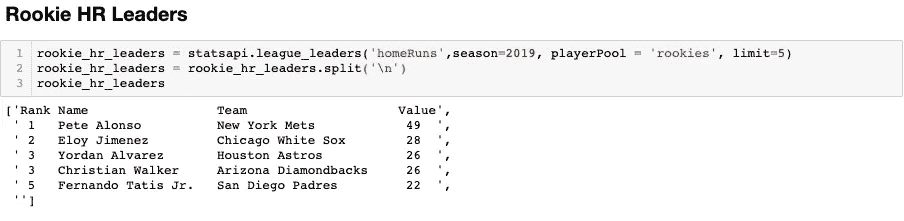
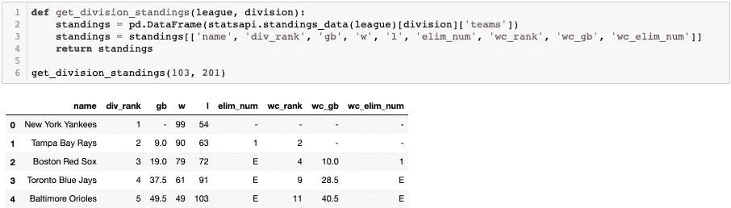

# 使用 MLB 统计 API 获取每日数据

> 原文：<https://betterprogramming.pub/using-the-mlb-stats-api-to-get-daily-data-88f48266656c>

## 如何不用太费力就把日常数据带进来

一段时间以来，我一直在寻找一个 API 来获得 MLB 比赛的每日数据和最新的赛季统计数据。我已经厌倦了为琐碎的任务搜集棒球参考资料，并一直希望构建一个无需太多努力就能带来日常数据的脚本。自从我尝试使用 [MLB API](https://appac.github.io/mlb-data-api-docs/) 已经有一段时间了。原因是，由于糟糕和/或不可用的文档，它从来没有对用户友好过。但今天我想再试一次。在这篇短文中，我将给出几个片段来帮助您开始使用这个 API。从那以后，你可能需要自己做一些调查，以获得你正在寻找的具体数据。

# 入门指南

`pip install MLB-StatsAPI`

这个 API 包装器是由 Todd Roberts 构建的；你可以在这里找到他的 GitHub 文档[。](https://github.com/toddrob99/MLB-StatsAPI)

我使用一个 [Jupyter 笔记本](https://jupyter.org/)，在我看来，这是摆弄 API 和进行初步探索性数据分析的最简单方法。Jupyter Notebook 也有一个内置的命令来查看函数参数，这在我学习使用这个 API 的时候拯救了我的理智。

接下来，干脆`import statsapi` *。*

现在我们准备引入一些数据。但是在我开始之前，我要警告读者:这方面的文档很难在网上找到；我花了相当多的时间试图找到使用 MLB API 的登录凭证，但多次失败。我能够查看这个 API 的文档的唯一方法是使用 Jupyter Notebook。

键入`statsapi`后，将光标置于其中，并使用`Shift+Tab`。这将为您提供可用功能的列表。选择一个功能后，将光标放在该功能内，再次执行`Shift+Tab`。这将为您提供各个功能的文档。从那里，你可以解码所有的参数(是的，这可能是相当多的工作，以适应它)。

# 寻找 2019 年的新秀本垒打领袖

为了开始我们的第一个查询，让我们看看 2019 年排名前五的强力新秀。为此，我们调用`statsapi`并使用`league_leaders`函数。所有可用的功能都可以在 Todd 的 GitHub 上看到。

皮特·阿朗索目前在 MLB 全垒打中领先

如您所见，`league_leaders`函数可以接受许多参数。对于这个查询，我决定查看`HR`,但是您可以通过许多不同的统计信息进行过滤。你也可以改变赛季以及严格过滤新秀，合格的击球手，或联盟中的每一个人。输出是一个混乱的字符串，所以我在`\n`上分开来稍微整理一下以便查看。这个查询非常简单。让我们再深入一点。

## 查找特定部门排名的函数

现在让我们使用 API 来了解纽约扬基队的表现(显然，他们在美联东区领先)。这可以通过使用`statsapi.standings_data( )` *来完成。对于这个函数，你必须钻研文档来理解什么参数可以传递给这个函数。见下文:*

**联赛**

*   103 =美国联赛
*   104 =国家联盟

**部门**

*   200 =阿尔韦斯特
*   201 = AL East
*   202 =铝中心
*   203 =荷兰西部
*   204 =荷兰东部
*   205 =荷兰中部

弄清楚这个模式后，我构建了一个函数来调用 API 并返回我查询的分区排名的数据框。

这个简单的函数可重复使用来查找任何部门的最新排名。所需要做的就是遍历从`standings_data`函数输出的字典，并重新排列列，使其更加易读。

如上图，当我调用我的`get_division_standings( )`函数时，传入了`103`(美联)和`201`(美联东)。就这样，我们得到了一个方便的数据框架。

# 结论

我对我今天的发现很满意，因为我可以通过一些努力来弄清楚如何使用这个 API。现在真正的工作可能开始了。感谢你阅读这篇文章，我希望你能学到一些新的东西！现在我要去布朗克斯看扬基队赢得 2019 年的第 100 场比赛。