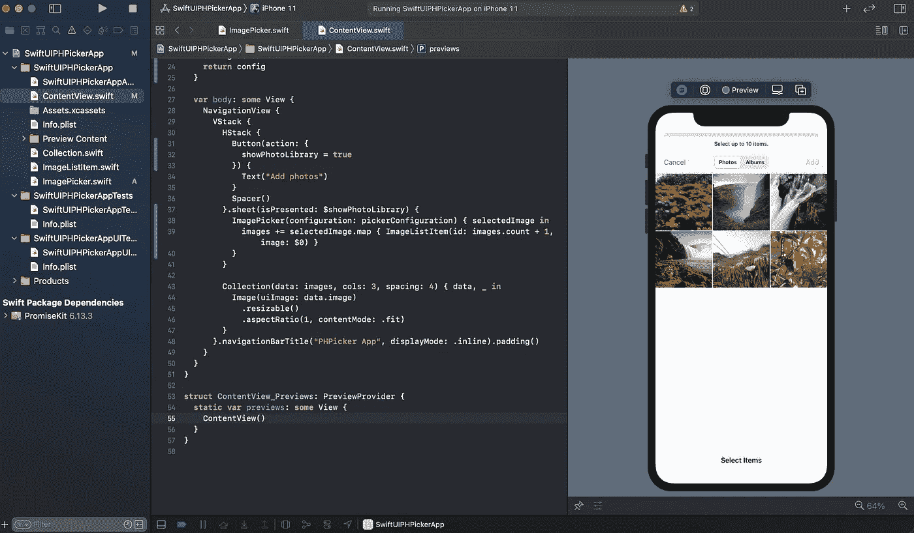
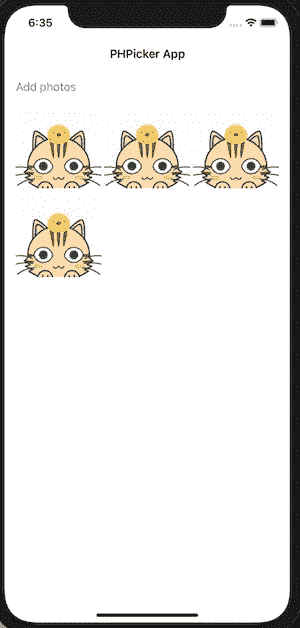
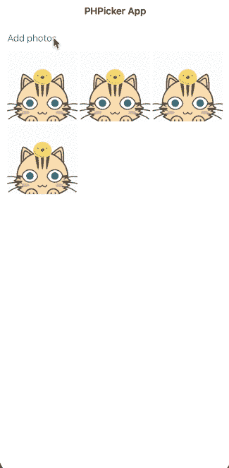
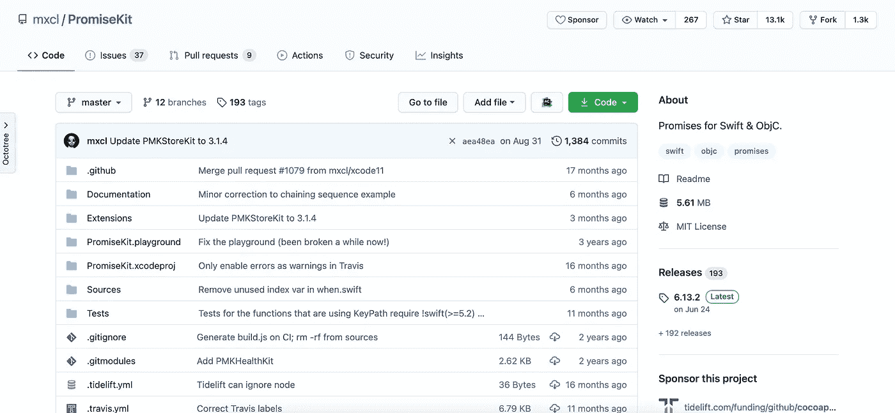
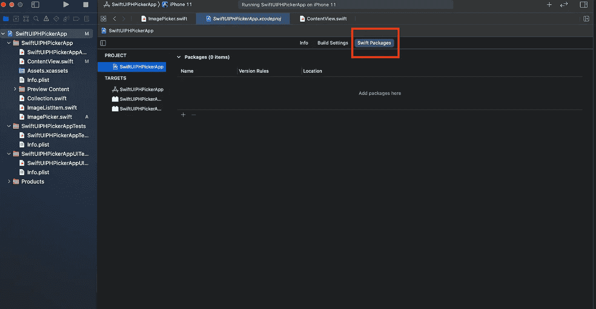
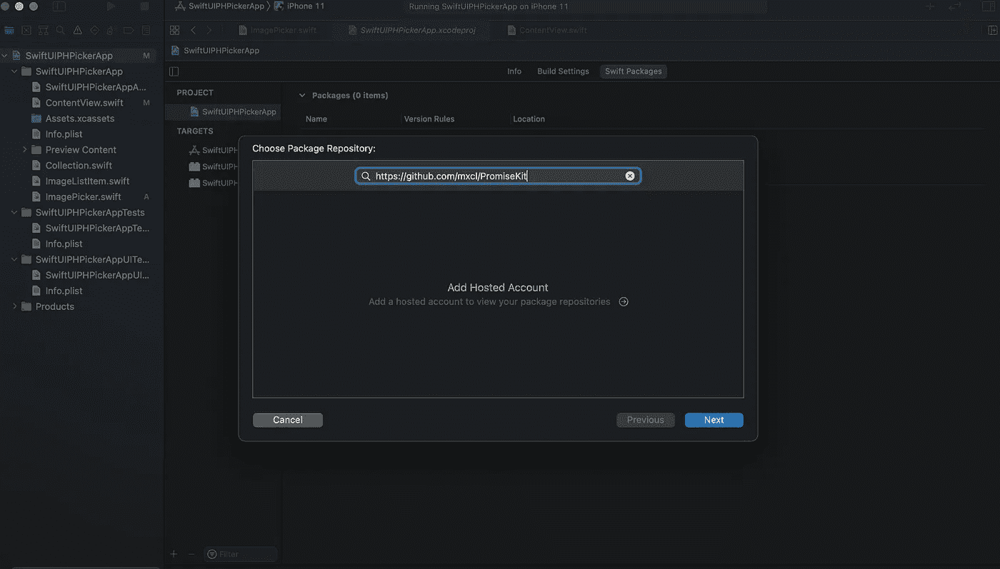
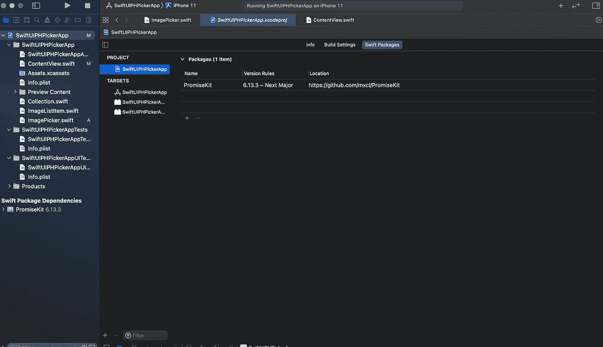

# 结合 SwiftUI 使用新的 PHPicker

> 原文：<https://betterprogramming.pub/using-the-new-phpicker-with-swiftui-a640e2d94d02>

## 将 PHPicker 与 SwiftUI 和 PromiseKit 结合使用的简单教程

PHPicker

2020 年 WWDC 车展上发布了一款新的图像拾取器。`PHPicker`是`UIImagePickerController`的替代产品，具有许多新功能，例如:

*   不需要完全访问照片图库
*   搜索
*   多重选择
*   放大或缩小

在本文中，我将带你了解如何在 SwiftUI 应用中使用`PHPicker`。

# 回购示例

以下是 GitHub 的最终代码:

 [## manakuro/swift ui-with-ph picker-示例

### 带有 SwiftUI GitHub 的 PHPicker 示例应用程序是超过 5000 万开发人员的家园，他们一起工作来托管和审查…

github.com](https://github.com/manakuro/swiftui-with-phpicker-example) 

# 属国

此应用程序中的依赖关系如下:

*   iOS14
*   Xcode12.0/Swift5.3
*   承诺 6.13.2

# 概观

我们将通过以下步骤实现此应用程序:

1.  将`PHPicker`添加到 SwiftUI。
2.  用 PromiseKit 处理异步任务。

假设我们将实现从照片库中挑选一张照片并将其显示在列表中的功能。

因此，我们在这个应用程序中有一个照片列表，看起来像这样:

示例应用程序

这是一个非常简单的视图，只有一个按钮和一个照片列表。

而`ContentView.swift`看起来是这样的:

内容视图. swift

# 1.将 PHPicker 添加到 SwiftUI

所以，我们来介绍一下`PHPicker`这款 app。

为了在 SwiftUI 中使用`PHPicker`，我们需要准备符合`UIViewRepresentable`协议的视图，并在其中创建一个`PHPicker`的实例。

连接到 PHPicker 的步骤如下:

*   创建一个符合`UIViewRepresentable`的视图。
*   添加`makeUIViewController`方法并提供`PHPicker`视图。
*   添加`updateUIView`。
*   添加一个`Coordinator`类和`makeCoodinator`方法。

因此，在根文件夹中创建`ImagePicker.swift`:

`makeUIViewController`负责创建`PHPicker`的实例并返回。配置应该在这里完成。

`makeCoodinator`提供一个协调器类来处理`PHPicker`的所有事件。

`Coordinator`类用于处理 picker 事件，并在从照片库中获取数据后触发完成处理程序。

在这种情况下，我们应该处理多张照片。

接下来，我们将在`ContentView.swift`中使用这个视图:

内容视图. swift

在`pickerConfiguration`中，你可以定制你想要的配置。在这种情况下，我们只使用`.image`数据，并设置了一个`10`图片的限制。

当按下“添加照片”按钮时，照片库出现，您可以选择多张照片:

GIF 格式

它似乎工作得很好。

# 2.用 PromiseKit 处理异步任务

我们已经引入了`PHPicker`视图，并将其应用于我们的`ContentView`。但是您可能已经注意到，每次在`picker`方法中加载完成时，我们都会调用完成处理程序。

如果您出于某种原因对这种方法感到不舒服，并且希望一次处理完，那么您需要在`picker`函数中等待所有的异步加载。

为此，您可以使用 [PromiseKit](https://github.com/mxcl/PromiseKit) :

PromiseKit

PromiseKit 允许您以一种简单的方式处理异步任务。它已经将几乎所有的苹果 API 转换为 promises，并完全支持 CocoaPods、Carthage、SwiftPM 和 Accio 的安装。

在本文中，我们将通过 SwiftPM 安装它。

进入项目> Swift 软件包:

Swift 包裹

按+并粘贴[https://github.com/mxcl/PromiseKit](https://github.com/mxcl/PromiseKit):

正在安装 PromiseKit

单击“下一步”,您将看到安装已经完成:

安装完成

接下来，打开`ImagePicker.swift`，编辑如下:

ImagePicker.swift

`thenMap`允许您异步映射单个值，解析承诺，并返回实际值。

在映射到它之后，您可以用`done`获取值，它从承诺集合中获取所有的值。

我觉得看起来简单多了。

有关 PromiseKit 的更多信息，请查看文档。

# 结论

就是这样！

我们已经介绍了如何在 SwiftUI 应用中使用`PHPicker`。`PHPicker`是处理您的照片库的一种强大而简单的方法。

我希望你觉得这很有趣。

最后，这里是最后的代码:

 [## manakuro/swift ui-with-ph picker-示例

### 带有 SwiftUI GitHub 的 PHPicker 示例应用程序是超过 5000 万开发人员的家园，他们一起工作来托管和审查…

github.com](https://github.com/manakuro/swiftui-with-phpicker-example)