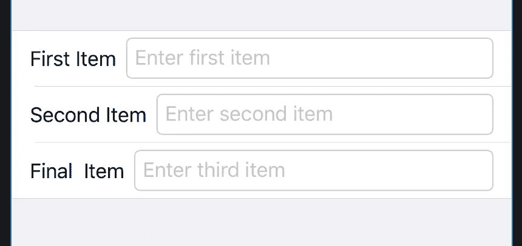
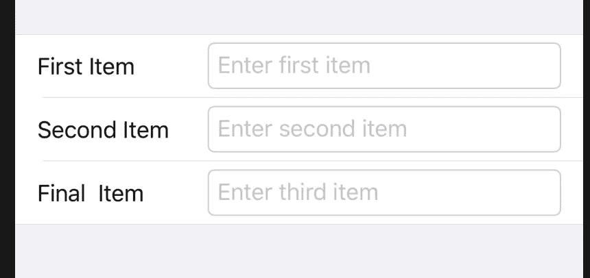

# 使用 PreferenceKey 协议在 SwiftUI 中对齐视图

> 原文：<https://betterprogramming.pub/using-the-preferencekey-protocol-to-align-views-7f3ae32f60fc>

## 如果你习惯于使用界面构建器来布局视图，那么当你在 SwiftUI 中时，感觉就像有人偷了你的工具箱

苏珊·霍尔特·辛普森在 [Unsplash](https://unsplash.com/s/photos/toolbox?utm_source=unsplash&utm_medium=referral&utm_content=creditCopyText) 上拍摄的照片

您有一个由三个`TextField`项组成的简单视图，并且您编写了如下所示的代码:

当您运行它时，您会得到以下结果:

图 1

*唉，*你以为。但是你记得在某处读到过关于`Spacer()`的内容，所以你试着把它加在`Text`和`TextField`项之间。

你猜怎么着？这两者都没什么区别。

于是你在互联网上搜寻解决方案。似乎什么都不管用。然后，一个朋友问你是否看过 SwiftUI essentials 上的 [WWDC 19 视频。你没有，所以你坐了一个小时听两个家伙赞美 SwiftUI 的优点。你(再次)变得非常兴奋。但是你错过了 52 分钟左右的几秒钟，在这几秒钟里，偏好被顺便提及。](https://developer.apple.com/videos/play/wwdc2019/216/)

偏好是聪明的东西——尤其是`PreferenceKey`协议。它看起来是这样的:

在本文的其余部分，我将向您展示如何使用它来获得如下结果:

图 2

定义，根据 [GitHub 文件](https://github.com/DKJone/SwiftUI-Learning/blob/master/SwiftUI-example/SwiftUI-example/SwiftUI.swift)说: *A* `PreferenceKey` *是一个视图产生的命名值。具有多个子视图的视图会自动将所有子值合并成一个对其祖先可见的值*。

`ColumnWidthPreferenceKey`下面是我对`PreferenceKey`的实现:

从`Text`视图收集的值是它们的宽度，这些值由`reduce`函数形成一个`ColumnWidthPreference`值数组。

那么这是怎么发生的呢？

下面是生成图 2 中视图的代码。

如您所见，这是一个由三个`HStacks`组成的`Form`，每个包含一个`Text`视图，后跟一个`TextField`视图。每一个都接受一个值到一个`Binding`。就本文而言，重要的特性是:

*   `Text`修饰符:`frame`和`background`。
*   `Form`修改器:`modifier`。

`background`的自变量为`columnWidthEqualiserView`，定义为:

这里，我们有一个`GeometryReader`的声明，它被定义为一个容器视图，该视图将其内容定义为其自身大小和坐标空间的函数。

这是通过一个`GeometryProxy`实现的，它提供了对容器视图的大小和坐标空间的访问。

在示例代码中，容器视图是`Text`视图。`GeometryReader`后面是一个闭包，它的单个参数就是这样一个`GeometryProxy`。闭包所做的是在由`fill`修改的容器内创建一个`Rectangle`形状，用清晰的颜色填充视图，并由`preference`为`ColumnWidthPreferenceKey`生成一个键/值对。这就是它如何为`Text`视图构建一个宽度值数组。

`Form`修改器的参数是`ColumnWidth`，定义为:

这是对`ColumnWidthPreferenceKey`变化的响应。

然后，它遍历所有子视图的首选项键/值对，寻找最宽的`Text`视图(+20)，并将它保存到传递给它的参数`width`。然后使用新的宽度重建视图，这就是`frame`的用武之地。

好吧，这有点复杂——但确实有效。