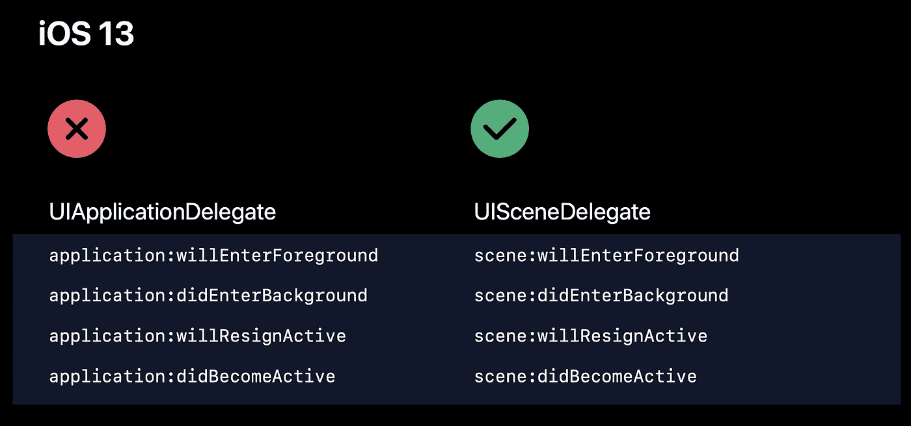
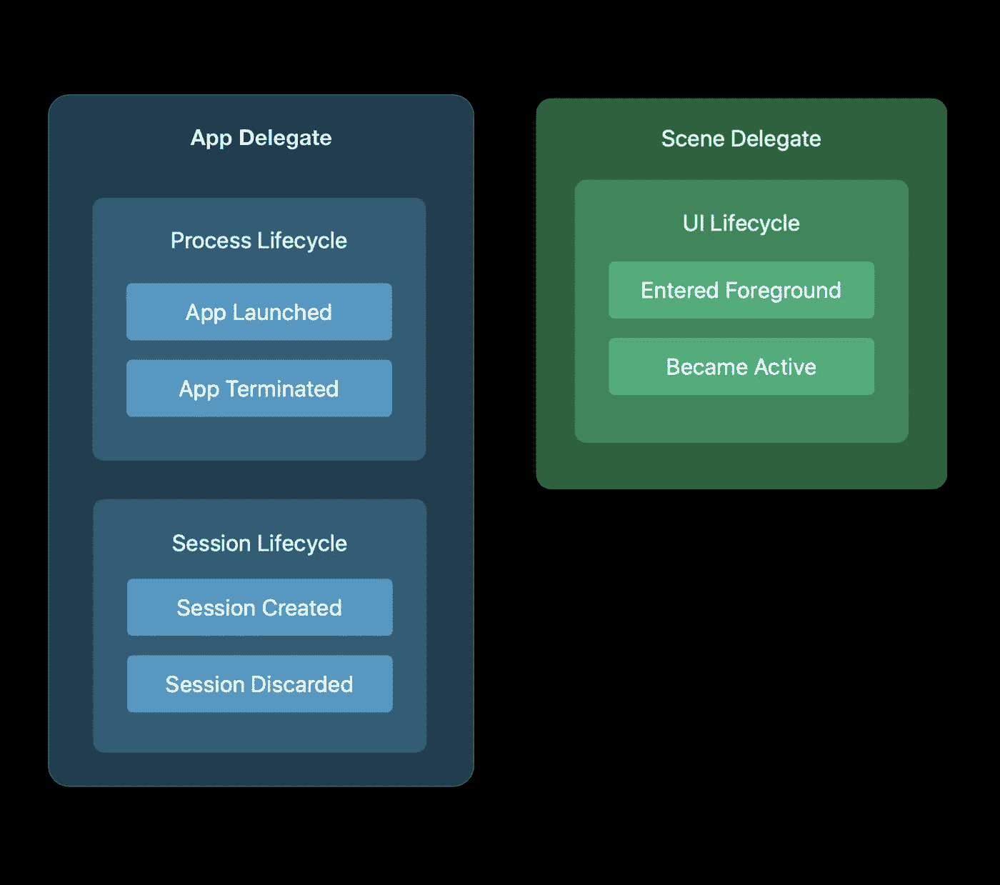
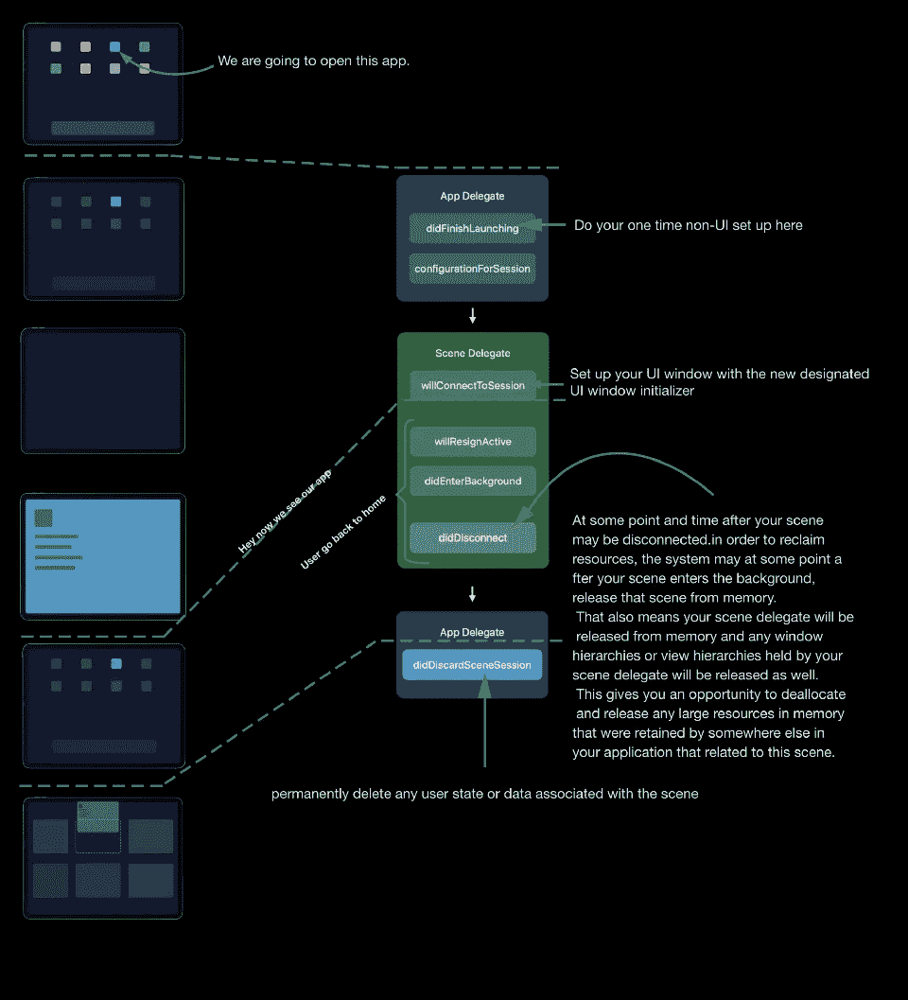

# 使用 SceneDelegate 方法

> 原文：<https://betterprogramming.pub/using-the-scenedelegate-21631ccaa137>

## 了解 SceneDelegate 到旧的 AppDelegate 方法的 1:1 映射

在 iOS 13 中，如果你的应用采用了新的场景生命周期，UIKit 将停止调用旧的与 UI 状态相关的`ApplicationDelegate`方法。

相反，我们将调用新的`SceneDelegate`方法，这非常简单，因为大多数方法都有一对一的映射。

但是不要担心——如果你想在 iOS 13 上采用多窗口支持，这并不意味着你需要放弃对 12 和更早版本的支持。

如果您正在重新部署，您可以简单地保留这两组方法，UIKit 将在运行时调用正确的方法。

# 委托方法

现在，在我们深入研究确切的委托方法之前，应用程序委托还有一个额外的责任，那就是当创建新的场景会话或放弃现有的场景会话时，系统会通知您的应用程序委托。

以下是一个概述:

重要的是不要使用`didDisconnect`来永久删除任何用户数据或状态，因为场景可能会重新连接并在稍后返回。

也有可能是你的一个用户在你的实际应用程序进程没有运行的时候，通过向上滑动从切换器中移除了一个或多个 UI 场景。如果您的进程没有运行，系统将跟踪被丢弃的会话，并在您的应用程序下次启动后不久调用它。

查看我之前的文章[“scene delegate 来自哪里？”](https://medium.com/@yodagamaheshan/where-does-this-scenedelegate-come-from-fb93ed5cb49d)