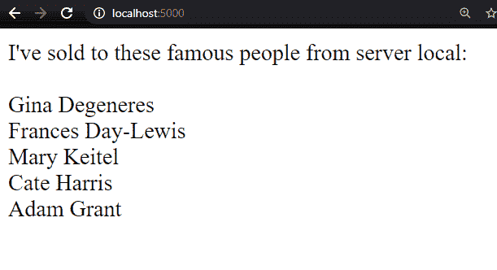
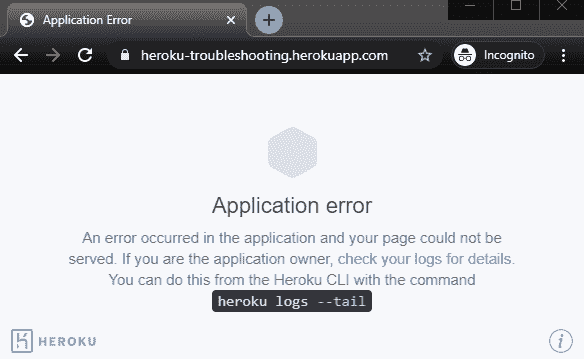
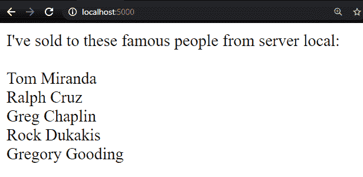

# 使用科学方法调试容器化应用程序

> 原文：<https://betterprogramming.pub/using-the-scientific-method-to-debug-containerized-applications-96749a4940ae>

## 这是一个很有用的过程，可以找出什么地方坏了


由 [NASA](https://unsplash.com/@nasa?utm_source=medium&utm_medium=referral) 在 [Unsplash](https://unsplash.com?utm_source=medium&utm_medium=referral) 上拍摄的照片

啊，是的，“它在我的机器上运行良好！”也许是我们这个行业最著名的一句话。即使出现了跨 SDLC 提供一致环境的容器，我们仍然听到开发人员在发现缺陷时使用这种说法。但最终，如果代码在测试或生产中不起作用，它就不起作用，即使它在本地起作用。因此，作为一名开发人员，不管环境如何，能够深入到您的容器化应用程序中来解决问题，是我们都必须学习的一项关键技能。

让我们来看一个示例应用程序，它可以在本地工作，但是在部署时会失败，以及您可能如何使用科学方法(您还记得在学校学到的，对吗？)来调试容器化 app 中的这些故障。

# 我们的例子

对于我们的[示例](https://github.com/Tokugero/kubernetes-hello-world/tree/heroku)，我们将使用一个简单的 Flask 应用程序，部署在 Kubernetes 容器中，显示使用过我们应用程序的名人。它在我们的本地系统上完美地工作！



名人

现在，让我们将它部署到我们的 Heroku 服务中，看看它的行为是否相同(提示:不会)。

`heroku container:push worker -a heroku-troubleshooting`

`heroku container:release worker -a heroku-troubleshooting`


出错信息

该死。被生产环境的力量所挫败。现在我们可以开始挖掘发生了什么，看看我们有什么工具可以使用。

# 我们的方法

当你的应用程序失败时，采取不偏不倚和客观的方法来诊断问题和理解错误是有帮助的。一种经典的方法是科学方法。经过数百年的严格重复和审查，我发现这种方法非常适合现代调试。

开发人员和 DevOps 工程师经常采取“让我们看看这能做什么”的分散方法进行调试。我们抓住想到的第一件事，即*可能*是错误的，改变我们的代码/配置，部署，并看看这是否有效。如果这不起作用，我们就继续尝试，有时会忘记我们已经尝试过的东西，有时会花几个小时甚至几天的时间沿着一条路走下去，如果我们停下来想一想，这条路显然是错误的。但是如果我们使用一个更合理、更结构化的方法，比如科学方法，我们的调试过程会更有效率、更快，最终会更好。

科学方法，最基本的，包括形成一个假设，进行实验，观察结果，然后完善你的假设。我用来调试容器化应用的科学方法是这样的:

1.  问“应该发生什么？”
2.  确定可能解释为什么*没有*发生的原因。
3.  通过调整配置或使用工具，设计一个测试来验证/否定这些声明。
4.  观察结果。
5.  得出结论。
6.  重复，直到结果是应该发生的。

# 行动中的科学方法

现在让我们看看这种方法的实际应用。

## **1。问“应该发生什么？”**

首先，我们需要理解我们的应用程序试图做什么。要开始研究，我们需要了解页面呈现的细节。让我们看看 docker 文件是如何描述我们的服务的:

```
FROM python:3WORKDIR /usr/src/appCOPY requirements.txt ./RUN pip install --no-cache-dir -r requirements.txtRUN echo "healthy" >> /tmp/healthy && \ cat /tmp/healthyENV FLASK_ENV=developmentENV FLASK_APP=myapp.pyCOPY myapp.py .CMD [ "python3", "myapp.py" ]
```

很简单。我们有一个 Python3 应用程序，它安装一些需求，然后启动`myapp.py`。让我们快速看一下我们的 Python 应用程序正在做什么，然后我们可以决定如何最好地继续。

```
from flask import Flask, Responseimport osimport psycopg2app = Flask(__name__)query = ("select * from actor order by random() limit 5;")host = os.getenv("host")password = os.getenv("PSQL_PASSWORD")user = os.getenv("PSQL_USERNAME")dbname = os.getenv("PSQL_DBNAME")print(host)print(user)print(dbname)def callpsql(): conn = psycopg2.connect(dbname=dbname, user=user, password=password, host=host, port="5432") cur = conn.cursor() cur.execute(query) results = cur.fetchall() cur.close() conn.close() return results@app.route('/')def index(): response = callpsql() print("Getting some juicy logs") results = "I've sold to these famous people from server "+os.getenv("DYNO")+": <br>\n" for row in response: results = results+"<br>\n"+str(row[1])+"\t"+str(row[2]) return results@app.route('/health')def health(): f = open("/tmp/healthy", "r") print(f) health = f.readline().rstrip() resp = Response(health) if health != "healthy": resp.status=500 resp.headers['health-check'] = health return respif __name__ == "__main__": port = 5000 app.run(debug=True, host='0.0.0.0', port=port)
```

另一个非常简单的应用程序。这需要几个环境变量进行身份验证，并在根页面被调用时对 Postgres 数据库执行 SQL 查询。

## **2。确定可能解释为什么*没有*发生**的原因

既然我们知道了应用程序正在*尝试*做什么，我们进入下一步，解释为什么在我们的新环境中没有发生。

这里我们可以看看错误页面上建议的 Heroku logs `--tail`命令。这应该让我们很好地了解我们的服务在任何时间点正在做什么，并且还帮助我们形成一个假设，即可能是什么问题。

```
$ heroku logs --tail -a heroku-troubleshooting...2020-08-22T22:45:34.805282+00:00 heroku[router]: at=error code=H14 desc="No web processes running" method=GET path="/" host=heroku-troubleshooting.herokuapp.com request_id=09292b76-b372-49e9-858b-e8611c020fd5 fwd="xx.xx.xx.xx" dyno= connect= service= status=503 bytes= protocol=https…
```

每次加载页面时，我们都会看到“没有 web 进程正在运行”的错误。看起来 Heroku 并不知道我们已经启动了 Flask。太好了！我们有我们的假设:“Flask 可能不在 Heroku 的环境中运行。”

## **3。通过调整配置或使用工具设计一个测试来验证/否定这些声明**

现在让我们进入下一步:创建一个测试来验证我们认为正在发生的事情，观察结果，并得出结论。

让我们来测试一下我们的假设。我们将跳到我们的 dyno 上，验证 Flask 服务是否正在运行。我们的 docker 文件指定 python 应该是一个运行的、监听的服务。

```
$ heroku ps:exec -a heroku-troubleshootingEstablishing credentials... error ▸    Could not connect to dyno! ▸    Check if the dyno is running with `heroku ps'
```

## **4。观察结果**

我们释放了我们的容器，所以它应该在运行。然而，我们测试的日志告诉我们，我们无法连接到应该运行代码的 dyno。执行建议的命令可能会给我们另一个线索。

`$ heroku ps -a heroku-troubleshooting`

`No dynos on ⬢ heroku-troubleshooting`

## **5。得出结论**

这太尴尬了。科学方法的结论？我们最初的断言是错误的，我们发布的代码留给我们一个运行的 dyno 来服务代码。我们确实推出并发布了我们的图像，但是我们没有在应用程序中添加任何 dynos。看来我们已经验证了应用程序没有运行，我们的假设是不正确的。

## **6。重复直到结果是应该发生的**

因此，我们进入下一步，即*重复这个过程，*我们将在整篇文章中继续重复这个过程，直到我们的问题得到解决。

所以我们来形成一个新的假设，检验一下。基于上一次测试，我们的新假设是，随着 dyno 的运行，我们应该能够从外部世界访问我们的 Flask 应用程序。我们将扩展一个 dyno 来启动应用程序，并再次检查日志来测试这个断言。

```
$ heroku dyno:scale -a heroku-troubleshooting worker=1Scaling dynos... done, now running worker at 1:Standard-1X$ heroku logs --tail -a heroku-troubleshooting2020-08-22T23:29:05.207217+00:00 app[api]: Scaled to worker@1:Standard-1X by user2020-08-22T23:29:18.202160+00:00 heroku[worker.1]: Starting process with command `python3 myapp.py`2020-08-22T23:29:18.760500+00:00 heroku[worker.1]: State changed from starting to up2020-08-22T23:29:21.559386+00:00 app[worker.1]: None2020-08-22T23:29:21.559547+00:00 app[worker.1]: None2020-08-22T23:29:21.559548+00:00 app[worker.1]: None2020-08-22T23:29:21.559549+00:00 app[worker.1]: * Serving Flask app "myapp" (lazy loading)2020-08-22T23:29:21.559556+00:00 app[worker.1]: * Environment: development2020-08-22T23:29:21.559556+00:00 app[worker.1]: * Debug mode: on2020-08-22T23:29:21.636027+00:00 app[worker.1]: * Running on http://0.0.0.0:5000/ (Press CTRL+C to quit)2020-08-22T23:29:21.637965+00:00 app[worker.1]: * Restarting with stat2020-08-22T23:29:21.897821+00:00 app[worker.1]: * Debugger is active!2020-08-22T23:29:21.929543+00:00 app[worker.1]: * Debugger PIN: 485-744-571
```

我们走吧。现在应用已经开始了！是时候再次测试该网站，观察它是否工作。



出错信息

我们现在的结论是，肯定不是。我们应该再次检查我们的命令，看看状态是否发生了变化，这样我们就可以创建一个新的假设。

```
$ heroku logs -a heroku-troubleshooting
2020-08-22T23:32:12.098568+00:00 heroku[router]: at=error code=H14 desc="No web processes running" method=GET path="/" host=heroku-troubleshooting.herokuapp.com request_id=4d3cbafa-cb31-4452-bfc6-7ee18ce72eb0 fwd="xx.xx.xx.xx" dyno= connect= service= status=503 bytes= protocol=https $ heroku ps -a heroku-troubleshooting
=== worker (Standard-1X): python3 myapp.py (1)
worker.1: up 2020/08/22 16:31:59 -0700 (~ 3m ago)
```

看起来我们正在运行一项服务，但是仅仅使用日志我们无法获得更多的数据。假设，我们可以进入服务，并确保它的工作。

```
$ heroku ps:exec -d worker.1 -a heroku-troubleshootingEstablishing credentials... error ▸    Could not connect to dyno! ▸    Check if the dyno is running with `heroku ps'
```

这里我们可以观察到，即使 dyno 在运行，我们也无法连接到它。回顾我们的 docker 文件和一些文档，我们可以得出结论，Heroku 环境需要一些必要条件来支持 exec 到部署的容器中。当我们在这里测试这个新配置是否允许我们连接时，我们应该添加一些我们可能需要的实用程序命令来测试未来的假设。

Dockerfile 文件

```
...RUN apt-get update && \ apt-get install -y \ curl \ openssh-server \ net-tools \ dnsutils \ iproute2RUN mkdir -p /app/.profile.d && \ touch /app/.profile.d/heroku-exec.sh && \ echo '[ -z "$SSH_CLIENT" ] && source <(curl --fail --retry 3 -sSL "$HEROKU_EXEC_URL")' >> /app/.profile.d/heroku-exec.sh && \ chmod +x /app/.profile.d/heroku-exec.sh...
```

稍后再按一次并释放，我们已经验证了我们的结论是正确的，我们最终可以连接:

```
$ heroku ps:exec -d worker.1 -a heroku-troubleshootingEstablishing credentials... doneConnecting to worker.1 on ⬢ heroku-troubleshooting...The programs included with the Debian GNU/Linux system are free software;the exact distribution terms for each program are described in theindividual files in /usr/share/doc/*/copyright.Debian GNU/Linux comes with ABSOLUTELY NO WARRANTY, to the extentpermitted by applicable law.~ $
```

现在我们已经在应用程序中了，我们可以检查我们的假设，即端口正在监听，并且我们的应用程序从容器本身内部做出响应。我们可以使用" net-tools" `netstat`命令作为测试，向我们显示容器上打开的端口列表，并监听打开套接字的调用。

```
~ $ netstat -apn | grep 5000 | grep LIST(Not all processes could be identified, non-owned process info will not be shown, you would have to be root to see it all.)tcp        0      0 0.0.0.0:5000            0.0.0.0:*               LISTEN      3/python3
```

我们的分析表明，端口如预期的那样打开，我们的假设是正确的。

因为什么都没有改变，我们必须设计一个新的测试。“Curl”可以作为我们的命令行互联网浏览器，向我们显示一个简化的端口视图，我们现在已经验证该端口是打开的，并且正在正确侦听。

```
~ $ curl -I localhost:5000HTTP/1.0 500 INTERNAL SERVER ERRORContent-Type: text/html; charset=utf-8X-XSS-Protection: 0Server: Werkzeug/1.0.1 Python/3.8.5Date: Sun, 23 Aug 2020 00:27:14 GMT~ $ curl localhost:5000...psycopg2.OperationalError: could not connect to server: No such file or directory Is the server running locally and accepting connections on Unix domain socket "/var/run/postgresql/.s.PGSQL.5432"?...
```

啊哈！我们对这个错误的分析证明，调用失败是因为我们的应用程序中出现了一个 500 错误。我们的新假设是，这肯定是 Heroku 不向我们的应用程序发送流量的至少*个*原因。如果我们回头看看我们的 Python 代码，我们可以看到它需要一些环境变量。在我们的本地主机中，我们将它们作为开发虚拟环境的一部分导出。我们现在可以得出结论，这些也需要添加到 Heroku 的应用程序中。

我们的新假设变成了:“服务应该在本地和生产环境中都像预期的那样工作。”为了测试这个假设并获得新的变化，我们需要重新启动我们的 worker，让应用程序获得新的环境变量。

```
$ heroku ps:restart worker.1 -a heroku-troubleshootingRestarting worker.1 dyno on ⬢ heroku-troubleshooting... done$ heroku ps:exec -d worker.1 -a heroku-troubleshootingEstablishing credentials... doneConnecting to worker.1 on ⬢ heroku-troubleshooting...The programs included with the Debian GNU/Linux system are free software;the exact distribution terms for each program are described in theindividual files in /usr/share/doc/*/copyright.Debian GNU/Linux comes with ABSOLUTELY NO WARRANTY, to the extentpermitted by applicable law.~ $ curl -I localhost:5000HTTP/1.0 200 OKContent-Type: text/html; charset=utf-8Content-Length: 148Server: Werkzeug/1.0.1 Python/3.8.5Date: Sun, 23 Aug 2020 00:50:35 GMT~ $ curl localhost:5000I've sold to these famous people from server worker.1: <br><br>Julianne        Dench<br>Sylvester       Dern<br>Greta   Keitel<br>Dustin  Tautou<br>Penelope        Monroe
```

在重新运行之前的测试之后，我们现在已经验证了本地容器正在按照我们的预期工作。尽管如此，我们的日志和浏览器得出结论，该应用程序仍然没有按预期运行。

我们内部卷曲的日志:

```
2020-08-23T00:50:35.931678+00:00 app[worker.1]: 127.0.0.1 - - [23/Aug/2020 00:50:35] "[37mHEAD / HTTP/1.1[0m" 200 - 2020-08-23T00:50:41.807629+00:00 app[worker.1]: 127.0.0.1 - - [23/Aug/2020 00:50:41] "[37mGET / HTTP/1.1[0m" 200 -
```

来自我们外部浏览器的日志:

```
2020-08-23T00:50:47.151656+00:00 heroku[router]: at=error code=H14 desc="No web processes running" method=GET path="/" host=heroku-troubleshooting.herokuapp.com request_id=a9421f09-94f2-4822-9608-f2f63ffe5123 fwd="68.251.62.251" dyno= connect= service= status=503 bytes= protocol=https
```


出错信息

假设应用程序在容器中工作，似乎一切都应该工作正常。利用我们之前重新运行的测试，并进一步分析错误“没有 web 进程运行”给了我们另一个提示。有两种类型的 dyno，我们将它部署为“工人”dyno。查看[文档](https://devcenter.heroku.com/articles/dynos#dyno-configurations)，我们可以得出结论，也许我们已经部署了错误的资源类型，没有获得入口。假设 Heroku 应该提供一个动态外部端口，如果我们将 dyno 配置为“web”而不是“worker”作为“web”动态测试重新部署的时间到了。

```
heroku ps:scale worker=0 -a heroku-troubleshootingheroku container:push web -a heroku-troubleshootingheroku container:release web -a heroku-troubleshootingheroku ps:scale web=1 -a heroku-troubleshooting
```

浏览网站仍然会给出与我们最初测试相同的结论，但是现在我们观察到的日志给了我们下一个要研究的线索。

```
2020-08-23T01:03:12.890612+00:00 app[web.1]:  * Serving Flask app "myapp" (lazy loading)2020-08-23T01:03:12.890619+00:00 app[web.1]:  * Environment: development2020-08-23T01:03:12.890620+00:00 app[web.1]:  * Debug mode: on2020-08-23T01:03:12.905580+00:00 app[web.1]:  * Running on http://0.0.0.0:5000/ (Press CTRL+C to quit)2020-08-23T01:03:12.906860+00:00 app[web.1]:  * Restarting with stat2020-08-23T01:03:13.661451+00:00 app[web.1]:  * Debugger is active!2020-08-23T01:03:13.662395+00:00 app[web.1]:  * Debugger PIN: 196-723-0972020-08-23T01:04:07.990856+00:00 heroku[web.1]: Error R10 (Boot timeout) -> Web process failed to bind to $PORT within 60 seconds of launch2020-08-23T01:04:08.016515+00:00 heroku[web.1]: Stopping process with SIGKILL2020-08-23T01:04:08.224860+00:00 heroku[web.1]: Process exited with status 1372020-08-23T01:04:08.290383+00:00 heroku[web.1]: State changed from starting to crashed2020-08-23T01:04:08.293139+00:00 heroku[web.1]: State changed from crashed to starting“Web process failed to bind to $PORT”
```

我们可以得出结论，我们需要将我们的进程绑定到一个变量，而不是默认的 Flask 端口。这很容易在我们的 Python 应用程序中解决。如果我们在生产环境中映射了正确的变量，并且我们的应用程序将该变量用作其端口配置，那么我们应该有一个功能完整的站点。为了测试这一点，我们可以从主机传入环境变量，并在我们的`app.run`参数中使用它。

```
myapp.pyif __name__ == "__main__": port = int(os.getenv("PORT", 5000)) app.run(debug=True, host='0.0.0.0', port=port)
```


名人

现在你知道了！我们对测试的分析表明，该应用程序在本地和部署时都可以工作。最后一次验证，以确保我们的更改也能在我们的开发环境中继续工作。



更有名的人。

# 把它放在一起

在这个工作流程中，我们使用科学的方法来调查一个无法在生产中呈现的应用程序。调试托管基础架构是一项令人望而生畏的任务，但这仅仅是因为其各部分的总和。通过分解产品的每一层，回顾它在标准化工具下的行为，从日志和应用程序输出中获取线索，并回顾各种产品文档，我们可以将这些复杂的结构分解成有意义的简单结论，这些结论将复活任何服务。

如果你想进一步分析我们部署的应用程序，你可以在这里看到它[。下次你发现自己在研究一个难题时，记得一次一层地研究每一个组成部分，并在这个过程中应用系统的、科学的方法。通过这样做，你可以消除很多个人偏见，否则这些偏见可能会让你陷入对 StackOverflow 文章和随机社区论坛的盲目追逐。](https://github.com/Tokugero/kubernetes-hello-world/tree/heroku)