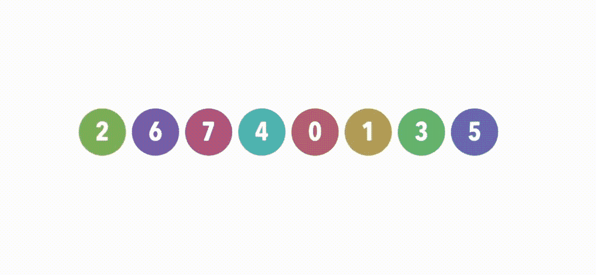
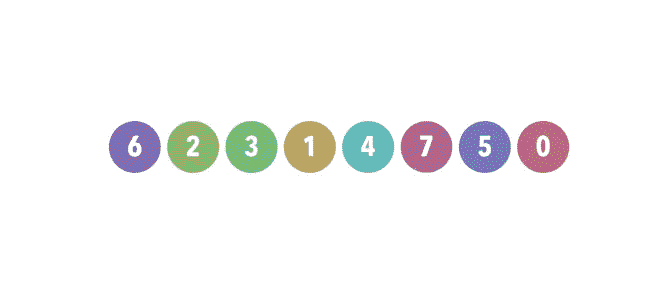

# 在 SwiftUI 2 中使用计时器和延迟

> 原文：<https://betterprogramming.pub/using-timers-and-delays-in-swiftui-2-1362f664f013>

## 延迟或定时行动的选项



使用多种类型延迟的排序算法的可视化。

在计算机编程的世界里，你肯定会遇到的事情之一就是种族冲突。当两个并行的代码以错误的顺序完成时，就会发生争用危险。它可能不是一个关键的错误，但可能是一个关键的需求。我们都有过这样的经历:你的客户希望事情发生，但他们没有。他们希望他们以某种技巧、某种顺序、某种时机来执行。尤其是在 SwiftUI 中，uou 需要在这里和那里减慢应用程序，以确保 A 块中的代码在 b 块中的代码之前完成。

想象一下，在这种情况下，我们的客户是苹果公司，他们想让你帮他们做一个关于排序算法的 WWDC 演示。但它需要图形化。你需要在代码中直观地展示这些东西是如何工作的。观看[这个 WWDC 演示](https://marklucking.medium.com/the-best-apple-wwdc-talk-ever-16d613815f86)以获得更好的想法。

那么你是怎么做到的呢？需要说明的是，我并不是要向你展示如何编写一个排序算法。这是达到目的的手段。一种说明 SwiftUI 和 Swift 中有哪些类型的调用和技术的方法，以使事情稍微慢下来，并鼓励他们相互合作。

我们从哪里开始？我建立了一个非常简单的应用程序，显示八个盒子，里面有数字。不同颜色背景的盒子。这些方框代表了我们需要排序的一组数字。但是就像我之前说的，我们需要在视觉上这样做。



排序算法的快照。

这是一个需要解决的好问题，因为它表现良好且容易理解，所以这里有很多选择。这是我选择的路径:我创建了一个 struct，在其中我将存储几个属性。看起来是这样的:

公平地说，我没有全部使用它，但是我还是把代码留在那里供您使用。方框是我们在彩色矩形中显示的值。所有其他变量都是不言自明的。时间和延迟是从哪里来的？

让我们回到案情摘要。我们需要展示实际的排序，所以我们需要慢慢来。我需要让排序以人类的速度运行。我需要让它看起来有趣。我该怎么办？我从延迟初始执行开始。我用我在 SO 上找到的这个优秀的小扩展来做这件事:

```
**func** delay(_ delay:**Double**, **closure**:**@escaping** ()->()) {
  **DispatchQueue.main.asyncAfter**(deadline: **DispatchTime.now**() + **Double**(**Int64**(delay * **Double**(NSEC_PER_SEC))) / **Double**(NSEC_PER_SEC), execute: closure)
}
```

这使用了我们军械库中的第一种大规模延迟武器，即 GCD。自 iOS 4.0 以来，它就一直存在，在很大程度上，几乎可以在任何地方和任何地方使用。

我使用的控制执行时间的下一段代码是调度程序，它比 GCD 年轻。它从 iOS 10.0 开始就存在了，老实说，我认为它在即将到来的版本中已经被弃用，并被 Combine 框架所取代。与 GCD 不同，它有一个我现在能想到的很大的缺点:调度程序需要在主线程上运行(这是可以的)，但是你可能希望/必须将它与 GCD 结合起来，以确保你不会阻塞事情。

在约定的时间启动代码的代码行如下所示:

```
let timer = Timer.scheduledTimer(withTimeInterval: 1.2, repeats: true) { timer in
// code contained within a block
}
```

一个将永远运行的计时器，或者直到你用这样的一行取消它:

```
timer.invalidate()
```

接下来是 Combine 框架，通过它我们定义了另一个定时器。使其工作的语法如下所示。与调度程序相比，它具有明显的优势，因为在这种情况下，SwiftUI 代码本身或 Swift 可以捕捉到它的“滴答”。Combine 和 SwiftUI 同时加入节目，所以需要 iOS 13.0。

```
**let** next = **Timer.publish**(every: 0.05, on: .main, in: .common).autoconnect()
```

在演示应用程序中可以找到这两种用法的示例。我们用 SwiftUI 中的以下代码在 SwiftUI 中捕获上述案例中的“下一个”:

```
.onReceive(next) { ( bind ) in
  tapGesture(box2D: bind)
}
```

通过 Swift 中的函数代码，我们可以在 GCD queue 下运行:

要取消已经开始的订阅，您需要使用以下命令。是的，我认为它看起来也有点像黑客:

```
next.upstream.connect().cancel()
```

拼图的最后一块只是特定于 SwiftUI 的动画部分。我包括了一个明确的延迟。在这种情况下，0.05 秒。很明显，这也是 iOS 13.0 依赖的。

```
**withAnimation**(.linear(duration: 0.05)) {
 // code to execute
}
```

使用动画，您可以影响它们如何平移，因此在这种情况下，线性是恒定的速率。我鼓励你查找并尝试一些其他选项。

这就是我们演示应用程序的结尾，虽然这还不是故事的结尾，因为还有几个选项我没有使用，但你可以使用。

我从一个叫做“竞争危险”的令人讨厌的错误开始这篇文章，有一个高级命令集专门用来处理这个叫做“操作队列”的错误。他们有时被拿来和 GCD 比较和对比，因为他们是相似的野兽，只是稍微精致一点。我听说它们是基于 GCD 构建的，尽管看起来它们比 GCD 更早(在 iOS 2.0 上可用)，所以我不确定事实是否如此。

在 iOS 中使用操作允许您将任务标记在一起，并将它们的完成与控制和平衡联系起来。也就是说，我想在这里提到信号量——一种同步代码块的高级方法。难以调试的高级。小心点。

现在，这确实把我带到了文章的结尾。我希望你能像我写这篇文章一样喜欢读它，并且在这个过程中可能学到了一两件事。下面是这篇文章的动画 GIF 背后的代码:

保持冷静，继续编码。