# 如何使用松露 L2 盒子桥接区块链网络

> 原文：<https://betterprogramming.pub/using-truffle-l2-boxes-to-bridge-blockchain-networks-23fbbfe4c7b8>

## 构建 L1 和 L2 之间互操作的 dapps 可能很困难。让我们看看使用乐观桥松露盒作为一种简单的方法


pixabay.com

众所周知，许多区块链都有可扩展性和拥塞问题。这些问题具有广泛的影响，从缓慢的交易时间到增加的交易费用和降低的用户体验。

一个解决方案是使用 [L2](https://ethereum.org/en/layer-2/) (第二层)链使 web3 成为多链。以太坊 L2，如[乐观](https://www.optimism.io/)、[仲裁](https://portal.arbitrum.one/)和[多边形](https://polygon.technology/)，建立在以太坊网络之上，但比以太坊更快更便宜。然而，作为一种权衡，它们通常不如以太坊安全。这就是为什么 L2 处理日常的用户活动，同时仍然依赖以太坊 L1 作为安全和分散的结算和数据可用性层的幕后基础。

这是一个很好的解决方案——然而，仅以太坊上就有许多 L2，每一个都是独立的网络，有其自身的细微差别和体验。对于用户和开发者来说，构建和使用在这些网络和以太坊 L1 之间互操作和移动的 dapps 可能是乏味的、困难的和糟糕的体验。

我们需要 web3 成为一个多链体验，消费者不需要知道他们使用的是哪一个链(坦率地说，也不在乎)，开发者可以依赖最能支持他们的 dapps 需求的任何网络。通过转移到区块链的多链互联网，web3 对每个参与者来说都是更好的体验。

不幸的是，允许 dapps 在链之间移动是一个困难的技术挑战。在本文中，我们将关注一个解决方案——使用 Infura RPC 端点和 Truffle Boxes 无缝地构建和桥接这些网络。具体来说，我们将使用[乐观桥松露盒](https://trufflesuite.com/boxes/optimism-bridge/)在以太坊 Goerli 测试网和乐观桥 Goerli 上创建一个项目。

# **使用 Infura 和块菌盒运行多链 Dapp**

## **松露盒**

作为我们的示例解决方案的核心，我们将依赖于来自 ConsenSys 的[Truffle box](https://trufflesuite.com/boxes/)——“快捷”样板(如合同、库、模块，甚至全功能的 dapp)，您可以使用它们来构建您的 dapp。对于多链解决方案，他们构建在许多 L2 网络的 [Infura RPC 节点](https://www.infura.io/networks)之上。

如上所述，我们将依靠[乐观桥松露盒](https://trufflesuite.com/boxes/optimism-bridge/)。这个盒子有与来自 L1 和 L2 的乐观桥交互所需的所有合同，以及一组用于部署、调用函数和在层间传递消息/值的迁移。它甚至有一个助手脚本，可以做我们需要的一切来看这一切。我们需要拆箱来得到我们需要的一切！包装盒包括以下内容:

*   一份在乐观桥上传递信息的 L1 合同
*   从以太坊向乐观主义传递信息的迁移
*   一份在乐观桥上传递信息的 L2 合同
*   从乐观主义向以太坊传递信息的迁移
*   自动编译合同、运行迁移和发送消息的脚本
*   一个自动发送 ETH 和 DAO 通过桥的脚本

注意:网桥是一种工具，它允许独立的区块链互相通信并发送令牌、NFT 等。

## **先决条件**

在开始之前，我们需要以下先决条件:

*   [Node.js](https://nodejs.org/en/) 及其包管理器 NPM。
*   使用以下终端命令验证我们是否安装了 Node.js:

`node -v && npm -v`

*   [一个虚假账户](https://docs.infura.io/infura/getting-started)
*   一个[元掩码](https://metamask.io/)账户
*   对 JavaScript 和 Solidity 有基本的了解

# 第一步。创建一个 Infura 帐户来访问网络

一旦具备先决条件，访问 Infura 网站[登录](https://infura.io/login)(或[注册](https://infura.io/register)新账号)。

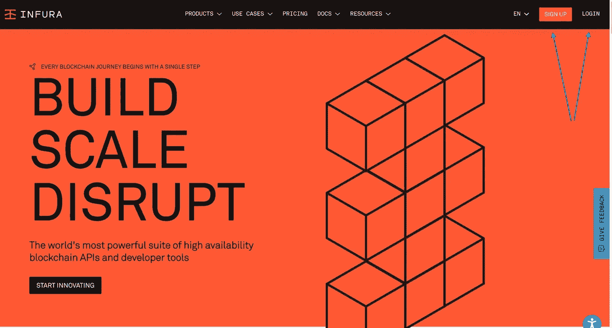

成功注册后，页面重定向到 Infura 仪表板，在这里我们可以创建一个新的 API 密钥，如下所示:

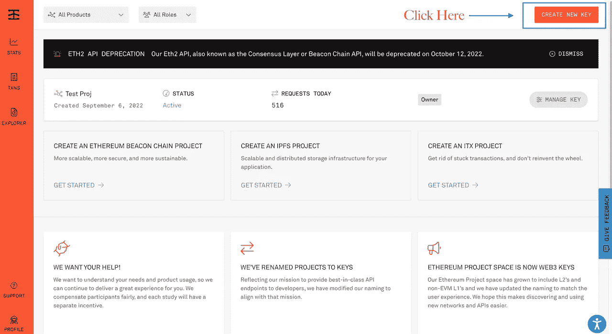

单击“创建新密钥”按钮，并填写所需信息。

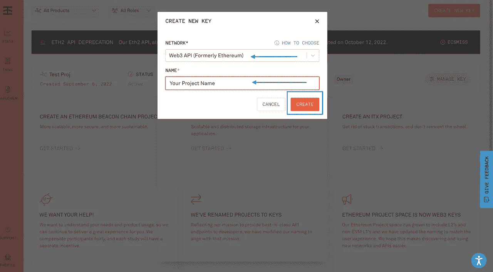

在创建您的 API 密钥之后，您的项目 ID 将在您的仪表板上的 API 密钥部分下可见，如下所示。复制并保存在某个地方；在本教程的后面，您将需要它。

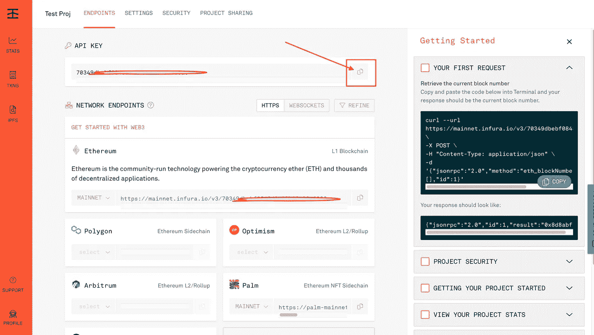

# **第二步。设置和安装**

接下来，我们将设置一个松露乐观桥盒。我们可以使用下面的命令在您选择的任何目录中运行 unbox 命令。

```
npx truffle unbox optimism-bridge <DIRECTORY_NAME>
```

用您选择的目录名替换<directory_name>。或者，您可以全局安装 Truffle 并运行 unbox 命令。</directory_name>

```
npm install -g truffle
truffle unbox optimism-bridge <DIRECTORY_NAME>
```

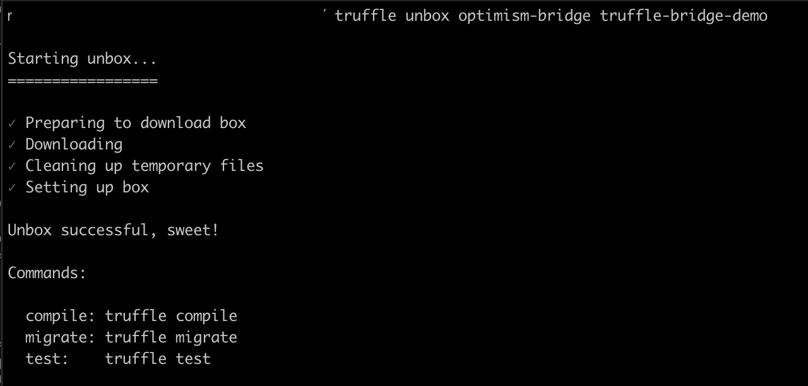

该命令应该下载并运行 npm install，作为拆箱过程的一部分。

现在，运行以下命令将目录更改为我们刚刚创建的新目录。

```
cd truffle-bridge-demo
```

*注意:truffle-bridge-demo 是我们创建的目录的名称。*

我们应该看到类似于下面的内容:

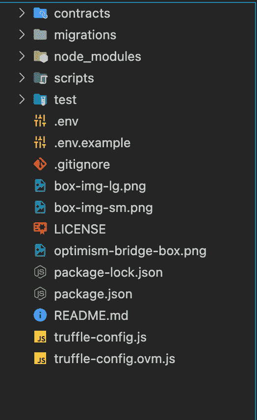

的。npm 软件包已经安装，但是我们需要添加一些信息到。拆箱后创建的 env 文件。`truffle-config.ovm.js`文件期望一个`GOERLI_MNEMONIC`值存在于。用于在以太坊 Goerli 和乐观 Goerli 测试网上运行命令的 env 文件，以及一个用于连接网络的`INFURA_KEY`。

```
GOERLI_MNEMONIC="<your-wallet-mnemonic>"
INFURA_KEY="<your-infura-key>"
```

用我们之前从 Infura 仪表板上获得的信息替换<your-infura-key>。(**注意**:千万不要和任何人分享你的私钥(助记符)，要保管好。并将<你的钱包助记符>替换为你的助记符，如下所示:</your-infura-key>

要从元掩码中检索助记符，请单击元掩码上的以下图标:


接下来，单击导出私钥按钮复制助记符。

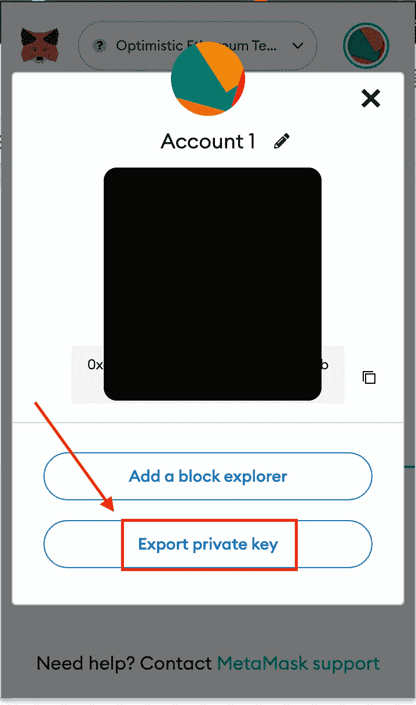

Git 忽略了。env 文件来帮助保护您的私有数据。避免向 GitHub 公开您的私钥是一个很好的安全实践。

# 第三步。使用松露 L2 盒桥接

当我们取消项目装箱时，我们项目的所有必要契约和脚本都为我们创建好了。在下一步中，让我们浏览一下各个合同和迁移，以了解网络之间的桥接和交互是如何发生的。

合同`contract/ethereum/GreeterL1.sol`告诉你如何通过乐观桥从 L1 向 L2 传递信息。

```
//SPDX-License-Identifier: Unlicense
// This contract runs on L1, and controls a Greeter on L2.
pragma solidity ^0.8.0;

import { ICrossDomainMessenger } from
    "@eth-optimism/contracts/libraries/bridge/ICrossDomainMessenger.sol";

contract GreeterL1 {
    address crossDomainMessengerAddr = 0x5086d1eEF304eb5284A0f6720f79403b4e9bE294;

    address greeterL2Addr = 0xC0836cCc8FBa87637e782Dde6e6572aD624fb984;

    function setGreeting(string calldata _greeting) public {
        bytes memory message;

        message = abi.encodeWithSignature("setGreeting(string)",
            _greeting);

        ICrossDomainMessenger(crossDomainMessengerAddr).sendMessage(
            greeterL2Addr,
            message,
            1000000   // within the free gas limit amount
        );
    }      // function setGreeting

}          // contract GreeterL1
```

迁移`migrations/3_set_L2_greeting.js`使用上述契约从以太坊向乐观派发送消息。

```
var Greeter = artifacts.require("GreeterL1");

/**
 * Set L2 Greeting
 * Run this migration on L1 to update the L1 greeting.
 */
module.exports = async function (deployer) {
  console.log("Updating the L2 Greetings contract from L1! 👋👋");

  const instance = await Greeter.deployed();
  const tx = await instance.setGreeting("👋 Greetings from Truffle!");

  console.log(`🙌 Greeter txn confirmed on L1! ${tx.receipt.transactionHash}`);
  console.log(`🛣️  Bridging message to L2 Greeter contract...`);
  console.log(
    `🕐 In about 1 minute, check the Greeter contract "read" function: https://goerli-optimism.etherscan.io/address/0xC0836cCc8FBa87637e782Dde6e6572aD624fb984#readContract`
  );
};
```

接下来，`contracts/optimism/GreeterL2.sol`合约通过乐观桥向另一个方向(L2- > L1)传递了一个信息。

```
//SPDX-License-Identifier: Unlicense
// This contract runs on L2, and controls a Greeter on L1.
pragma solidity ^0.8.0;

import { ICrossDomainMessenger } from
    "@eth-optimism/contracts/libraries/bridge/ICrossDomainMessenger.sol";

contract GreeterL2 {
    address crossDomainMessengerAddr = 0x4200000000000000000000000000000000000007;

    address greeterL1Addr = 0x7fA4D972bB15B71358da2D937E4A830A9084cf2e;

    function setGreeting(string calldata _greeting) public {
        bytes memory message;

        message = abi.encodeWithSignature("setGreeting(string)",
            _greeting);

        ICrossDomainMessenger(crossDomainMessengerAddr).sendMessage(
            greeterL1Addr,
            message,
            1000000   // irrelevant here
        );
    }      // function setGreeting

}          // contract GreeterL2
```

迁移`migrations/4_set_L1_greeting.js`使用上述契约从乐观主义向以太坊发送消息。

```
require("dotenv").config();
const sdk = require("@eth-optimism/sdk");
const ethers = require("ethers");
const Greeter = artifacts.require("GreeterL2");
const goerliMnemonic = process.env["GOERLI_MNEMONIC"];
const infuraKey = process.env["INFURA_KEY"];

const sleep = (milliseconds) => {
  return new Promise((resolve) => setTimeout(resolve, milliseconds));
};

/**
 * Set L1 Greeting
 * Run this migration on L1 to update the L1 greeting.
 */
module.exports = async function (deployer) {
  const newGreeting = "👋 Greetings from Truffle!"; //<---- CHANGE THIS VALUE TO YOUR NAME!!!
  const instance = await Greeter.deployed();

  console.log("Updating the L1 Greetings contract from L2! 👋");

  const tx = await instance.setGreeting(newGreeting);
  const txHash = tx.receipt.transactionHash;

  console.log(`🙌🙌 Greeter txn confirmed on L2! ${txHash}`);
  console.log(
    `🛣️  Bridging message to L1 Greeter contract.\n 🕐 This will take at least 1-5 min...`
  );

  // Set providers for Optimism sdk
  const l1Provider = new ethers.providers.JsonRpcProvider(
    "https://goerli.infura.io/v3/" + infuraKey
  );
  const l2Provider = new ethers.providers.JsonRpcProvider(
    "https://optimism-goerli.infura.io/v3/" + infuraKey
  );

  // Connect an L1 signer
  const wallet = ethers.Wallet.fromMnemonic(goerliMnemonic);
  const l1Signer = wallet.connect(l1Provider);

  // Initialize sdk messenger
  const crossChainMessenger = new sdk.CrossChainMessenger({
    l1ChainId: 5,
    l2ChainId: 420,
    l1SignerOrProvider: l1Signer,
    l2SignerOrProvider: l2Provider,
  });

  let statusReady = false;

  // Sleep for 1 min during L2 -> L1 bridging
  await sleep(60000); // 60 seconds

  // Poll the L1 msg status
  while (!statusReady) {
    let status = null;
    status = await crossChainMessenger.getMessageStatus(txHash);
    statusReady = status == sdk.MessageStatus.READY_FOR_RELAY;
    if (!statusReady) {
      console.log(
        "Message not yet received on L1.\n 🕐 Retrying in 10 seconds..."
      );
      await sleep(10000); // 10 seconds
    }
  }

  console.log("📬 Message received! Finalizing...");

  // Open the message on L1
  finalize = await crossChainMessenger.finalizeMessage(txHash);
  console.log(
    `🎉 Message finalized. Check the L1 Greeter contract "read" function: https://goerli.etherscan.io/address/0x7fA4D972bB15B71358da2D937E4A830A9084cf2e#readContract`
  );
};
```

在脚本目录中，我们还有`goerli_bridge_message.mjs`和`goerli_bridge_value.js`来自动化编译合同、运行迁移和发送消息的过程。

# 第四步。完成以太坊歌尔利和乐观歌尔利之间契约的编译、迁移和桥接

接下来，我们将把我们的合同部署到 Goerli。助手[脚本](https://trufflesuite.com/scripts/deploy.mjs)促进以太坊 Goerli 和乐观主义 Goerli 之间消息的编译、迁移和桥接。在这些网络上，我们需要 testnet ETH 来使用它。要接收一些，使用[水龙头](https://community.optimism.io/docs/useful-tools/faucets/)。我们还需要[将乐观附加软件](https://blog.infura.io/post/infura-launches-support-for-optimistic-ethereum)添加到您的 Infura 账户。

接下来，我们将运行以下命令来启动项目:

```
npm run deploy
```

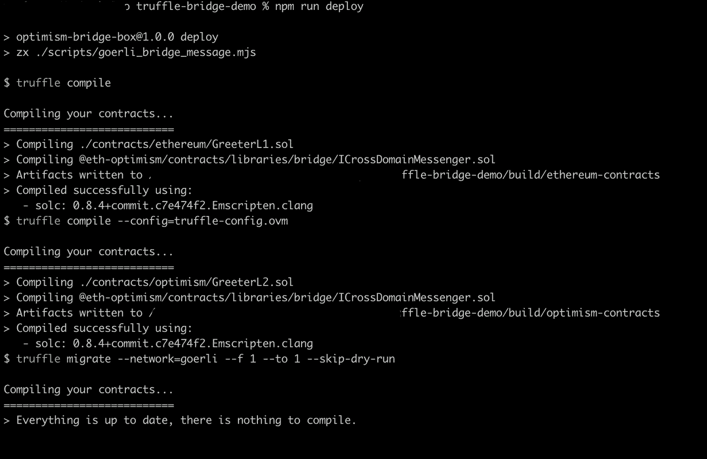

下面是一个 URL，用于在完成迁移后确认(通过以太扫描)桥接的消息。

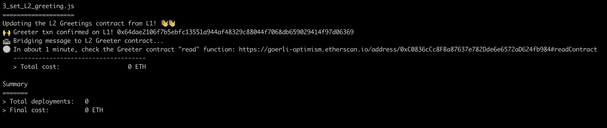

第四次迁移完成后，将提供通过以太网扫描确认桥接消息的链接。

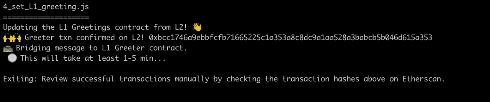

# 第五步。使用[块浏览](https://goerli-optimism.etherscan.io/)验证项目是否成功进入 Goerli 测试网

我们已经成功地设置、安装、构建、部署并完成了之前拆箱的项目。接下来，我们将在 Goerli 以太坊测试网上验证该项目。

前往[goer Li ethers can](https://goerli-optimism.etherscan.io/)block explorer 并粘贴部署时显示在我们 CLI 上的事务地址`0xbcc1746a9ebbfcfb71665225c1a353a8c8dc9a1aa528a3babcb5b046d615a353`。

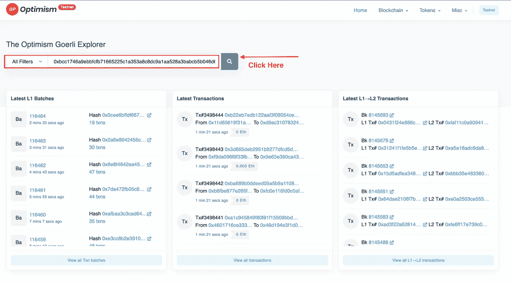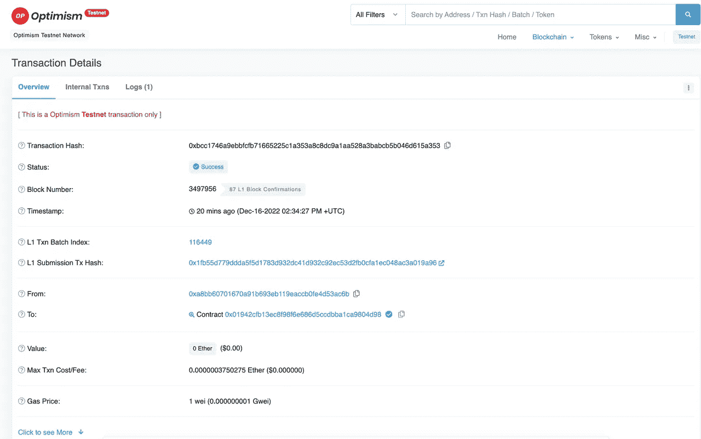 [## 乐观 Goerli 事务哈希(Txhash)详细信息|乐观

### 乐观 for txhash 的详细交易信息…

goer Li-乐观主义](https://goerli-optimism.etherscan.io/tx/0xbcc1746a9ebbfcfb71665225c1a353a8c8dc9a1aa528a3babcb5b046d615a353) 

# 结论

如果我们想改善用户和开发者的体验，多链 web3 世界是至关重要的。为了实现这一点，我们需要 dapps 能够在链之间快速无缝地通信。希望我们使用乐观桥松露盒的例子向您展示了一种相对容易和快速的开始方式。要了解更多信息，请查看官方文档。

祝你今天过得愉快！