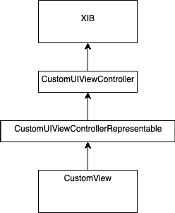

# 在 SwiftUI 中使用 UIReturnKeyType 或 inputAccessoryView

> 原文：<https://betterprogramming.pub/using-uireturnkeytype-or-inputaccessoryview-in-swiftui-c140a24cd112>

## 为开发人员融合 SwiftUI 和 UIKit

由 [Max Nelson](https://unsplash.com/@maxcodes?utm_source=unsplash&utm_medium=referral&utm_content=creditCopyText) 在 [Unsplash](https://unsplash.com/s/photos/swift?utm_source=unsplash&utm_medium=referral&utm_content=creditCopyText) 上拍摄的照片

是的，创建和布局视图的概念是很容易的，它接受来自用户的输入(文本)，显示它，并使它可用于“幕后”的视图逻辑。

在 SwiftUI 中，只需定义:

SwiftUI 中文本字段的声明

但是，还没有 API 来定义 SwiftUI 中`UIReturnKeyType`的行为或细节。在键盘顶部使用工具栏也是不可能的。

应该解释一个解决方案:向开发人员提供混合 SwiftUI 和 UIKit 的可能性，并且在这个场景中是有意义的。

解决方案，用散文的来说，就是创建一个新的 XIB 文件，包含一个`TextField` as 视图，分别定义它，并用一个自定义的`UIViewController`来初始化它。

这里我们完成了 UIKit 部分，SwiftUI 接管了。将创建一个新的 SwiftUI 文件，它包含一个定制的`UIViewControllerRepresentable`，作为通往新世界的桥梁的一边。

它初始化并更新前面提到的`UITextField`的`UIViewController`。

SwiftUI 视图层次结构的集成是由 SwiftUI 视图完成的，它在`body-field-var`中声明了我们的自定义`UIViewControllerRepresentable`。

仅此而已；添加一个 SwiftUI 预览，或者只是 CMD+R(un it)，将会显示一个`UITextField`，它已经在 SwiftUI 中进行了相应的配置。

# 直升机视角

我们在顶部看到了 XIB 盒子。这就是我们想要的视角，因为我们的文本字段需求(`UIReturnKeyType`或`inputAccessoryView`)就是我们开始的地方。

XIB 由一个`UIViewController`初始化。

`UIViewController`由`UIViewControllerRepresentable`创建。

最后，SwiftUI-view 在其主体中声明了`UIViewControllerRepresentable`。

# 即插即用

下面，我们将讨论具有`UIToolbar` ⁴.的`UITextField`的实现`UIReturnKeyType`可以在 XIB(界面构建器)中配置，有点不起眼。

文本字段将提供通知新的文本更改的可能性，并且如果键盘被取消，将提供一个回调。

# 代码或它没有发生

从上面的涂鸦可以看出，这个解决方案既不复杂也不费力。实际上是三个文件。

XIB 文件很简单，我们省略了接口构建器，但是讨论了下一个组件:`UIViewController`。它提供了两个 API，一个文本绑定和一个闭包，在执行键盘工具栏中的 *done* 按钮时调用。

我们的 UITextField 的 UIViewController

XIB 和`UIViewController`就位后，任务基本完成。接下来将创建`UIViewControllerRepresentable`和 SwiftUI 视图:

# 结论

如果理解了 UIKit 和 SwiftUI 接口背后的“模式”,为后者中可能的限制提出解决方案就变得很自然了。

这让我想起了一般的跨平台开发，例如 [Xamarin](https://dotnet.microsoft.com/apps/xamarin) Forms⁵，在那里开发人员有时不得不接触本地 API，并且不得不用这些本地实现来存根跨平台视图。

有人可能会说，对于 iOS 原生开发者来说，SwiftUI 就像是 C#/Xamarin 开发者的“表单”部分。它是一组本地 API 之上的 UI 抽象；作者们在与开发者的需求竞争，以最终支持新世界中的所有原生 API。

最终，在未来，当开发人员在没有 SwiftUI 的情况下编写和实现本机 API 时，他们可能会感到超出了他们的舒适区。

# 资源

1.  [https://developer . apple . com/tutorials/swift ui/interfacing-with-ui kit](https://developer.apple.com/tutorials/swiftui/interfacing-with-uikit)
2.  [https://developer . apple . com/documentation/ui kit/uiview controller/1621359-init](https://developer.apple.com/documentation/uikit/uiviewcontroller/1621359-init)
3.  [https://developer . apple . com/documentation/swift ui/uiviewcontrollerrepresentable](https://developer.apple.com/documentation/swiftui/uiviewcontrollerrepresentable)
4.  [https://developer.apple.com/documentation/uikit/uitoolbar](https://developer.apple.com/documentation/uikit/uitoolbar)
5.  [https://dotnet.microsoft.com/apps/xamarin/xamarin-forms](https://dotnet.microsoft.com/apps/xamarin/xamarin-forms)