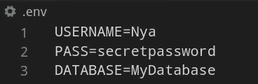
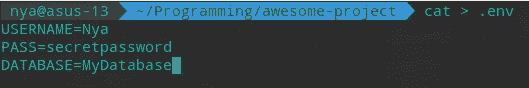
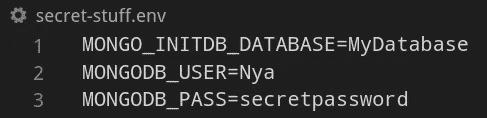

# 在 Docker-Compose 中使用变量

> 原文：<https://betterprogramming.pub/using-variables-in-docker-compose-265a604c2006>

## 自定义 Docker 做更多你想做的事情


# 介绍

迟早，我们都必须在我们的合成文件中处理环境变量。它们会成为一种痛苦，尤其是当我们不知道如何正确使用它们的时候。这篇文章回顾了我所学到的关于环境变量的一切，旨在使使用这些变量变得简单，最重要的是安全。

## 首先，我们如何使用环境变量？

Docker Compose 允许我们通过命令行传递环境变量或者在 shell 中定义它们。但是，建议将这些值保存在实际的合成文件中，不要放在命令行中。你可能会问，为什么？

因为这样，我们不必记住每次部署容器时使用的所有环境变量。通过将它们存储在 Compose 文件中，我们可以在构建过程中保持一致性。

有几种方法可以做到这一点:

# 使用环境选项

使用 Compose 环境选项允许我们在我们的合成文件中声明环境变量及其值，如下所示:

docker-compose.yml 文件

这是在合成文件中存储环境变量最简单、最快捷的方式。然而，它有一个(在我看来)巨大的缺点。这关系到安全。你能猜出它是什么吗？

没错。

将环境变量的值存储在 Compose 文件中，十之八九会直接进入源代码控制，这是一个巨大的安全风险。幸运的是，我们有一个替代方案:使用外部文件来存储我们的环境变量。

# 使用. env 文件

为环境变量使用外部文件的主要优点是，您可以将该文件置于源代码控制之外。毕竟，没有人喜欢他们的密码/API 密匙/其他超级机密信息被显示在互联网上，让任何人看到。

`.env`文件是纯文本文件，用于配置。请记住，因为文件名以`.`开头，所以它们对系统是隐藏的。

***提示:*** *要列出隐藏文件，可以使用 Linux 上的* `*ls -a*` *命令，或者 Windows 上的* `*dir /a:h*` *命令。*

`.env`文件必须创建在你的项目的根目录下，，这也是你的`docker-compose.yml`文件应该在的地方。

我们在`.env`文件中声明和分配变量。您可以随意命名变量，因为我们将只访问它们的值。这是我的`.env`文件:



。环境文件内容

您还可以从命令行创建并填充您的`.env`文件，方法是使用 Linux `cat`命令:



创造。命令行中的 env 文件

***提示:*** *记住不要在* `*=*` *符号和赋给变量的值之间留任何空格，因为它们将被添加到字符串中。*

因此，现在我们已经将变量存储在了我们的`.env`文件中，让我们在我们的 Compose 文件中使用它们。现在是时候使用字符串插值(这是使用这种符号的一个有趣的名字:`${string}`)来将我们的`.env`变量的**值**分配给 Compose 文件中的环境变量，就像这样:

如您所见，我们维护了环境选项，并简单地将我们的外部值赋给 Compose 环境变量。

要检查一切是否正常工作，请运行以下命令:

```
docker-compose up
```

***提示:*** *您可以通过运行以下命令(在不同的终端中)来检查哪些值被分配给了环境变量:*

```
docker-compose config
```

## 环境变量优先级

我们必须记住的非常重要的一点是 Compose 在选择使用哪个环境值时使用的优先级。这是什么意思？

如果我们在几个文件中声明相同的环境变量，例如，在合成文件和外部`.env`文件中，用不同的值，合成将使用在合成文件中声明的变量值。为什么？因为根据变量声明的位置，Compose 会赋予它更高或更低的优先级。顺序如下，从最高优先级到最低优先级排列:

1.  **撰写文件**
2.  **外壳环境变量**
3.  **环境文件**
4.  **Dockerfile**
5.  **变量未定义**

如果出于某种原因，Compose 选择并分配了一个您不期望的值，这可能就是原因。确保在你想要的地方声明所有的变量。

# 使用 env_file 选项

在上一节中，我们讨论了普通的`.env`文件，但是我们从来没有使用命名的`.env`文件。如果我们确实想让我们的`.env`文件有一个名字，比如`secret-stuff.env`，Compose 有一个漂亮的小选项叫做`env_file`。

这个选项允许我们告诉 Compose 它必须寻找哪个`.env`文件，而不是它的默认行为，即寻找一个未命名的`.env`文件。这是我们如何使用`env_file`选项:

在合成中声明 env_file

可以看到，我们添加了`env_file`选项，它指向一个名为`secret-stuff.env` 的文件。剩下的就是将我们之前的`.env`文件重命名为`secret-stuff.env` *。*

您可能已经注意到，环境选项不再出现在我们的合成文件中。这是因为使用`env_file` 选项引发了一个问题(这让我相当头疼)。请允许我解释:

要将名为 `.env` 的外部**文件中声明的值分配给合成变量，需要在主合成服务中定义所述文件。这与执行操作时 Compose 遵循的顺序有关。然而，我们没有主服务，因为我们只使用了一个 **db** 服务。因此，如果我们尝试部署我们的 Compose 文件，它会抱怨我们的变量没有被定义，并用空白字符串替换它们。**

你不必相信我的话，尽管去试试吧！运行`docker-compose up` 看看会发生什么:)

那么，我们如何解决这个问题呢？这是我发现的:

如果我们从 Compose 文件中删除环境选项，那么在部署时，Compose 将搜索指定的`secret-stuff.env`文件，当环境选项存在时，它不会这样做。问题解决了！

但是请记住，由于我们不再有环境选项，我们必须直接在`secret-stuff.env`文件中声明环境变量，如下所示:



秘密材料. env

再次，要检查一切工作正常，运行:

```
docker-compose up
```

# 结论

就这些了，伙计们！到目前为止，您已经(希望！)学习了在合成文件中安全处理环境变量的不同方法。

感谢您的阅读:)