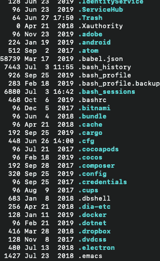
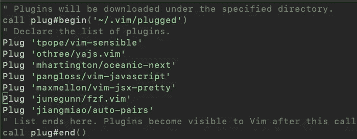

# 将 Vim 与 React Native 2020 一起使用

> 原文：<https://betterprogramming.pub/using-vim-with-react-native-2020-77deb4e44348>

## 如何配置您的机器来使用 Vim 和构建跨平台应用程序


由[丹尼尔·科尔派](https://unsplash.com/@danielkorpai?utm_source=unsplash&utm_medium=referral&utm_content=creditCopyText)在 [Unsplash](https://unsplash.com/?utm_source=unsplash&utm_medium=referral&utm_content=creditCopyText) 上拍摄

# Vim 简介

当我第一次对使用 Vim 和 React Native 感兴趣时，我不知道如何开始。当然，我可以下载 Vim 并开始使用基本命令，但是 linter、color scheme 和任何其他使 Vim 成为理想编辑器的工具呢？

这就是本指南的用处。它通过帮助您来帮助您配置 Vim 的 React Native:

*   创建一个存储库，允许在不同的机器上共享配置文件
*   决定是使用 Mac OS 终端还是 iTerm
*   为本地反应配置 Vim

让我们从了解什么是*点文件*开始。

# 点文件

## 什么是点文件？

[点文件](https://wiki.archlinux.org/index.php/Dotfiles)是用于不同用途的隐藏文件，例如保存实用程序的状态或用户偏好。

如果你去你的主目录做一个`ls -al`，你可能会看到一个巨大的隐藏文件列表。



Vim 将设置存储在。vimrc 文件

## 在 GitHub 上存储点文件

GitHub 是一个可以在任何平台上工作的存储系统，它在多个系统之间共享文件时非常有用。这就是为什么把你的点文件存储在上面很棒的原因之一。您可以在不同的计算机之间共享您的 Vim 配置文件，并使用相同的设置。

另一种解决方案是使用 u 盘，但我觉得它不如 GitHub 可靠。您可能会意外地覆盖文件，并且在发生错误时没有历史可以恢复。另一方面，GitHub 允许你直接从命令行推送更新、合并和你需要的一切。

## 入门指南

去年，我和我的一些同事进行了一次对话，由于来自原生 iOS 开发，我甚至没有意识到在 GitHub 上存储点文件是一件事。这是确保您的环境在不同机器上相同的好方法。

在我搜索的过程中，我找到了一个介绍这些步骤的教程[。它详细解释了如何建立自己的 Git 存储库。我会给你一个基本的命令纲要，但是如果你想要一个更深入的解释，我建议你去看看教程。](https://www.atlassian.com/git/tutorials/dotfiles)

确保`mkdir .cfg`在您的主目录中。

```
git init — bare $HOME/.cfg
alias config=’/usr/bin/git — git-dir=$HOME/.cfg/ — work-tree=$HOME’
config config — local status.showUntrackedFiles no
echo “alias config=’/usr/bin/git — git-dir=$HOME/.cfg/ — work-tree=$HOME’” >> $HOME/.bashrc
```

以下是一些关于如何使用刚刚创建的配置别名的示例:

```
 config status
 config add .vimrc
 config commit -m “Add vimrc”
 config add .bashrc
 config commit -m “Add bashrc”
 config push
```

## 使用不同的计算机访问配置文件

如果您想从另一台计算机访问您的 dot 配置文件存储库，请执行以下步骤:

确保`mkdir .cfg`在您的主目录中。

```
alias config=’/usr/bin/git — git-dir=$HOME/.cfg/ — work-tree=$HOME’
echo “.cfg” >> .gitignore
git clone — bare <git-repo-url> $HOME/.cfg
config checkout
```

这是在不同设备上设置回购和访问的基础。接下来是尝试决定在 Mac OS 上使用哪个终端。

# 使用哪个终端应用程序

## Mac OS 终端与 iTerm

[Terminal.app](https://en.wikipedia.org/wiki/Terminal_(macOS)) 可能是你在命令行输入命令的首选，但它的功能有限。尽管它可能缺乏功能，但据说它比 iTerm 有更好的[性能](https://news.ycombinator.com/item?id=20587488)。

注意:如果你想在 Terminal.app 中添加窗格，我建议你考虑一下 [tmux](https://github.com/tmux/tmux/wiki) 。

[iTerm](http://iterm.sourceforge.net/) 则是功能丰富。下面列出了 iTerm 的一些我最喜欢的特性:

*   拆分窗格
*   24 位颜色支持
*   用户化
*   暴露选项卡

iTerm 内置了分割窗格，所以不需要设置 tmux。它有一个自动完成功能，可以记住你过去执行过的命令。这是一个开箱即用的完整设置。

如果您以前没有使用过 tmux，也不熟悉 Vim，我会考虑使用 iTerm，这样您就可以更多地关注 Vim。

# 配置 Vim

## 装置

现在我们开始讨论好东西，在你的 Mac 上安装 Vim。

首先，你需要在你的系统上安装[自制软件](https://brew.sh/)。

这些是神奇的击键:

`brew install vim`

安装完成后，我们必须配置 Vim。

## 基本插件

以下是 React Native 的优秀插件列表:

*   [插件](https://github.com/junegunn/vim-plug) —用于管理插件
*   [自动配对]('jiangmiao/auto-pairs') —成对插入或删除括号、引号、引号
*   [YAJS](https://github.com/othree/yajs.vim) —又一个 Javascript 语法
*   [NERDTree](https://github.com/scrooloose/nerdtree) —文件导航
*   [FZF](https://github.com/junegunn/fzf.vim) —模糊搜索
*   [Oceanic Next](https://github.com/mhartington/oceanic-next) —配色方案
*   [Vim-jsx-pretty](https://github.com/MaxMEllon/vim-jsx-pretty) —反应语法高亮和缩进
*   [Ale](https://github.com/dense-analysis/ale) —林挺和固定

## 插头快速入门指南

[下载 plug.vim](https://raw.githubusercontent.com/junegunn/vim-plug/master/plug.vim) 放在`~/.vim/autoload`目录下。

向`.vimrc`添加插件:

1.  打开`~/.vimrc`文件，将这几行添加到顶部。
2.  写`plug#begin(‘~/.vim/plugged’)`。
3.  使用“Plug”关键字列出你想要的插件。
4.  `Call plug#end()`。



5.然后使用命令`:so .vimrc`重新加载文件。

6.最后，键入命令`:PlugInstall`来安装新添加的插件。

## 格式化

格式对于代码的可读性很重要。我以前用过更漂亮的,它有点让我难以忘怀。

`npm install -g prettier`

在 call `plug#end()`行下面，我添加了这些格式化程序:

```
au FileType javascript setlocal formatprg=prettier
au FileType javascript.jsx setlocal formatprg=prettier
au FileType typescript setlocal formatprg=prettier\ — parser\ typescript
```

现在为了使用更漂亮，你必须使用这些键盘命令:

*   `gq`非常方便，因为它可以与文本对象结合使用
*   `gqgq`格式化当前行
*   `gqip`格式化段落
*   `gggqG`格式化整个文件

## 林挺

linter 在分析源代码时非常方便。linter 可以搜索错别字、代码味道，以及代码是否符合某种风格。

在格式化程序的下面，我有这样几行代码:

```
let g:ale_linters = { ‘javascript’: [‘eslint’] }
let g:ale_fixers = { ‘javascript’: [‘eslint’], ‘typescript’: [‘prettier’, ‘tslint’], ‘scss’: [‘prettier’], ‘html’: [‘prettier’], ‘reason’: [‘refmt’] }
```

# 结论

这只是设置 Vim 并让它与 React Native 配合使用的快速入门指南。还有很多其他插件，所以一旦你熟悉了基本的设置，我建议你再深入探索一下。