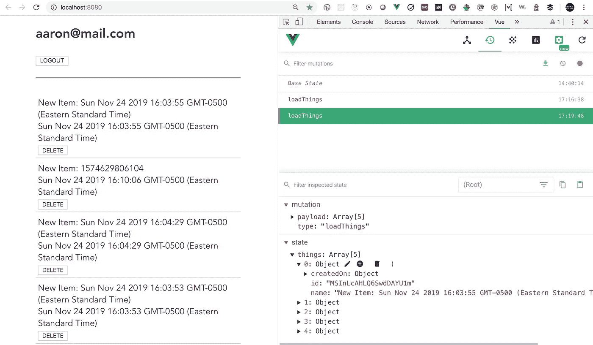

# 将 Vue.js 组合 API 与 Firebase 和 Vuex 一起使用:第 3 部分

> 原文：<https://betterprogramming.pub/using-vue-composition-api-with-firebase-vuex-part-iii-7870be80a0b>

## 带有 Vuex 状态管理和 Firebase 的新 Vue.js 组合 API



# 概观

对于第一个例子，我将向您展示如何将带有 [Vuex](https://vuex.vuejs.org/guide/) 的状态管理集成到这个应用程序中。

我不会将商店直接集成到 [vue-composition](https://buff.ly/2He4rUk) 函数中，我将从调用 [vue-composition](https://vue-composition-api-rfc.netlify.com/) 函数的组件外部访问商店。

当远程 [Firebase 数据库](https://firebase.google.com/?authuser=0)成功更新后，我们将调用商店来更新本地数据。

*   第 1 部分: [Vue.js 组合 API 样例 App w/video](https://medium.com/@c_innovative/vuejs-composition-api-sample-app-w-video-eaff85c13efa)
*   第 2 部分:[使用带有 Firebase 的 Vue.js 组合 API](https://medium.com/better-programming/using-vue-composition-api-with-firebase-18bd9154e19)

# 设置

安装 Vuex。

```
npm install --save vuex
```

在项目根目录下创建一个名为`store.js`的新文件，并添加下面的代码，这将构成我们在项目中使用的存储。因为 Vuex 不是这篇博文的主要目标，所以我不会详细讨论 Vuex。

查看关于 Vuex 的更多[信息。](https://vuex.vuejs.org/)

```
import Vue from "vue";
import Vuex from "vuex";
Vue.use(Vuex);

const store = new Vuex.Store({
  state: {
    things: [],
  },
  mutations: {
    addThing(state, payload) {
      state.things = [payload, ...state.things];
    },
    deleteThing(state, payload) {
      let newArray = state.things.filter(i => i.id !== payload);
      state.things = newArray;
    },
    loadThings: (state, payload) => {
      state.things = [...payload];
    }
  },
  actions: {
    loadThings: ({ commit }, payload) => {
      commit("loadThings", payload);
    },
    addThing: ({ commit }, payload) => {
      commit("addThing", payload);
    },

    deleteThing: ({ commit }, payload) => {
      commit("deleteThing", payload);
    }
  }
});

export default store
```

在主 Vue 实例上导入并设置商店；这将允许我们访问组件的存储。

```
import Vue from "vue";
import App from "./App.vue";
import VueCompositionApi from "@vue/composition-api";

// New information from store
import store from "./store"

Vue.config.productionTip = false;
Vue.use(VueCompositionApi);

new Vue({
  store, // <== ADD STORE HERE
  render: h => h(App)
}).$mount("#app");
```

# 如何更新 Vuex 商店

下面是来自`ThingList.vue`组件的代码片段，我在博客中只包括了代码的关键部分。

Vuex 最简单的集成是访问 vue-composition 函数之外的商店，并确保所有 vue-composition 函数返回一个承诺。

成功完成承诺后，我们将对商店分派适当的操作来更新状态。

```
// snippet from ThingList.vue
methods: {
    addThing(_name) {
      this.createDocument({ name: _name }).then(_result => {
        this.$store.dispatch("addThing", _result);
      });
    },
    deleteThing(_id) {
      this.deleteDocument(_id).then(_result => {
        this.$store.dispatch("deleteThing", _result.id);
      });
    }
  },
  mounted() {
    this.getCollection(/*{ limit: 5 }*/).then(_results => {
      this.$store.dispatch("loadThings", _results.data);
    });
  }
```

# 如何更新应用程序以使用模板中的商店

因为我们现在直接从商店渲染反应内容，而不是 vue 合成功能`use-collection`，我们需要更新模板来反映这一变化。

```
<div v-for="item in $store.state.things" :key="item.id">
   <div class="item-wrapper">
      <div @click="getDocument(item.id)">
         <div>{{item.name}}</div>
         {{item.createdOn.toDate()}}
      </div>&nbsp;
      <button @click="deleteThing(item.id)">DELETE</button>
   </div>
</div>
```

# 对 vue 合成功能的更改

所有的改变将确保从函数中返回一个承诺，并且在更新 Vuex 存储之前，成功的承诺和不成功的承诺的结果被适当地返回。

# 使用-集合

1.  我们现在从查询中返回承诺。
2.  当承诺被解析时，我们返回一个具有包含查询结果的属性数据的对象。
3.  当承诺被拒绝时，我们返回一个带有包含错误的属性错误的对象。

```
const getCollection = ({ query, orderBy, limit } = queryOptions) => {
    state.loading = true;
    state.error = null;

    let resultArray = [];
    let theQuery = query
      ? db.collection(collectionName).where(_query)
      : db.collection(collectionName);

    theQuery = limit ? theQuery.limit(limit) : theQuery;
    theQuery = orderBy ? theQuery.orderBy(orderBy) : theQuery;

    // (1) we now return the promise from the query
    return theQuery
      .get()
      .then(querySnapshot => {
        querySnapshot.forEach((doc)=> {
          resultArray.push({ id: doc.id, ...doc.data() });
        });
        state.collectionData = resultArray;
        state.error = null;

        // (2) when the promise is resolved, we return an object
        // with a property data containing the query results
        return { data : resultArray }
      })
      .catch((error) => {
        console.log("Error getCollection: ", error);
        state.error = error;

        // (3) when the promise is rejected, we return an object
        // with a property error containing the error
        return { error };
      })
      .finally(() => {
        state.loading = false;
      });
  };
```

# 使用文档

## 删除文档

1.  我们现在从查询中返回承诺。
2.  当承诺被解析时，我们返回一个带有属性 ID 的对象，该属性 ID 包含被删除文档的 ID。
3.  当承诺被拒绝时，我们返回一个带有包含错误的属性错误的对象。

```
const deleteDocument = _documentId => {
    state.loading = true;
    state.error = null;

    // (1) we now return the promise from the query
    return db
      .collection(collectionName)
      .doc(_documentId)
      .delete()
      .then(() => {
        console.log("Document successfully deleted!");
        state.error = null;
        state.documentData = null;

        // (2) when the promise is resolved, we return an object
        // with a property id containing the id of the deleted
        // document
        return { id: _documentId };
      })
      .catch(error => {
        console.error("Error removing document: ", error);
        state.error = error;
        state.documentData = null;

        // (3) when the promise is rejected, we return an object
        // with a property error containing the error
        return { error };
      })
      .finally(() => {
        state.loading = false;
      });
  };
```

## 创建文档

1.  我们现在从查询中返回承诺。
2.  当承诺被解析时，获取新文档的 ID，这是从 [Firebase](https://firebase.google.com/) 获取整个文档所需要的。
3.  现在我们有了文档和所有的数据，返回文档。
4.  当承诺被拒绝时，我们返回一个带有包含错误的属性错误的对象。

```
const createDocument = _documentData => {
    state.loading = true;
    state.error = null;

    // (1) we now return the promise from the query
    return db
      .collection(collectionName)
      .add({
        ..._documentData,
        createdOn: firebase.firestore.FieldValue.serverTimestamp()
      })
      .then(docRef => {

        // (2) get the id of the new document which is needed to
        // get the whole document back from firebase
        state.error = null;
        state.documentData.id = docRef.id;
        return docRef.get();
      })
      .then(_doc => {

        // (3) Now that we have the document and all of the data,     
        // return the document
        return { id: _doc.id, ..._doc.data() };
      })
      .catch(function(error) {
        // The document probably doesn't exist.
        console.error("Error createDocument: ", error);
        state.error = error;
        state.documentData = null;

        // (4) when the promise is rejected, we return an object
        // with a property error containing the error
        return { error };
      })
      .finally(() => {
        state.loading = false;
      });
  };
```

# 结论

感谢您关注这一增强，将 vue-composition 功能集成到 Firebase 和 Vuex 的项目中。

# 源代码

*   请注意:源代码位于主 repo 的分支上，请确保在检查代码时位于分支“vuex-1”上。
*   [项目源代码](https://github.com/aaronksaunders/vue-composition-firebase-app-2/tree/vuex-1)