# 如何在 AWS SDK 中使用等待程序

> 原文：<https://betterprogramming.pub/using-waiters-with-aws-sdk-8ec539ac974>

## 让你的代码更具可读性，减少样板逻辑


由 [Petr Sevcovic](https://unsplash.com/@sevcovic23?utm_source=medium&utm_medium=referral) 在 [Unsplash](https://unsplash.com?utm_source=medium&utm_medium=referral) 上拍摄的照片

创建、更新或删除 AWS 资源可能需要一些时间，并且在脚本中执行这些操作时，如果后续代码试图访问所述资源，可能会导致错误。在这篇博文中，我们将介绍什么是等待者，何时以及如何使用它们，以及在改变资源状态时如何避免任何错误。

**注意**:下面的代码将使用 Python 和 Boto3 库编写，但是等待程序也可以与任何其他 AWS SDKs 一起使用。

# 先决条件

*   AWS 帐户
*   Python3/Pip
*   Boto3

# 代码走查

在本演练中，我们将看到一个 python 脚本，它从 csv 文件中提取数据，并将其写入 AWS 上新创建的 DynamoDB 实例中。

我将尝试构建一个面向服务员的用例，但是如果您已经习惯了在您的本地环境中使用 Python SDK，那么可以直接滚动到服务员部分。

首先，我们来看看数据集。

```
MMM,127.83,1669231715.438569
AOS,61.8,1669231717.501728
ABT,106.14,1669231718.50959
ABBV,159.42,1669231719.519121
ABMD,377.81,1669231720.609117
ACN,295.34,1669231721.636138
ATVI,76.44,1669231722.648533
ADP,262.38,1669231725.858109
A,157.01,1669231730.847122
GOOGL,98.21,1669231741.430469
MO,44.81,1669231743.767232
AMZN,94.11,1669231744.166251
AIG,61.12,1669231750.5217159
ABC,165.99,1669231756.527267
AAPL,150.95,1669231765.310137
```

数据文件名是`stock_prices.csv`，与我们的`example_waiters.py`脚本位于同一个目录中。第一列表示股票代码，第二列是其对应的价格，最后一列是 unix 时间戳，表示提取股票价格的时间。

```
## Helper Functions
def get_file_contents(file_path):
 f = open(file_path, "r")
 contents = f.readlines()
 f.close()

 return [ line.strip() for line in contents ]

def create_item_obj_for_dynamo(line_data):

 symbol, price, extracted_time = line_data.split(",")

 Item = {
  "symbol": { "S": symbol },
  "price": { "S": price },
  "extracted_time": { "S": extracted_time }
 }

 return Item
```

`get_file_contents`函数读取我们的文件并返回其内容列表，其中列表的索引对应于 csv 文件中的数据行。

`create_item_obj_for_dynamo`函数将列表中的每一行转换成一个对象，该对象可以传递给 dynamodb `put_item()` API 调用的 *Item* 参数。

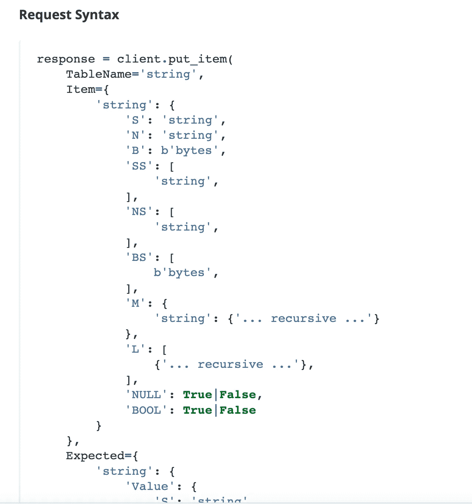

Boto3 文档— DynamoDb 客户端— Put_Item API

在`put_item` api 中只有两个必需的参数，即`TableName`和`Item`。

对于`Item`，我们看到它需要一个对象(或 python 字典)，其键对应于表中的列名，其值是一个字典(字典的键对应于我们希望该列的值具有的数据类型，值是我们希望插入到该列中的内容)。

由于 DynamoDB 是一个 NoSQL 数据库，所以只需要为`put_item`的`Item`参数的每个 item 对象传递`Primary Key`。在我们的例子中，股票代码的主键/分区键是一个`symbol`。

```
 Item = {
  "stock": { "S": symbol },
  "price": { "S": price },
  "extracted_time": { "S": extracted_time }
 }
```

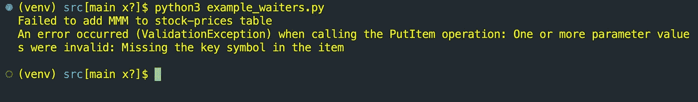

Boto3 PutItem 验证异常—密钥丢失

因此，如果我们用`stock` 替换`symbol`，那么我们将遇到一个`ValidationException`，因为没有对应于我们的表的`Primary Key`的键，即`symbol`

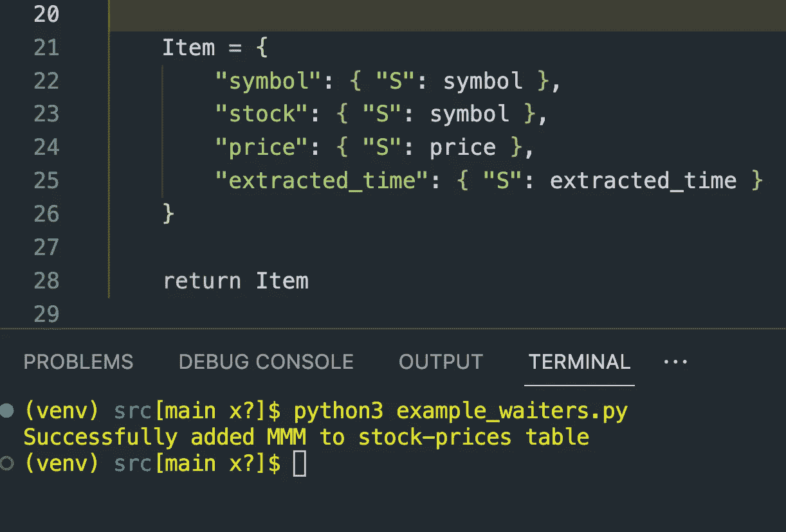

成功的放置项目 API 调用

只要我们在对象中提供主键，我们就可以添加任何其他的键值对。

```
 import boto3

# initialize client
dynamo = boto3.client("dynamodb")

def create_dynamo_table(table_name):
 try:
  dynamo.create_table(
   TableName=table_name,
   AttributeDefinitions=[{
    "AttributeName": "symbol",
    "AttributeType": "S"
   }],
   KeySchema=[{
    "AttributeName": "symbol",
    "KeyType": "HASH"
   }],
   ProvisionedThroughput={
    "ReadCapacityUnits": 1,
    "WriteCapacityUnits": 1
   }
  )

 except Exception as err:
  print(err)
  exit(1)

def add_item_to_table(table_name, item_obj):
 try:
  dynamo.put_item(
   TableName=table_name,
   Item=item_obj
  )
  print(f"Successfully added {item_obj['symbol']['S']} to {table_name} table")
 except Exception as err:
  print(f"Failed to add {item_obj['symbol']['S']} to {table_name} table")
  print(err)
  print("")
  exit(1)
```

`create_dynamo_table`函数调用`create_table` api，所有显示的参数都是必需的。

`KeySchema` 参数是我们明确声明`symbol`将是我们的分区键(通过*散列* 关键字)的地方，而`AttributeDefinitions`是我们定义其数据类型的地方。

我们任意将读/写容量单位设置为 1，因为我们只处理非常小的数据集。`add_item_to_table`函数是我们调用`put_item` API 的地方。

这是我们整个脚本目前应该看起来的样子:

```
## example_waiters.py
import boto3

# initialize client
dynamo = boto3.client("dynamodb")

""" --- Helper Functions --- """
def get_file_contents(file_path):
 f = open(file_path, "r")
 contents = f.readlines()
 f.close()

 return [ line.strip() for line in contents ]

def create_item_obj_for_dynamo(line_data):

 symbol, price, extracted_time = line_data.split(",")

 Item = {
  "symbol": { "S": symbol },
  "price": { "S": price },
  "extracted_time": { "S": extracted_time }
 }

 return Item

""" --- API CALLS --- """
def create_dynamo_table(table_name):
 try:
  dynamo.create_table(
   TableName=table_name,
   AttributeDefinitions=[{
    "AttributeName": "symbol",
    "AttributeType": "S"
   }],
   KeySchema=[{
    "AttributeName": "symbol",
    "KeyType": "HASH"
   }],
   ProvisionedThroughput={
    "ReadCapacityUnits": 1,
    "WriteCapacityUnits": 1
   }
  )

 except Exception as err:
  print(err)
  exit(1)

def add_item_to_table(table_name, item_obj):
 try:
  dynamo.put_item(
   TableName=table_name,
   Item=item_obj
  )
  print(f"Successfully added {item_obj['symbol']['S']} to {table_name} table")
 except Exception as err:
  print(f"Failed to add {item_obj['symbol']['S']} to {table_name} table")
  print(err)
  print("")
  exit(1)

def main():
 #initialize variables
 table_name = "stock-prices"
 file_path = "./stock_prices.csv"

 #execute tasks
 create_dynamo_table(table_name)

 stock_data_objs = get_file_contents(file_path)

 for stock_data in stock_data_objs:
  item_obj = create_item_obj_for_dynamo(stock_data)
  add_item_to_table(table_name, item_obj)

if __name__ == "__main__":
 main()
```

在`main`中，我们首先定义了`table_name`和`file_path`，在下一行，我们创建了 dynamodb 表。

`stock_data_objs`变量是一个数组，对应于`stock_symbols.csv`中的每一行数据。

我们遍历数组中的每一行数据，将其解析成一个 python 字典，然后将该字典传递给要添加到我们的`stock-prices`表中的`put_item`方法。

在我们继续之前，我们需要解决一个可能的问题。

# AccessDeniedException & IAM 权限

尽管代码在本地运行，但我们仍然需要确保我们拥有与 IAM 用户相关联的正确 IAM 权限。

检查和查看是否缺少权限的一种快速方法是运行上面的脚本。

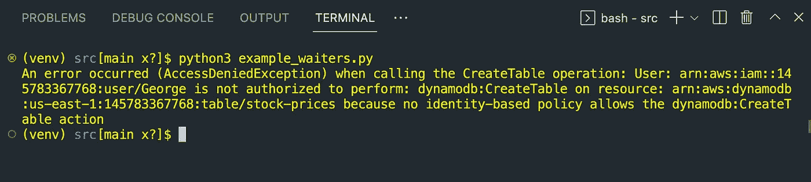

AccessDeniedException 缺少执行操作的 IAM 权限

如果在运行代码时有一个`AccessDeniedException`,那么这意味着我们没有为 IAM 用户附加正确的权限来运行代码。本节将介绍如何添加这些权限来修复此错误。如果没有错误，可以跳过这一部分。

AWS 安全令牌服务(AWS STS)是一种用于获取访问 AWS 资源所需的安全凭据的服务，但也可用于获取有关这些凭据的信息。为了知道在哪里添加权限，我们需要知道我们用来进行 API 调用的 IAM 用户。我们将使用 STS 中的`get_caller_identity`方法来帮助完成这项工作。

```
## get_user_arn.py
import boto3

# initialize client
sts = boto3.client("sts")

# get ARN for user
response = sts.get_caller_identity()["Arn"]
print(response)
```

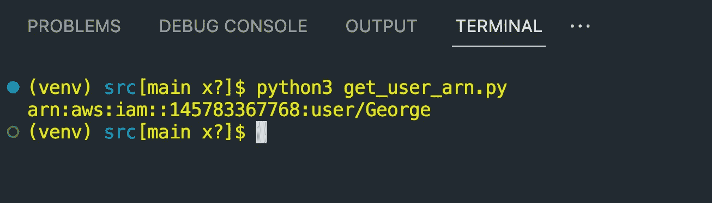

boto3 客户端的用户 ARN

运行上面的脚本输出 IAM 用户的 ARN，该用户的凭证用于对 AWS 进行`boto3` API 调用，在我的例子中，我们看到这个用户是 George。现在，让我们为用户添加权限。


IAM 用户的权限选项卡

导航到 IAM 服务控制台，在侧边菜单上，单击*用户*。从那里，我们选择感兴趣的用户(在我的例子中是 George)。突出显示*权限*选项卡后，现在选择*添加内嵌策略*为您的用户创建新的权限策略。

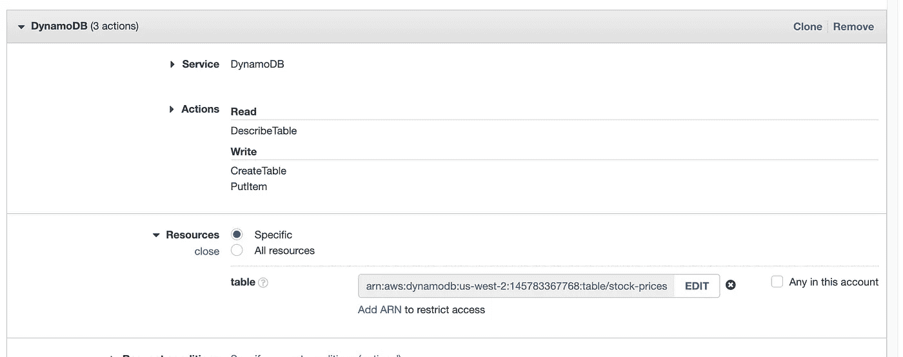

DynamoDB 的内联权限策略

对于维修，选择`DynamoDB`，所需的操作对应于

*   `dynamodb:CreateTable`
*   `dynamodb:DescribeTable`
*   `dynamodb:PutItem`

如果我们想在许可上更加严格，我们可以设置 *Resources* 单独指向这个特定的 DynamoDB 表。因为我们将要创建的表名叫做`stock-prices`，所以 ARN 将采用以下形式

`arn:aws:dynamodb:{your-region}:{your-account-id}:table/stock-prices`

现在点击*审查政策*

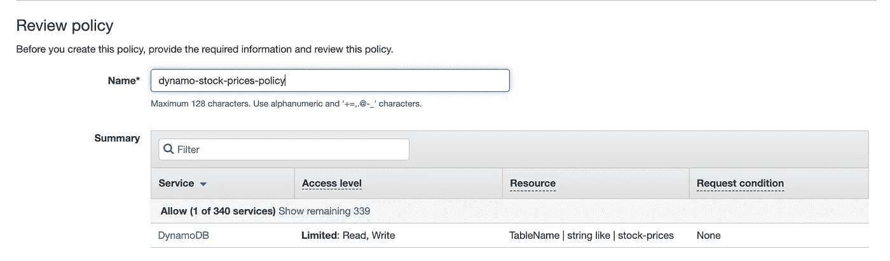

查看 IAM 权限策略

为策略命名，然后单击*创建策略。*这将附加在本地运行代码所需的权限。

# ResourceNotFoundException &变通办法

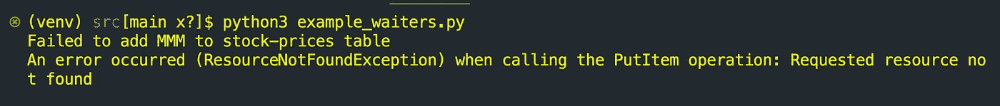

Put-Item 失败— ResourceNotFoundException

现在我们已经确保了我们有正确的权限，在运行脚本之后，我们看到我们得到了一个`ResourceNotFoundException`。这里给出的声明是我们的**股票价格**表没有找到，因此没有创建。

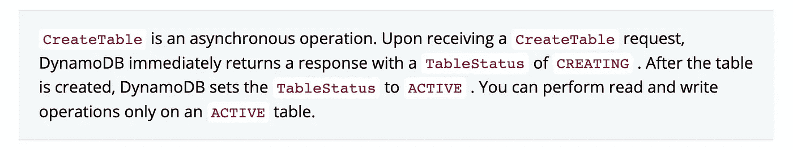

Boto3 文档—DynamoDB 客户端—创建 _ 表格注释

Boto3 文档提到`CreateTable`是异步的，这可以解释我们收到`ResourceNotFoundException`的原因。

由于表最初处于*创建*状态，我们需要找到一种方法，在调用`put_api`之前，等待它的状态变为*活动*。

**注意**:如果我们注释掉创建表格的代码，并在第一次执行几秒钟后再次运行脚本，那么我们将能够向表格中添加数据，这将解决问题。但是我们希望能够同步进行，因此只运行一次脚本。解决这个问题的一个非常常见的方法是使用`describe_table` API。

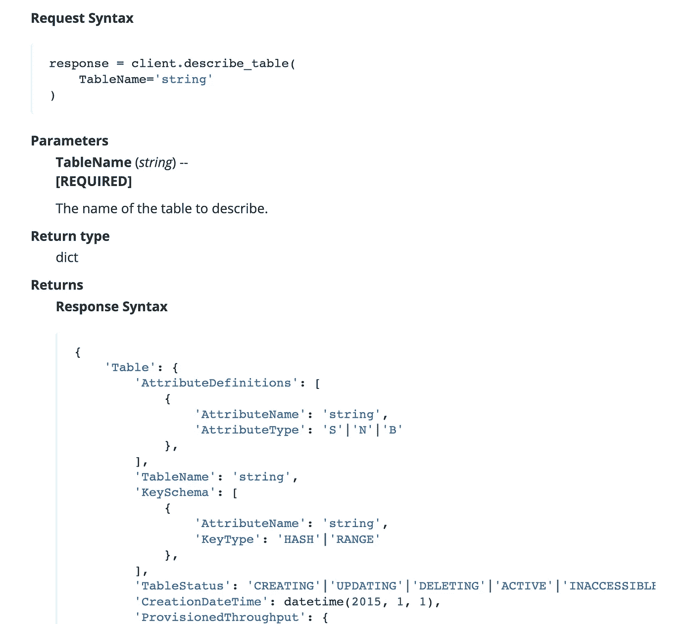

Boto3 — DynamoDB 客户端—描述 _ 表方法

从**响应语法**中，我们感兴趣的是`TableStatus`值

```
def get_table_status(table_name):
 try:
  response = dynamo.describe_table(
   TableName=table_name
  )["Table"]

  print(f"The status of the table is currently: {response['TableStatus']}")
  return response["TableStatus"]

 except Exception as err:
  print(err)
```

因此，我们在脚本中添加了一个新函数来获取和记录表状态

```
def main():
 #initialize variables
 table_name = "stock-prices"
 file_path = "./stock_prices.csv"

 #execute tasks
 create_dynamo_table(table_name)

 count = 0
 status_of_table = get_table_status(table_name)
 while status_of_table != "ACTIVE":
  status_of_table = get_table_status(table_name)
  count += 1

 print(count)
 stock_data_objs = get_file_contents(file_path)
 for stock_data in stock_data_objs:
  item_obj = create_item_obj_for_dynamo(stock_data)
  add_item_to_table(table_name, item_obj)
```

在`create_dynamo_table`之后，我们有一个`while`循环，它将一直循环，直到桌子的状态等于*活动*，然后它将中断循环并继续脚本的其余部分。

我添加了一个 count 变量来查看这个函数会循环多少次。

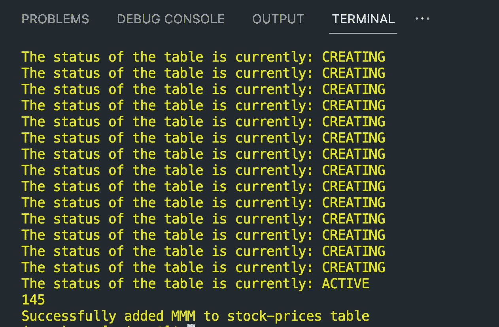

while 循环迭代计数

在这种情况下，`describe_table`操作被执行了 145 次！这需要大量的 API 调用，累积起来成本会很高。

一个解决方法是导入`time`模块并使用`time.sleep`

```
 count = 0
 status_of_table = get_table_status(table_name)
 while status_of_table != "ACTIVE":
  status_of_table = get_table_status(table_name)
  time.sleep(1)
  count += 1
 print(count)
```

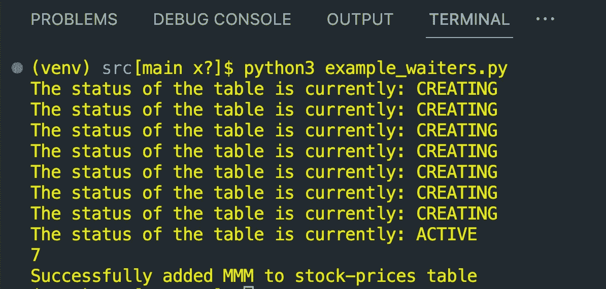

使用 time.sleep(1)减少 describe_table 调用

将我们的`while`循环更新为睡眠一秒钟，我们看到我们已经将`describe_table`调用从 145 次减少到 7 次。有趣的是，这也告诉我们创建表大约需要 7 秒钟，所以我们可以使用`time.sleep(7)`将调用次数减少到 1 次。

但是如果我们试图创建和添加的其他 DynamoDB 表需要更长的时间才能到达活动状态呢？为`time.sleep`选择秒数似乎很随意…

此时，您可能会想，一定有更好的方法来做到这一点？

嗯，你说得对！

所以我们终于谈到了这个博客的主题。

# 用等待者实现

等待程序轮询 AWS 资源的指定状态，并暂停执行，直到资源达到该状态，从而使脚本能够以同步方式运行。

为了初始化一个服务员，我们首先需要访问资源的`boto3 client`,然后向服务员提供我们想要等待的状态。

对象上的属性告诉我们给定资源等待的状态

```
import boto3

dynamo = boto3.client("dynamodb")
ec2 = boto3.client("ec2")
sqs = boto3.client("sqs")

print("dynamo waiters:", dynamo.waiter_names)
print("")
print("ec2 waiters:", ec2.waiter_names)
print("")
print("sqs waiters:", sqs.waiter_names)
```

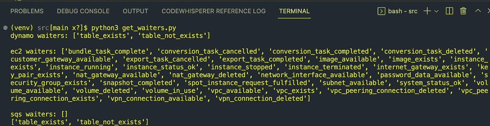

DynamoDB、EC2 和 SQS 客户端的可用等待状态

我们看到 DynamoDB 只有两种状态，在这两种状态下，我们可以使用`waiter`来轮询和停止我们的执行。EC2 要多得多，而 SQS 一个都没有。并不总是保证一个客户会有服务员。

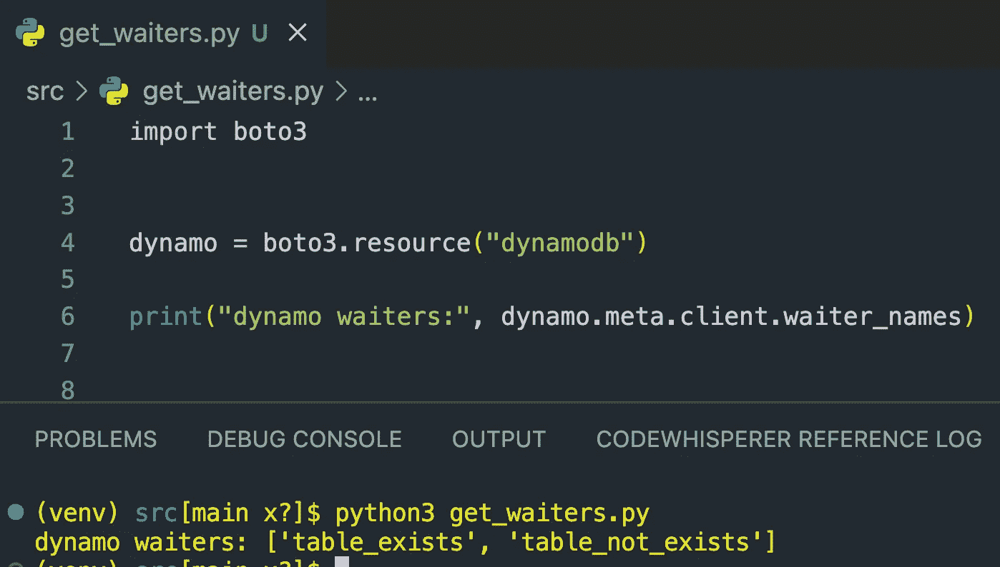

通过资源对象访问客户端对象

当使用资源对象时，我们可以使用`.meta.client`来访问我们的低级客户端对象，因此可以通过这种方式获得`waiter_names`。

```
def main():
 #initialize variables
 table_name = "stock-prices"
 file_path = "./stock_prices.csv"

 #execute tasks
 create_dynamo_table(table_name)

 #waiter for table to become ACTIVE
 waiter = dynamo.get_waiter("table_exists")
 waiter.wait(TableName=table_name)

 stock_data_objs = get_file_contents(file_path)
 for stock_data in stock_data_objs:
  item_obj = create_item_obj_for_dynamo(stock_data)
  add_item_to_table(table_name, item_obj)
```

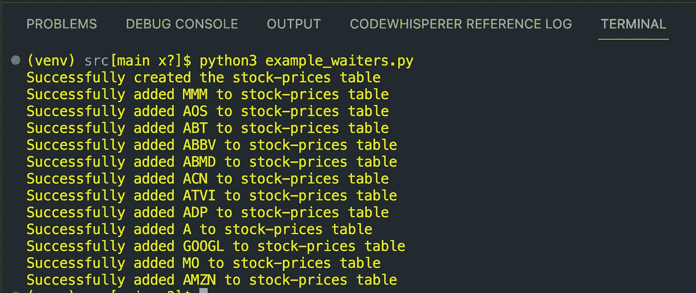

实现服务员后的输出

在更新我们的主函数以使用客户端的`get_waiter`方法和提供的`waiter_name`(在本例中是`table_exists`)之后，我们能够获得我们的`Waiter`对象。为了执行指定的服务员，我们在该对象上使用了`wait`，我们看到我们的程序成功地创建了表并添加了所有的项目。所有这些都是在没有之前的`while`循环逻辑和明确使用`describe_table()` API 的情况下完成的。这使得我们的代码可读性更强，也更容易管理。

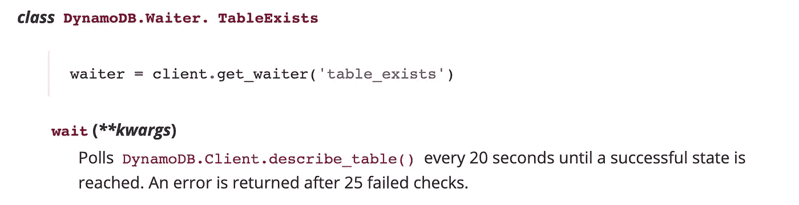

DynamoDB 客户端表 _exists 等待程序

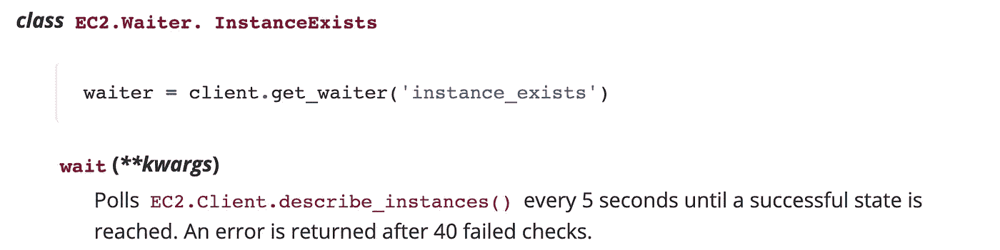

EC2 客户端实例 _exists 等待程序

需要注意的是，默认情况下，每个等待对象轮询资源的延迟时间不同，重试次数也不同。上面，我们看到`DynamoDB.Waiter.TableExists`等待轮询资源的时间是`EC2.Waiter.InstanceExists`的 4 倍，这会降低我们程序的速度。

此外，考虑到我们之前注意到的情况，我们的实例大约花了 7 秒钟才变成活动的*，因此在这里等待 20 秒钟可能太长了。*

*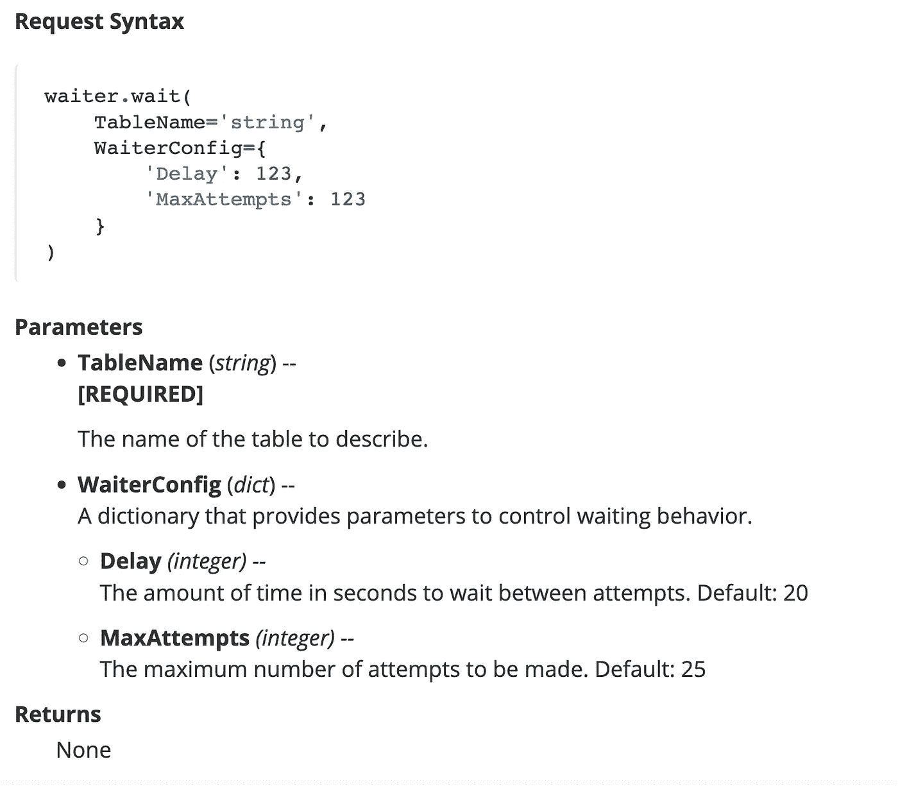*

*DynamoDB。服务员. TableExists 参数*

*幸运的是，我们可以使用`WaiterConfig`参数定制`Delay`和`MaxAttempts`，因此可以对我们的轮询尝试进行更多的控制。*

*我们最终的脚本，使用服务员*

```
*## example_waiters.py
import boto3
from typing import List

# initialize client
dynamo = boto3.client("dynamodb")

""" --- Helper Functions --- """
def get_file_contents(file_path: str) -> List[str]:
 f = open(file_path, "r")
 contents = f.readlines()
 f.close()

 return [ line.strip() for line in contents ]

def create_item_obj_for_dynamo(line_data: str) -> dict:

 symbol, price, extracted_time = line_data.split(",")

 Item = {
  "symbol": { "S": symbol },
  "price": { "S": price },
  "extracted_time": { "S": extracted_time }
 }

 return Item

""" --- API CALLS --- """
def create_dynamo_table(table_name: str) -> None:
 try:
  dynamo.create_table(
   TableName=table_name,
   AttributeDefinitions=[{
    "AttributeName": "symbol",
    "AttributeType": "S"
   }],
   KeySchema=[{
    "AttributeName": "symbol",
    "KeyType": "HASH"
   }],
   ProvisionedThroughput={
    "ReadCapacityUnits": 1,
    "WriteCapacityUnits": 1
   }
  )

  print(f"Successfully created the {table_name} table")

 except Exception as err:
  print(err)
  exit(1)

def add_item_to_table(table_name: str, item_obj: dict) -> None:
 try:
  dynamo.put_item(
   TableName=table_name,
   Item=item_obj
  )
  print(f"Successfully added {item_obj['symbol']['S']} to {table_name} table")
 except Exception as err:
  print(f"Failed to add {item_obj['symbol']['S']} to {table_name} table")
  print(err)
  print("")
  exit(1)

def main() -> None:
 #initialize variables
 table_name = "stock-prices"
 file_path = "./stock_prices.csv"

 create_dynamo_table(table_name)

 #wait for table to be in ACTIVE state
 waiter = dynamo.get_waiter("table_exists")
 waiter_config = {"Delay": 2, "MaxAttempts": 10}
 waiter.wait(TableName=table_name, WaiterConfig=waiter_config)

 #parse data and add to dynamo table
 stock_data_objs = get_file_contents(file_path)
 for stock_data in stock_data_objs:
  item_obj = create_item_obj_for_dynamo(stock_data)
  add_item_to_table(table_name, item_obj)

if __name__ == "__main__":
 main()*
```

# *结论*

*等待程序是暂时停止执行和轮询资源直到达到特定状态的好方法。这有助于避免在访问该资源时遇到错误。使用等待程序通过删除样板逻辑使代码更具可读性，并且可以配置为以不同的速率轮询和重试，这有助于优化您的代码。*

*感谢您的阅读！*

*也可以随时在 LinkedIn 上与我联系！*

# *资源*

*   *[https://boto 3 . Amazon AWS . com/v1/documentation/API/latest/reference/services/dynamo db . html # dynamo db](https://boto3.amazonaws.com/v1/documentation/api/latest/reference/services/dynamodb.html#dynamodb)*