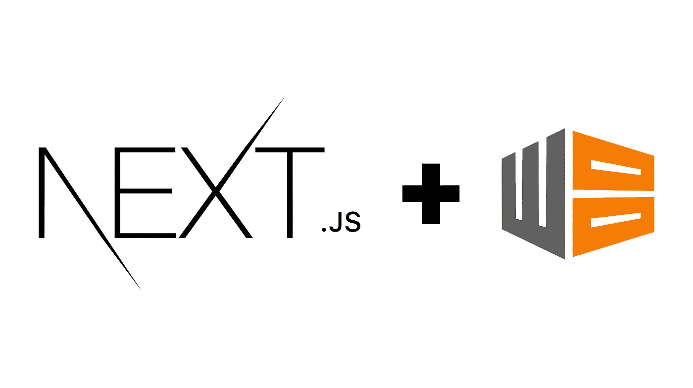

# 如何在 Next.js 中使用 Workbox

> 原文：<https://betterprogramming.pub/using-workbox-with-next-js-a-step-towards-progressive-web-apps-a3f985f5f864>

## 迈向渐进式网络应用的一步



谷歌的[工具箱](https://developers.google.com/web/tools/workbox)是一组库和节点模块，使其易于缓存资产并充分利用用于构建[渐进式网络应用](https://developers.google.com/web/progressive-web-apps/) (PWAs)的功能。

值得注意的是，Workbox 提供了两个 [webpack](https://webpack.js.org/) 插件:一个为您生成一个完整的服务工作者，另一个生成一个要预先缓存的资产列表，通过`[workbox-webpack-plugin](https://developers.google.com/web/tools/workbox/modules/workbox-webpack-plugin)`库注入到服务工作者文件中。

当你想将 [Next.js](https://nextjs.org/) 与 Workbox 集成时，这些插件就派上了用场。尽管可以认为集成很容易，但是任何 Next.js 项目都会受益于一些特定的配置值。

# 介绍 next-with work box

`[next-with-workbox](https://github.com/cansin/next-with-workbox)`是一个 Next.js 插件，旨在封装这样的配置并使它们可重用。它提供了一个完全可定制的界面，因此您可以通过 Workbox 实现您需要的任何功能。

要使用这个库，让我们首先将它安装到我们的 Next.js 应用程序中:

```
yarn add next-with-workbox workbox-window
```

下一步是在您的`next.config.js`中启用插件:

```
// at next.config.jsconst withWorkbox = require("next-with-workbox");module.exports = withWorkbox({
  workbox: {
   // .
   // .. *// ... any workbox-webpack-plugin.GenerateSW option*
  },
  // .
  // ..
  // ... other Next.js config values
});
```

然后，通过`.gitignore`忽略自动生成的文件:

```
public/sw.js
public/sw.js.map
public/worker-*.js
public/worker-*.js.map
```

这就是配置您的工作箱服务人员设置的全部内容。然后你可以在`pages/_app.js`注册你的工具箱实例:

```
import React, { useEffect } from "react";
import { Workbox } from "workbox-window";function App({ Component, pageProps }) {
  useEffect(() => {
    if (
      !("serviceWorker" in navigator) ||
      process.env.NODE_ENV !== "production"
    ) {
      console.warn("Progressive Web App support is disabled");
      return;
    }const wb = new Workbox("sw.js", { scope: "/" });
    wb.register();
  }, []);return <Component {...pageProps} />;
}export default App;
```

你完了！祝贺您，您已经为您的 Next.js 应用程序设置了 Workbox。在引擎盖下，`[next-with-workbox](https://github.com/cansin/next-with-workbox)`插件将配置一些东西，如确保缓存破坏只对非哈希文件名启用，将`public/**/*`文件夹内容添加到预缓存中，修改`_next/static`文件的 URL 前缀，等等！

## 使用工具箱-web pack-插件。注射清单

上面的介绍假设你正在尝试使用`[GenerateSW](https://developers.google.com/web/tools/workbox/modules/workbox-webpack-plugin#generatesw)` 插件。如果你想使用`[InjectManifest](https://developers.google.com/web/tools/workbox/modules/workbox-webpack-plugin#injectmanifest)`插件来更好地控制你的服务人员，使用`[next-with-workbox](https://github.com/cansin/next-with-workbox)`插件也很简单。

首先，再安装一个您需要依赖的依赖项:

```
yarn add workbox-precaching
```

然后，只需将`swSrc`选项添加到您的`next.config.js`中，如下所示:

```
// at next.config.jsconst withWorkbox = require("next-with-workbox");module.exports = withWorkbox({
  workbox: {
   swSrc: "worker.js",
   // .
   // .. *// ... any other workbox-webpack-plugin.InjectManifest option*
  },
  // .
  // ..
  // ... other Next.js config values
});
```

并在项目的根目录下创建一个`worker.js`文件:

```
import { precacheAndRoute } from "workbox-precaching";precacheAndRoute(self.__WB_MANIFEST);
```

就是这样。现在您可以在`worker.js`放置任何您需要的服务工作者代码。

# 结论

`[next-with-workbox](https://github.com/cansin/next-with-workbox)`插件完成了你将 Workbox 与 Next.js 应用程序集成所需的大部分日常工作，让你专注于服务人员真正重要的事情。但是请记住，仍然需要了解 Workbox 和维修人员如何在其上工作。

## 还会有更多

如果您只想启用 Google 的 [Lighthouse](https://developers.google.com/web/ilt/pwa/lighthouse-pwa-analysis-tool) 上的所有绿色 PWA 标记，并使您的应用程序可安装，该怎么办？你很幸运。我正在开发一套库，它将使您能够快速采用 app shell 模型，并以最少的配置为您的 Next.js 应用程序提供一个基本的离线视图。但稍后会详细介绍！