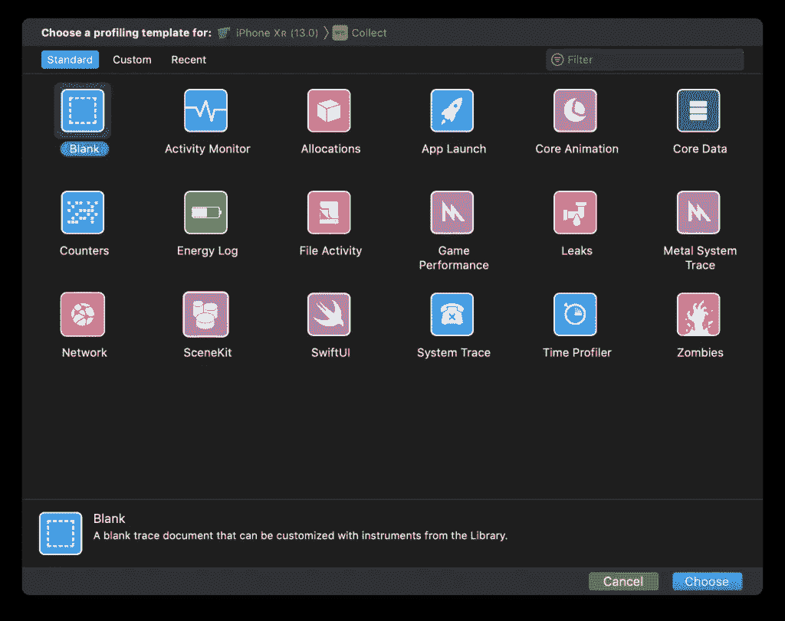
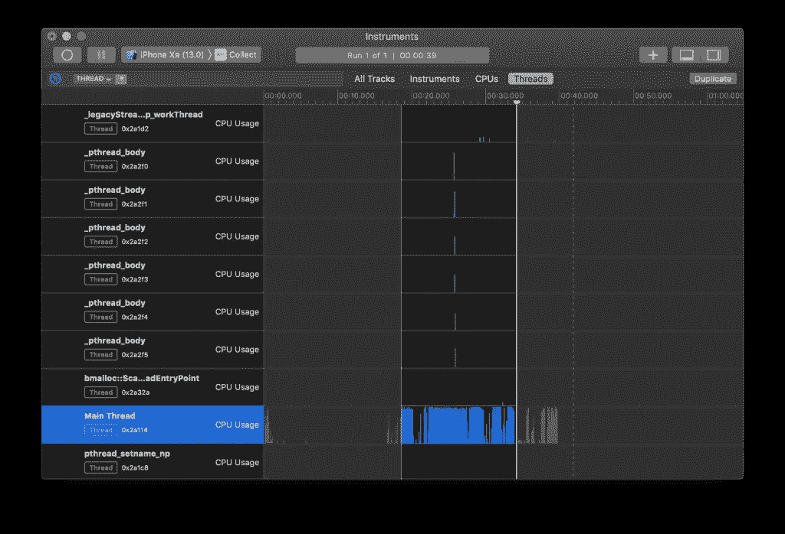
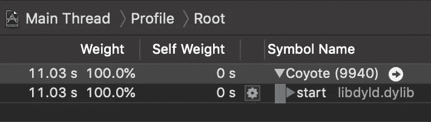
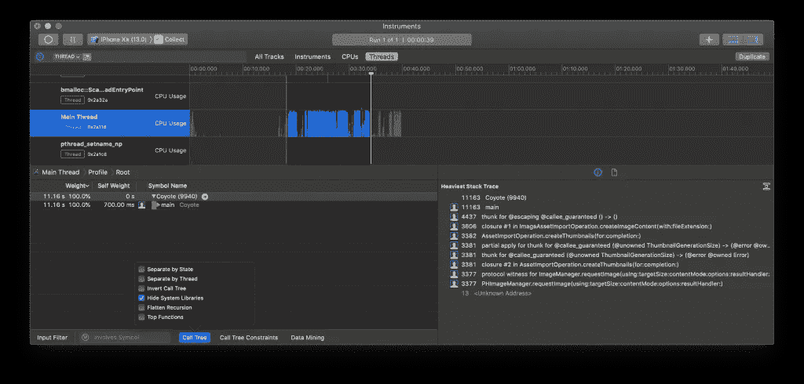
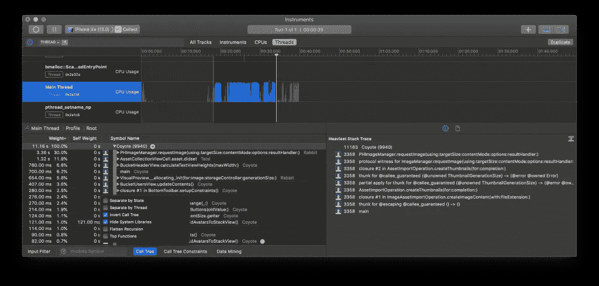
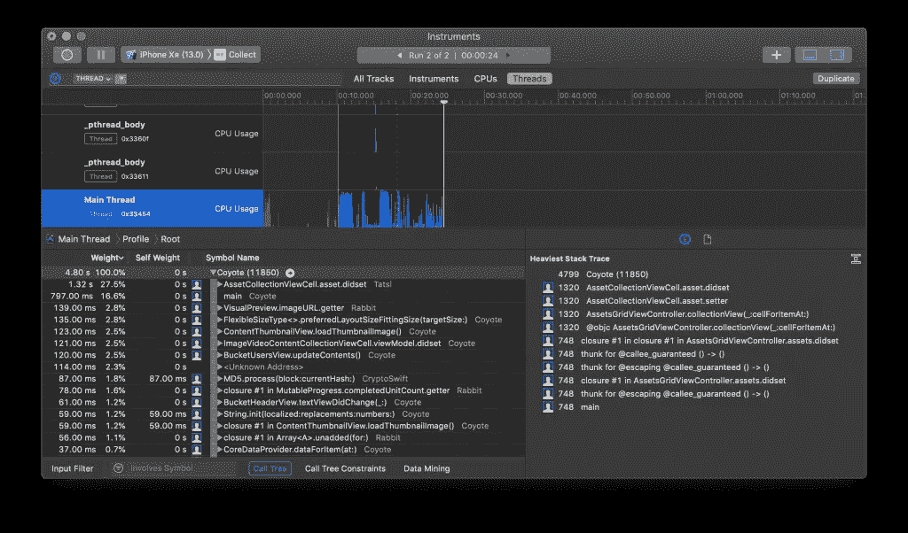

# 使用 Xcode 工具提高应用程序性能

> 原文：<https://betterprogramming.pub/using-xcode-instruments-to-improve-app-performance-a9b30f5e5813>

## 深入可用的工具，开始改进您的应用程序

照片由[艾米·李斯特](https://unsplash.com/@07lista?utm_source=unsplash&utm_medium=referral&utm_content=creditCopyText)在 [Unsplash](https://unsplash.com/search/photos/dive?utm_source=unsplash&utm_medium=referral&utm_content=creditCopyText) 上拍摄

Xcode Instruments 是 Xcode 免费提供的开发工具。它有很多有用的工具来检查和改进你的应用程序。尽管它能提供很多东西，但它通常是一个不太为人所知的领域。

这部分在你的应用里越好，你的应用表现越好。

在这篇博客文章中，我将向你展示我如何使用 Xcode Instruments 提高了 WeTransfer 应用程序 [Collect 的关键部分的性能。](https://collect.wetransfer.com)

为了让您对结果有一个概念，这是“导入照片”后得到显著改进的前后结果:

正如你所看到的，在旧版本中，导入弹出窗口显示的时间更长，而最终的共享表也延迟了很多。

是时候深入了解并看看我们是如何改进这一流程的了！

# 什么是 Xcode 仪器？

Xcode Instruments 被描述为一个强大而灵活的性能分析和测试工具。它是 Xcode 工具集的一部分，该工具集还包括 Create ML 和 Accessibility Inspector 等工具。

这些仪器可用于:

*   追踪源代码中的问题。
*   分析你的应用程序的性能。
*   查找内存问题。

还有很多！

# 如何访问 Xcode 乐器？

您可以使用 Xcode 菜单中的`Product ➔ Profile`来访问仪器，该菜单的快捷手柄为`⌘ + I`。这将重建您的产品并打开 Xcode 仪器概述。

Xcode 仪器概述

# 我应该知道如何使用每个仪器吗？

展示 17 种不同乐器的概览可能会让人不知所措。

它们中的每一个都可能非常有价值，但绝对不是每个应用程序都需要它们。其中一些，比如游戏性能工具，只有在你开发游戏的时候才有价值。

不过，深入研究可用的工具并了解哪些工具可用是值得的。你可能会陷入一个可以通过现有工具解决的问题。

# 我可以在模拟器中使用仪器吗？

虽然大多数仪器可以在模拟器上运行，但并不总是建议这样做。物理设备将显示更真实的结果，因此推荐使用。

# 使用 Xcode Instruments 时间配置文件研究和提高性能

Time Profiler 工具可以深入了解系统的 CPU 以及多核和线程的使用效率。这部分在你的应用里越好，你的应用表现越好。

在收集应用程序性能示例中，我们的目标是加快向应用程序添加内容的流程。时间分析器是我们洞察哪部分代码可以优化的起点。

# 使用时间剖面仪创建新记录

选择 Time Profiler 仪器后，我们可以按左上方的红色按钮或使用`⌘ + R`开始新的记录。这将在所选设备中启动你的应用程序，之后你可以开始你的流量。

当你完成了你想要改进的流程，你可以停止记录，开始研究结果。

我们首先想知道主线程是怎么用的。当主线程上有大量工作发生时，UI 被阻塞，这正是我们在 Collect 应用程序中遇到的问题。

# 使用过滤器创建线程概述

通过选择*螺纹*选项卡，过滤栏可用于缩小概览并更好地了解使用的螺纹。

向下滚动显示我们的主线程被大量使用，而其他线程并不那么忙:

时间分析器主线程使用情况

# 确定哪部分代码可以优化

使用`⌘ + D`将打开*细节区域*，如果它还不可见的话。

这显示了突出显示的时间段的符号名称。在前面的示例中，您可以看到图表中的峰值以蓝色突出显示。您可以通过单击并拖动想要调查的零件来完成同样的操作。

首先，从细节区域中的符号名称来看，它看起来非常不可用:

细节区域中不清楚的符号名称

尽管细节区域的右侧向我们显示了*最重的堆栈跟踪*，但是我们可以使用*调用树*输入过滤器来获得更好的概览。这也将通过隐藏某些符号来改善最重堆栈跟踪视图。

在详细信息区域隐藏系统库

我们从*隐藏系统库*开始，它将去掉所有不在我们控制范围内的低级符号，我们也无法对它们进行优化。正如你所看到的，最重的堆栈跟踪现在要干净得多。

接下来是*反转调用树*过滤器，它将使顶层方法可见，而不必单击每个调用树。

结合对 *Weight* 列的排序，我们可以确切地看到哪些方法应该被优化。

用于缩小结果范围的时间剖面输入过滤器

很明显，我们的`PHImageManager`代码表现最差，因为它花费了总时间 11.16 秒中的 3.36 秒。事实证明，我们可以很容易地将这一部分转移到后台线程，并为这一部分卸载主线程。

我们注意到的另一件事是`BucketHeaderView`，它一直在重新计算它的高度，尽管我们在测试的流中没有对它做任何事情。事实证明，我们确实不必这样做。

# 验证结果

在您改进了代码之后，是时候重新运行时间分析器并验证结果，以确保它确实得到了改进。

在时间分析器中验证结果

虽然我们已经在之前分享的前后视频中看到了改进，但我们现在可以看到，同一个流不再包含作为最重堆栈跟踪的`PHImageManager`。这证实了我们的代码更改是有效的。

标题也不再重新计算，我们的流的性能得到了改善。

# 结论

Xcode Instruments 包含许多有价值的工具，可以提高应用程序的性能。时间分析器可用于深入某个流程，改进一段代码，然后立即进行验证。

花些时间钻研可用的工具，这样你就知道哪些是有用的，并开始改进你的应用程序。