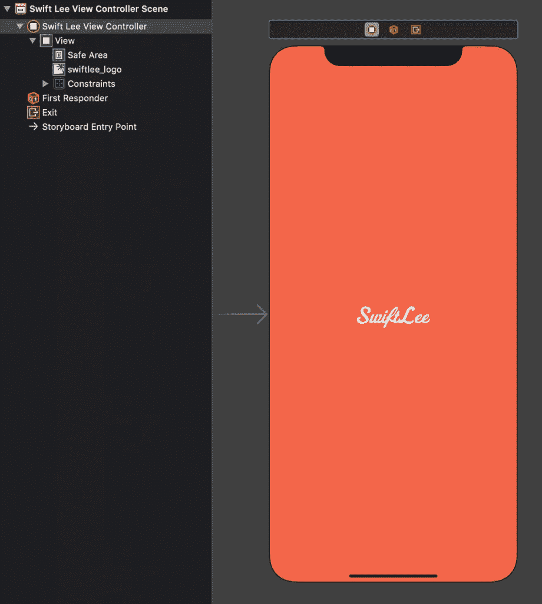
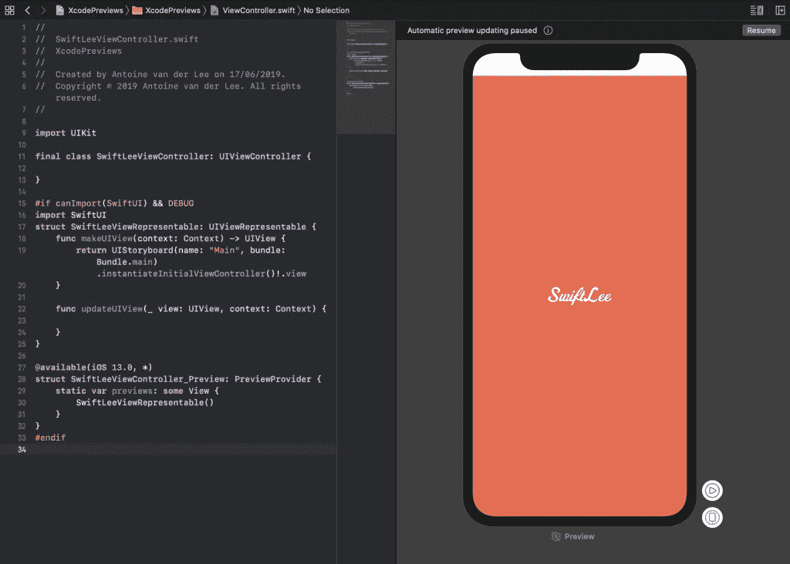

# 在现有视图中使用 Xcode 预览，而不使用 SwiftUI

> 原文：<https://betterprogramming.pub/using-xcode-previews-with-existing-views-without-using-swiftui-a8dae93ecd23>

## 在 Xcode 11 中使用 Xcode 预览的方法


约书亚·阿拉贡在 [Unsplash](https://unsplash.com/@goshua13) 上拍摄的照片

Xcode 预览已添加到 Xcode 11 中，它们允许您快速预览视图的当前状态。虽然你可能认为你需要使用 SwiftUI 来利用这个伟大的新特性，但这不是真的！无论您使用自定义的`UIView`还是自定义的`UIViewController`，它们都支持在新画布中预览。这很棒，因为这个新特性允许你更快地迭代和实现设计。

*注意:您需要 Xcode 11 和 MacOS Catalina 才能使用 Xcode 预览。*

# 我们即将预览的 SwiftLee 视图控制器

在下面的例子中，我们有一个非常简单的`SwiftLeeViewController`，它在一个`UIImageView`中显示了 SwiftLee 标志。视图控制器是从界面构建器中设置的:



显示 SwiftLee 徽标的简单视图控制器。

视图控制器的代码为空:

```
final class SwiftLeeViewController: UIViewController {

}
```

# 支持旧版本 iOS 时使用 Xcode 预览

WWDC 很棒，但一个很大的缺点是，在你放弃 iOS 12 之前，你可能不会使用很多新功能。然而，Xcode 预览不一定是这样的功能！

诀窍在于开发时将 OS 部署目标设置为 iOS 13。这允许画布生成预览，就像 SwiftUI 一样。

# 但是我如何使用这些只有 iOS 13 及以上版本才有的协议呢？

为此，我们可以利用`canImport`,以及可用性 API。

为了添加对我们的`SwiftLeeViewController`的支持，我们必须添加以下代码:

```
#if canImport(SwiftUI) && DEBUG
import SwiftUI
struct SwiftLeeViewRepresentable: UIViewRepresentable {
    func makeUIView(context: Context) -> UIView {
        return UIStoryboard(name: "Main", bundle: Bundle.main).instantiateInitialViewController()!.view
    }

    func updateUIView(_ view: UIView, context: Context) {

    }
}

@available(iOS 13.0, *)
struct SwiftLeeViewController_Preview: PreviewProvider {
    static var previews: some View {
        SwiftLeeViewRepresentable()
    }
}
#endif
```

我们来分析一下。

我们从`canImport`开始，它确保我们的项目仍然为没有最新 Xcode 版本的开发人员构建。他们可能还不能导入 SwiftUI 框架。

请注意，我们只为我们的调试配置导入 SwiftUI 框架，所以我们永远不会在发布的代码中导入该框架。

`SwiftLeeViewRepresentable`是我们的包装器，它将我们的`UIView`转换成 SwiftUI `View`。在`makeUIView`方法中，我们基本上实例化了我们的视图控制器。此方法可用于实例化任何视图，包括自定义视图或从代码创建的视图控制器。

我们以实现`PreviewProvider`协议的`SwiftLeeViewController_Preview`结束。这将自动启用 Xcode 中的预览画布，它将实际显示预览。我们只需返回`SwiftLeeViewRepresentable`实例就可以完成这项工作。我们还使用`@available`代码来确保如果我们为调试配置改回 OS 版本，我们的代码仍然可以构建。



带有 UIKit 视图的 Xcode 预览

你唯一需要做的就是在开发的时候把你的项目设置切换到 iOS 13.0。一旦你的用户界面完成，你可以切换回你支持的最低 iOS 版本。最好的办法是为您的发布版本设置这个版本。例如，当您支持 iOS 11 及更高版本时:


Xcode 中的操作系统版本设置

# 结论

虽然工作流程要求您切换操作系统版本，但它允许您使用 Xcode 预览。这可以提高开发速度，并允许您在放弃 iOS 12 支持之前开始使用 Xcode 预览。