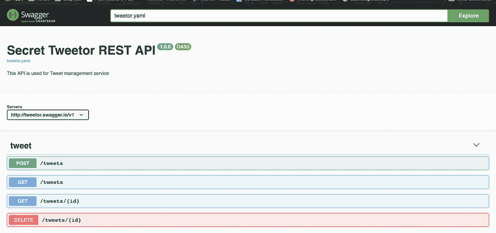

# 利用开放 API 3 加快软件开发过程

> 原文：<https://betterprogramming.pub/utilize-open-api-3-for-the-faster-software-development-process-6783f18c63d5>

## 如何使用开源工具在 Kubernetes 中轻松制作模拟服务器、APIClient SDK 和实时 API 文档


在 [Unsplash](https://unsplash.com?utm_source=medium&utm_medium=referral) 上[给](https://unsplash.com/@toineprojects?utm_source=medium&utm_medium=referral)拍照

我对开源世界充满热情。有这么多伟大的免费开源工具，如 Linux、Kubernetes、Docker、NodeJS 和 Golang。这个生态系统还在继续发展，为这个世界(软件工程世界)带来了新的技术和解决方案。

今天，我将探索一些可能对开发人员有用的开源项目。如果你曾经读过[我的关于我们在](https://toolbox.kurio.co.id/api-driven-development-in-kurio-speeding-up-the-development-process-with-open-api-3-addcc07cb9ce) [Kurio](https://kurio.id) 中使用的 API 驱动开发实践的文章，你会发现像开放 API 3、模拟服务器和 SDK 生成器这样的术语。但是，在那篇文章中，我没有解释诸如利用 Open API 3、创建模拟服务器或生成 SDK 之类的事情。

在这篇文章中，我将介绍如何创建一个模拟服务器，使用免费工具生成一个 API SDK(也称为开源项目)并将其托管在 Kubernetes(K8s)集群中。对于这种情况，我将使用我自己的 Kubernetes 集群。

下面的所有步骤都将使用 K8s 集群，我将在假设您已经拥有一个可用的、生产就绪的 K8s 集群(或者至少是准备就绪的)的情况下工作。

对于我的探索，我已经准备了一个 Open API 3 规范的例子，我将在本文中使用这个规范。规范可以在我的 [Github repo](https://github.com/bxcodec/tweetor/blob/master/docs/openapi.yaml) 中找到。

总而言之，我将使用开放 API 规范做三件事:

*   [根据开放的 API 3 规范创建实时 API 文档](#d9c7)
*   [从 Open API 3 中创建一个轻量级且速度极快的模拟服务器](#b13e)
*   [从开放 API 3 规范生成 HTTP SDK 客户端](#bbc2)

# 创建实时 API 文档

需要准备的工具:

*   [Swagger UI](https://github.com/swagger-api/swagger-ui)
*   开放 API 的完整/现成安装
*   一个实时的、生产就绪的 K8s 集群(或者至少是准备就绪的)

最简单的方法是创建实时 API 文档。有了实时 API 文档，希望每个开发人员都能够阅读并理解我们的 API，它是如何工作的，请求和响应。我们可以使用的工具有很多，但在本文中，我将使用 Swagger 提供的默认工具，Swagger UI **。**

他们已经提供了一个我们可以使用的公共 docker 图像。因此，如果您有一个 K8s 集群，只需将它的部署添加到我们的 K8s 集群中。很简单。

## **第一步:创建 Swagger UI 的 Docker 图像**

我们需要创建一个 Docker 映像，它将被使用并部署到我们的 K8s 集群中。不要忘记使用 Swagger UI 作为基本的 docker-image。

下面是我的 Dockerfile 文件的一个例子:

```
FROM swaggerapi/swagger-ui:v3.23.1ADD **tweetor.yaml** /usr/share/nginx/html/tweetor.yaml
# Add another spec here
```

*   `tweetor.yaml` 是我的开放 API 规范。只需将它添加到基本图像文件夹中。完整的文件可以在[这里](https://github.com/bxcodec/tweetor/blob/master/docs/openapi.yaml)找到。
*   由于基础图像`swaggerapi/swagger-ui:v3.23.1`使用了 NGinx，我需要将我的`Spec`添加到 NGinx 文件夹中，这个文件夹在`/usr/share/nginx/html/`中。

然后，我们可以构建并将其推送到私有容器注册中心(我使用 GCR 作为我的个人 docker 注册中心):

```
$ docker build -t asia.gcr.io/kube-xmas/tweetor-docs:latest .
//docker build process will happen here...$ docker push asia.gcr.io/kube-xmas/tweetor-docs:latest
//docker push process will happen here...
```

## **第二步:为 Swagger UI 创建一个 Kubernetes 部署配置**

接下来，创建 K8s 部署组件。

在 Kubernetes 上执行和运行部署:

```
$ kubectl apply -f swagger_ui_deployment.yaml$ kubectl get pods --namespace=tweetor-docs
NAME                             READY   STATUS    RESTARTS   AGE
tweetor-docs-786d889d67-65h45   1/1     Running   0          14m
```

所以，在上面的部署中，我只使用了三个组件，`Namespace`、`Deployment`和`Service`(节点端口)。最后一步是将`Ingress`组件添加到服务中，这样每个工程师都能看到文档。

```
$ kubectl apply -f ingress_swagger_docs.yaml
```

现在，任何工程师都可以获得这些文档。



* *注意:如果您在访问 API-Docs 时遇到 Petstore swagger，请输入您在 docker 文件中创建的 swagger yaml 名称。在我的例子中，我使用 tweetor.yaml，你可以在搜索栏/explore 中看到。你所有的文档都可以放在一个 docker 容器中。* *如果有时间的话，试着在索引页中更改默认的 swagger 文件。*

仅此而已，很简单。

# 创建一个轻量级且速度极快的模拟服务器

需要准备的工具:

*   [API 萌芽](https://github.com/danielgtaylor/apisprout)
*   开放 API 的完整/现成安装
*   一个实时的、生产就绪的 K8s 集群(或者至少是准备就绪的)

另一个对软件开发有用的技巧是创建一个模拟服务器。模拟服务器是一个虚拟服务器，它代表一个真实的服务器，但是通常没有任何特定的逻辑。他们可以接受任何请求，但响应通常是静态的。

为什么我们需要模拟服务器？你可以在我过去的文章[这里](https://toolbox.kurio.co.id/api-driven-development-in-kurio-speeding-up-the-development-process-with-open-api-3-addcc07cb9ce)中找到更多的细节，但我将在这里简单介绍一下。

我能想到的最简单的例子是，想象我们在两个团队之间工作，一个在后端，另一个在前端。两个队开始了相同的冲刺。通常，前端团队需要先准备好 API，这样他们才能工作，但是当工作在同一个 sprint 上时，它将被阻塞，因为后端仍然没有实现 API。这就是模拟服务器有用的时候。

那么，我们如何轻松地创建一个模拟服务器呢？

## **第一步:创建 docker 文件**

我已经有了一个活的 Kubernetes 集群和一个现成的 [Open API 3 specs](https://github.com/bxcodec/tweetor/blob/master/docs/openapi.yaml) 副本。

这里有一个很好的工具/库。这是一个基于开放 API 3 规范的简单模拟服务器生成器。代码真的很简单，是用 Golang 写的。如果是我先有这个想法的话，这个工具可能就是我发明的。但是，没关系，而不是重新发明轮子，我只是用在我自己的。

我需要做的是从它创建一个 docker 映像，并将我的 Open API 规范添加到 Docker 映像中。

这是我的文档:

```
FROM danielgtaylor/apisproutADD tweetor.yaml /data/tweetor.yaml
```

创建 Docker 映像并将其推送到 Docker 注册表:

```
$ docker build -t asia.gcr.io/kube-xmas/tweetor-mock:latest .
//docker build process will happen here...$ docker push asia.gcr.io/kube-xmas/tweetor-mock:latest
//docker push process will happen here...
```

就这样，我们剩下的就是向 Kubernetes 添加一个部署文件。

## **第二步:为模拟服务器创建 Kubernetes 部署**

接下来，添加 K8 的部署。以下是我的部署配置:

```
$ kubectl apply -f mock_tweetor_deployment.yaml
```

将入口添加到 DNS 管理后，您现在可以访问模拟服务器:

```
$ curl mock.tweetor.xyz/tweets
[
  {
    "createdTime": "2018-12-24T09:21:41.827Z",
    "id": "abc-f45def-5sdaf-5636f",
    "text": "Merry Christmast Everyone!!!"
  },
  {
    "createdTime": "2018-12-23T09:21:41.827Z",
    "id": "abc-f45def-5sdaf-5636f",
    "text": "I believe santa will give me a great present"
  },
  {
    "createdTime": "2018-12-22T09:21:41.827Z",
    "id": "abc-f45def-5sdaf-5636f",
    "text": "Hello my secret santa. Thank you!!!"
  }
]
```

现在，我们的前端团队将能够使用模拟 API 开发前端。

# 生成 HTTP SDK 客户端

需要准备的工具:

*   [打开 API 生成器](https://github.com/OpenAPITools/openapi-generator)
*   对于高级用法，在本文中，我不会使用 CI/CD。

我们要讨论的最后一件事是如何利用开放 API 规范来帮助我们生成 HTTP 客户端 SDK。SDK 代表软件开发工具包，意思是一组库或其他可以帮助我们集成或使用一些服务或工具的东西。

在微服务世界中，有如此多的服务在运行并处理不同的任务。每个服务都有其可能与其他服务不同的端点，但在其差异内，它们仍然具有相同的模式(我说的是 RESTfull 微服务)。它们使用 HTTP 动词(GET、POST、PUT、DELETE)和状态代码(200、201、202、400、401、403、404、500 等)。

每个服务可能依赖于不止一个服务，当将每个服务连接到另一个服务时，通常，程序员构建他们的函数来执行 HTTP 请求。


服务 A 和 B 依赖于 C

以上图为例:

> 假设服务 A 和服务 B 连接到服务 C。现在想象一个程序员从服务 A 手动构建连接器(REST HTTP 客户端)。该程序员还从服务 B 构建连接器。想象还有许多服务将连接到服务 C，并且所有连接器都是手动构建的。

在上面的例子中，我们看到一个多余的任务。如果连接器是独立的，并作为库导入到我们的项目中，会怎么样？如果我们可以自动生成连接器，而不是手动构建，会怎么样呢？

这就是 Open API 在这里的用法。以前，在 Open API 3 的早期版本 Swagger 2 中，生成 HTTP 客户端 SDK 是很常见的。但是，在 Open API 3 中，它仍然是新的。

幸运的是，这里的社区已经开发了一个很棒的工具。它是开源的，免费的，非常容易使用。尤其是因为它们已经支持 CLI 和 Docker 映像。

## **用 Docker 生成 SDK**

我更喜欢和 Docker 一起使用，因为它可以在 CI/CD 中使用，特别是如果 CI/CD 像 Buddy 一样支持容器化的话。同样使用 Docker，我们不需要安装 Java SDK，因为如果要使用 CLI 安装，我们需要安装 Java SDK。由于我不想添加任何额外的作业，所以我只使用 Docker 方法。

*   用你的开放 API 规范改变`./**tweetor.yaml**` 。
*   `**-g**` **:** 指定生成的 SDK 的编程语言。支持的编程语言可以在[这里](https://github.com/OpenAPITools/openapi-generator#overview)看到。在上面的例子中，我想为 Golang 生成一个 HTTP 客户端 SDK。
*   `**-o**`:指定生成的 SDK 的目标文件夹。

这里先睹为快生成的 HTTP 客户端 SDK。这是在 Go 中生成客户端后的一个示例文件夹结构。

```
.
├── README.md
├── api
│   └── openapi.yaml
├── api_tweet.go
├── client.go
├── configuration.go
├── docs
│   ├── Tweet.md
│   └── TweetApi.md
├── git_push.sh
├── go.mod
├── go.sum
├── model_tweet.go
└── response.go
```

我不能确切地告诉你代码是如何生成的，但是你可以自己尝试一下，看看生成的 SDK。如果在许多微服务上工作，这真的很有帮助，可以帮助我们更快地开发项目。

但是将来，这个生成的 SDK 可能会有一个问题:

*   **维护目标 API 的版本**。因为它是一个生成的 HTTP 客户端 SDK，可能很难处理版本控制。因此，最佳解决方案是在我们生成 SDK 之后，我们必须推送到 git 存储库，并为每个生成的 SDK 添加 Git 标签(实际上，shell 脚本已经在生成的文件夹中准备好了，所以它解决了:D)。

# 下一步是什么？

有很多工具可能对我们有用，这些工具与 Open API 或 Swagger 相关。这里列出的工具你都能找到: [https://openapi.tools](https://openapi.tools/) 。

下一步是使用(您选择的)CI/CD 自动化该过程，因此当工程师更新开放 API 规范时，它将自动更新所有 API 文档、模拟服务器和生成的 SDK。

上面写的所有流程我都做了自动化流程，但是还在找合适的时机写出来。🤧🤕