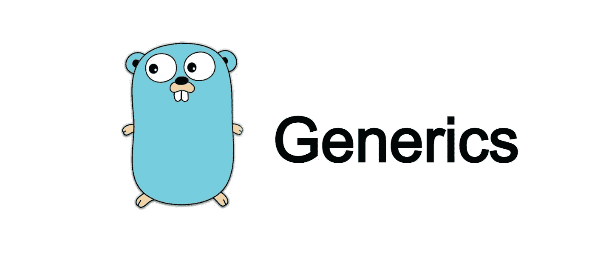

# 使用 Golang 泛型集合

> 原文：<https://betterprogramming.pub/utilizing-sets-with-golang-generics-316b4fe2ca28>

## 在 Go 中构建自己的全功能集合类型



当我第一次学习 Go(主要来自 Python)时，我发现一个更令人沮丧的事情是缺少集合类型，比如集合和它们的公共操作。在本文中，我们将展示 Go 1.18 中泛型的引入如何允许我们构建自己的全功能集合类型。以下所有代码也可以在我的 [GitHub go-collections](https://github.com/noahschumacher/go-collections) 中找到。

您可能熟悉集合这种非常有用的数据收集类型。集合是唯一项目的无序集合。通常，集合是使用哈希表实现的，哈希表查找值 O(1)(假设没有哈希冲突)。集合有 4 个主要操作，这使它们特别有用:

1.  并集( **A** ⋃ **B** ) —是包含集合 a 和 b 中所有元素的集合
2.  交集( **A** ∩ **B** )—是包含集合 A 和 B 中所有元素的集合。
3.  补集(**A**c)——是在泛集 S 中但不在 A 中的元素的集合。*我们将忽略补集，因为它是由差来处理的。*
4.  差(**A**—**B**)**—**—**是在 **A** 中而不在 **B** 中的元素的集合。**

**让我们从在 Go 中定义集合类型开始。首先，我们想定义什么是集合，通过泛型，我们可以利用约束来轻松扩展集合类型，以处理大量的数据类型。**

```
package collections

// A collection of unique comparable items. Uses a map with only true values
// to accomplish set functionality.
type Set[T comparable] map[T]bool

// Create a new empty set with the specified initial size.
func NewSet[T comparable](size int) Set[T] {
    return make(Set[T], size)
}

// Add a new key to the set
func (s Set[T]) Add(key T) {
    s[key] = true
}

// Remove a key from the set. If the key is not in the set then noop
func (s Set[T]) Remove(key T) {
    delete(s, key)
}

// Check if Set s contains key
func (s Set[T]) Contains(key T) bool {
    return s[key]
}
```

**在第一部分中，我们创建了利用内置映射类型的集合类型。我们将映射的键限制为 Comparable 类型。从文档中，我们知道可比较的类型包括**

> **(布尔值、数字、字符串、指针、通道、可比较类型的数组、字段都是可比较类型的结构)**

**我们还在我们的类型上添加了一些基本方法，用于添加、删除和检查是否存在。这样，我们就不准备开始实现上面定义的集合操作了。先说`Difference` **。****

```
// A difference B | NOTE: A-B != B-A
func (a Set[T]) Difference(b Set[T]) Set[T] {
    resultSet := NewSet[T](0)
    for key := range a {
        if !b.Contains(key) {
             resultSet.Add(key)
        }
    }
    return resultSet
}
```

**相当简单的例子。我们简单地创建一个容量为 0 的新集合(因为我们不知道这个新集合有多大)，然后遍历集合`A`，只添加不包含在`B`中的元素。**

**接下来的两个操作`Union`和`Intersection`遵循类似的模式——但是这一次我们添加了一个轻微的(或者潜在的大的)优化。**

```
// A union B
func (a Set[T]) Union(b Set[T]) Set[T] {
    small, large := smallLarge(a, b)

    for key := range small {
        large.Add(key)
    }
    return large
}

// A intersect B
func (a Set[T]) Intersection(b Set[T]) Set[T] {
    small, large := smallLarge(a, b)

    resultSet := NewSet[T](0)
    for key := range small {
        if large.Contains(key) {
            resultSet.Add(key)
        }
    }
    return resultSet
}

// returns the small and large sets according to their len
func smallLarge[T comparable](a, b Set[T]) (Set[T], Set[T]) {
    small, large := b, a
    if len(b) > len(a) {
        small, large = a, b
    }

    return small, large
}
```

**这两种方法都相当简单。在`Union`中，我们只是迭代一个集合，将值添加到另一个集合中。在`Intersection`中，我们检查`A`中的值是否也在`B`中，并返回一个只包含两者中元素的集合。**

**优化来自于区分哪个集合是`smallLarge(a, b)`调用中较小的一个。通过这样做，我们允许循环只在两个集合中较小的集合上迭代。如果一组非常大而另一组很小，这可能会节省大量迭代。**

> **然而，在**联合**中，我们正在覆盖可能是 **A** 或 **B** 的大集合。如果我们想在联合时保留原始集合，我们就必须在两个集合上循环。**

**我们现在有一个功能齐全的套装。再做一点工作，我们就可以为切片添加帮助器，并添加更多的实用方法，比如检查相等性的方法。**

```
// A == B (all elements of A are in B and vice versa)
func (a Set[T]) Equals(b Set[T]) bool {
    return len(a.Difference(b)) == 0 && len(b.Difference(a)) == 0
}

// Create a Set from a slice.
func SliceToSet[T comparable](s []T) Set[T] {
   set := NewSet[T](len(s))
   for _, item := range s {
       set.Add(item)
   }
   return set
}

// Union two slices. The provided slices do not need to be unique. Order not guaranteed.
func SliceUnion[T comparable](a, b []T) []T {
   aSet, bSet := SliceToSet(a), SliceToSet(b)
   union := aSet.Union(bSet)
   return union.ToSlice()
}

// Intersection of two slices. The provided slices do not need to be unique. Order not guaranteed.
func SliceIntersection[T comparable](a, b []T) []T {
   aSet, bSet := SliceToSet(a), SliceToSet(b)
   intersection := aSet.Intersection(bSet)
   return intersection.ToSlice()
}
```

**通过以上所有工作，我们能够执行如下所示的操作:**

```
func TestSets(t *testing.T) {
   A := SliceToSet([]int{1, 3, 5})
   B := SliceToSet([]int{0, 1, 2, 3, 4})

   union := A.Union(B)
   fmt.Println(union) // map[0:true 1:true 2:true 3:true 4:true 5:true]

   C := SliceToSet([]string{"a", "b", "noah"})
   D := SliceToSet([]string{"a", "noah"})
   intersection := C.Intersection(D)
   fmt.Println(intersection) // map[a:true noah:true]

   fmt.Println(C.Equals(D)) // false
}
```

**我希望这篇文章对你有帮助！同样，所有代码都可以在我的 GitHub [这里](https://github.com/noahschumacher/go-collections)找到。**