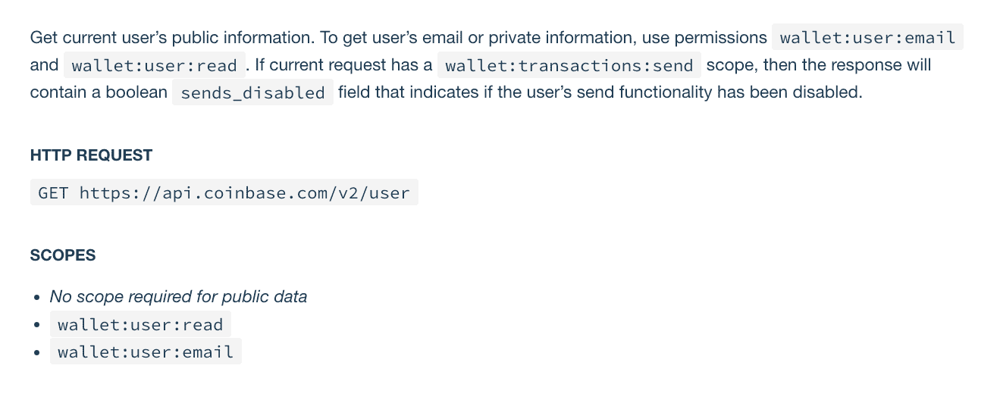
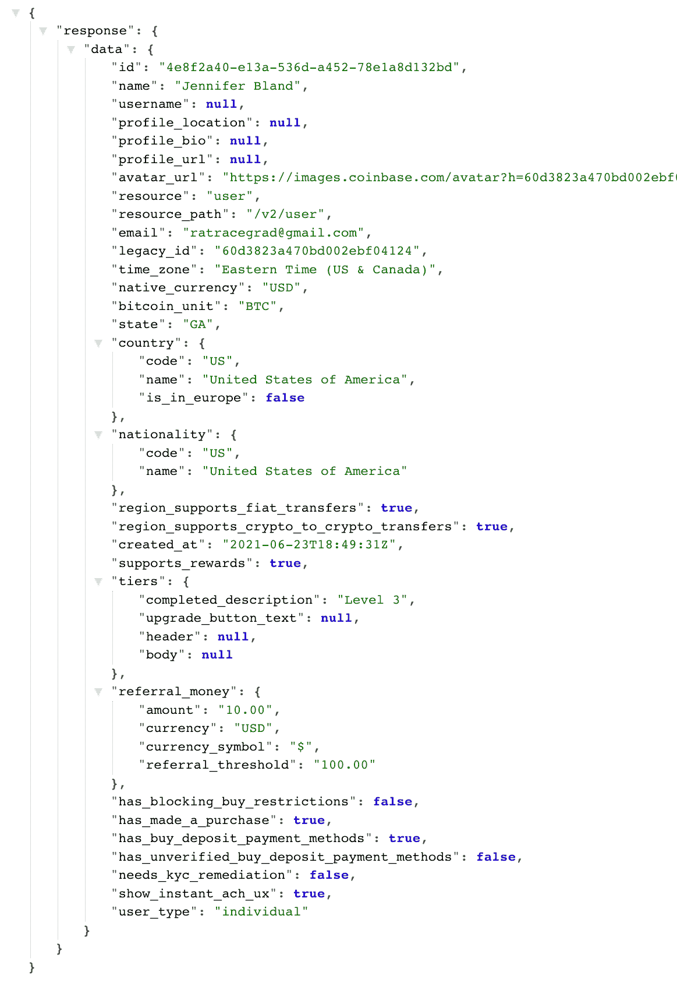
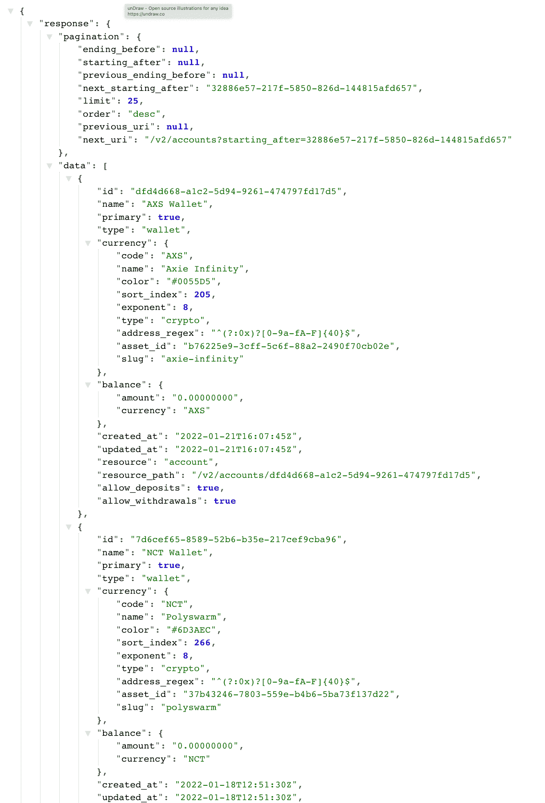
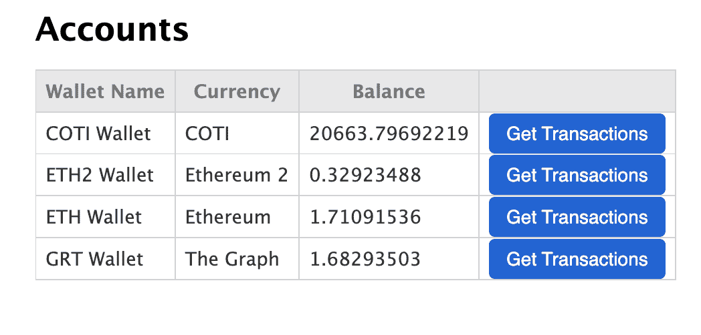
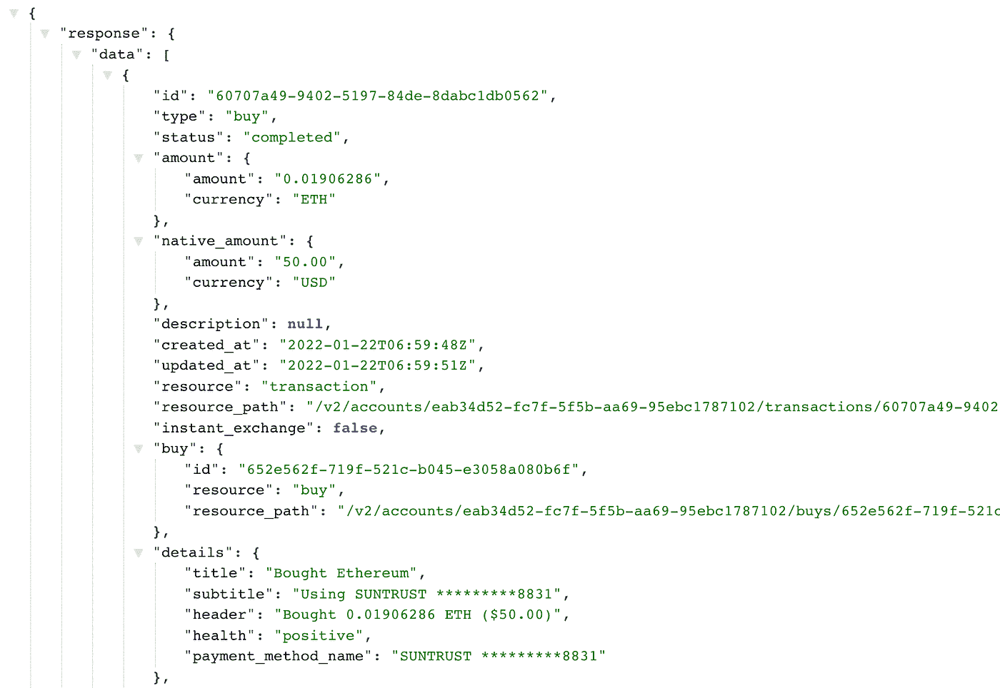
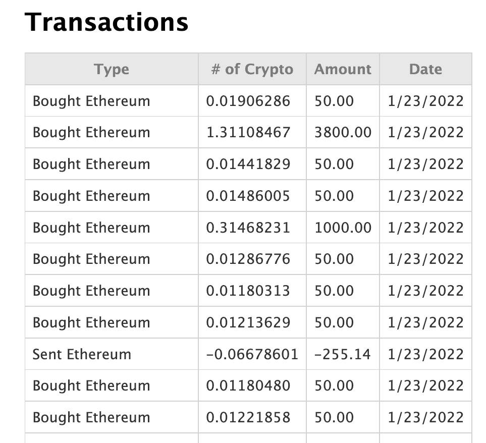

# 在 Node.js 应用程序中利用比特币基地 API

> 原文：<https://betterprogramming.pub/utilizing-the-coinbase-api-in-a-node-js-application-4c24844254cf>

## 获取您所有加密货币交易的列表


[Kelly Sikkema](https://unsplash.com/@kellysikkema?utm_source=medium&utm_medium=referral) 在 [Unsplash](https://unsplash.com?utm_source=medium&utm_medium=referral) 上拍摄的照片

在上一篇文章中，我向您展示了如何使用比特币基地 API 来验证您的应用程序，这样任何人都可以使用它。在本文中，我将通过以下方式向您展示如何在此基础上构建:

*   获取用户详细信息
*   获取所有用户帐户的列表
*   获取用户对其拥有的每枚加密硬币完成的所有交易(购买、出售等)的列表。

# 获取用户详细信息

让我们看看关于显示当前用户详细信息的比特币基地 API 文档。你可以[在这里查看文档](https://developers.coinbase.com/api/v2#show-current-user)。

文档说我们需要对`/v2/user`端点进行`GET`调用，以获取当前用户的公共信息。要获取用户的电子邮件或私人信息，使用权限`wallet:user:email`和`wallet:user:read`。

在上一篇文章中，我们提供了当用户授权我们的应用程序时，我们从比特币基地请求的权限列表。在那份名单中，我们包括了`wallet:user:email`和`wallet:user:read`。



# 保存用户令牌详细信息

为了调用`/v2/user`端点，我们必须包含之前在用户授权我们的应用程序后收到的令牌。我们需要存储这些值。

打开 routes 目录中的`index.js`文件。在`/callback`端点中，令牌在响应变量中。在我们创建的所有变量下面的文件的顶部，添加以下两个变量:

```
let accessToken = ""; let refreshToken = "";
```

然后在 try 块中的 response 变量下面，为这两个新变量设置值，如下所示:

```
try { 
  const response = await axios(config);   // saving tokens for other requests 
  accessToken = response.data.access_token; 
  refreshToken = response.data.refresh_token; res.send({ response: response?.data }); 
} 
```

# 创建/用户端点

我们将为`/user`创建一个新的端点。代码如下:

```
// Gets the user details 
router.get("/user", async (req, res) => { 
  const config = { 
    method: 'get', 
    url: 'https://api.coinbase.com/v2/user', 
    headers: { 
      'Authorization': `Bearer ${accessToken}`, 
      'CB-VERSION': '2021-06-23' 
    } 
  };   try { 
    const response = await axios(config); 
    res.send({ response: response?.data }) 
  } catch (e) { 
    console.log("Could not get user", e.response.data) 
  } 
});
```

让我们浏览一下这段代码。它的格式类似于我们为`/callback`端点输入的代码。

我们创建一个配置对象，它具有:

*   `METHOD`是得到
*   `URL`是/v2/用户端点
*   `headers` -我们包含`Authorization`，并将其设置为我们为用户接收的承载令牌。这是我们从/callback 端点存储的令牌。

我们使用 Axios 来调用使用这个配置对象的比特币基地 API。就像`/callback`端点一样，我们将在浏览器中显示从比特币基地 API 返回的所有内容。

要对此进行测试，请启动您的服务器。在浏览器中导航至`http://localhost:3000`。连接到比特币基地并授权应用程序。

接下来在你的浏览器中输入`http://localhost:3000/user`作为网址。您应该会得到这样的回应:



# 获取用户帐户持有列表

帐户资源代表用户的所有帐户，包括比特币、比特币现金、莱特币和以太坊钱包、法定货币帐户和保管库。

要列出所有用户的帐户，您可以访问`/v2/accounts`端点。此端点将列出身份验证方法有权访问的当前用户的帐户。

你怎么知道你能访问哪些账户？在主页上连接比特币基地的按钮代码中，我们包含了一个参数`account=all`。这使我们能够访问用户的每个帐户。

让我们为`/accounts`添加一个新的端点。在`index.js`文件中添加以下代码:

```
// Gets all account details 
router.get("/accounts", async (req, res) => { 
  const config = { 
    method: 'get', 
    url: 'https://api.coinbase.com/v2/accounts', 
    headers: { 
      'Authorization': `Bearer ${accessToken}`, 
      'CB-VERSION': '2021-06-23' 
    } 
  };   try { 
    const response = await axios(config); 
    res.send({ response: response?.data }) 
  } catch (e) { 
    console.log("Could not get accounts", e.response.data) 
  } 
});
```

我们使用与其他呼叫相同的格式。我们使用一个包含用户令牌的配置对象。我们将配置对象传递给调用比特币基地 API 的 axios。我们在浏览器中显示从比特币基地返回的所有内容。

要对此进行测试，请启动您的服务器。在浏览器中导航至`http://localhost:3000`。连接到比特币基地并授权应用程序。

接下来在浏览器中输入`http://localhost:3000/accounts`作为 URL。您应该会得到这样的回应:



# 过滤帐户数据

当你查看比特币基地的回复时，你会注意到它提供了所有可能支持的钱包的详细信息。用户可能在这些钱包中没有任何密码。

我们可以过滤数据，只返回有实际余额的账户。更新 try-catch 块，使其包含以下代码:

```
try {
  const response = await axios(config);
  // filter out only accounts that have a balance
  let accounts = response.data.data.filter( item => {
    if (parseFloat(item.balance.amount) > 0 ) {
      return item;
    }
  });
  res.send({ response: accounts })
} catch (e) {
  console.log("Could not get accounts", e.response.data)
}
```

现在再测试一次，你会发现它只返回正余额的账户。

# 格式化表格中的帐户数据

目前，我们在浏览器中显示从比特币基地返回的所有内容。这不是很有效。我宁愿在表格中显示信息。

如果你看一下`/`端点，我们使用`res.render`显示一个 html 文件。我们使用`res.send`显示从比特币基地返回的数据。让我们将它改为显示一个带有数据表的 html 页面。

在 views 文件夹中创建一个名为`accounts.ejs`的新文件。将`index.ejs`文件的内容复制/粘贴到`accounts.ejs`文件中。

删除`body`标签中的

和按钮，只保留标题。在标题下添加以下代码:

```
<table>
  <thead>
    <tr>
      <th>Wallet Name</th>
      <th>Currency</th>
      <th>Balance</th>
      <th></th>
    </tr>
  </thead>
  <tbody>
    <% for(var i=0; i< accounts.length; i++){ %>
      <tr>
        <td><%= accounts[i].name %></td>
        <td><%= accounts[i].currency.name %></td>
        <td><%= accounts[i].balance.amount %></td>
        <td><a href='<%= '/transactions/' + accounts[i].id %>' class="btn">Get Transactions</a></td>
      </tr>
    <% } %>
  </tbody>
</table>
```

这段代码的作用是遍历所有的账户，并将它们显示在表中的一行中。

我们只需要在显示这个文件时传递帐户。返回 index.js 文件。将`res.send`线替换为:

```
res.render('accounts', { title: 'Accounts', accounts: accounts });
```

# 设计我们的桌子

在测试结果之前，让我们放入一些样式，以便我们的表看起来不错。

打开 public/stylesheets 文件夹中的`style.css`文件。添加以下 CSS 代码:

```
table { 
  color: #333; 
  background: white; 
  border: 1px solid grey; 
  font-size: 12pt; 
  border-collapse: collapse; 
  margin-bottom: 50px; 
} table thead th, 
table tfoot th { 
  color: #777; 
  background: rgba(0,0,0,.1); 
} table caption { 
  padding:.5em; 
} table th, 
table td { 
  padding: .5em; 
  border: 1px solid lightgrey; 
}
```

# 测试我们的帐户页面

我们将按照之前测试帐户页面的相同步骤进行操作。

要对此进行测试，请启动您的服务器。在浏览器中导航至`http://localhost:3000`。连接到比特币基地并授权应用程序。

接下来在浏览器中输入`http://localhost:3000/accounts`作为 URL。您应该会得到这样的回应:



# 授权帐户后显示帐户

当你点击“连接比特币基地”按钮时，我并不热衷于显示来自比特币基地的原始数据。我宁愿显示帐户页面。让我们改变我们的应用程序来做到这一点。

打开 routes 目录中的`index.js`文件。在`/callback`路径中，我们有一个`res.send`条目，显示从比特币基地返回的所有数据。让我们改为重定向到`/accounts`路线。用此线替换`res.send`:

```
res.redirect('/accounts');
```

现在，当您测试该应用程序时，在获得比特币基地的授权后，您将会看到一个包含您所有帐户详细信息的表格。这对我们的用户来说是一个更好的 UI。

# 显示交易记录

交易资源代表帐户上的一个事件。它可以是负数，也可以是正数，取决于它是贷记还是借记账户上的资金。

这是比特币基地 API [关于交易](https://developers.coinbase.com/api/v2#list-transactions)的文档。

要获得事务，您需要调用`/v2/accounts/:account_id/transactions`端点。您还必须拥有`wallet:transactions:read`权限。

如果你回到范围变量，你会看到我们有`wallet:transactions:read`权限。

打开 routes 目录下的`index.js`文件。添加此代码:

```
router.get('/transactions/:id', async(req, res) => { 
  const { id } = req.params; 
  const config = { 
    method: 'get', 
    url: `https://api.coinbase.com/v2/accounts/${id}/transactions`, 
    headers: { 
     'Authorization': `Bearer ${accessToken}`, 
     'CB-VERSION': '2021-06-23' 
    } 
  };   try { 
    const response = await axios(config); 
    res.send({ response: response?.data }) 
  } catch (e) { 
    console.log("Could not get user authentication details", e.response.data) 
  } 
});
```

让我们浏览一下这段代码。为了进行交易，您需要有特定加密硬币的 id。该值是从 accounts 表传入的。我们将析构参数来获取 id 的值。

接下来，我们创建一个 config 对象，传入我们的用户令牌。URL 使用传入的 id。然后，我们将配置对象传递给 axios 来调用比特币基地。我们在浏览器中显示从比特币基地返回的结果。

测试一下。您应该会得到这样的结果:



# 创建交易记录表

我们之前创建了一个表来显示用户的帐户。我们将复制该表，开始构建我们的事务表。

在视图文件夹中创建一个名为`transactions.ejs`的新文件。将`accounts.ejs`的内容复制/粘贴到该文件中。

将`table`更新为:

```
<table> 
  <thead> 
    <tr> 
      <th>Type</th> 
      <th># of Crypto</th> 
      <th>Amount</th> <th>Date</th> 
    </tr> 
  </thead> 
  <tbody> 
    <% for(var i=0; i< transactions.length; i++){ %> 
      <tr> 
        <td><%= transactions[i].details.title %></td> 
        <td><%= transactions[i].amount.amount %></td> 
        <td><%= transactions[i].native_amount.amount %></td> 
        <td><%= new Intl.DateTimeFormat().format(new Date(transactions[i]).created_at) %></td> 
      </tr> 
    <% } %> 
  </tbody> 
</table>
```

现在我们已经创建了表，我们需要更新端点来显示这个文件，而不是显示从比特币基地 API 返回的结果。

打开 index.js 文件，用下面的代码替换`res.send`行:

```
res.render('transactions', { 
  title: 'Transactions', 
  transactions: response?.data.data 
});
```

现在，当您单击“transactions”按钮时，您应该会看到类似这样的内容:



# 结论

感谢您阅读我关于访问比特币基地 API 的文章。你在这里能做什么？

还有其他比特币基地 API 调用允许你买卖加密货币。您可以浏览并将该功能添加到应用程序中。

每次我们添加一个新功能，我们都必须回到与比特币基地的连接，并授权我们的应用程序。这是因为当我们尝试访问 API 时，它会失败，并显示一条错误消息，指出我们的当前令牌不再有效。收到此错误消息时，您可以添加一个端点来刷新用户令牌。这将意味着你不需要不断地重新与比特币基地联系。

您最终可以通过将您的购买价格与该加密货币的当前价格进行比较，来显示您拥有的每种加密货币的盈利/亏损。

感谢阅读。

*最初发表于*[*https://www.jenniferbland.com*](https://www.jenniferbland.com/utilizing-the-coinbase-api-in-a-node-js-application/)