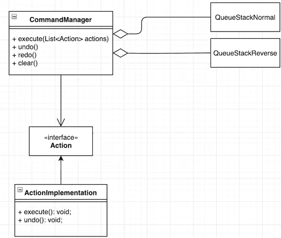

# 使用命令模式

> 原文：<https://betterprogramming.pub/utilizing-the-command-pattern-to-support-undo-redo-and-history-of-operations-b28fa9d58910>

## 支持操作的撤消、重做和历史记录

由[t rants](https://unsplash.com/@tfrants)在 [Unsplash](https://unsplash.com/search/photos/typing?utm_source=unsplash&utm_medium=referral&utm_content=creditCopyText) 上拍摄的照片

我最近有机会开发一个基于网络的图表应用程序，它需要实现*撤销*、*重做*和*操作历史*。

在处理撤销和重做这样的操作时，有两种主要的软件开发模式是显而易见的选择: [Memento 和 Command](http://www.parkeresmay.com/memento-and-command-pattern-for-undo/) 模式。在这篇文章中，我将简化这两个功能的实现过程，对传统的命令模式做一些小小的修改。

下图概述了主要组件:

*   `Action`接口，包括两个方法，执行和撤销。
*   两个修改过的链表，我喜欢称之为“队列栈”,因为它们像栈一样推送，像队列一样弹出
*   `CommandManager`，它将处理核心功能，执行动作和撤销/重做。

注意，`CommandManager`的`execute`方法需要一系列动作，例如，在绘图程序中，我们定义了删除形状的动作，同时我们可以选择和删除多个形状。每一个执行的动作都会在`QueueStackNormal`中注册——当执行撤销时，会弹出该动作，调用撤销方法并推送到`QueueStackReverse`，反之则进行重做操作。

体系结构

`clear`方法用于清除所有注册的动作。为每个队列堆栈提供两个明确的方法将是有用的，这样在一些撤销操作之后(当`QueueStackReverse`被填充时),用户在板上绘制另一个矩形。我们可能还想清空队列堆栈，这样单击重做就不会导致任何不必要的行为。

假设逻辑解释清楚了，我们就可以进行编码了。既然我们已经正式定义了组件和交互，这应该很容易。代码可以在[这个链接](https://github.com/njofce/codingimpossible_command)找到。

首先，我们定义了`QueueStack`，它被实现为一个泛型类。这个数据结构在内部使用了一个`LinkedList`。当向它添加一个项目时，它的行为类似于一个堆栈(项目被添加在开始处)，当弹出元素时，它的行为类似于一个队列(最后一个元素被移除并返回)。

接下来，我们定义`Action`接口。每个要实现它的类都应该为以下内容提供一个实现:

*   方法`execute`，当动作被记录并且需要执行所需的操作时，将调用该方法
*   `undo`，当该动作被撤销时将被调用
*   一个实用方法，`getName`，将用于显示动作的历史。

注意，通过将`Action`定义为抽象类，可以进一步简化代码。

最后，我们实现了`CommandManager`，建模为单例，因为它通过各自的数据结构在内部管理动作和历史的状态。**命令管理器**允许执行一系列动作，执行撤销和重做以及检索操作历史。

为了测试工作流，我实现了一个简单的 main 方法，通过执行不同的操作与`CommandManager`交互。输出如下所示:

## ***输出***

***= = =动作= =*= =**

***执行动作 1***

***执行动作 2***

***撤消动作 1***

***撤销动作 2***

***执行动作 1***

***执行动作 2***

***= = =历史= =*= =**

***【动作 1，动作 2，动作 1 —撤销，动作 2 —撤销，动作 1 —重做，动作 2 —重做】***

我希望这能对你有所帮助。期待听到大家的建议。

# **资源:**

[https://www.baeldung.com/java-command-pattern](https://www.baeldung.com/java-command-pattern)

[https://stack overflow . com/questions/32597736/why-should-I-use-the-command-design-pattern-while-I-can-easy-call-required-met](https://stackoverflow.com/questions/32597736/why-should-i-use-the-command-design-pattern-while-i-can-easily-call-required-met)

[https://sourcemaking.com/design_patterns/command](https://sourcemaking.com/design_patterns/command)

[http://www . Parker esmay . com/memento-and-command-pattern-for-undo/](http://www.parkeresmay.com/memento-and-command-pattern-for-undo/)