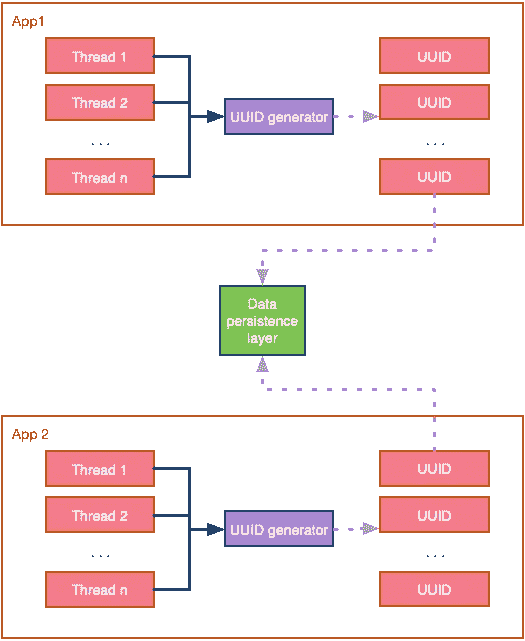
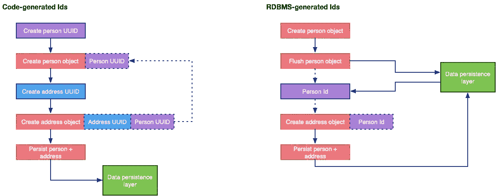
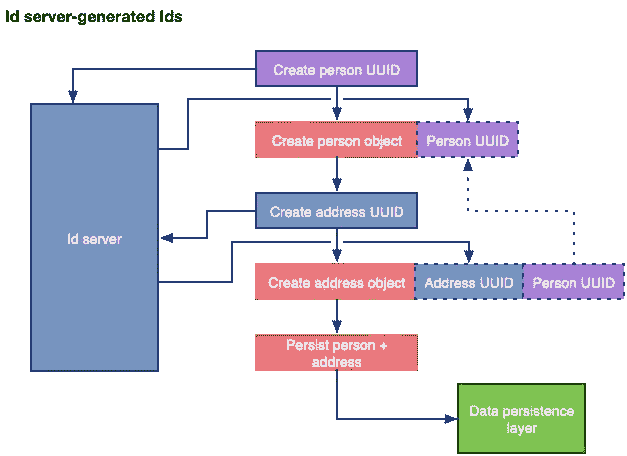

# 什么是雪花 id？

> 原文：<https://betterprogramming.pub/uuid-generation-snowflake-identifiers-unique-2aed8b1771bc>

## 如何在大规模分布式环境中生成唯一的 id

照片由 [Aaron Burden](https://unsplash.com/@aaronburden?utm_source=medium&utm_medium=referral) 在 [Unsplash](https://unsplash.com?utm_source=medium&utm_medium=referral)

在应用程序开发生命周期的某个阶段，所有程序员都必须处理生成唯一标识符的任务。惟一 id 允许我们正确地识别数据对象，持久化它们，检索它们，并让它们参与复杂的关系模式。

但是，这些唯一的 id 是如何生成的呢？在不同的负载规模下，哪种方法效果最好呢？在多个计算节点竞争下一个可用 ID 的分布式环境中，ID 如何保持唯一性？

在这篇文章中，我将讨论三种最常用的技术——从小的单节点规模到 Twitter 规模。

# 通用唯一标识符—uuid

通用唯一标识符是一个众所周知的概念，已经在软件中使用多年。UUID 是一个 128 位的数，当以一种受控的和标准化的方式产生时，它提供了一个极大的密钥空间，几乎消除了冲突的可能性。

UUID 是由几个不同部分组成的合成 ID，如时间、节点的 MAC 地址或 MD5 哈希命名空间。为了适应所有这些组合，多年来出现了多个版本的 UUID 规范，特别是版本 1 和 4。但是，根据您的数据和业务领域，您可能会对其他版本感兴趣。

处理 128 位数字并不是对开发人员最友好的描述信息的方式，因此 UUIDs 通常以规范的文本形式表示，其中 16 个八位字节(16 * 8 位= 128 位)被转换为由连字符分隔的 32 个十六进制字符，总共 36 个字符:

v4 UUID 的样本(图片由作者提供)

显而易见，UUIDs 最有趣的特性是它们可以独立生成，并且仍然保证在分布式环境中的唯一性。此外，底层 ID 生成算法并不复杂，也不需要任何同步(至少可以达到 100 纳秒的水平)，因此它可以并行执行:

在分布式环境中生成唯一的 id(图片由作者提供)

自生成唯一性的内在属性使 UUIDs 成为分布式环境中最常用的 ID 生成技术之一。但是，请记住，UUIDs 需要额外的存储空间，可能会对查询性能产生负面影响。

# 持久层生成的 IDs

当您不想在应用程序级别生成惟一的 id 时，一种常见的方法是让您的持久性存储来处理它。所有最新的 RDBMS 都提供了某种列数据类型，允许您将唯一标识符的生成委托给它们。MongoDB 提供`ObjectID`，MySQL、MariaDB 提供`AUTO_INCREMENT`，MS SQL Server 提供`IDENTITY`等。ID 的实际表示在不同的数据库实现之间有所不同，但是关于惟一性的语义是相同的。

持久层生成的 id 缓解了必须在应用程序代码中生成唯一 id 的问题。但是，如果您运行一个大型数据库集群，并且前面有一个非常繁忙的应用程序，那么这种方法的性能可能无法满足您的需求。

使用持久层生成的 ID 时的另一个实际问题是，如果没有到数据库的往返，生成的 ID 对您的代码是未知的:

RDBMS 与代码生成 Id(图片由作者提供)

上述到 RDBMS 的额外往返可能会减慢您的应用程序，并使您的代码看起来不必要的复杂，然而，现代 ORM 框架可以帮助您以标准化的方式做到这一点，而不管您使用的是什么底层 RDBMS 产品。

# ID 服务器，或雪花 ID

ID 服务器负责为您的分布式基础设施生成唯一的 ID。根据您的 ID 服务器的实现，它可以是创建 ID 的单个服务器，也可以是每秒创建大量 ID 的服务器集群。

Twitter 不需要特别介绍，平均每秒 [9000 条推文](https://www.internetlivestats.com/one-second/#tweets-band)，峰值高达每秒 [143199 条推文](https://www.dsayce.com/social-media/tweets-day/)，他们需要一个解决方案，不仅可以扩展其庞大的服务器基础设施，还可以生成高效的存储 id。Twitter 是这样想出雪花项目的:

> Snowflake 是一种网络服务，通过一些简单的保证，可以大规模生成唯一的 ID 号。

Twitter 希望每个进程每秒至少有 10000 个 id，响应速度小于 2 毫秒。ID 服务器之间不需要任何网络协调，生成的 ID 应该大致按时间排序。最后，为了保持最小的存储空间，IDs 必须是紧凑的。

为了解决上述项目，Twitter 开发了雪花项目，作为用 Scala 编写的节俭服务器。生成的 id 包括:

*   时间— 41 位(毫秒精度)
*   已配置的机器 ID — 10 位
*   序列号— 12 位—每台机器每 4096 次滚动一次

虽然雪花现在是一个退休的 Twitter 项目，被一个更大的项目所取代，即 [TwitterServer](https://twitter.github.io/twitter-server/) ，但是分布式 ID 生成器如何工作的基本原则仍然适用。由于每个生成器的独立性质，Twitter 能够根据需要扩展其基础设施，由于集群同步和协调，不会引入额外的延迟。

带有 ID 服务器的解决方案的工作方式与代码生成的 ID 类似:

Id 服务器生成的 id(图片由作者提供)

您可能会注意到，到 ID 服务器的往返仍然会降低性能，但是，这种额外的延迟比将对象刷新到 RDBMS 要小得多，因为它不涉及复杂的数据库操作。

ID 服务器提供了一种折中的解决方案，使您能够控制如何以及在哪里生成您的唯一 ID，而无需引入复杂的、高延迟的基础设施。

# 结论

对于所有最终需要持久存储数据的应用程序来说，生成唯一标识符是必不可少的。

本文讨论了三种常用的方法:UUIDs——本地生成 IDs，持久层驱动的 IDs——集中创建 IDs，以及雪花 IDs——作为网络服务生成 IDs。

选择在应用程序中生成惟一 id 的策略需要考虑您的数据以及您的持久性选项和网络基础设施。因为没有放之四海而皆准的解决方案，所以您应该评估您的选择，并选择符合您的要求和您想要实现的规模的解决方案。

感谢您阅读这篇文章。希望下一部能见到你。