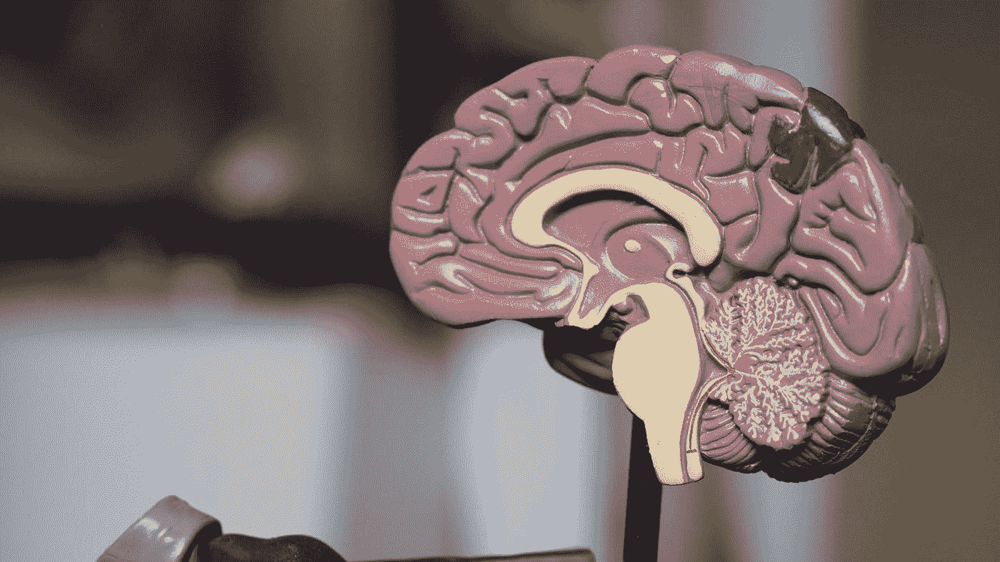
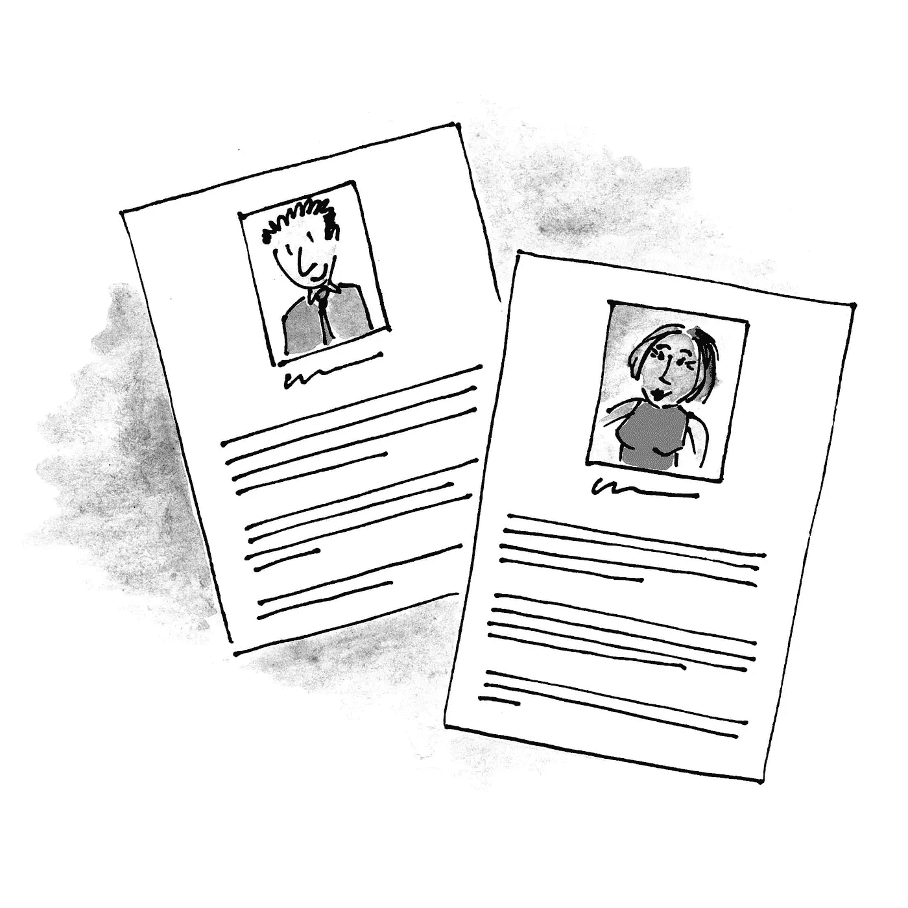

# 作为软件开发人员，构建更好产品的 5 个心智模型

> 原文：<https://betterprogramming.pub/ux-mental-models-34b8ede1d42b>

## [软件工程](https://rakiabensassi.medium.com/list/software-engineering-7a179a23ebfd)

## 为了打造更好的产品，请站在最终用户的角度考虑问题

由 [Robina Weermeijer](https://unsplash.com/@averey?utm_source=medium&utm_medium=referral) 在 [Unsplash](https://unsplash.com?utm_source=medium&utm_medium=referral) 上拍摄的照片

作为软件开发人员，我们花费数小时来构建供其他人使用的应用程序，因此关注用户体验至关重要。为了做到这一点，我们经常依赖特定的心理模型。

心智模型是指某人对某事物的直觉理解。我们一直都有心智模型，通常甚至没有意识到。但是一旦我们理解了为什么以及如何使用它们，它们就会成为有价值的工具，帮助我们[简化复杂的问题](/problem-solving-techniques-b1ed8b4c729f)，更加专注，并打造更好的产品。

在本文中，我将概述如何使用“用户建模”、“人物角色”、“启发式评估”、“卡片分类”和“用户故事映射”来为我们的客户和顾客构建更好的软件。

# 1.用户建模

用户建模——也称为“仿真”或“模拟”——是用户在特定情况下的行为表现。它是通过记录或收集用户以前与系统交互的数据，然后根据这些数据建立一个有助于预测行为的模型来创建的。

在界面实际存在之前，知道用户将如何与界面交互，允许界面构建者开发专门为最终用户需求定制的工具，而不必测试每一个可能的选项和布局。它还允许快速的设计迭代，并且需要[开发人员](https://levelup.gitconnected.com/a-day-in-the-life-of-a-software-engineer-cb817cf13d0)更少的时间和精力。

用户模型的例子包括从人们的驾驶习惯中收集的数据、关于以前访问的网站的信息以及关于人们如何使用移动设备的信息。

一个人的行为经常受到周围环境的影响。比如很多人晚上用黑暗模式，白天用光明模式。因此，开发一个能够准确反映用户当前环境需求的界面，对于改善用户的整体体验至关重要。

# 2.人物角色

人物角色是将使用产品的人的简单但有用的表示。通过让开发人员了解他们是在为谁开发应用程序，他们可以帮助开发人员创造出色的用户体验。

使用人物角色来展示你的用户的心智模型([形象信用](https://uxmastery.com/communicating-mental-models-to-your-team/)

人物角色不一定是一个真实的人，它可以基于人口统计信息、采访结果，甚至只是你自己的想象！

很多年前，当我在 [Otto](https://www.otto.de/) 做前端开发人员时，我们用“Julia”来代表我们在线购物平台的典型用户。在我们的想象中，“朱莉娅”是一个年轻的女人，在结束一天的工作后，坐在沙发上，拿着她的平板电脑，滚动我们的应用程序，选择她想要添加到购物车或收藏夹列表中的商品。

您可能已经猜到了，您可以将“人物角色”与前面提到的心智模型结合起来，创建“[带有人物角色](https://www.researchgate.net/publication/215500618_User_modeling_with_personas)的用户建模”，这样更有效。

# 3.启发式评估

启发式评估是[软件开发](/frontend-architecture-376e6323ef9b)中一种流行的可用性测试方法。它通过询问用户以下问题来衡量系统的使用难易程度:

*   "*你花了多长时间完成这个任务？*
*   "*您会向其他人推荐该产品吗？*

这种方法让你了解你的用户是如何与你的软件交互的，这样你就可以做出有益于他们的改进。

2013 年，我是 immonet.de 的全栈开发人员，我们使用“眼球追踪”技术进行可用性测试，这有助于我们注意到我们的一些 UI 元素没有像我们预期的那样被用户发现。

# 4.卡片分类

这种方法包括根据主题将卡片分类成不同的组。卡片分类被用于许多领域，包括市场营销、产品设计和客户服务。它允许你在头脑中对物体进行分类，这可以帮助你更快更有效地完成各种任务。

**示例:**产品负责人在为下一个版本的特性划分优先级时，可能会使用卡片分类。

# 5.用户故事映射

在他的书“[用户故事映射:发现整个故事，构建正确的产品](https://www.amazon.com/User-Story-Mapping-Discover-Product/dp/1491904909)”中，Jeff Patton 给出了关于“这种经常被误解的技术如何帮助你的[团队](https://medium.com/swlh/characteristics-of-successful-team-60272e59a2c6)专注于用户和他们的需求，而不会迷失在对单个产品功能的热情中”的见解

照片由[帕特里克·帕金斯](https://unsplash.com/@patrickperkins?utm_source=medium&utm_medium=referral)在 [Unsplash](https://unsplash.com?utm_source=medium&utm_medium=referral) 上拍摄

用户故事映射是基于[敏捷软件开发](/agile-software-development-manifesto-be453882314)方法的心智模型。它包括描绘出你的用户所拥有的故事、特性和需求，并创建一个它们都适合的可视化表示:

*   每个功能或用户请求都放在一张卡片上。
*   每张卡片都和其他主题相似的卡片放在一块板上。
*   每张卡都有一个号码，一个简短的描述，以及一个想要处理它的团队成员。

这是一种组织如何构建一个软件的想法并跟踪进展的实用方法。

它有助于澄清需要做什么，需要改进什么，以及谁在做什么，这可以防止人们陷入以功能为中心的头脑风暴会议，这可能导致产品不能用于其预期目的。

# 最后的想法

促进人类福祉、简化复杂任务和高效是我们创建软件的三大原因。这意味着我们必须理解人类的思维以及人们与科技互动的无数方式。

这也意味着我们应该关注最终用户的需求，无论他们是人还是机器。通过开发适合他们在社会、经济和物理环境中需求的应用程序，我们可以确保他们对我们的产品和服务满意。

如果您在职业生涯中使用过这些心智模型或其他模型，请告诉我们您使用它们的体验。如果你还没有，我希望你下次会喜欢应用它们。

🧠💡我为一群聪明、好奇的人写关于工程、技术和领导力的文章。 [**加入我的免费电子邮件简讯独家访问**](https://rakiabensassi.substack.com/) 或在此注册媒体。