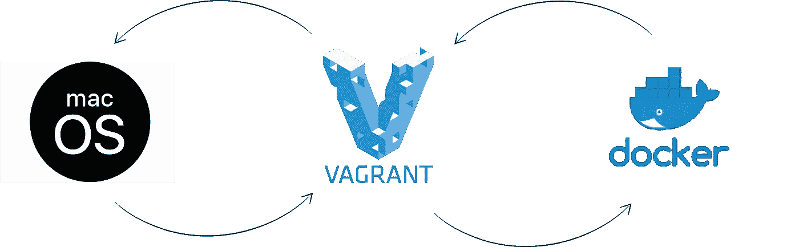
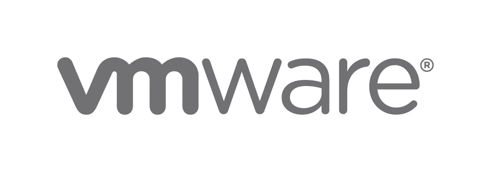
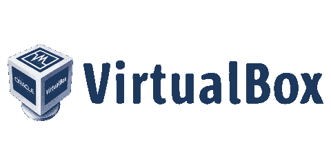
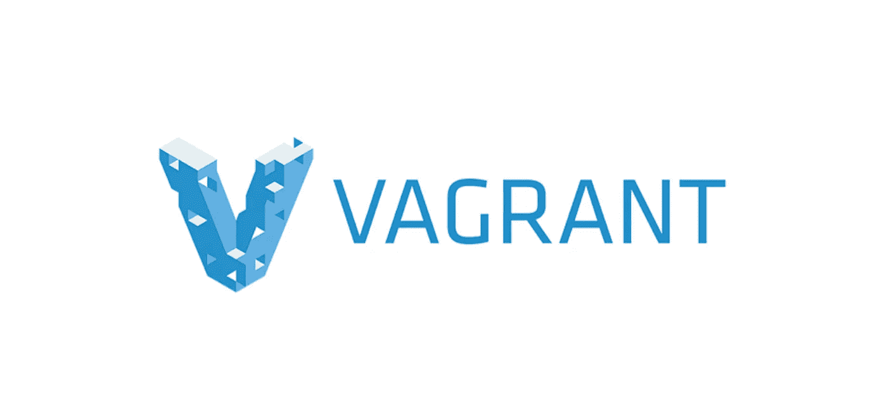
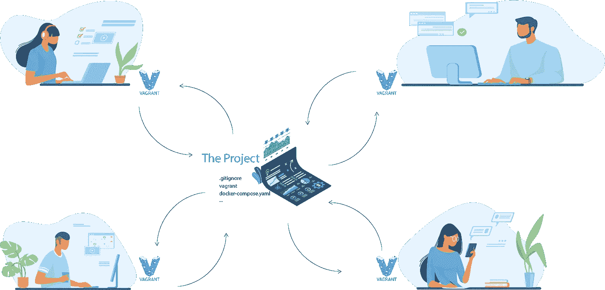

# 提高 macOS 上的 Docker 性能

> 原文：<https://betterprogramming.pub/vagrant-to-increase-docker-performance-with-macos-25b354b0c65c>

## 我如何管理一个在我的机器上运行超过 80 个容器的微服务项目



我是 [TheCodingMachine](https://www.thecodingmachine.com/) 的一名 web 开发人员，我管理着一个微服务项目，有 80 多个容器在我的本地机器上运行。我想你知道我的问题！

有了这么大的项目，Mac 上的 Docker 就成了讨厌鬼。它很慢，当我开始、停止、向下或刷新页面时，我会损失很多时间。有解决方案，比如同步你的文件和改善文件管理，但这都是一个黑魔法。

我们的目标是让 Docker 永远不要使用 macOS 文件管理系统，而是使用 Linux 文件管理系统，因为当您开发 web 应用程序时，Docker 在其中表现非常好。

所以我们需要:

*   用于开发应用程序和使用 Docker 的强大系统
*   这是一个简单的使用方法，因为你在你的项目中从来不是一个人，而且这只是 Mac 的问题
*   更新变更和共享解决方案的简单方法，以便在所有团队中保持 ISO 合规性

所以有一天，我问自己，“你为什么继续在你的 Mac 上与 Docker 斗争，Greg？你能找到解决办法的！”

所以我找到了解决办法。在展示我的最佳解决方案之前，我将解释我的多重测试。

# VMware



我从 VMware 开始我的测试。我认为它是世界上最好的虚拟机。它简单、快速，并为您的 Mac 提供最佳性能。但是(是的，有一个*但是*)当你和一个团队一起工作，你试图保持一致性和符合 ISO 的硬件……问题可能会出现。

当你发送你的虚拟机时，你共享你的配置——比如你的`.env`文件。也许您会测试或尝试其他东西，但是每个人都有您的环境文件。您决定更改配置，因此必须将新的虚拟机发送给您的团队。所有的开发人员都有自己的配置和开发工具，并且必须将您的最新版本与他们的版本合并。

总之，管理它并不容易，而且可能是一个非常大的问题。

最后一个小问题是你必须在你的虚拟机中开发。您没有一个容易链接到本地的文件。

# VirtualBox



VirtualBox 与 VMware 非常相似，但当您尝试构建虚拟机时会遇到更多问题。不会吧？

# 无赖



我尝试过流浪，这是一件神奇的事情。

这是非常容易的工作，因为你只需要安装 VirtualBox 和流浪者和…完成！为什么说是神奇的解决方法？

*   首先，您有一个文件配置，可以与团队中的每个人共享。您创建初始配置并构建您的虚拟机。因此，每个人都有一个符合 ISO 的环境，可以在这个环境中进行项目工作。
*   其次，您在本地环境和虚拟机之间实现了同步。因此，任何本地更新的文件都将在您的虚拟机中更新。

是的，很好看！



举个例子:当我构建我的流浪 VM 时，我的`Vagrantfile`看起来如下。

```
*# encoding: utf-8
# -*- mode: ruby -*-
# vi: set ft=ruby :
# Box / OS* VAGRANT_BOX = 'bento/ubuntu-19.10'
*# Memorable name for your* VM_NAME = 'new-vm-vagrant'

*# VM User — 'vagrant' by default* VM_USER = 'vagrant'

*# Username on your Mac* MAC_USER = 'your-name'

*# Host folder to sync* HOST_PATH = '/Users/your-name/workspace/my-project'

*# Where to sync to on Guest — 'vagrant' is the default user name* GUEST_PATH = '/opt/my-project'

*# # VM Port — uncomment this to use NAT instead of DHCP
# VM_PORT = 8080* Vagrant.configure(*2*) do |config|

  *# Vagrant box from Hashicorp
*  config.vm.box = VAGRANT_BOX

  *# Actual machine name
*  config.vm.hostname = VM_NAME

  *# Set VM name in Virtualbox
*  config.vm.provider "virtualbox" do |v|
    v.name = VM_NAME
    v.memory = *4096
*    v.cpus = *2* end

  *#DHCP — comment this out if planning on using NAT instead
  #config.vm.network "private_network", type: "dhcp"
*  config.vm.network *:forwarded_port*, *guest: 80*, *host: 80

  # # Port forwarding — uncomment this to use NAT instead of DHCP
  # config.vm.network "forwarded_port", guest: 80, host: VM_PORT
  # Sync folder
*  config.vm.synced_folder HOST_PATH, GUEST_PATH

  *# Disable default Vagrant folder, use a unique path per project
*  config.vm.synced_folder '.', '/home/'+VM_USER+'', *disabled: true

  #Install package for your VM
*  config.vm.provision "shell", *inline:* <<-SHELL
    apt-get update -y
    apt-get install -y git
    apt-get install -y apt-transport-https
    apt-get install -y build-essential
    apt-get install -y curl
    apt-get install -y gnupg-agent
    apt-get install -y software-properties-common
    curl -fsSL https://download.docker.com/linux/ubuntu/gpg | sudo apt-key add -
    apt-key fingerprint 0EBFCD88
    add-apt-repository \
       "deb [arch=amd64] https://download.docker.com/linux/ubuntu *\* $(lsb_release -cs) *\
*       stable"
    apt-get update -y
    apt-get install -y docker-ce docker-ce-cli containerd.io
    curl -L "https://github.com/docker/compose/releases/download/1.25.4/docker-compose-$(uname -s)-$(uname -m)" -o /usr/local/bin/docker-compose
    chmod +x /usr/local/bin/docker-compose
    ln -s /usr/local/bin/docker-compose /usr/bin/docker-compose
  SHELL
end
```

您可以使用以下命令启动虚拟机:

```
vagrant up
```

所以你的虚拟机流浪者运行，你有一个本地文件夹和虚拟机流浪者之间的同步。

`/Users/your-name/workspace/my-project`(本地)➡ `/opt/my-project`(虚拟机)

当您的虚拟机启动时，您可以使用以下命令进行连接:

```
vagrant ssh
```

您可以在本地文件夹的文件夹项目中创建 Docker 合成文件。我的例子:

```
version: '3'

services:

  traefik:
    ...
    ports:
      - "80:80"
    volumes:
      - /var/run/docker.sock:/var/run/docker.sock
    ...

  api:
    ...
    volumes:
      - ./sources:/usr/src/app:rw
    ...
```

最后，连接到您的浮动虚拟机(`vagrant ssh`，并在您的浮动虚拟机中运行 Docker 或 Docker Compose。

在这个配置中，当你连接到你的流浪者虚拟机时，你连接的是`vagrant`用户，所以要运行 Docker，你必须使用`sudo`命令或者直接使用`sudo -s`来连接根用户。

```
sudo docker-compose up -d
```

现在，您有了在本地`[127.0.0.1](http://127.0.0.1/)`上运行的 Docker 应用程序。

所以如果我总结一下，这个解决方案就是:

*   **健壮:**vagger 拥有多年经验，使用 VMware 或 VirtualBox 的虚拟机
*   **易于使用:**构建、运行和连接您的虚拟机很容易
*   **易于共享:**您有一个配置文件，并且您的团队总是保持 ISO 兼容。

**注意:**如果你在 Linux 或者 Windows 上开发(希望你永远不要在 Windows 上开发！)，您永远不需要使用它，项目可以在您的本地 Docker 引擎上运行。

# 逻辑


总而言之，逻辑是这样的，您有两个同步:

*   您的本地文件夹和 VM 流浪者文件夹之间的同步。所以当你开发时，你在 VM 中的环境会自动更新(非常快)。
*   虚拟机流浪者(Ubuntu)文件和你的容器 Docker 之间的同步。所以在`./source`中你的 VM travel(Ubuntu)中的所有文件将在你的 Docker 容器中同步(在我的例子中是`api`)。

是的，我知道您会告诉我:“两个同步—不可能通过两个同步来提高性能！”

我同意——有两个同步，这不是最佳的。但是你的 Docker 引擎从来不使用 macOS 的文件系统，而是使用 Ubuntu 的系统文件(在我之前的例子中)。事实上，当你使用 Docker 时，你有更好的性能。所以测试它，我保证你会提高你的生产力，并在你的开发中赢得时间。

我们开始工作吧！感谢阅读。