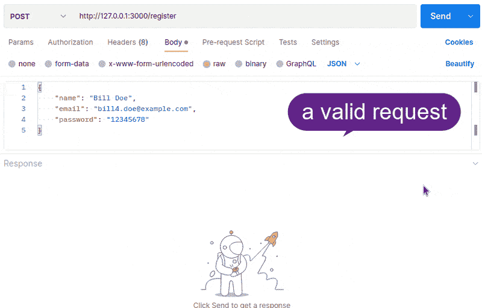
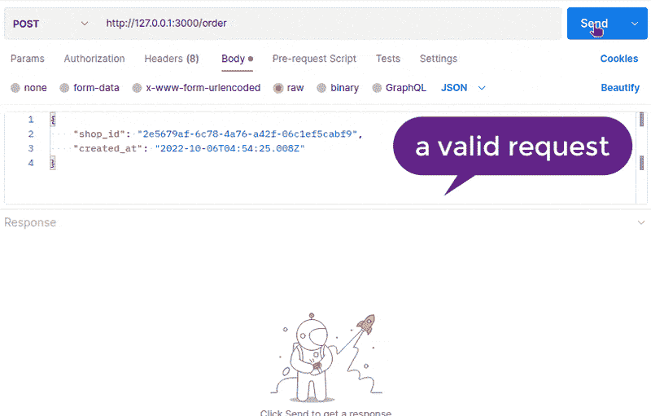
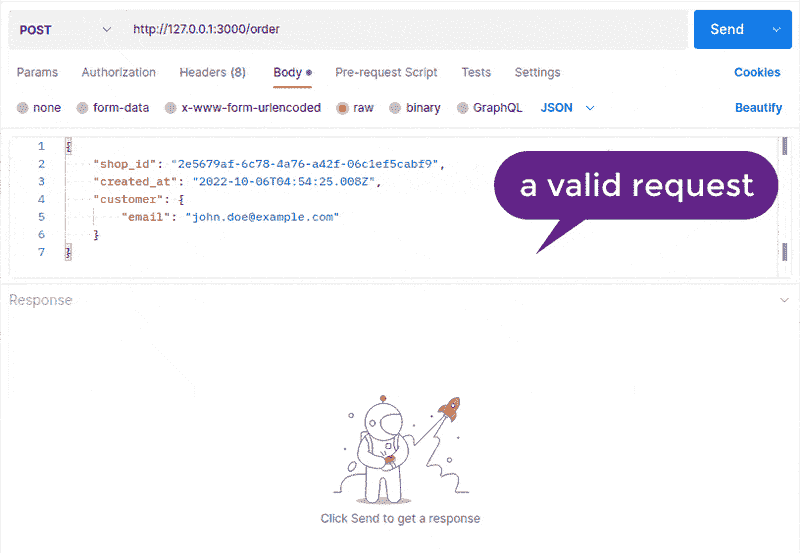
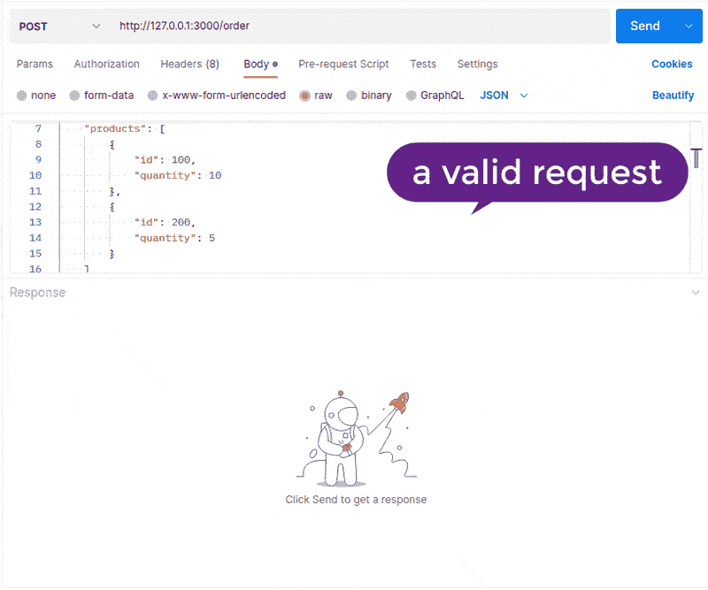
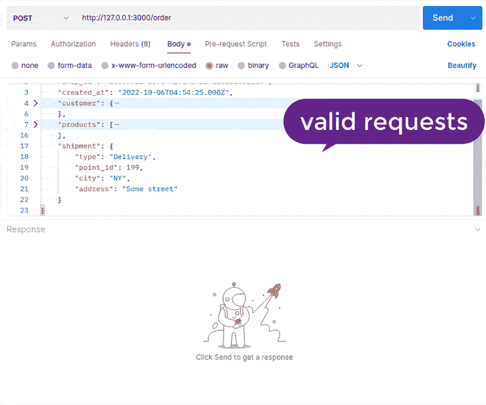
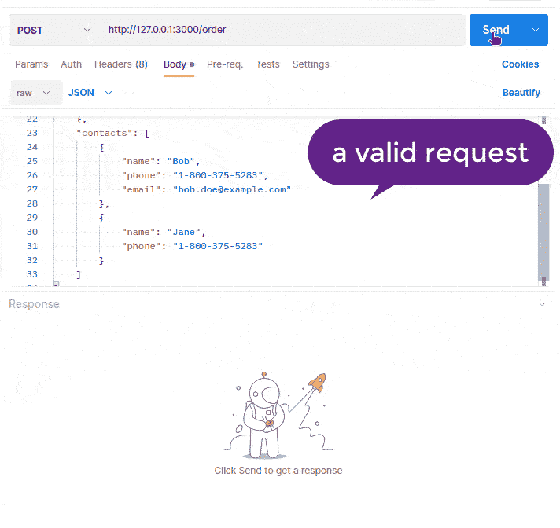
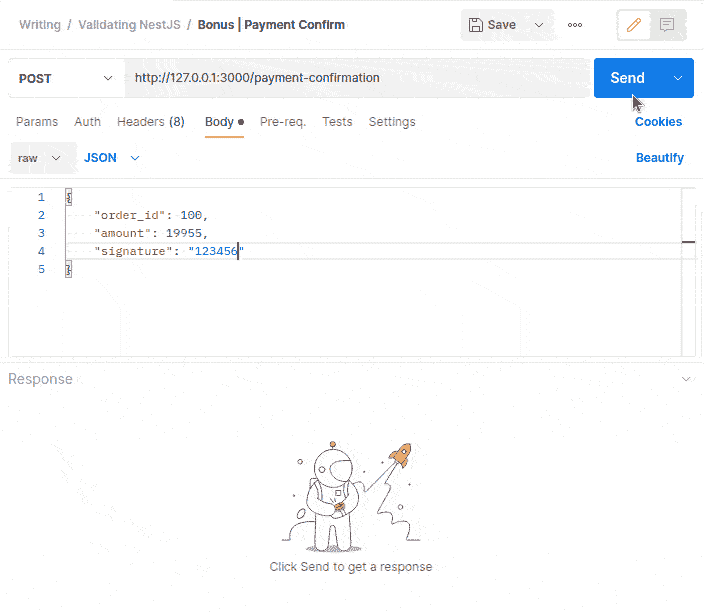
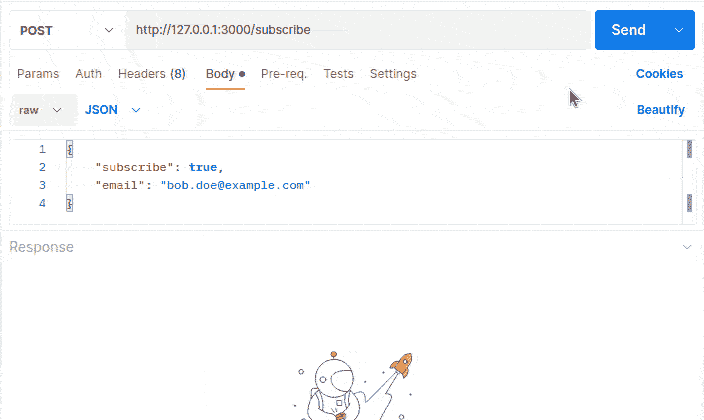
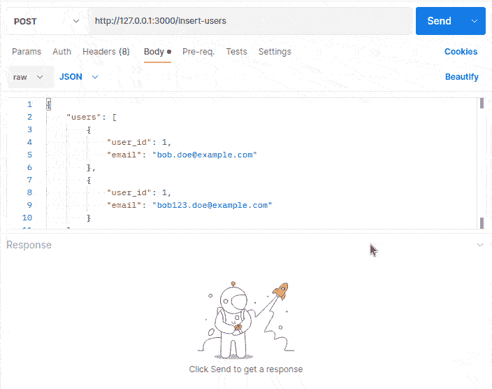
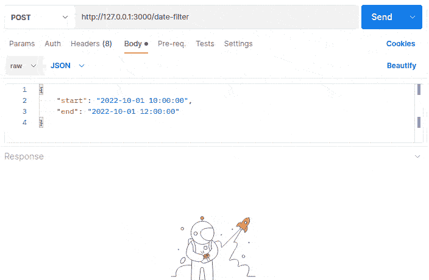

# 用 NestJS 验证复杂的请求

> 原文：<https://betterprogramming.pub/validating-complex-requests-with-nestjs-a-practical-example-b55c287f7c99>

## 实际例子

由[胡安乔·哈拉米略](https://unsplash.com/@juanjodev02?utm_source=unsplash&utm_medium=referral&utm_content=creditCopyText)在 [Unsplash](https://unsplash.com/s/photos/programming?utm_source=unsplash&utm_medium=referral&utm_content=creditCopyText) 拍摄

在本文中，我想深入探讨用 NestJS 对传入请求执行复杂验证的方法。

NestJS 提供了一个很好的方法，通过一些好的默认值将请求验证集成到您的应用程序中。它的建议是使用一个强大的、有很好的文档和例子的`class-validator`包。

# 为什么请求验证很重要？

验证是在线服务安全性和数据完整性的重要步骤。

它确保您只接收您的服务期望的格式的数据。丢弃任何你不期望的额外数据的可能性。

它提供了一层针对恶意行为者的保护，记住你不应该相信任何用户输入。尽可能采用零信任策略。

不要在数据库中存储无效数据，保护管道中的服务免受无效数据输入的影响。

# 什么是“类验证器”包？

 [## GitHub—type stack/class-validator:基于 Decorator 的类属性验证。

### 允许使用装饰器和基于非装饰器的验证。在内部使用 validator.js 执行验证…

github.com](https://github.com/typestack/class-validator) 

它是一组 decorators，您可以使用它和您的 JavaScript 类属性来添加验证。有像`@IsString()`这样的基本验证规则——验证的字段应该是一个字符串，并且能够编写完全自定义的验证类和装饰器。

这个包允许的另一件好事是从父应用程序使用依赖注入容器。这对于验证外部资源非常有用，例如一个`User`数据库。有一个小技巧可以让它工作，并节省你搜索的时间。检查这个`main.ts`文件:

一个使用 NestJS DI 容器的类验证器的例子。

这里最重要的一行是:

> use container(app . select(app module)，{ fallbackOnErrors:true })；

在撰写本文时，NestJS 的官方文档中没有提到这一点。

# 什么是复杂请求？

我将它定义为至少有一个数组或一个对象的东西，这将依次包括嵌套的对象和/或数组。另一个常见的用例是根据外部资源(数据库、缓存、S3 等)检查有效性。).

对于我的例子，我将使用一个假想的 SaaS 多租户电子商务 API，它将允许我:

*   全局注册用户
*   为特定商店下订单

# 验证用户创建请求

要注册用户，我们需要下面的类中列出的字段:

我们将在全球范围内注册用户，没有任何特定商店的链接。

我们的约束条件如下:

*   `name` —必需，是一个字符串，长度至少为三个字符。
*   `email` —必填，应为有效的电子邮件字符串，不应已在我们的数据库中注册。
*   `password` —必需，是一个字符串，长度至少为 8 个字符。

这是我的`UserCreateDto`加上`class-validator`装修工后的样子。

让我们首先回顾一下这里使用的`class-validator`包中的标准验证规则:

*   `@IsString()`—值应该是字符串
*   `@MinLength(N)`—值的最小长度应为 N
*   `@IsEmail()` —值应该是有效的电子邮件(仅语法检查)

现在有趣的部分是`@EmailNotRegistered()`验证。我创建这个是为了拒绝注册用户，如果他们的电子邮件已经存在于我们的应用程序中。

通过电子邮件对照第三方来源检查用户存在的自定义验证。

这是我的定制验证装饰器，创建它的过程在[文档](https://github.com/typestack/class-validator#custom-validation-decorators)中描述。然而，大部分代码是样板文件，让我们检查最有趣的行。

第 11 行—注入一个定制的提供者`private readonly userRepository: UserRepository`。

第 14–15 行—通过在`UserRepository`中搜索电子邮件来提供验证功能。

My `UserRepository`只是一个内存存储，模拟某种形式的异步网络 I/O。这是为了复制真实的 DB 请求/响应生命周期。

复制异步网络 I/O 的内存存储。

用户注册 API 端点如下所示:

这就是让 NestJS 验证传入请求所要做的全部工作:

*   在您的路由签名中键入提示 DTO 类
*   向 DTO 类中添加验证装饰器
*   在`main.ts`内打开验证使用(如上例所示)

用户注册端点验证正在进行。

干得好。让我们继续订单请求和验证！

# 验证创建订单请求

好了，我们从一些相当简单的事情开始，现在让我们试着验证一个订单请求。

我们对`OrderCreateDto`的要求是:

*   应该有共同的订单属性，如商店 ID(我们是 SaaS 多租户应用程序)，以及创建日期。
*   应该有客户信息(客户电子邮件)。
*   应该有一个订单产品列表(一个数组)，有一个通用的结构——产品 ID 和数量。
*   应该有一个订单发货描述，这是一个可变对象:或者是`Delivery`或者是`Pickup`类型，带有各种必填字段。
*   最后，它应该有一个联系人列表，每个联系人的一些细节。

满足这些要求的第一个未经验证的 DTO 可能如下所示:

预期的创建订单请求对象。

让我们检查这个请求的每个块，描述它，并添加验证。

# OrderCreateDto

OrderCreateDto 字段。

以下是限制条件:

*   `shop_id` —应为 UUID 格式，存在于`ShopRepository`中。
*   `created_at` —应为日期对象或日期可转换对象。

## 解决办法

验证订单特定字段的示例。

根据外部资源验证商店 ID。

`@IsUUID()` —是一个用于检查字符串是否为有效 UUID 的装饰器。

`@Validate(ShopIdExistsRule)` —使用自定义规则验证字段(类似于编写您的装饰器，但更简单一点)。

`@Type(() => Date) & @IsDate()` —将尝试将提供的输入转换为`Date`，并验证它是一个`Date`对象。

订单创建验证正在进行。

# 订单客户

OrderCustomerDto 字段。

以下是限制条件:

*   `email` —应该存在于用户存储库中，并且应该是有效的电子邮件字符串。
*   验证父级`OrderCreateDto`中`OrderCustomerDto`的嵌套对象。

## 解决办法

`OrderCreateDto` 和`OrderCustomerDto` 带有验证装饰器的对象。

这里的新东西:

`@CustomerExists()` —这与我之前使用的`@EmailNotRegistered()`规则相反。逻辑类似，我们采取提前注入`UserRepository`。

`@Type(() => OrderCustomerDto)` —这是一个实用程序行，它将嵌套的对象转换成一个类，因此可以通过下面的`@ValidateNested()`进行验证。如果不进行转换，验证将不会运行。

客户数据验证正在进行。

如果在启动 NestJS 时出现错误:

> ReferenceError:无法在初始化之前访问“OrderCustomerDto”

您需要将`OrderCustomerDto`声明移动到`OrderCreateDto`之前，如我上面的代码示例所示。

# OrderProductDto

OrderProductDto 字段。

以下是限制条件:

*   `products` —应为数组，不应为空。
*   `id` —应存在于`ProductRepository`中，应为整数值。
*   `quantity` —应足够该产品可用，应为整数。

## 解决办法

带有验证装饰器的 OrderProductDto 和`OrderCustomerDto` 对象。

这里有一些新的东西:

`@IsInt()` —检查值是否为整数，100.5 验证失败。

`@ArrayNotEmpty()` —验证产品数组不为空。

`@ValidateNested({ each: true })` —触发数组嵌套验证，因此我们可以有效地验证 1 到 N 个产品。

`ProductIdExists`和`ProductIsAvailable` —是检查产品是否存在以及是否有足够的数量下订单的自定义规则。

产品数据验证正在进行。

# 订单交付

OrderShipmentDto 字段。

以下是限制条件:

*   `type` —应该是 enum ( `Delivery` | `Pickup`)的一部分，应该被定义。
*   如果选择了`Delivery`类型，则`city`和`address`字段为必填字符串，不能为空。
*   如果选择了`Pickup`类型，则`point_id`字段为必填字段，应为整数，不能为空。

## 解决办法

带验证装饰器的装运和`OrderCustomerDto` 对象。

这里有一些新的东西:

`@Equals(DeliveryTypes.DELIVERY)`和`@Equals(DeliveryTypes.PICKUP)` —将对提供的值进行严格的(===)检查。

然后，基于交付类型，我们验证嵌套对象。为此，我们需要一个更高级的`@Type()`用例。

class-transformer 根据请求中的字段进行键入的助手。

由于`shipment`对象是变量类型，我们包括变量类型 cast 用于验证，现在`shipment`看起来像这样:`shipment: DeliveryShipmentDto | PickupShipmentDto;`

这允许我们的验证系统删除特定交付对象不需要的字段，例如，您请求`Pickup`装运并提供`city`——这将被`class-transformer`包删除。

发货数据验证正在进行。

# OrderContactDto

OrderContactDto 字段。

以下是限制条件:

*   `name` —应该是一个字符串，应该被定义。
*   `phone` —应该是有效的手机号码。
*   `email` —可选，如果已定义，则应为有效的电子邮件语法。

带有验证装饰器的 OrderContactDto 和`OrderCustomerDto` 对象。

新的验证在这里:

`@IsMobilePhone(‘en-US’)` —将检查电话字符串是否具有有效的语法、号码数量等。

`@IsOptional()` —仅验证提供的电子邮件。

联系人验证正在进行。

# 最终解决方案

好吧，这是一条漫长的道路。现在，让我们来看一个包含所有验证装饰器的完整请求对象:

NestJS DTO 类验证的最终版本。

# 额外收获:更常见的验证用例

很难举出一个例子来涵盖请求验证的所有特性。因此，我将在这里列出我实践中的一些有趣的用例:

## 付款确认

用例:来自第三方卡处理器(PayPal、Stripe)的 webhook 调用。

您通常在配置中存储了某种形式的`secret`签名密钥，并且需要验证请求的签名。

这里有一个使用注入 NestJS 配置服务的验证器的例子。

## 请求

我们将组合`order id + amount + secret`并将其与接收到的签名进行比较。

这个验证规则使用 NestJS `ConfigService`来获取秘密值。

签名验证正在进行。

## 条件属性验证

用例:仅当另一个属性设置为特定值时才验证属性。

任务:只有当`subscribe`为`true`时，才验证`email`。

根据 subscribe 字段的值，带有电子邮件字段的验证请求示例。

订阅验证正在进行。

## 没有数据库查询的重复约束验证

用例:您有一个唯一的 DB 约束(field1 + field2)，但是您想在到达 DB 级别之前验证它(并获得存储异常)。您的请求接受一次存储多个实体，并且可以包含重复的实体。

这里有一个 DTO 的例子:

通过验证:

一个记录数组的唯一性验证器的例子。

操作中没有重复的用户验证。

## 与请求相关的日期范围约束

用例:带有`start`和`end`日期的过滤器。您希望`end`日期晚于`start`日期。

带有验证约束:

应用开始/结束约束的日期验证。

有效的日期范围验证。

# 结论

NestJS 和`class-validator`在请求验证方面表现良好。它可以覆盖从最简单到复杂的验证场景的所有内容。

另一个好处是，在验证失败的情况下，可以获得标准的错误响应结构，您不必自己编写代码——所有这些都由 NestJS 处理。

带有测试代码的存储库如下:[https://github . com/dkhorev/validating-complex-requests-with-nest js](https://github.com/dkhorev/validating-complex-requests-with-nestjs)

我希望这能有所帮助。好运，快乐工程！