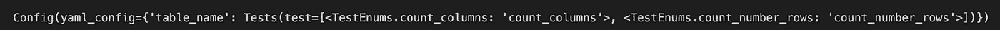
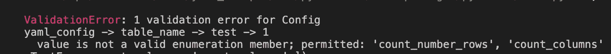
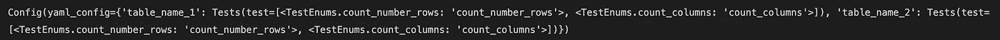
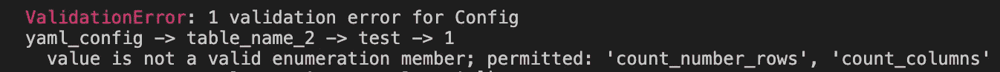

# 如何使用 Pydantic 验证 YAML 配置

> 原文：<https://betterprogramming.pub/validating-yaml-configs-made-easy-with-pydantic-594522612db5>

## 验证 YAML 配置不再困难


我最近构建了许多 YAML 配置，甚至构建了一些标准化的 YAML 配置，专门用于数据监控。

我一直在纠结的一件事是如何验证 YAML 模式。我的第一次尝试是将`pytest`中的一堆测试组合在一起。虽然这种方法有效，但是对于某些人来说，很难找到预期的模式是什么。

此外，这不是非常可伸缩的，您必须为每个添加的新测试创建新的`pytest`测试。这是行不通的。

# 构建一个简单的 Pydantic 类

我决定研究一下如何使用 [Pydantic](https://pydantic-docs.helpmanual.io/) 来做到这一点。这篇文章是使用 Pydantic 来验证 YAML 配置的一个非常简单的方法。注意，有一个叫做`pydantic-yaml`的 python 库，虽然它看起来很有用，但我发现它太抽象了。

让我们首先从一个名为`table_tests.yml`的 YAML 配置示例开始。其思想是您指定一个`table_name`(即`table_name_1`)，您想要为每个测试运行的测试被指定为`test`键下的值。这基本上就是 [dbt 测试](https://docs.getdbt.com/reference/resource-properties/tests)的工作方式。让我们从一个简单的例子开始，您只需要指定测试名称。测试不接受它们自己的任何参数

```
-- Example config where we run some tests on a table
table_name_1:
  tests:
    <example test 1>
    <example test 2>
```

现在进入 Pydantic。Pydantic 是一个数据验证工具(扩展了 Python 的`dataclass`库)。Pydantic 背后的主要概念是明确陈述数据假设(通过模型和枚举)。

让我们定义一个基本的 Pydantic 类

```
from enum import Enum
from pydantic import BaseModel, Field
from typing import Dict, Any, List 

class TestEnums(str, Enum):
    count_number_rows = 'count_number_rows'
    count_columns = 'count_columns'

class Tests(BaseModel):
    test: List[TestEnums] = Field(..., description="Table tests to run")

class Config(BaseModel):
    yaml_config: Dict[str, Tests]

Config(yaml_config={
  'table_name': {'test': ['count_columns', 'count_number_rows']}
})
```

这将返回一个 Pydantic 模型



你可以看到，每个`Test`现在都是一个`enum`，枚举对我们可以通过的测试施加了约束。例如，让我们试着通过一个我们没有创建的测试`count_non_null_rows`

```
Config(yaml_config={
  'table_name': {'test': ['count_columns', 'count_non_null_rows']}
})
```

这抛出了一个相对容易理解的错误:唯一有效的枚举成员(测试)是`count_number_rows`和`count_columns`



# 将 Pydantic 类应用于 YAML 配置

我们现在有一个 Pydantic 类，让我们定义一个示例 YAML 配置。这有两个表，其中`table_name_1`有两个测试，而`table_name_2`有一个测试。

```
table_name_1:
    test:
        - count_number_rows
        - count_columns
table_name_2:
    test:
        - count_number_rows
```

我们现在需要定义一个简单的助手函数来导入这个 yaml 文件，我们使用了`pyyaml`库。

```
import yaml 

def parse_from_yaml(path_to_yaml):
    with open(path_to_yaml) as f:
        config = yaml.safe_load(f)

    return(config)
```

这样，我们现在可以初始化一个 Pydantic 类

```
## Initialize a Pydantic class from the yaml config
Config(yaml_config=parse_from_yaml(parse_from_yaml(path_to_yaml_file)))
```

瞧，这是一个成功



现在让我们来看看如果用户创建了一个包含无效测试的 YAML 文件会发生什么:

```
table_name_1:
    test:
        - count_number_rows
        - count_columns
table_name_2:
    test:
        - count_number_rows
        - count_non_null_rows --this is not a valid test
```

运行相同的命令:

```
## Initialize a Pydantic class from the yaml config
Config(yaml_config=parse_from_yaml(parse_from_yaml(path_to_yaml_file)))
```

我们得到同样的错误，这是一个无效的测试:



# 结论

这只是对 Pydantic + YAML 的一个基本介绍。通过为每个测试构建 Pydantic 模型，并使用它们自己的枚举，现在可以很容易地看到如何扩展它来验证强制的`args`和可选的`kwargs`。