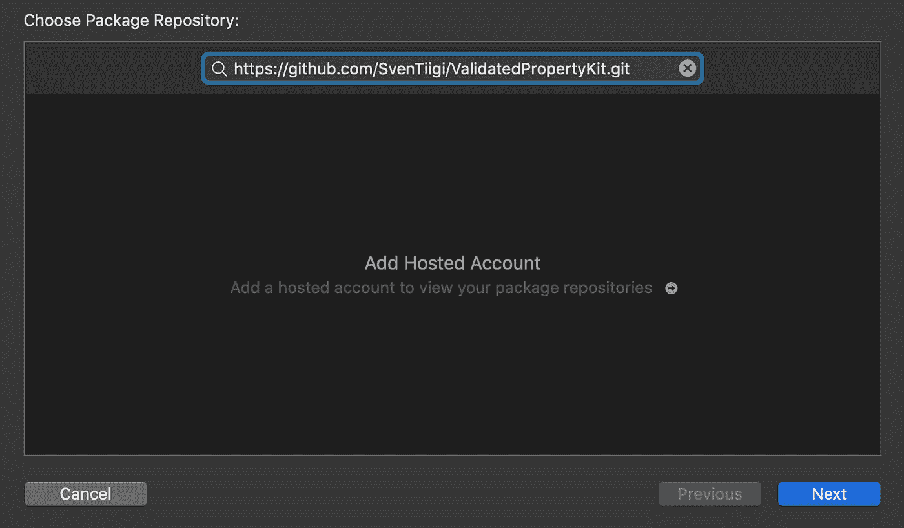
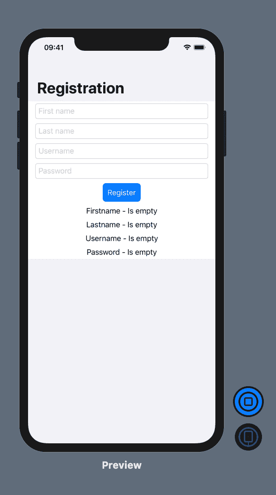
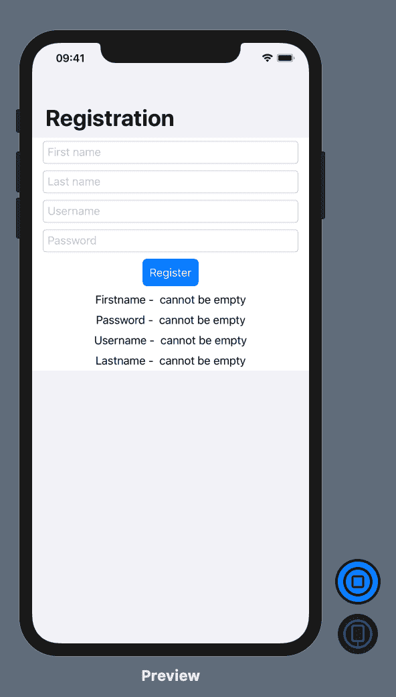
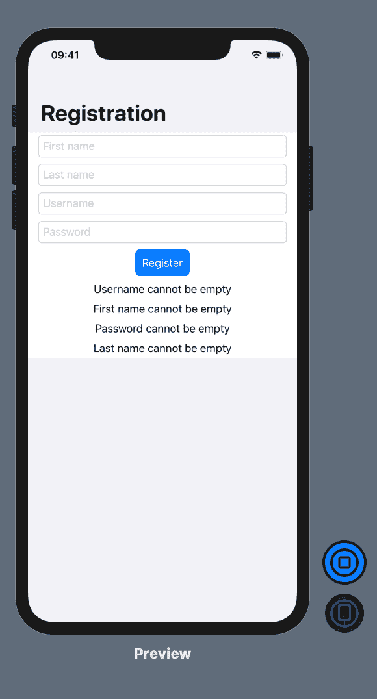

# 如何使用 ValidatedPropertyKit 改进 SwiftUI 应用程序中的验证

> 原文：<https://betterprogramming.pub/validation-in-swiftui-using-validatedpropertykit-3c85f27b123a>

## 使用 Swift 5.1 的属性包装器

在 [Unsplash](https://unsplash.com/s/photos/technology?utm_source=unsplash&utm_medium=referral&utm_content=creditCopyText) 上 [Jesus Kiteque](https://unsplash.com/@jesuskiteque?utm_source=unsplash&utm_medium=referral&utm_content=creditCopyText) 拍摄的照片。

[ValidatedPropertyKit](https://github.com/SvenTiigi/ValidatedPropertyKit) 是一个在应用中执行验证的 Swift 框架。它使用 Swift 5.1 中引入的属性包装特性，用所需的验证属性来修饰属性。在本文中，我们将把 ValidatedPropertyKit 集成到我们现有的 SwiftUI 应用程序中，并在界面上显示破坏的规则。

# **集成有效属性工具包**

第一步是在 SwiftUI 应用程序中集成 ValidatedPropertyKit 框架。请记住，ValidatedPropertyKit 是一个独立的库，不依赖于 SwiftUI 的框架。

集成 ValidatedPropertyKit 的最简单方法是使用 Swift Package Manager。在 Xcode 中，打开文件菜单，选择 Swift 包，，然后添加包依赖。这将打开一个对话框，您可以在其中输入依赖项的 Github URL。如下所示:

通过 Xcode 中的 Swift Package Manager 添加依赖关系。

单击“下一步”按钮，完成整个过程。一旦对话框关闭了您的依赖项，ValidatedPropertyKit 将被成功添加到项目中。接下来，我们将使用属性包装来修饰视图模型，这将支持验证。

# **向 RegistrationViewModel 添加验证**

如前所述，ValidatedPropertyKit 围绕属性包装器展开。为了执行验证，我们必须在视图模型中修饰我们的属性。如下所示:

用属性包装修饰的 RegistrationViewModel。

注意:我们已经将属性声明为可选属性，并将其初始化为空字符串，因为 ValidatedPropertyKit 将只验证非空值。

实现从导入 ValidatedPropertyKit 开始，然后在将参与验证的属性上装饰属性包装。在 ValidatedPropertyKit 框架中有许多不同的属性包装器可用。下面的列表显示了其中的一些:

*   `**.**nonEmpty` —值不能为 null 或空。
*   `**.**isEmail` —值必须为电子邮件格式。
*   `.range(8…)` —值必须满足范围。
*   `.greaterOrEqual(1)` —值必须满足条件。

您还可以为默认的 ValidatedPropertyKit 中没有涵盖的情况创建自己的自定义验证包装。

下一步是实现 validate 函数，它将负责评估属性。实现如下所示:

验证 RegistrationViewModel 的功能。

在 validate 函数中，我们创建了一个`rules`数组，其中包含属性的名称以及与该属性相关的验证错误。

接下来，我们遍历规则。如果我们发现任何与该属性相关的失败原因，我们会将它作为一个破规则添加到`brokenRules`数组中。`brokenRules`还标记了`@Published` 属性包装器，这意味着它一更新就会发布一个事件。

最后一步是在用户界面上显示被破坏的规则。这与之前完全相同:我们将在 registrationVM 上调用 validate 函数，然后使用 BrokenRulesView 来显示错误。实现如下所示:

已将 BrokenRulesView 添加到 ContentView。

如果你们注意的话，会注意到我们在将值绑定到 TextField 视图时使用了一个绑定函数。原因是 TextField 绑定到`Binding<String>`而不是`Binding<String?>`。绑定的扩展允许我们打开可选的，然后可以用来绑定到用户界面上的视图。绑定函数的实现可以下载源代码。

结果如下所示:

ValidatedPropertyKit 显示错误。

如您所见，验证被触发，默认的错误消息显示在屏幕上。这在某些情况下是可行的，但是如果我们可以自定义错误消息，那就更好了。在下一节中，您将学习如何编写可以提供自定义错误信息的自定义验证规则。

# **自定义验证错误**

为了自定义或添加新的验证规则，您需要扩展 ValidatedPropertyKit 提供的验证结构。向现有项目添加一个名为`Validation+Extension.swift`的新文件，并添加一个名为`required`的新静态属性。实现如下所示:

`required`验证属性的实现。

`required`属性是我们的自定义属性，它将对字符串值执行验证。如果该值为空，则错误消息将触发失败关闭。否则，将触发成功关闭。

接下来，更新您的 RegistrationViewModel 并使用新的`required`验证规则。如下所示:

使用必需的验证规则注册 ViewModel。

再次运行您的应用程序，点击注册按钮，无需填写表格。结果如下所示:

自定义验证消息。

我们甚至可以更进一步，在属性包装器中提供错误消息。为了实现这一点，我们将把定制的必需验证器从属性更新为函数。实现如下所示:

自定义必需的验证程序

现在，您可以更新您的 RegistrationViewModel 以利用新的`required`函数。如下所示:

将必需的验证器更新为函数。

这是结果:

使用自定义验证程序的错误消息。

# 结论

在本文中，您学习了如何使用 ValidatedPropertyKit 来验证您的视图模型属性。ValidatedPropertyKit 是一个令人惊叹的框架，它利用 Swift 5.1 的属性包装器的力量，允许开发人员向他们的应用程序添加验证。

# 参考

1.  [在 GitHub 上验证了 property kit](https://github.com/SvenTiigi/ValidatedPropertyKit)
2.  [NSScreencast validated property kit 演示项目](https://github.com/nsscreencast/427-validation-property-wrappers)
3.  [栈溢出上绑定函数的实现](https://stackoverflow.com/questions/57021722/swiftui-optional-textfield)