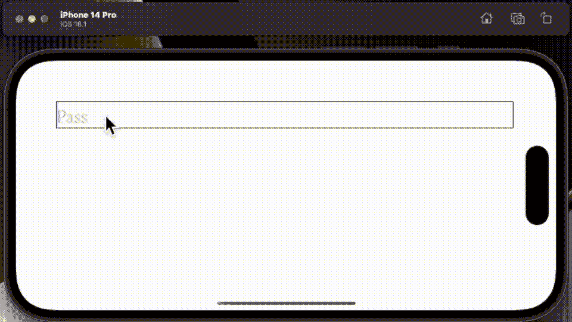

# 在 Swift 5.7 中使用 SwiftUI 和 Combine 进行正则表达式验证

> 原文：<https://betterprogramming.pub/validation-with-regex-before-ios-16-using-swiftui-and-combine-567817909d1>

## 使用新的正则表达式语法验证用户输入


关于正则表达式变体的幻灯片|来自[苹果开发者文档](https://developer.apple.com/forums/thread/707822)的代码

您可以将 Regex 的历史追溯到美国数学家，[斯蒂芬·科尔·克莱尼](https://en.wikipedia.org/wiki/Stephen_Cole_Kleene)，他在 1951 年提出了使用各种数学表达式来表示模式的想法。然而，直到 1967 年 Ken Thompson 决定在他的编辑器 Qed 和 ED 中使用它，他的工作才开始起步，在 UNIX 下运行，UNIX 是 OSX、iOS 和 Android 的前身。

虽然你可能认为正则表达式的简洁几乎肯定影响了世界上最流行的编程语言之一的语法，即 C 语言，它直到 1972 年才问世。目标 C 的先行者，现在是斯威夫特。

尽管 Regex 没有进入 C 语言，但它已经被集成到许多 UNIX 实用程序中，如 grep、awk 和 vi，以及大多数现代编程语言中。所以，苹果花了将近 40 年才在 Objective C 中采用 Regex，直到 2010 年，这多少有点令人惊讶(至少对我来说)。

另一个十年前，他们试图在 WWDC2022 中通过重写语法来更新它，使它更加用户友好。和我一起用一些更现代的正则表达式来更新这篇文章和它的同行。虽然我将在新的命令框架中在很大程度上使用原来的语法。

# 我们的基本代码

在我开始之前，我想用正则表达式语法定义 12 条规则。正如我所说的，这里的语法和 1967 年的几乎一样，所以——非常确定。

```
enum Rules:String, CaseIterable {
    case alphaRule = "[A-Za-z]+"
    case digitRule = "[0-9]+"
    case limitedAlphaNumericCombined = "[A-Za-z0-9]{4,12}"
    case limitedAlphaNumericSplit = "[A-Za-z]{4,12}[0-9]{2,4}"
    case currencyRule = "(\\w*)[£$€]+(\\w*)"
    case wordRule = "(\\w+)"
    case numericRule = "(\\d+)"
    case numberFirst = "^(\\d+)(\\w*)"
    case numberLast = "(\\w*)(\\d+)$"
    case spaceRule = "[\\S]"
    case capitalFirst = "^[A-Z]+[A-Za-z]*"
    case punctuationCharacters = "[:punct:]"
}
```

简而言之，方括号表示指定范围内的字符；加号表示一个或多个。花括号中的数字是最小和最大字符数。后跟小写字母的双斜线是字符类，后跟大写字母的双斜线是所述类的逆。星号表示零或更多。如果在方括号之外，帽子意味着必须以下列字符开头。

注意，如果在方括号内，帽子也有相反的意思。美元手段必须以上述模式结束。最后，您有一个 POSIX 类`[:punct:]`，它是不言自明的。

一组错误消息[以相同的顺序]链接到所述正则表达式。

```
enum Crips:String, CaseIterable {
    case alphaRule = "MUST be alpha only"
    case digitRule = "MUST be numeric ONLY"
    case limitRuleCombined = "MIN 4 AlphaNumeric MAX 12 AlphaNumeric"
    case limitRuleSplit = "START MIN 4 Alpha MAX 12 Alpha, FINISH MIN 2 numeric, MAX 4 numeric"
    case currencyRule = "MUST contain $£€"
    case wordRule = "MUST be alphanumeric"
    case numericRule = "MUST be numeric"
    case numberFirst = "MUST start with a number"
    case numberLast = "MUST finish with a number"
    case noSpaces  = "MUST not contain spaces or tabs"
    case leadingCapital = "MUST start with am uppercase letter"
    case punctuationCharacters = "MUST contain punctuation characters"

    static var cripList: [String] {
        return Crips.allCases.map { $0.rawValue }
    }
}
```

但是，在我开始之前，这里有一个我用来帮助我将第一组枚举映射到第二组枚举的扩展。它返回提交给它的枚举的索引。

```
extension CaseIterable where Self: Equatable {
    public func ordinal() -> Self.AllCases.Index {
        return Self.allCases.firstIndex(of: self)!
    }
}
```

好了，接下来是主菜。我想尽可能简单。我首先定义一个结构，在这个结构中，我将使用链接到与我的密码字符串不匹配的正则表达式的消息。

```
struct Diag: Hashable, Codable, Identifiable {
    var id = UUID()
    var message = ""
}
```

我创建了一个结构`Hashable`、`Codable`和`Identifiable`，这样我就可以在 SwiftUI 循环中使用它。现在来看主菜，主菜有两个主要功能。这里的第一个是匹配我的枚举中的正则表达式。

```
fileprivate func matchRegex() {
        for rule in Rules.allCases {
            let formulae = try! Regex(rule.rawValue)
            if let _ = passText.wholeMatch(of: formulae) {
                // is good, right size alpha upper + lower & numeric
            } else {
                let diag = Crips.cripList[rule.ordinal()]
                diagMsgs.append(Diag(message: "\(diag)"))
                let foo = /\a/
                print(foo)
            }
        }
    }
```

它贯穿了我的集合中的所有正则表达式。为所有匹配失败的诊断消息构建一个数组。

现在，第二个功能显示了一个类似控制台的诊断列表，如果它变得太大，就会从屏幕上滚下来。

```
fileprivate func displaceFailedMatches() -> ScrollViewReader<ScrollView<VStack<some View>>> {
        return ScrollViewReader { moveTo in
            ScrollView(.vertical) {
                VStack(alignment: .leading) {
                    ForEach(diagMsgs, id: \.id) { text in
                        Text("\(text.message)")
                            .font(Fonts.neutonRegular(size: 16))
                            .id(text.id)
                    }.onChange(of: diagMsgs) { _ in
                        moveTo.scrollTo(diagMsgs.last?.id, anchor: .bottom)
                    }
                }
            }
        }
    }
```

最后，我有主体。

```
var body: some View {
        VStack {
            HStack {
                Spacer(minLength: 4)
                TextField("Pass ", text: $passText)
                    .font(Fonts.neutonRegular(size: 32))

                    .onChange(of: passText) { newValue in
                        diagMsgs.removeAll()
                        matchRegex()
                        if passText.isEmpty {
                            diagMsgs.removeAll()
                        }
                    }
                    .border(Color.black)
                    .padding(.top, 64)
                Spacer()
            }
            displaceFailedMatches()
        }
    }
```

您需要用所示的双态变量定义的主体，在已经提到的方法中引用。

```
struct ContentView: View {
    @State var passText = ""
    @State var diagMsgs:[Diag] = []
```

把这些放在一起，你会在屏幕的顶部看到一个区域，你可以在那里输入一个单词。对所有数组正则表达式测试一个单词，报告失败的匹配。



如您所见，清除所有的错误消息是不可能的，因为我有冲突的集合。我让读者来决定他们需要取消哪些来获得一些工作集。

所有这些都让我想到这篇短文的结尾。如果您有兴趣了解更多信息，请花点时间观看 WWDC2022 视频。苹果已经为正则表达式开发了一种新的语法，尽管我提醒读者，也许他们应该先学习已经存在了 60 年甚至更久的版本(如本文所示)。

这是你在其他任何地方都能找到的 Regex 风格。