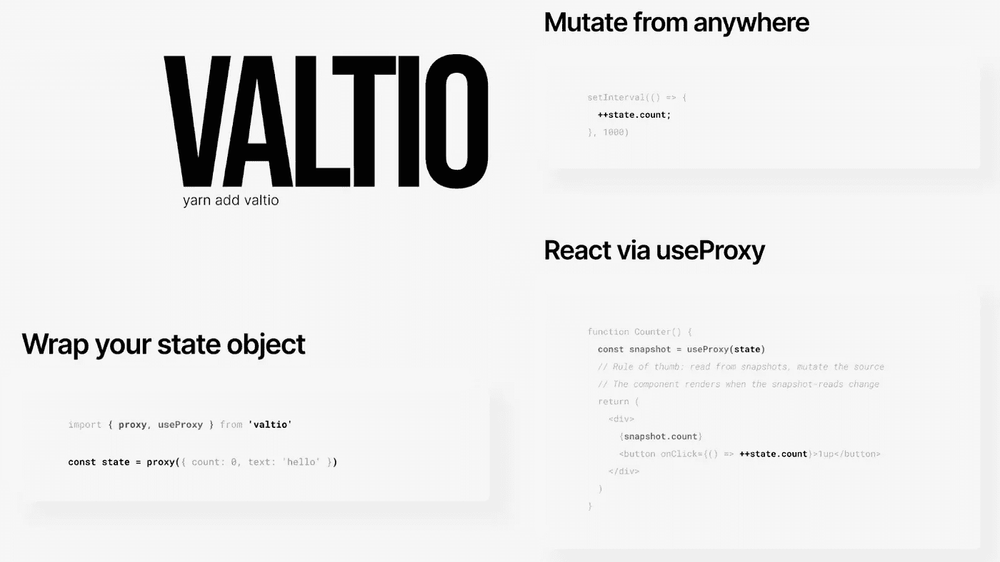
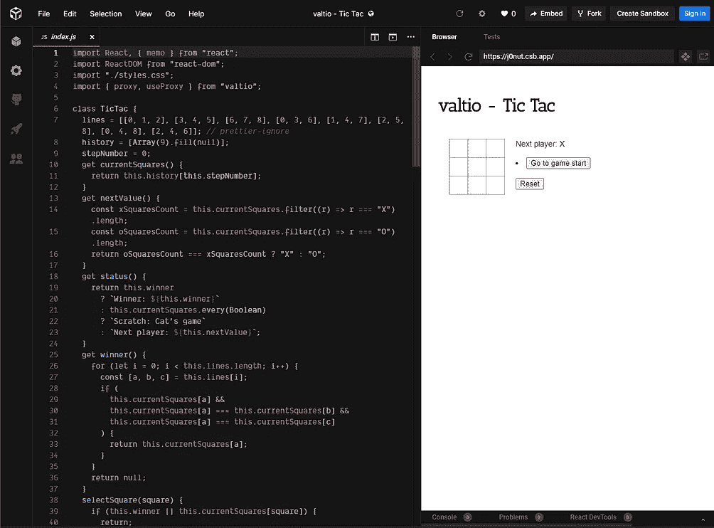
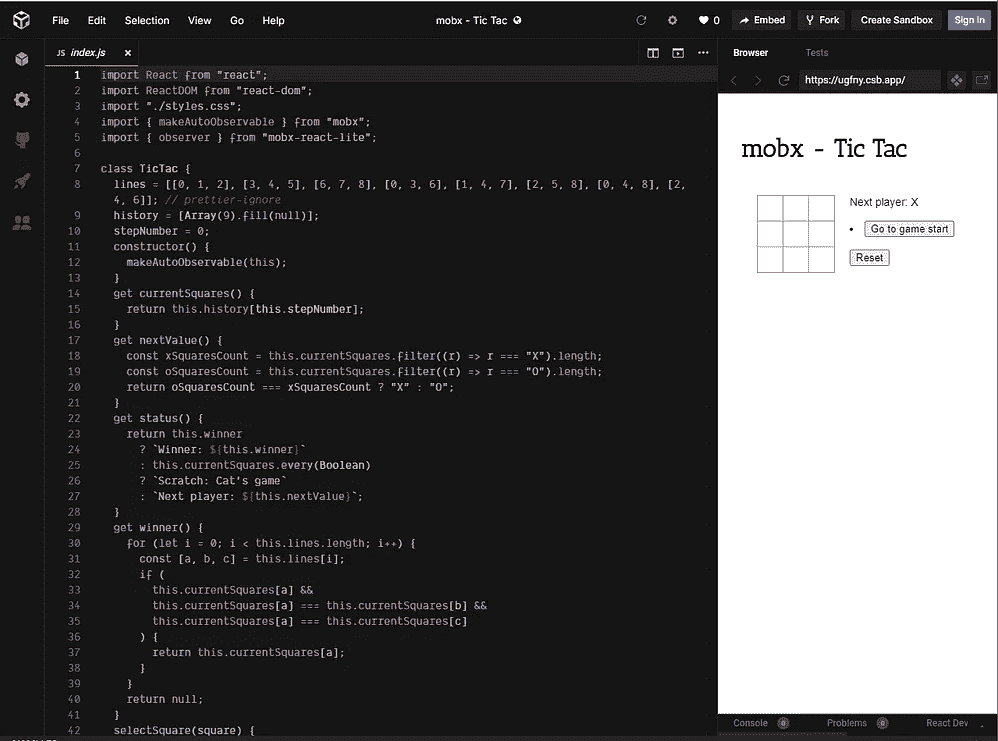

# valtio——React 中可能的最小代理状态

> 原文：<https://betterprogramming.pub/valtio-the-most-minimal-proxy-state-possible-in-react-764a67ba4833>

## React 的另一个州库？React 的可变全局状态



[https://github.com/pmndrs/valtio](https://github.com/pmndrs/valtio)(图片来源:作者)

# 这是谁创造的？

这是由npm install valtio
# if you use yarn
yarn add valtio

接下来你可以做的四件事是:

## 1.创建您的代理状态

```
import { proxy } from 'valtio'

const state = proxy({ count: 0, userName: '' })
```

## 2.改变状态

```
*// You can freely mutate it from anywhere you want ...* state.nested = { ticks: 0 }setInterval(() => state.nested.ticks++, 200)setInterval(() => { state.count++ }, 1000)
```

## 3.通过`useProxy`做出反应

这将从代理制作值的副本或快照。

```
import { useProxy } from 'valtio'
function Counter() {
  const snapshot = useProxy(state)
  // Rule of thumb: read from snapshots, mutate the source
  // The component renders when the snapshot-reads change
  return (
    <div>
      {snapshot.count}
      <button onClick={() => ++state.count}>+1</button>
    </div>
  )
}
```

## 4.从任何地方订阅更改

```
import { subscribe } from 'valtio'

// Suscribe to all state changes
const unsubscribe = subscribe(state, () => console.log(`state has changed to ${state}`))// Unsubscribe by calling the result
unsubscribe()// Subscribe to a portion of state
subscribe(state.foo, () => console.log(`state.foo has changed to ${state.foo}`))
```

这里可以免费开始玩 Valtio:[Valtio-simple-counter-qqljs](https://codesandbox.io/s/valtio-simple-counter-qqljs)。

# Valtio 和 MobX 的对比

[](https://codesandbox.io/s/valtio-tic-tac-j0nut)[](https://codesandbox.io/s/mobx-tic-tac-ugfny)

【https://codesandbox.io/s/valtio-tic-tac-j0nut】(左)[https://codesandbox.io/s/mobx-tic-tac-ugfny](https://codesandbox.io/s/mobx-tic-tac-ugfny)(右)

# 总结，或 TLDR

Valtio 简化了代理状态。想想类似 MobX 的东西，但是没有 99%的 API 面可以使用，增加了开发体验质量！

# 如果你想了解更多关于钩子的知识

我在开始使用自定义钩子和 Next 的时候亲自看过**[**学习 React 钩子**](https://amzn.to/2UFiZ5F)**。Js 或 Gatsby，它每天都帮助我理解 React 及其插件和库的生态系统:[https://amzn.to/2UFiZ5F](https://amzn.to/2UFiZ5F)****

# ****资源****

*   ****[https://github.com/pmndrs/valtio](https://github.com/pmndrs/valtio)****
*   ****[https://codesandbox.io/s/valtio-simple-counter-qqljs](https://codesandbox.io/s/valtio-simple-counter-qqljs)****
*   ****[https://twitter.com/dai_shi](https://twitter.com/dai_shi)****
*   ****[https://amzn.to/2UFiZ5F](https://amzn.to/2UFiZ5F)****