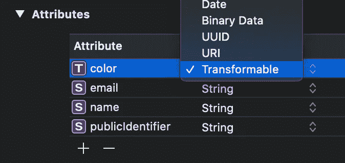
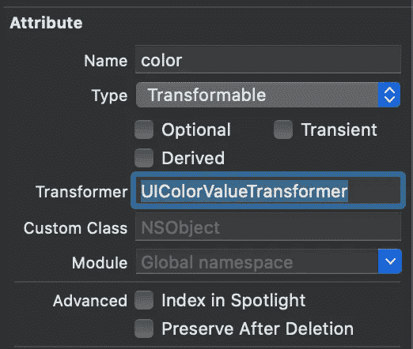

# 核心数据中的 ValueTransformer 解释:存储绝对 URL

> 原文：<https://betterprogramming.pub/valuetransformer-in-core-data-explained-storing-absolute-urls-61ee37515690>

## 一个强大的工具，允许您存储类型，如枚举


弗兰克·麦肯纳在 [Unsplash](https://unsplash.com?utm_source=medium&utm_medium=referral) 上拍摄的照片。

核心数据中的 ValueTransformers 是在将值插入数据库并被读取之前转换值的强大方法。它们设置在一个抽象类中，该类处理从一种表示到另一种表示的值转换。

它们通常被用来存储默认情况下不支持的值。核心数据允许您保存字符串和整数之类的类型，但是存储一个`CGRect`或`CGPoint`需要使用 ValueTransformer。一旦你了解了它们是如何工作的，你会发现你也可以在其他情况下使用 ValueTransformers(例如，将绝对 URL 存储为相对 URL)。

# 什么是 ValueTransformer？

一切都在名称中:它转换一个值。更准确地说，它在读取和写入核心数据数据库时转换一个值。

ValueTransformer 可以接受任何类型作为输入，并返回不同类型的值。一个例子是在插入时将`UIColor`转换为`NSData`，并且在读取后将其从`NSData`转换回`UIColor`。

# 如何在核心数据中使用 ValueTransformers？

ValueTransformer 是一个抽象类，它要求您根据要实现的转换来覆盖和实现它的一些方法。一旦定义了 ValueTransformer，就应该对它进行注册，以便它可用于您的核心数据模型。最后，您可以将一个属性定义为可转换的，并在模型表示中分配您的定制转换器。

## 创建价值转换器

在这个例子中，我们将创建一个转换器，将一个`UIColor`转换成`NSData`，并存储在我们的数据库中。

我们首先创建一个名为`UIColorValueTransformer`的新类，它继承自`ValueTransformer`:

核心数据基本上可以被视为一种技术，它将 C 函数调用包装到一个更易于使用的面向对象的框架中，以管理 SQL 数据库。它还没有内置到 Swift 中，因此需要我们与 Objective-C 进行交互。`@objc`属性告诉 Swift 在 Objective-C 中使用我们的 ValueTransformer。

下一步是设置我们的转换逻辑，这可以通过覆盖抽象`ValueTransformer`类中的一些可用方法来实现。我们首先定义转换后的值类，并将转换器标记为可逆的:

`transformedValueClass`需要返回“读取”的类型，这是一个正向转换。在我们的例子中，我们希望在从持久容器中读取值时有一个`UIColor`类型。

通过将我们的转换器定义为可逆的，我们基本上告诉核心数据，我们的转换器能够处理插入和读取。在其他情况下，您可能只想在插入时转换一个值，以确保该值符合某些要求(例如，存储一个首字母大写的名称)。然而，在我们的案例中，我们希望向两个方向转变。

## 转变价值观

接下来是实现实际的转换方法:一个用于读取数据库，一个用于写入数据库。

我们使用了`NSKeyedArchiver`类，它允许我们使用安全编码来读取和存储数据，这是从 iOS 11 开始就需要的，以提高安全性。在调试过程中，如果转换失败，我们通过抛出断言来帮助自己。断言失败只在调试版本中触发，这在我们的例子中非常好！

## 注册变压器

我们的 ValueTransformer 的实现大部分已经完成。我们只需要一种方法来注册它，并使它对我们的核心数据模型可用。

我们使用强类型名称，而不是将名称定义为静态字符串。如果我们决定重命名我们的转换器，这可以防止将来的错误。

静态的`register()`方法允许我们注册如下的转换器:

```
UIColorValueTransformer.register()
```

请确保在设置持久性容器之前这样做，否则您将会遇到如下错误:

```
No NSValueTransformer with class name 'UIColorValueTransformer' was found for attribute 'color' on entity 'user'
```

## 通过连接 ValueTransformer 将属性设置为可转换的

最后，您需要将 ValueTransformer 连接到数据库中的一个属性。通过将属性定义为可转换的，可以做到这一点:



将属性定义为可转换的，以便它可以使用 ValueTransformer。

您可以在数据模型检查器中连接 ValueTransformer:



在核心数据模型中连接 ValueTransformer。

这就是你使用你自己的 ValueTransformer 所需要的一切。在这种情况下，将`UIColor`存储到核心数据持久容器中。

# 使用 ValueTransformer 将绝对 URL 存储为相对 URL

现在您已经知道了 ValueTransformer 是如何工作的，是时候探索实现它们的其他方法了。

## 在核心数据中存储 URL

核心数据中的一个常见场景是存储 URL。iOS 11 引入了`URIAttributeType`，这使得将 URL 直接存储到核心数据变得很有诱惑力。这在某些情况下是没问题的，但它也使存储绝对 URL 成为一个简单的错误，这在将来会成为一个非常大的问题。

URL 通常指向像`App Group`文件夹或`Documents`目录这样的目录。正如在[文档](https://developer.apple.com/documentation/foundation/nsfilemanager/1412643-containerurlforsecurityapplicati)中所描述的，其中一些 URL 是可能改变的路径:

> "总是使用此方法返回的 URL 来定位组目录，而不是用显式路径手动构造 URL。在 macOS 的未来版本中，目录在文件系统中的确切位置可能会改变，但此方法将始终返回正确的 URL。

您可能不会总是足够仔细地阅读文档来防止所有情况，这就是为什么我总是选择最安全的路线。这意味着我将所有的 URL 相对地存储在核心数据中。

## 为什么应该使用 ValueTransformer 将绝对 URL 存储为相对 URL？

您可能想知道为什么要使用 ValueTransformer 将 URL 存储为相对 URL。要防止类似这样的代码:

```
@NSManaged private var urlPath: String

public var url: URL? {
    NSURL(fileURLWithPath: urlPath, relativeTo: RabbitInfo.shared.appGroupURL).absoluteURL
}
```

这样定义我们的属性会好得多:

```
@NSManaged public var url: URL?
```

## 使用 ValueTransformer 将绝对 URL 转换为相对 URL

在这个例子中，我们将一个指向文件的 URL 存储在`App Group`容器中。它从我们的配置中获取应用程序组 URL，配置使用`FileManager`来检索正确的路径:

```
FileManager.default.containerURL(forSecurityApplicationGroupIdentifier: "YOUR_APP_GROUP_NAME")
```

最终的实现如下所示:

如您所见，这个 ValueTransformer 看起来很像我们之前定义的`UIColor`转换器。在插入新的 URL 时，提取并存储相对路径。一旦读取了值，我们就追加指向我们的`App Group`容器的当前 URL。这样，我们就能确保总是引用正确的路径，并且永远不会遇到文件丢失的情况。

## 那么什么时候应该使用 URL 属性类型呢？

只有当您确定某个路径将来不会改变时，才使用 URL 属性类型。显然，您也可以使用它来存储 web URLs，对于这些 URL，转换器无法解决任何未来的更改。

# 结论

核心数据中的 ValueTransformers 允许您将值从任何类型转换为任何其他类型。通过在插入前将它们转换成`NSData`，可以存储`UIColor`、`CGRect`或其他类型。ValueTransformers 还可以用于其他情况，比如将 URL 从绝对转换为相对。

感谢阅读！