# 如何使用 Vapor 4 和 Swift 构建待办事项列表后端

> 原文：<https://betterprogramming.pub/vapor-4-todo-backend-5035c9d7e295>

## 服务器端 Swift 入门

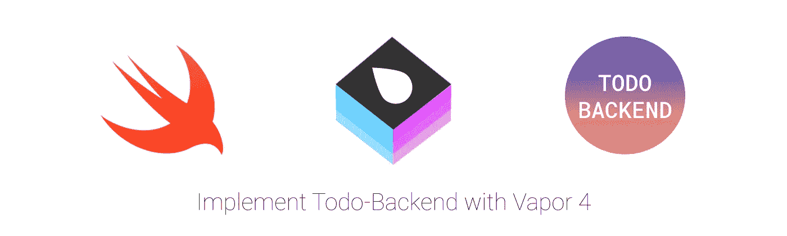

# 序文

[Todo-Backend](https://www.todobackend.com) 是一个很棒的项目，它为管理待办事项列表提供了一个简单的 web API 规范。您可以自己实现 API，并提供一个端点来了解您选择的服务器框架的更多信息(在本文中，我们将结合 Vapor 4 使用 ServerSideSwift)。
设置好之后，您可以[在这里添加测试目标 URL](https://todobackend.com/specs/)，运行测试并实现您的 API，直到您满足所有测试。这是一个很好的学习机会！

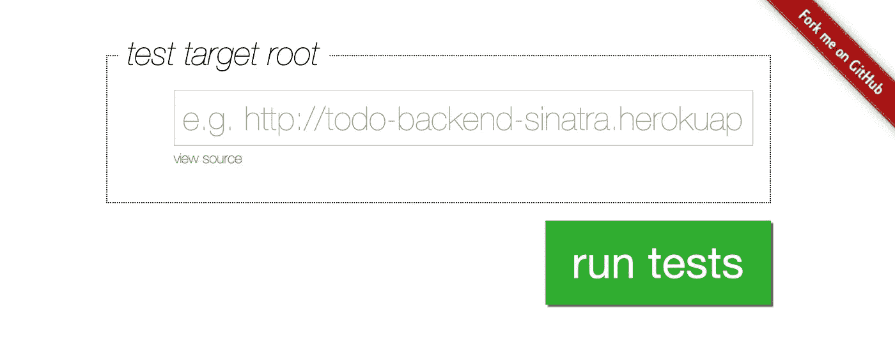

在此添加您的服务器并运行测试以获得反馈

在本教程中，您将学习:

*   如何使用 TDD 来使用`[Todo-Backend](https://www.todobackend.com)`并满足其规格
*   如何使用`[ngrok](https://ngrok.com)`使您的本地后端可用
*   如何配置`CORS`
*   如何写路线
*   如何编写待办事项
*   如何使用模型迁移

# 设置项目

## 创建 Vapor 项目

只需要几个步骤就可以在您的机器上完全运行 Vapor 后端。

将`[Vapor api-template](https://github.com/vapor/api-template.git)`(分支:4)克隆到您选择的文件夹中:

```
$ git clone [https://github.com/vapor/api-template.git](https://github.com/vapor/api-template.git) -b 4 todo-backend-vapor
```

***注:*** *目前 Vapor 4 模板在一个名为* `*4*` *的分支中。如果你以后读到这篇文章，它可能已经被合并到 master 中了。如果是这样，只需从上面的命令中删除* `*-b 4*` *即可。*

在 Xcode 中打开项目:

*   **将**文件夹或`Package.swift`拖放到 Xcode app 图标中

或者:

*   通过终端，将目录切换到您的新项目(在我的例子中是:`todo-backend-vapor`)并键入`open Package.swift`。

## **在 Xcode 中添加一个工作目录**

编辑您的`Run`方案并启用“使用自定义工作目录”。将其设置为项目的根目录。在 Xcode 中运行时，这是必需的，以确保我们的 SQLite 数据库文件存储在那里。

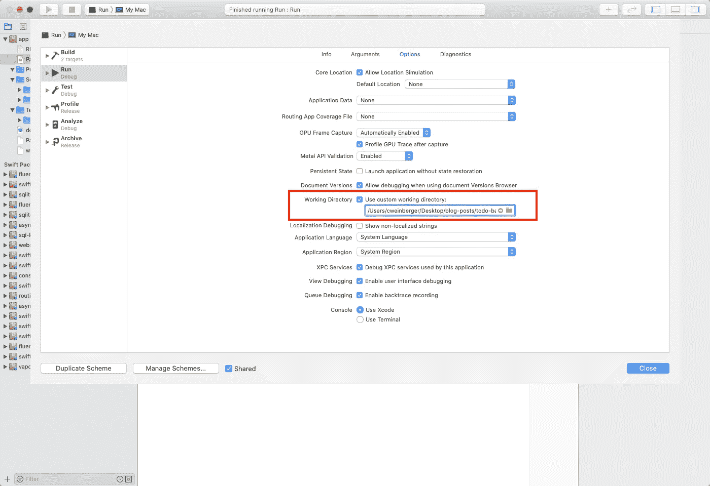

添加自定义工作目录

## **启用自动迁移**

现在，让我们再添加一个步骤来启用自动迁移。Vapor 的 ORM `Fluent`将在启动时尝试迁移您的模型/方案:

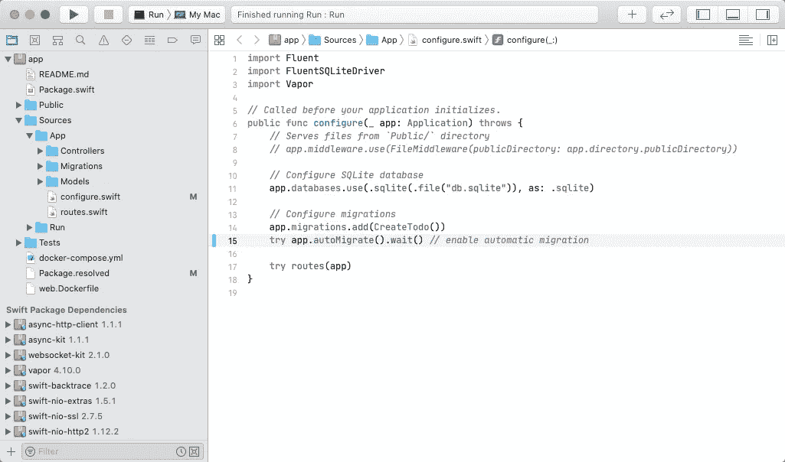

启用自动迁移

等到所有包都被解析，选择`Run`方案并运行您的项目:

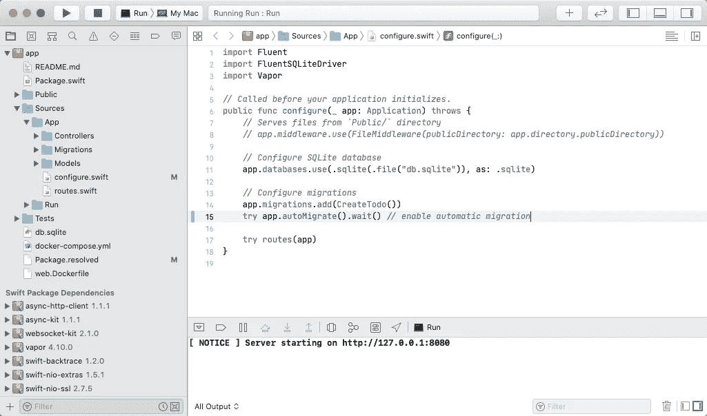

运行 Vapor API 模板

您会注意到已经创建了`db.sqlite`。您可以随意使用您选择的数据库客户端来检查它，例如 [TablePlus](https://tableplus.com) 或 [SQLiteStudio](https://sqlitestudio.pl) 。

切换到你的浏览器，打开 [http://localhost:8080](http://localhost:8080) 。你应该看到它的工作！

## 设置 ngrok

为了让您的本地后端对 todobackend.com 可见和可用，我们将使用`[ngrok](https://ngrok.com)`。

一次性设置操作:

*   转到[https://ngrok.com/download](https://ngrok.com/download)
*   下载客户端，解压并保存在某个地方。例如在`/Applications`中
*   使用 ngrok 创建一个免费帐户
*   在这里找到你的认证令牌:[https://dashboard.ngrok.com/get-started/setup](https://dashboard.ngrok.com/get-started/setup)
*   连接您的帐户，在终端中键入:

```
$ /Applications/ngrok authtoken {your auth token}
```

## **启动 ngrok**

*   从现在起，无论何时您想创建一个到本地后端的隧道，您只需键入:

```
$ /Applications/ngrok http 8080
```

这将使您的本地端口 8080 可以通过`ngrok`提供的 URL 到达:

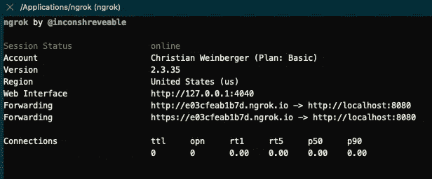

***注意:*** *在一个免费账户中，每当你停止/启动 ngrok 时，URL 都会发生变化。但现在这不应该困扰我们。*

将 HTTPS 网址复制到您的浏览器中。你应该看到它再次工作。太好了，您的后端现在可以从外部访问了！

***注:*** `*ngrok*` *提供了一个很棒的 web 界面，在这里你可以* ***跟踪传入的请求*** *。这对于调试非常有用——你可以在浏览器中导航到*[*http://127 . 0 . 0 . 01:4040*](http://127.0.0.01:4040)*来打开它。*

## 将后端连接到 Todo-Backend

接下来，您将连接您的后端到 Todo-Backend。确保 Xcode 中的后端仍在运行。

*   转到[https://todobackend.com/specs/](https://todobackend.com/specs/)
*   添加您的 https URL 并附加`/todos`，例如[https://e03cfeab1b7d.ngrok.io/todos](https://e03cfeab1b7d.ngrok.io/todos)

***注:****`*/todos*`*端点已经在* `*api-template*` *项目中为您提供了。**

*   *运行测试:*

*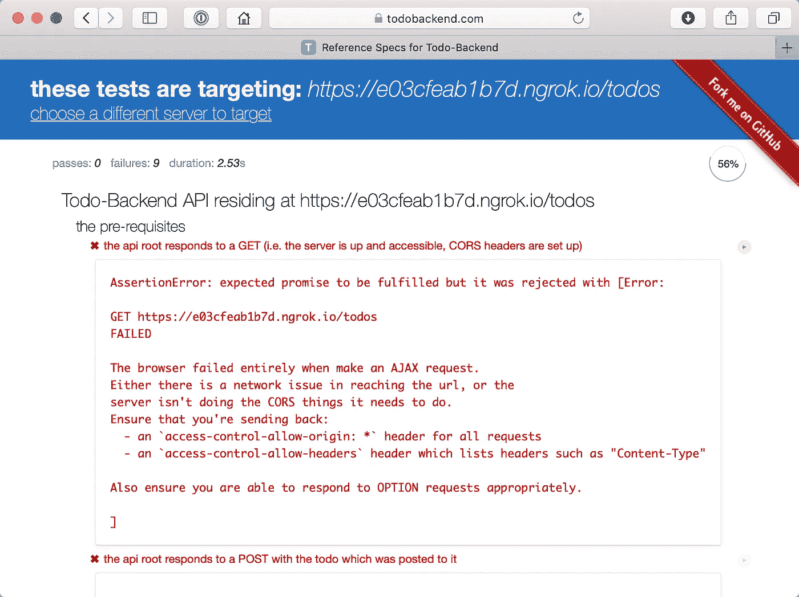*

*Todo 后端的测试结果*

*太好了！它可以访问我们的服务器，但是所有的测试都失败了。现在是满足规范的时候了。*

# *实现您的 Todo-Backend API*

## *修理 CORS*

**CORS 是一种机制，它使用额外的 HTTP 头来告诉浏览器给在一个来源运行的 web 应用程序从不同的来源访问选定的资源。当 web 应用程序请求来源(域、协议或端口)与其自身不同的资源时，它会执行跨来源 HTTP 请求。**

**如果你想了解更多关于 CORS 的信息，请查看 Mozilla* *的这篇文章。**

*在 Vapor 中，您可以通过添加`CORSMiddleware`来启用 CORS。在`routes.swift`中，更新中间件并使用默认配置添加 CORS:*

*第 5 行:添加 CORSMiddleware*

*如果刷新 Todo-Backend tests 页面，前两个测试现在应该通过了:*

**

*Todo 后端的测试结果*

*如您所见，我们不仅满足了 CORS 的要求，还通过了`POST /todos`测试。Vapor 的 api 模板已经实现了这一点。您可以在`routes.swift`中找到端点，在`TodoController.swift`中找到实现。*

## *实施“全部删除”*

*Todo-Backend 需要在`DELETE /todos`下有一个`delete all todos`端点。要实现这一点，切换到`TodoController.swift`并添加一个新的路由处理器:*

*现在切换到`routes.swift`并将`DELETE /todos`端点添加到末端:*

*运行您的应用程序并刷新 Todo-Backend 测试:*

*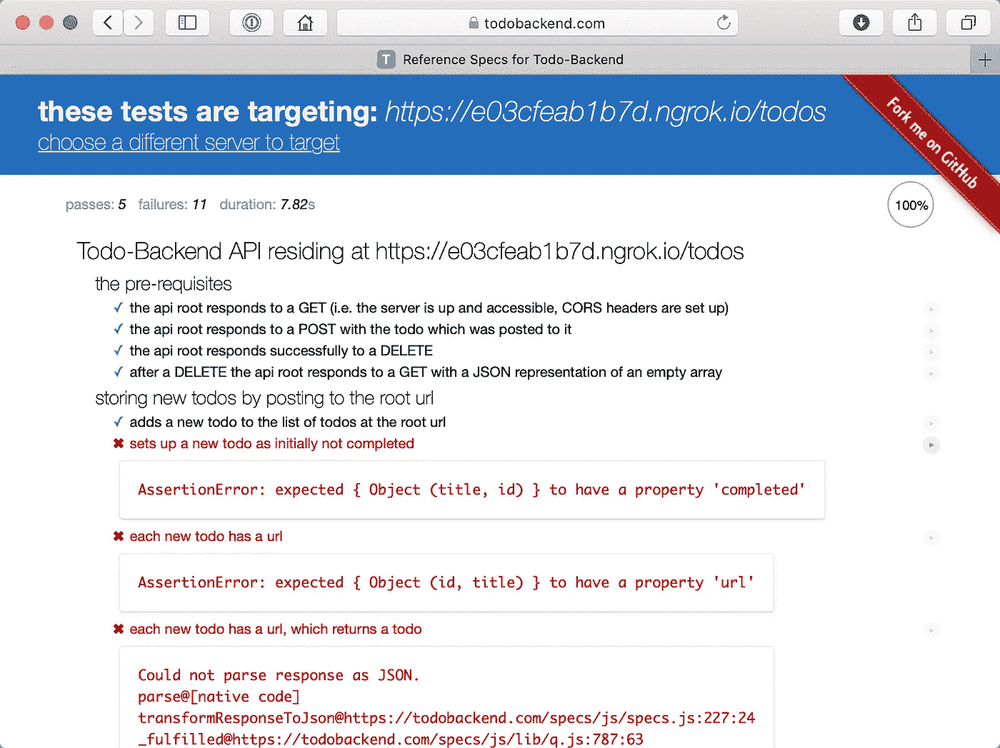*

*太好了——我们已经通过了五项测试！*

## *修复 TODO 模型*

*正如测试输出中概述的，Todo-Backend 希望我们的`Todo`模型有一个字段`completed`。让我们更新我们的`Todo`型号:*

*向我们的“Todo”模型添加一个新字段“completed”*

*`// 1.)`添加一个名为`completed`的类型为`Bool`的新字段。*

*`// 2.)`用`completed`的默认值`false`更新初始化程序。*

*现在，您必须更新方案。转到`CreateTodo.swift`并添加`completed`字段:*

*向我们的 Todo 迁移添加一个新字段“已完成”*

*现在删除 db.sqlite 文件并再次运行您的项目。*

****注意:*** *在生产环境中你要避免删除数据库。在这种情况下，您还可以修改您的迁移。请看一下* [*这里的*](https://docs.vapor.codes/4.0/fluent/migration/) *了解更多详情。**

*项目运行后，重新加载 Todo-Backend 测试。您会注意到现在有更多的测试失败了，错误在您的控制台中堆积起来。例如，先前通过的`/POST todos`测试失败。这是由于我们新的`completed`字段，我们使*成为必需的*，但在创建新的 Todo 时，Todo-Backend 并不提供。*

*让我们更新我们的`TodoController`来使用特定的模型来创建 Todo。切换到`TodoController.swift`，添加一个新的`CreateTodoRequestBody`结构，并更新`create(req:)`:*

****注:*** *如果你是 Vapor 新手，想了解其* ***异步性*** *以及何时使用* `*map*` *、* `*flatMap*` *或* `*flatMapThrowing*` *查看*[*Vapor 4****异步性*** *文档*](https://docs.vapor.codes/4.0/async/)*

*重新运行项目和 Todo-Backend 测试。我们已经通过了六项测试:*

*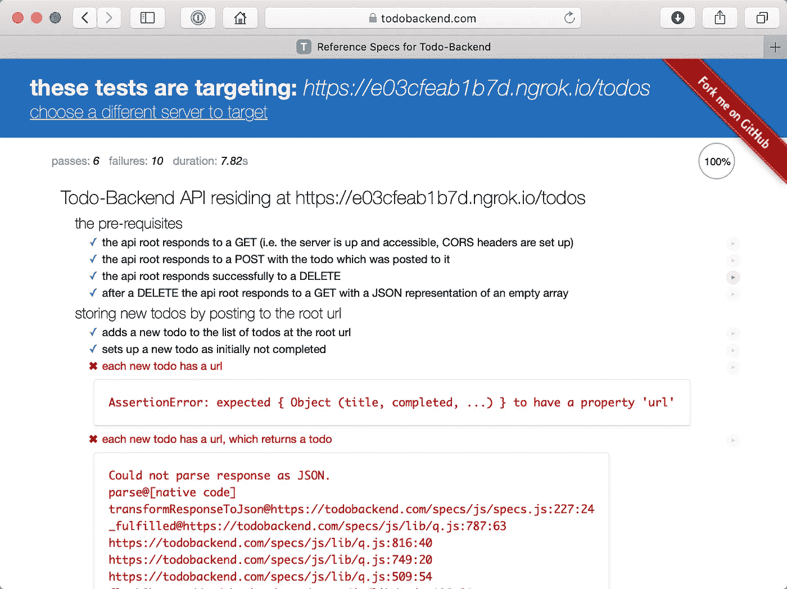*

*6 次通过，10 次失败——干得好😅*

## *添加自定义 Todo API 模型*

*Todo-Backend 希望所有返回的 Todo 对象都包含一个属性`url`,该属性带有指向其资源的链接。在 RESTful API 中，这应该是`/todos/{resource identifier}`，其中`{resource identifier}`是我们的`Todo`的`id`。*

*由于向数据库添加 URL 没有意义(这会添加冗余信息，并且 URL 可能会根据环境而改变)，我们将为我们的`Todo`实体引入一个新的 API 模型。在`Models`文件夹中创建一个新文件`TodoAPIModel.swift`:*

*我们的“TodoAPIModel”*

*您正在创建一个新模型，它具有所需的`url`属性和一个方便的初始化器，可以很容易地用`Todo`初始化我们的新模型。*

*现在，您必须更新`TodoController`路由处理程序，以获取所有 todo 并创建一个 todo 来返回`TodoAPIModel`而不是`Todo`。*

*更新现有路线以使用“TodoAPIModel”而不是“Todo”*

*重新运行项目并重新加载 Todo-Backend 测试。你会看到我们现在通过了更多的测试。*

*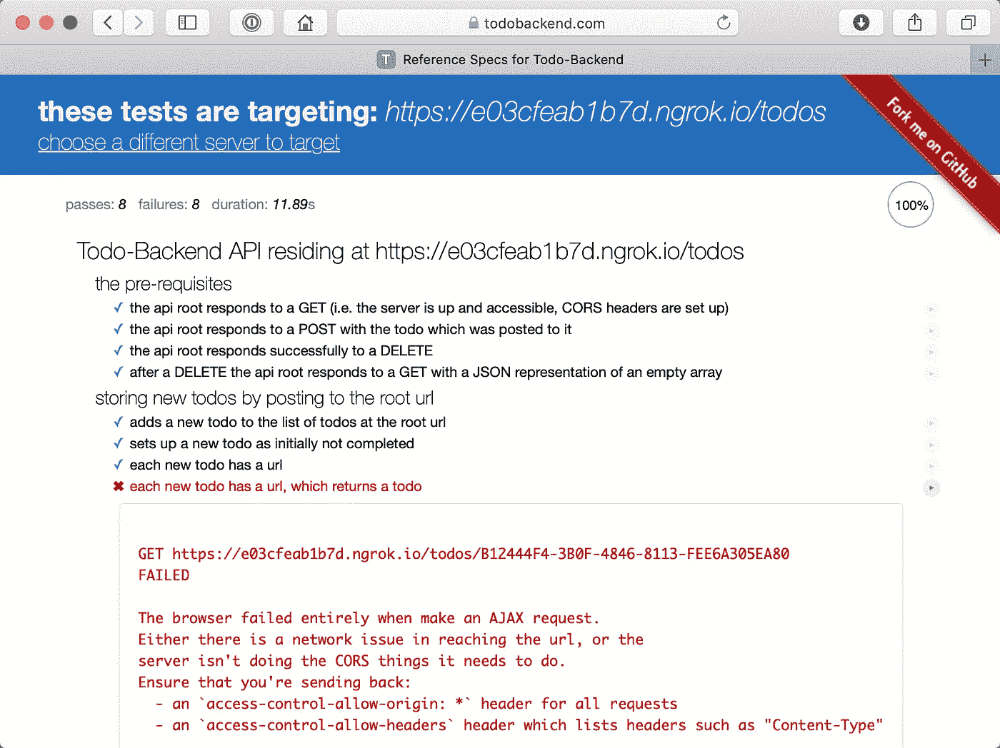*

*todo 有一个 URL，但是调用它还不会返回 TODO*

## *添加端点以获取单个 todo*

*转到`TodoController`并添加一个新的路线处理器`getSingle(req:)`。*

*TodoController.swift —获取单个 todo 路线处理程序*

*将该路线和命名参数`todoID`添加到`routes.swift`的末尾:*

*routes.swift 为`:todoID `添加带命名参数的路由*

****注:*** *可以在我的文章* [*中了解路由和命名参数 4*](https://medium.com/@cweinberger/routing-in-vapor-4-b49ad909e33c) *。**

***重新运行**项目，**重新加载**Todo-back end 测试。*

*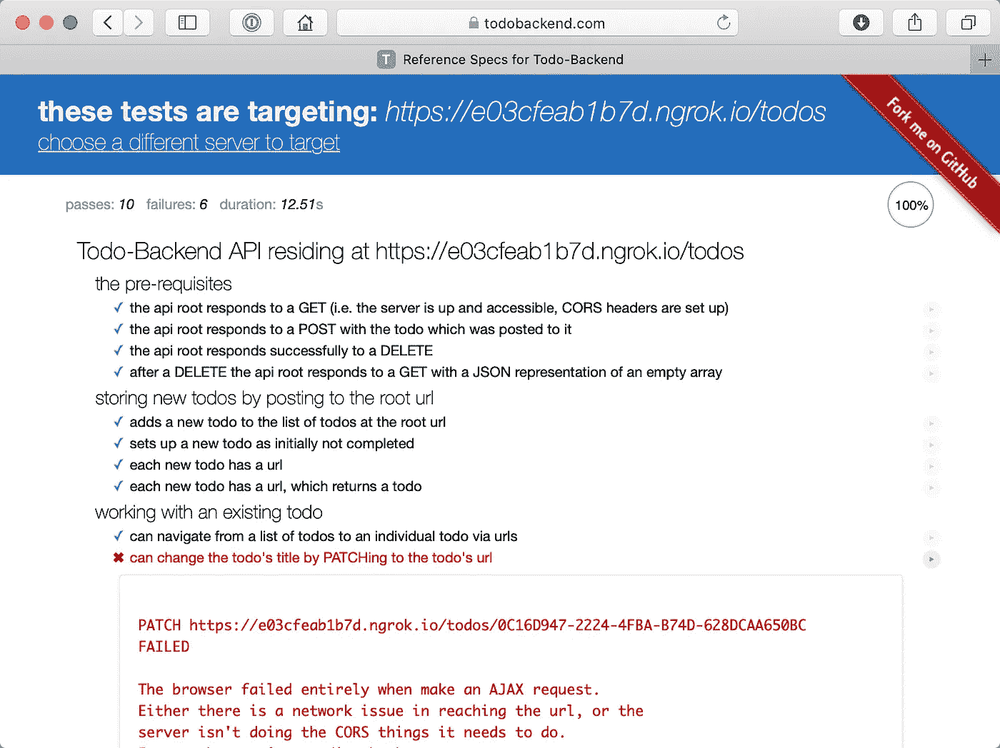*

*Todo-后端现在可以获取一个 todo🎉*

## *更新待办事项*

*下一个缺失的部分是允许 Todo-Backend 更新 Todo 的`title`并更改`completed`的值的路由。为此，我们必须实现一个新的路由`PATCH /todos/{todoID}`并引入一个新的带有可选字段的`PatchTodoRequestBody`。*

*我们在这里做什么？*

*`// 1.)`我们检查是否能找到与`todoID`相关的待办事宜。*

*`// 2.)`将请求体解码成`PatchTodoRequestBody`。*

*`// 3.)`在我们的数据库中查找待办事宜*

*`// 4.)`如有更新`title`*

*`// 5.)`如果提供，更新`completed`*

*`// 6.)`保存对数据库的更改*

*`// 7.)`归还我们的`TodoAPIModel`*

*现在，我们将新路线添加到`routes.swift`:*

***我们重新运行**项目并**重新加载**Todo-back end 测试:*

*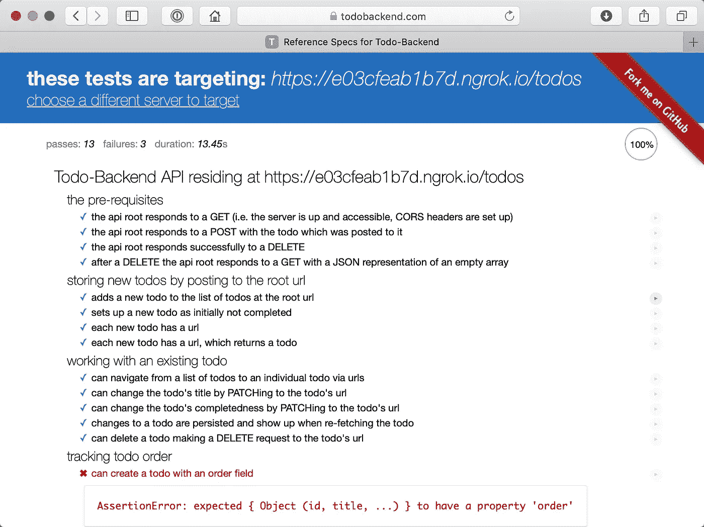*

*哇！现在只有 3 个失败的测试！*

## *允许订购 todos*

*Todo-后端希望能够订购我们的 todo。为此，我们必须执行几个步骤:*

*   *向我们的`Todo`模型和`CreateTodo`迁移添加一个新字段`order`。*
*   *将新字段`order`添加到我们的`TodoAPIModel`、`CreateTodoRequestBody`和`PatchTodoRequestBody`中。*
*   *更新`PATCH todos/:todoID`端点以允许更新订单。*

## ***更新模型和迁移***

*向`Todo.swift`添加一个新的可选`order`字段，并更新初始值:*

*Todo.swift 带有“订单”字段*

*更新`CreateTodo.swift`的迁移:*

*更新`TodoAPIModel`、`CreateTodoRequestBody`和`PatchTodoRequestBody`:*

*将“order”添加到“TodoAPIModel”并更新便利初始化器*

*在“CreateTodoRequestBody”和“PatchTodoRequestBody”中添加“order”*

*更新更新待办事项路由处理程序，以允许更改现有待办事项的顺序:*

*现在删除数据库`db.sqlite`，重新运行项目，并重新加载 Todo-Backend 测试。*

*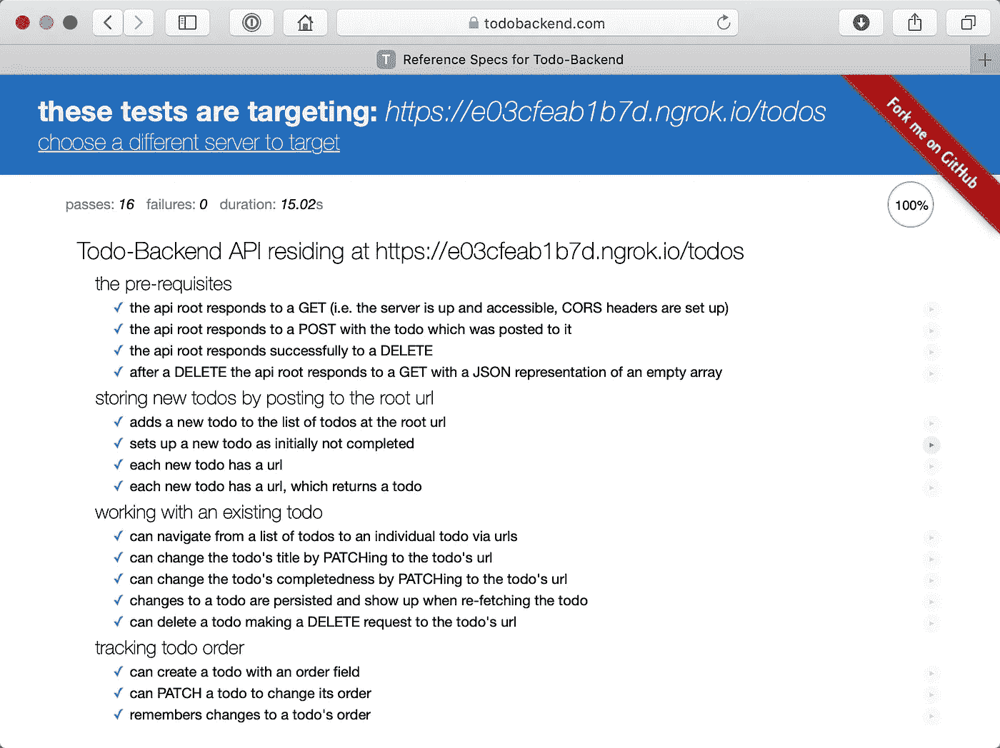*

*所有测试通过✅*

*就是这样——你做到了！*

*你可以在这里找到完整的源代码:[https://github.com/cweinberger/todo-backend-vapor4](https://github.com/cweinberger/todo-backend-vapor4)*

*我希望你喜欢我的教程！如果您有任何问题，请随时使用评论部分。*