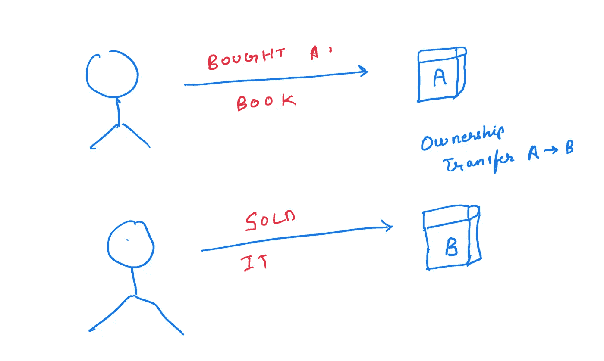
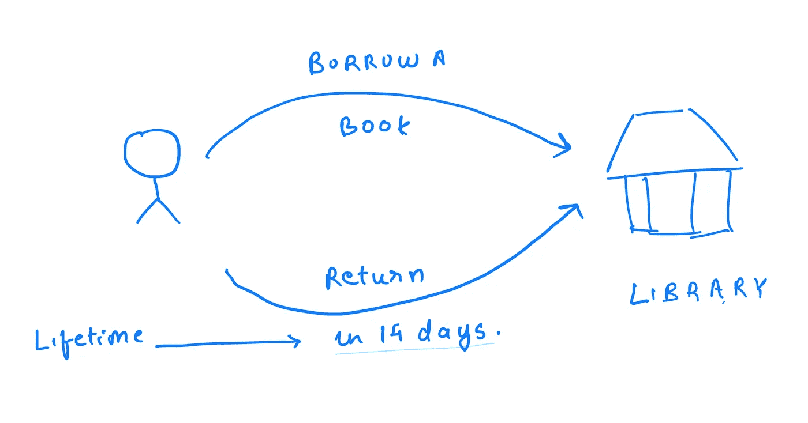

# Rust 中的变量、参考和寿命——实用介绍

> 原文：<https://betterprogramming.pub/variable-references-and-lifetimes-in-rust-a-practical-introduction-dd3c89527c22>

## 掌握防锈基础知识


[附身摄影](https://unsplash.com/@possessedphotography?utm_source=medium&utm_medium=referral)在 [Unsplash](https://unsplash.com?utm_source=medium&utm_medium=referral) 上拍照

在本文中，我们将触及 Rust 中变量、内存和引用的一些基础知识。目标是理解为什么 Rust 中存在生存期，以及我们如何使用 RUST 编译器编写安全的代码。我们将看到一些简单的例子，突出了 Rust 编译器帮助我们解决引用和内存管理错误的能力。

# 变量

作为开发人员，我们都知道变量。这是所有编程语言中的通用概念。

变量是一个符号名，它被赋予我们程序中的值。这些在整个计划中可能会改变或保持不变。根据数据类型，赋给变量的值可以存储在堆栈或堆中。Rust 提供了使用`let`关键字声明变量的方法。参考下面的例子:

```
fn main() { 
  let a = 10 ; 
  let b : u32 = 20 ; 
  let c = 2999.4 ; 
  let name = "hello_world" ;
}
```

像整数、浮点数和双精度数这样的简单类型存储在堆栈中。而字符串、结构或对象等复杂类型存储在堆中。

> 无论哪种情况，内存都是在变量初始化期间分配的。每当变量无效时就释放内存。

变量充当它们所指向的数据/对象的所有者。理解这一块很关键。一旦分配了所有者，只要变量有效，与变量关联的值就有效。

如果你已经熟悉了变量和引用，[参考这篇文章来理解关于所有权的规则](/understanding-rust-ownership-model-by-example-5d586ec5e8e4)

我们看到了变量如何拥有它们所指向的数据。我们还知道数据是可能在堆栈/堆上的内存块。(参考下图。)

变量的另一个方面是变量的所有权也可以转移给其他变量。这是任何其他编程语言都不具备的部分。让我们以下面显示的真实场景为例。



假设用户 A 在亚马逊上买了一本书。这个用户现在是这本书的所有者。几天后，这个用户决定将这本书作为旧书出售。用户 B 现在购买了这本书。用户 A 不再拥有该书的访问权限。它被运送给用户 B，我们知道所有权转移给了 B。

在这个例子中，书是一个变量可以保存的数据。我们可以用下面的代码来表示上面的场景。我们创造了两个变量。当我们将 user_a 的值分配给`user_b`时，Rust 将所有权转移给用户 B，就像在现实生活中会发生的一样。

```
Ownership of Book belongs to User A Lord of the Rings
Ownership of Book belongs to User B Lord of the Rings
```

现在尝试访问 owner_a 并再次打印，看看编译器输出是什么。

> 按照逻辑，当我们试图访问 user_a 的书名时，如果用户并不拥有它，我们就不应该被允许这样做。而这正是 Rust 的编译器用下面的错误信息告诉我们的。

```
error[[E0382]](https://doc.rust-lang.org/stable/error-index.html#E0382): borrow of moved value: `user_a`
  [--> src/main.rs:11:52
](https://play.rust-lang.org/#)   |
7  |   let user_a = Book{name : "Lord of the Rings".to_string()}; 
   |       ------ move occurs because `user_a` has type `Book`, which does not implement the `Copy` trait
8  |   println!("Ownership of Book belongs to User A {}" , &user_a.name); 
9  |   let user_b = user_a ; 
   |                ------ value moved here
10 |   println!("Ownership of Book belongs to User B {}" , user_b.name); 
11 |   println!("Can user A :{}: access this book ? " , user_a.name); 
   |                                                    ^^^^^^^^^^^ value borrowed here after move
```

请注意，基本类型没有这个错误，因为当我们试图给它们赋值时，值是被复制的。在复杂类型和所有存储在堆中的数据中，这是我们希望在 Rust 中看到的行为。

# 参考

我们看了什么是变量，以及 Rust 如何管理它们。现在让我们看看什么是参考。

引用是指向特定数据的指针。顾名思义，引用指向内存位置的地址。这听起来可能类似于 C++中的引用。我们可以通过使用关键字`&`来定义一个引用。

```
A is stored at address 0x7ffeb6aa08e4
New reference variable address 0x7ffeb6aa08e4
```

注意，这两个变量指向同一个内存地址。对内存中数据的只读指针的引用是不可变的。

也可以通过使用可变引用来更新值。参考下面的代码。

要使用引用改变一个值，必须使用`mut`关键字将原始值声明为可变的。点击这里了解更多关于不变性的信息。

# 借用参考文献

重要的是要明白，当我们创建一个引用`a_ref`时，我们是从所有者那里借用访问一些数据。这里的主人是变量`a`。我们可以不变地或可变地使用数据，但所有权仍然属于原始变量。该参考具有一个必须始终有效的`lifetime`。

让我们看另一个类比来理解这一点。想象一下，如果你决定从图书馆借一本书。你可以去图书馆借一本可以看两个星期的书，然后还回来。这本书仍归图书馆所有，但人们只是被允许阅读它。过了一段时间或者你看完之后需要还回来。这本书一归还，就可以被其他人借去使用。当你拥有这本书时，如果它被偷或丢失，将会有后果，你必须确保这本书永远是安全的。此外，当你拥有这本书时，没有人可以借走。另一个用户可能会借阅同一本书的不同副本。



这非常严格，但是非常像在 rust 中使用引用。引用从变量拥有的位置借用数据。使用引用时有一些规则。我们不会详细讨论这些规则。[你可以在另一篇文章](/understanding-rust-ownership-model-by-example-5d586ec5e8e4)中读到它。但是理解这一点是有帮助的，就像变量一样——引用可以被视为一种特殊类型的变量。

> 当开始使用参考资料时，RUST 可能感觉我们每次都在碰壁。我们越是围绕一些简单的概念考虑数据和内存，就越容易使用 RUST。

# 借款和寿命

我们已经了解了什么是变量，什么是引用，以及引用用法的一些基本概念。我们还讨论了所有权和变量的范围。该是我们审视一生的时候了。

如下例所示，一旦作用域结束，变量及其内存就会被删除。编译器确保这些检查完美完成。

```
error[[E0425]](https://doc.rust-lang.org/stable/error-index.html#E0425): cannot find value `b` in this scope
 [--> src/main.rs:6:57
](https://play.rust-lang.org/#)  |
6 |     println!("A value is {} . And b value is {} " , a , b); 
  |                                                         ^ help: a local variable with a similar name exists: `a` 
```

Rust 编译器确保引用和变量总是有效的。范围是一种非常简单的思考方式。

由于引用指向内存中的数据，Rust 必须确保程序中的任何一点都没有无效引用。当实际数据没有意义或被完全删除时，我们不希望有引用。引用上不应发生无效的访问/操作。Rust 编译器确保所有这些检查的方式是通过生存期。生存期是编译器检查这些情况并确保我们拥有的任何引用总是有效的方法。这些比作用域更高级，但是从作用域的角度考虑是很自然的。这正是 Rust 的优势所在，在使用`safe` Rust 时，几乎不可能出现无效的内存访问、故障或与内存和数据访问相关的漏洞。

在这篇文章中，我们不会涉及太多的细节。但是当我们谈到寿命和引用时，我们会看到 rust 是如何帮助我们的。

考虑到上面的例子，我们看到变量`a`的范围直到最后都是有效的。但是请注意，在内部块中，a 被指定为对`y`的引用。一旦第 6 行的内部作用域阻塞，y 的值就被删除。通常，我们会说`a`现在持有一个垃圾值。因为 a 指向的变量不存在。但这在 rust 中是无效操作。Rust 认为 y 的生命周期比 a 的生命周期短，超过这个时间点访问它是完全错误的。因此，它抛出以下编译时错误。

```
error[[E0597]](https://doc.rust-lang.org/stable/error-index.html#E0597): `y` does not live long enough
 [--> src/main.rs:5:13
](https://play.rust-lang.org/#)  |
5 |         a = &y;
  |             ^^ borrowed value does not live long enough
6 |     }                           // y is dropped
  |     - `y` dropped here while still borrowed
7 | 
8 |     println!("The value of 'x' is {}.", a);
  |                                         - borrow later used here
```

它明确说明 y 活得不够久，有些引用可能无效。

当我开始时，我发现这很难理解，但现在对我来说感觉很自然。这些东西的建模方式帮助我们解决了运行时可能出现的许多错误。想象一下当我们处理并行和并发程序时可能出现的竞争情况。生存期使我们避免了很多这些方面，编译器为我们做了大部分繁重的工作。

我将试着详细描述生命周期，以及一些编码它们的方法。希望这篇文章很好地介绍了所有这些概念。