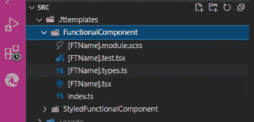
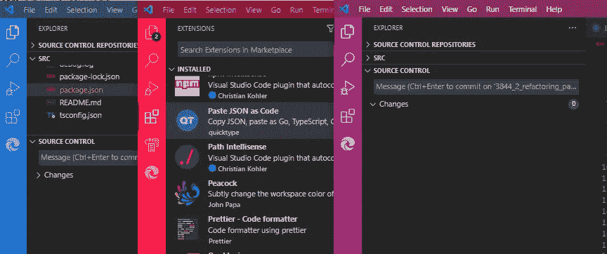

# 10+ React VS 代码扩展，在 2022 年提高生产力

> 原文：<https://betterprogramming.pub/vc-code-extensions-for-javascript-and-react-developers-in-2022-f0828b9ea00>

## 我最喜欢的 VS 代码扩展享受编码

卡尔·海尔达尔在 [Unsplash](https://unsplash.com?utm_source=medium&utm_medium=referral) 上拍摄的照片

我们都想更好、更快地工作，提高我们的生产力，按时交付优秀的产品。不幸的是，有时我们花了太多时间来保持代码的干净和清晰，格式化和重组。

当你有了预定义的规则，并且你没有浪费时间去考虑如何组织你的项目，如何构造组件，在哪里放置样式或测试，如何快速测试你的功能，等等时，你会更容易有效地工作。在一个项目中，我不是一个人，我必须定义这些规则，这就是为什么我总是在寻找更好的方法和伟大的工具，它们可以帮助我尽可能地自动化事情。

我使用不同的 VS 代码扩展，但是我想告诉你这些，它们帮助我和我的团队更快地编写更干净的代码，而不用复制粘贴旧的代码。值得一提的是，我的有用扩展列表在 2022 年变得有点短，因为我们不再需要额外的工具来调试和着色括号。

# ***更漂亮，Eslint***

你两个都需要！如果你想在你的项目中有好的格式化和检查的代码，你必须使用[格式化器](https://marketplace.visualstudio.com/items?itemName=dbaeumer.vscode-eslint)和 [linter](https://marketplace.visualstudio.com/items?itemName=dbaeumer.vscode-eslint) 。

我通常有配置文件(`.prettierrc`和`.eslintrc.json`)，在那里我定义我的代码应该是什么样子，以及如何检查它。

在`eslint`配置中，定义将要使用的插件是很重要的(顺序很重要)——因为你不想在 eslint 和 prettier 之间有冲突。

扩展显示了我代码中所有不正确的地方，我可以在保存时轻松地格式化它(vs 代码中的`editor.formatOnSave` 必须是 `true`**`settings.json`)。**

# *****文件夹模板*****

**我在寻找一个扩展，它可以从预定义的模板中生成 ReactJs 组件，但我也希望有一种方法来改变模板的结构并创建非常具体的模板。**

**这就是我最喜欢《T3》这部《T4》的原因。它不仅仅会反应，我可以创造我想要的任何东西。**

**例如，我有一个创建视图的模板，它创建一个组件，导入我们的列表组件和用于数据获取和状态管理的特定定制钩子。**

**由于我们的团队正在使用这种方法，我们不需要考虑组件的结构，我们只需要选择类型、名称，我们就可以使用默认导入的组件、测试文件、样式、故事(对于故事书)等等。**

**当所有组件都以一种方式结构化是件好事时，它在库中特别有用。**

****

**预定义模板**

# *****ES7+React/Redux/React-Native 片段*****

**这一款是[大扩展](https://marketplace.visualstudio.com/items?itemName=dsznajder.es7-react-js-snippets)。它有助于创建新的组件、函数等等。最重要的是，它很快，让编写`useEffect`、`useCallback`或任何其他钩子变得容易。**

**在下面的图片中，你可以看到它在代码中的样子以及 beauty/eslint 插件的反应。**

****

**带有 eslint 和更漂亮建议的 useEffect 代码段**

# *****VS 代码反应重构*****

**有时我们都需要重构所有代码，有一个工具来帮助我们是很好的。[有了这个扩展](https://marketplace.visualstudio.com/items?itemName=planbcoding.vscode-react-refactor)，很容易选择应该提取到新组件的代码行，就这样。**

**我通常喜欢用预定义的模板创建新的组件，但是有时候组件非常简单和小，以至于你不需要那种方法。**

# **`Peacock`**

**我喜欢这个，真的无法想象没有它的生活。**

**我通常会打开 2 个以上的项目，而 peacock 为我节省了时间。**

**通过颜色识别正确的项目要容易得多，而不仅仅是通过项目名称。**

****

# **React 开发的更多扩展**

*   **[自动重命名标签](https://marketplace.visualstudio.com/items?itemName=formulahendry.auto-rename-tag) —自动改变成对的标签，简单，但非常有效。**
*   **将 JSON 粘贴为代码——有时我需要将 JSON 对象转换为接口，这个插件做得很好。您只需要将 JSON 粘贴到一个新文件中，瞧，界面已经准备好了。**
*   **[quo kka](https://marketplace.visualstudio.com/items?itemName=WallabyJs.quokka-vscode)——这个扩展提供了 JavaScript 和 TypeScript playground editor 的机会，这是一种快速简单的测试代码的方法。**
*   **[Gitlens 和 Git History](https://marketplace.visualstudio.com/items?itemName=eamodio.gitlens) —查看文件历史、提交、比较版本的好方法。**
*   **[路径智能感知](https://marketplace.visualstudio.com/items?itemName=christian-kohler.path-intellisense) —帮助自动完成文件名，节省添加导入的时间。**
*   **[括号对上色器](https://marketplace.visualstudio.com/items?itemName=CoenraadS.bracket-pair-colorizer) —这是一个很棒的扩展，我已经用了很长时间了——尽管现在我使用 VS 代码内置特性。但是，为了怀旧，你可以使用这个功能。为此，您需要在 VS 代码`settings.json`文件中添加这一行代码:`"editor.bracketPairColorization.enabled": true.`**

**这就是我最喜欢的提高生产率和更好编码的扩展。希望这些扩展也能帮助你。**