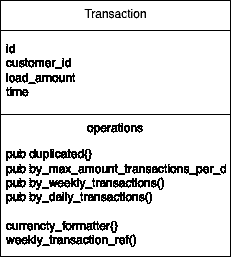
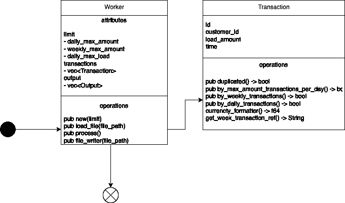

# 生锈时的速度限制—性能至关重要

> 原文：<https://betterprogramming.pub/velocity-limit-with-rust-performance-matters-9345763ec2d6>

## 这个周末让我们用 Rust 重建速度极限

照片由[乔治·霍夫曼](https://unsplash.com/@ghuffmanphotography?utm_source=medium&utm_medium=referral)在 [Unsplash](https://unsplash.com?utm_source=medium&utm_medium=referral) 上拍摄

上次，我分享了一些关于卓越运营的想法和经验[。让我们本周回到一些用例编码上来。](https://medium.com/geekculture/five-tips-to-start-your-i-t-operational-excellence-journey-9b238d21652b)

三年前的 2019 年，[我用 Golang 建立了一个管道](https://levelup.gitconnected.com/build-a-finance-velocity-limits-real-time-data-process-pipeline-in-go-with-gcp-stacks-558081f6ba8c)来处理带有一些具有速度限制能力的事务数据的文件。

本周我们将用铁锈制作它。首先，让我们回忆一下“**速度极限。**

在金融领域，账户通常有所谓的**“速度限制”、**来接受或拒绝交易，以便将资金存入客户账户。

## 功能需求

1.  每个传入的数据都是一个简单的 JSON 有效负载，如下所示:

文件示例—按作者

2.每个客户都有三个限制:

*   每天最多可以加载$ 100(例如$500.00)
*   每周最多可加载$ 1000 元(例如$20000.00)
*   无论数量多少，每天都可以执行最大装载次数。(例如，5)

一个用户试图在一天内加载 1000 美元两次，第二次会被拒绝，一个用户试图在一天内加载 500 美元四次也会被拒绝。

3.如果对于一个特定的用户 id，一个事务 ID 被观察了不止一次，我们将只计算列表中第一个出现的 ID。

4.对于每笔交易，我们将返回一个 JSON 响应，指示交易是否根据用户的活动被接受，其结构如下:

文件输出—按作者

由于我们将更多地关注代码和逻辑演练，我们可能不会涉及一些实现细节，如错误处理、日志记录、警报等。

# 让我们编码

编码就像讲故事一样。今天的主角是`Transaction`。基于文件结构，让我们定义一下`Transaction`的样子。

事务结构—按作者

正如你从功能需求中看到的，在这个过程中需要保持跟踪记录。所以我们需要一些散列表来满足需求。

跟踪和输出结构—按作者

我们需要确保我们的代码库可以基于当前需求或未来需求进行扩展，处理这一点的最佳方式是让事务维护其逻辑，并且它可以通过其 orchestrator 进行调用。

事务 UML 项目—按作者

事务操作实现—按作者

**这里的重要提示**:如果你仔细阅读代码，在运行期间跟踪速度和有效限制的关键是使用 hashmap，特别是当我们跟踪每周交易时，我们只需要获得一年中周数的唯一字符串，并将其作为唯一的引用键。

到目前为止，我们已经实现了`Transaction`。让我们从定义一个工人开始。

生锈速度限制工人-作者

工人实现—按作者

让我们把它组装起来，然后运行它。

生锈速度极限主要—作者

货物运行-发布-按作者

但是等一下。如果你记得我们三年前的 Golang 实现(链接更早)，执行时间是~ 5 毫秒。

让我们进行一些性能比较。

无缓冲长凳运行——作者

发生了什么事？在范围运行中，Go 几乎比 Rust 实现快 50 %。

# 性能调整

首先，不要误解我，我喜欢 Golang，我已经用 Golang 编码很长时间了，我喜欢 Golang 的简单性和其他伟大的特性。但是，我们不应该在 Golang 和 Rust 之间看到如此巨大的性能差距。

我们一定漏掉了什么。但是，你可能觉得还是快。为什么你还固执于那些~3 毫秒。

性能至关重要，尤其是在云环境中，从规模、基础架构成本以及我们的客户期望来看，毫秒数非常重要。

为了找出问题所在，在运行我们的仪器之前，让我们后退一步，重新思考该应用程序的主要活动，以及哪些步骤可能会影响性能，看看我们是否可以缩小一些关注方向。

在 worker 实现中，您可以看到有三个主要任务，

1.  读取文件。
2.  用事务实现处理文件。
3.  写文件。

读取和写入都大量涉及系统调用，并且系统调用是昂贵的。

Golang 和 Rust 是很棒的低级语言；但是，它们处理 I/O 读写的方式不同。Golang 的`io.writer`接口默认是缓冲的。另一方面，Rust 在没有缓冲的文件上读写。

好吧，我们试试看。

1.  在`load_transaction`功能中，我们使用的是`BufReader::new(file)` *。*哪个应该好。
2.  在`file_writer`里。让我们添加这一行代码。

bufwriter —按作者

再次基准测试:

缓冲长凳—作者，

你可以看到结果是有希望的。Rust 回到游戏的速度比 Golang 快 3 毫秒。

# 最后的话

我们了解到:

1.  如何在 Rust 中实现“速度极限”用例？
2.  我们还会查看性能比较，以及当我们需要深入研究性能挑战时应该如何思考。
3.  同样，性能基准测试是必不可少的，尤其是因为我们处于云的原生世界中。
4.  以适当的心态追踪绩效并不顽固。:)

感谢您的阅读。