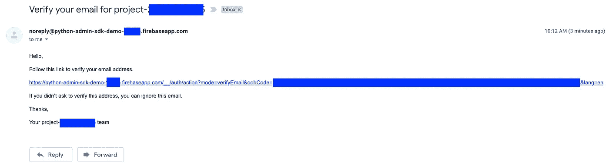
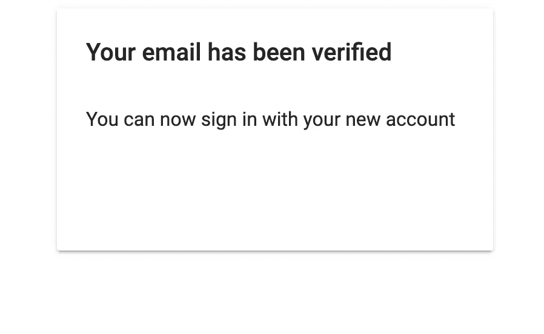

# 如何使用 Firebase 和 Python 验证用户的电子邮件地址

> 原文：<https://betterprogramming.pub/verify-user-email-address-with-firebase-and-python-adda433ff48d>

## 发送电子邮件验证链接，以确保您的用户是他们所说的人


Philipp Katzenberger 在 [Unsplash](https://unsplash.com?utm_source=medium&utm_medium=referral) 上的照片

# 介绍

在这个时代，保护我们应用程序用户的信息是我们应该投入大量精力的最重要的事情之一。这就是为什么大多数应用程序(如果不是全部的话)都有身份验证的形式。例如，电子邮件地址和手机号码是两个最常见的。

我们当然可以从头开始构建我们自己的验证解决方案，但是，如果我们时间紧迫，需要快速完成任务，该怎么办呢？

这个问题的一个答案是谷歌的 [Firebase](https://firebase.google.com/) 。该工具提供了一个 API 来发送电子邮件验证链接并确认电子邮件验证本身。

在本教程中，我们将讨论和演练如何实现 Firebase 的电子邮件验证 API 来验证我们的应用程序用户的电子邮件地址。

TLDR:克隆这个 GitHub [repo](https://github.com/billydh/python-firebase-admin-sdk-demo) 。

# 先决条件

我们需要一个谷歌账户和一个 Firebase 项目来实现电子邮件验证。最近，我写了一篇关于如何建立一个 Firebase 项目并获得证书和 API 密匙的教程。

您可以遵循该教程，对 Firebase 如何与您的应用程序后端集成有一个基本的了解。

除了介绍 Firebase 项目设置之外，本教程还介绍了用户管理，包括创建用户、更新用户的详细信息、设置用户的密码、使用电子邮件和密码验证用户以及删除用户。

在进入下一部分之前，请克隆这个 GitHub [库](https://github.com/billydh/python-firebase-admin-sdk-demo)。

# 发送电子邮件验证链接

好了，让我们进入本教程的第一部分，向用户发送一封包含电子邮件验证链接的电子邮件。

发送电子邮件验证链接的 API 是 Firebase Auth REST API 的一部分。它是一个接受包含`requestType`的请求体的`POST`端点，请求体的值应该总是`"VERIFY_EMAIL"`和`idToken`，这是我们在用户通过身份验证时获得的 Firebase ID 令牌。

因此，让我们创建一个新用户，设置一个密码并进行身份验证，这样我们就可以获得 Firebase ID 令牌。所有的步骤都包含在前面提到的教程中。

继续使用您可以访问的电子邮件地址创建一个用户，以便您可以在以后接收电子邮件验证链接。

如果您遵循上面提到的教程，这些步骤看起来会是这样的。

```
~/demo/python-admin-sdk-demo ❯ python create_user.py --email your.email@yourdomain.com --user-id 12345Firebase successfully created a new user with email - your.email@yourdomain.com and user id - 12345~/demo/python-admin-sdk-demo ❯ python set_password.py --user-id 12345 --password whateverpasswordyouwanttouseFirebase has updated the password for user with user id - 12345~/demo/python-admin-sdk-demo ❯ python sign_in_with_email_and_password.py --email your.email@yourdomain.com --password whateverpasswordyouwanttouse### This will result in a Json response body. Just grab the value of the field named 'idToken'. ###
```

一旦我们在认证用户之后获得了 Firebase ID 令牌，我们就可以继续创建一个名为`send_email_verification_link.py`的新 Python 文件。

`send_email_verification_link.py`

让我们称之为向用户的电子邮件地址发送电子邮件验证链接的脚本。

```
~/demo/python-admin-sdk-demo ❯ python send_email_verification_link.py --firebase-id-token <insert-id-token-here>{'email': 'your.email@yourdomain.com',
 'kind': 'identitytoolkit#GetOobConfirmationCodeResponse'}
```

很好。

如果这是我们看到的响应，这意味着 API 调用成功了。现在，如果我们进入我们的电子邮件收件箱，我们应该会看到一封来自 Firebase 的电子邮件，就像这样。



Firebase 的电子邮件验证链接

如果您只是点击链接，它将带您到一个新的页面，如果验证成功，您将看到以下内容:



成功的电子邮件验证

我们中的一些人可能已经注意到，我们的 API 密钥包含在上面的电子邮件验证链接中。我们的第一反应很可能是这样做不安全。

然而，对于 Firebase 项目，API 键实际上是公共信息，有必要在 Google 服务器上识别我们的 Firebase 项目。关于这个主题，有一个很好的堆栈溢出问题供你参考。

本质上，Firebase 推荐使用 [Firebase 安全规则](https://firebase.google.com/docs/rules)来保护您的资源。因此，在部署您的应用程序之前，请设置相关的安全规则，以保护您的应用程序资源。

# 参考

*   [Firebase —发送电子邮件验证链接](https://firebase.google.com/docs/reference/rest/auth#section-send-email-verification)
*   [Firebase 安全规则](https://firebase.google.com/docs/rules)
*   [GitHub 回购](https://github.com/billydh/python-firebase-admin-sdk-demo)