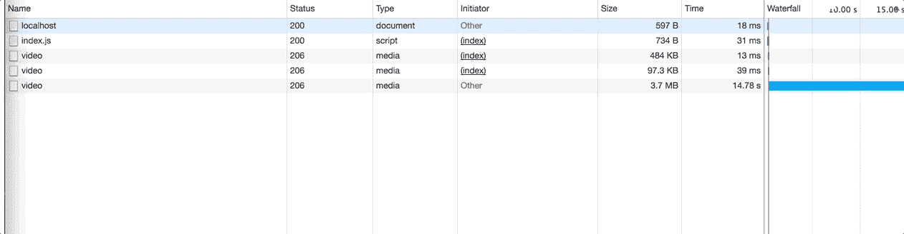

# Node.js 和 HTML5 的视频流

> 原文：<https://betterprogramming.pub/video-stream-with-node-js-and-html5-320b3191a6b6>


[阮富仲](https://unsplash.com/@heyitsmebev)

有人问我如何使用 [Node.js](https://nodejs.org/) 进行视频流。这是我还没有尝试过的东西，所以我想，“为什么不呢！”让我与你分享我的发现。

挑战在于创建一个将. mp4 文件发送到页面并使视频可供查看的路由。

我分解它的方式是:

*   制作一个服务器路由来传送视频。
*   使用 HTML5 和 JS 请求提要。
*   让视频分部分加载，而不是从一开始就加载。

TL；DR——你可以在这里找到视频流[的工作演示。](https://github.com/daspinola/video-stream-sample)

# **流**

视频通过流式传输工作。这意味着，不是在一个包中把所有的东西都发送到前端，而是应该一次一小块一小块地发送。

通过流发送意味着，在能够观看视频之前，不必等待页面从服务器下载整个视频，而是可以向服务器请求视频的前几秒，并在视频播放时下载其余部分。

您也可以使用这种方法发送大块文本。例如，你的客户不需要等很久就能看到文章的前几行。

# **一些理论**

*   **获取文件大小** : `fs`在 Node 中有一个名为`statSync`的方法，该方法将返回文件的统计信息。在这些统计数据中，我们需要知道当前加载的块到达文件末尾时的文件大小。你也可以使用`stat`——在我的例子中，我试图避免同步性，以使代码更容易被新人理解。
*   **从一个文件创建一个流** : `fs`包含另一个叫做`createReadStream`的方法，它将创建一个给定文件的流，开始和结束块。

```
const fileChunk = fs.createReadStream(sample.mp4, {start, end});
```

*   **块的大小:**起始块将在请求中提供给你。为了计算要加载多少文件，我使用了结束块大小(如果不可用，使用完整的文件大小)和开始块大小的减法:

```
 endChunk - startChunk
```

*   **HTTP 206:** 这用于部分内容，这是我们希望我们的连接的头。我们不断地向前端提供数据块，并且希望在发出请求时，我们的起始数据块是可用的。你至少要定义:

```
'Content-Range': 'bytes **chunkStart**-**chunkEnd**/**chunkSize'**
'Accept-Ranges': 'bytes'
'Content-Length': **chunkSize**
'Content-Type': 'video/mp4'
```

# **服务器**

考虑到这些因素，我最终在我的路线中找到了类似的东西，命名为`video`。(我正在使用 Express 创建路线。)

这相当多的代码。别担心，你随时可以用[演示](https://github.com/daspinola/video-stream-sample)进一步调试。

让我试着解释一下流程:

*   当发出请求时，我们获取文件大小并在`else`语句中发送视频的前几个块。
*   当我们开始观看视频时(通过`localhost:3000/video`或从前端访问路线)，会发出后续请求，这一次是在头中使用范围，以便我们知道下一个块的起点。
*   再次读取文件以创建另一个流，传递新的开始和结束值(很可能是请求头中的当前部分和视频的文件大小)。
*   通过应用我们前面讨论过的公式，我们将 206 头响应设置为只发送新创建的流的一部分。

# **前端**

使用 HTML5 `video`标签，前端出奇地简单——您只需要添加一个源路由，它会为您处理剩下的工作。

```
<video id="videoPlayer" controls> <source src="http://localhost:3000/video" type="video/mp4"></video>
```

`controls`属性允许你看到玩家的控制。


播放器控制、音量、播放按钮和其他

如果没有它，您可以通过访问 player 元素自己编写这些和其他属性；在本例中是 id `videoPlayer`。

所以，如果你的 HTML 上有一个按钮，你可以像这样复制播放/停止按钮:

在开发者工具的`network`标签中，你可以看到成块的数据流，尤其是当你关闭连接的时候。



30MB 文件中的部分流示例

# **结束语**

对于一个简单的实现来说，我没有想到会如此顺利。当然，在这个实现中有一些缺陷，比如开始的块不总是预期的那样(可能是因为连接挂起，因为我在这个例子中没有处理它)。

尽管如此，我认为对于那些想要开始创建某种流应用程序的人来说，这是一个很好的起点。如果你有更好的或者更少出错的方法，请告诉我！