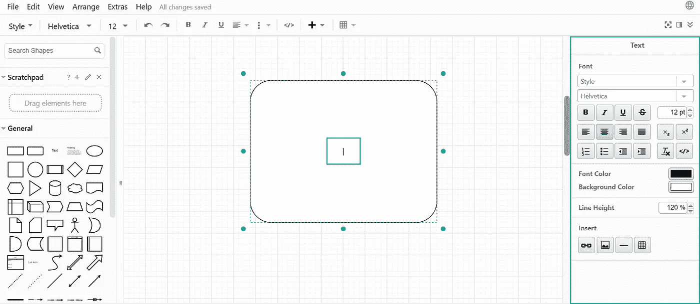
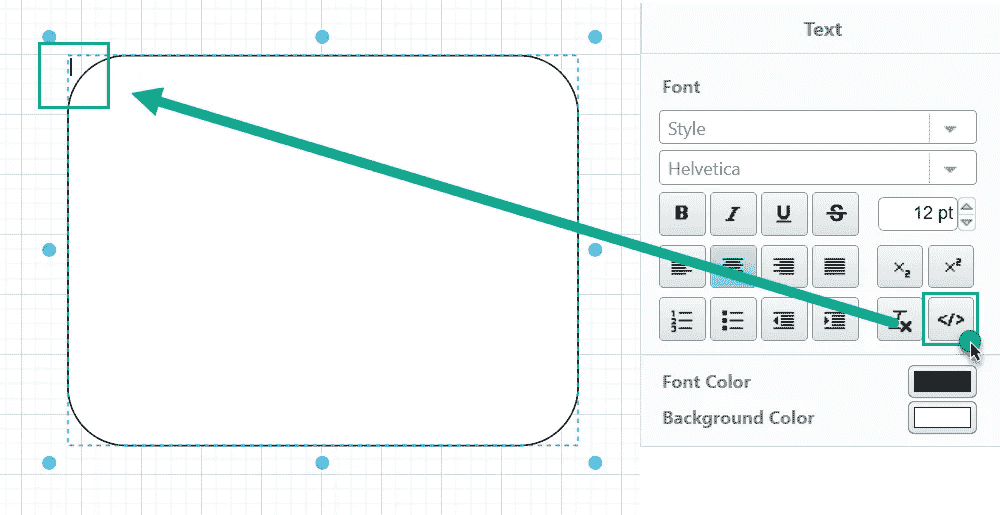
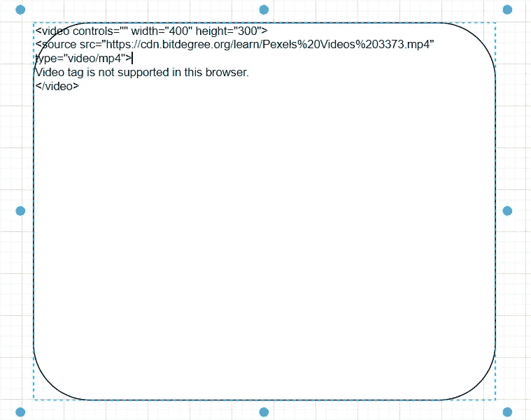
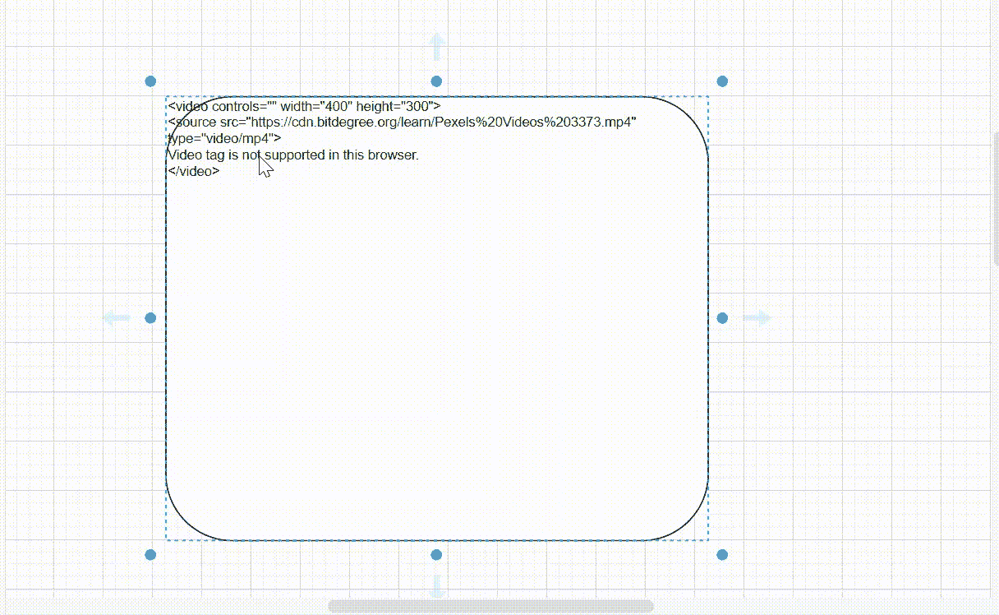

# 如何使用 Draw.io 在技术图中插入视频内容

> 原文：<https://betterprogramming.pub/videos-in-draw-io-diagrams-f1c9e0dd63b5>

## 创建更多说明性技术博客内容的技巧


通常，[draw . io](https://app.diagrams.net/)([https://app.diagrams.net/](https://app.diagrams.net/))图示意性地描绘流程和用户场景。然而，有时，用用户界面中的实际案例来说明模式可能会有所帮助。

例如，图表解释了用户在网站上创建个人资料的步骤。创建插入到图表中的轮廓的用户体验的记录确保了对示意过程的更好理解。

在本文中，我们将研究一种在 draw.io 中将视频内容插入图表的方法。

# 如何将视频插入 draw.io 图

1.  插入一个将容纳视频内容的元素(例如，圆角矩形)并双击它。在元素内部，**文本光标**出现，并且在右侧菜单中，**文本**面板出现:



2.在**文本**面板中，点击**按钮< / >。**此时，文本光标从元素的中心移动到其左上角:



3.将以下代码粘贴到文本光标所在的位置:

```
<video controls=”” width=”400" height=”300">
<source src=”{link_to_video}.{mp4/odd}" type=”video/{format}">
Video tag is not supported in this browser.
</video>
```

在哪里

*   `{link_to_video}` —视频的完整网络路径，包括其名称和格式；
*   `{format}`—视频的一种格式(例如，. mp4 或。奇数)。

例如

```
<video controls=”” width=”400" height=”300">
<source src=”https://cdn.bitdegree.org/learn/Pexels%20Videos%203373.mp4" type=”video/mp4">
Video tag is not supported in this browser.
</video>
```



❗ *如果你复制并粘贴代码，确保其中没有多余的符号。此外，在英文版式中重新键入所有引号。*

4.在元素外部单击以显示视频控件:



# 用于从 Google Drive 插入视频的代码

对于来自 Google Drive 的视频，draw.io 元素中的代码略有不同:

```
<video controls="" width="400" height="300">

<source src="https://drive.google.com/uc?export=download&id=1N-ccc9oBZwPBMW5prrSxd7QjyO2O7Dsp" type="video/mp4">

Video tag is not supported in this browser.

</video>
```

在标签中:

*   ["https://drive.google.com/uc？export=download & id=](https://drive.google.com/uc?export=download&id=) " —这个部分告诉 draw.io 应该从 Google Drive 下载一个特定的视频，以便在元素中显示它
*   “1N-b 5s 9 obzwpbmw 5 PRRS xd 7 qjyo 2 o 7 DSP”——这部分是你的视频的标识符。

要获取视频的标识符，请在 Google Drive 中获取视频的共享链接:

```
https://drive.google.com/file/d/1N-ccc9oBZwPBMW5prrSxd7QjyO2O7Dsp/view?usp=sharing
```

*   1N-CCC 9 obzwpbmw 5 PRRS xd 7 qjyo 2 o 7 DSP—这是视频的 id

## **注释**

*   您只能插入存储在 web 文件夹中的视频；您不能插入来自 youtube 或其他视频门户的视频。
*   并非所有浏览器都支持从 draw.io 图进行视频翻译
*   并非所有视频格式都受支持。

遗憾的是，我无法从 draw.io 图表中与视频翻译兼容的浏览器和格式的完整列表，但最常见的. mp4 格式适用于 Chrome、Mozilla 和 Safari。

为了避免视频内容在图表中过载，您可以将视频放在单独的层上，只有当读者单击相应的按钮时才显示它们。

[本文](https://rinagreen090296.medium.com/creating-story-telling-interactive-diagrams-with-draw-io-f7e57ae32621)解释了如何使用多层图表。