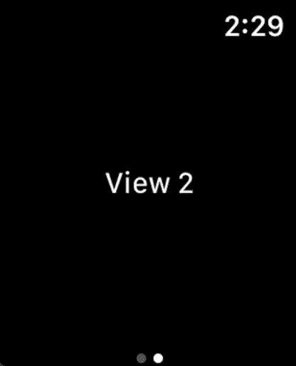

# 在 SwiftUI 中查看布局和演示

> 原文：<https://betterprogramming.pub/view-layout-and-presentation-in-swiftui-705b7d81f03>

## 您期待已久的完整 SwiftUI 2 文档

## 针对 iOS 14、iPadOS 14、WatchOS 7 和 MacOS Big Sur 进行了更新


图片由 [PIRO4D](https://pixabay.com/users/PIRO4D-2707530/?utm_source=link-attribution&utm_medium=referral&utm_campaign=image&utm_content=4251894) 来自 [Pixabay](https://pixabay.com/?utm_source=link-attribution&utm_medium=referral&utm_campaign=image&utm_content=4251894)

2020 年初，我写了一篇名为“[您一直在等待的完整 SwiftUI 文档](https://medium.com/better-programming/the-complete-swiftui-documentation-youve-been-waiting-for-fdfe7241add9)”的中篇文章。

这是我分享我在试图填补苹果公司提供的不充分文档所留下的空白时所学到的东西的方式。

虽然我的文章似乎帮助了很多人，但我也晚了八个月才写完。

现在苹果 2020 年开发者大会已经结束，SwiftUI 被赋予了一些新的功能，所以希望这次更新能让我的文档比以往任何时候都更有帮助。这将作为一个系列发布，每篇文章一章。这些章节的名称与苹果 SwiftUI 文档中的章节名称相对应。它们可以按任何顺序阅读，所以我没有给它们编号。

正如我所承诺的，当前章节没有“视图和控件”那么长，比我的原始文档还要长！

*   **查看布局和演示文稿**
*   [视图和控件](https://medium.com/better-programming/swiftui-views-and-controls-the-swift-2-documentation-youve-been-waiting-for-dfa32cba24f3)
*   应用程序结构和行为
*   绘画和动画
*   框架集成
*   状态和数据流
*   手势
*   试映

如果您发现任何错误或您认为我应该更详细介绍的主题，我鼓励您在下面的回复中与我联系。

```
[LazyHStack and LazyVStack (New in 2.0)](#a04a)
[LazyVGrid (New in 2.0)](#b5f7)
[LazyHGrid (New in 2.0)](#d594)
[GridItem (New in 2.0)](#9cac)
[List (Updated in 2.0)](#51f2)
[ForEach & DynamicViewContent (Updated in 2.0)](#c1f5)
[ScrollViewReader (New in 2.0)](#6e57)
[ScrollViewProxy (New in 2.0)](#1ae9)
[Group (Updated in 2.0)](#7373)
[Groupbox (Updated), OutlineGroup (NEW), & DisclosureGroup (NEW)](#6348)
[NavigationView (Updated in 2.0)](#3320)
[TabView (Updated in 2.0)](#5eb5)
```

# lazy stack 和 lazyv stack(2.0 中的新功能)

[*回目录↑*](#6117)

在 SwiftUI 的第一次迭代中，有一点非常模糊，那就是`List`的行是否排队。

当您滚动`[UITableView](https://developer.apple.com/documentation/uikit/uitableview)`时，离开屏幕底部或顶部的单元格被添加到一个队列中，这意味着表格中的每个单元格不必一次存储在内存中。当一个单元格将要被滚动到视图中时，一个类似于`[func dequeueReusableCell(withIdentifier: String) -> UITableViewCell?](https://developer.apple.com/documentation/uikit/uitableview/1614891-dequeuereusablecell)`的方法被调用。信元被认为是可重用的，因为它们可以被销毁和重新创建，将它们从队列中移除被称为*出列*。

总之，事实证明`[List](https://stackoverflow.com/a/56656890)` [确实重用了细胞](https://stackoverflow.com/a/56656890)。但是如果你想用一个`ScrollView`来代替，当它们离开屏幕的顶部或底部时，你会立刻回到所有的加载，而不是排队。你可能不介意使用`List`而不是垂直的`ScrollView`，但是如果你想水平滚动会发生什么呢？

如果你尝试一下，你会注意到`List`没有水平滚动的选项。

在我的例子中，我们有一个名为`WhatJustHappenedView`的函数，它打印最近的排队事件。如果栈不是偷懒的话，里面的每个`Text`细胞一开始都会出现一次，排队的时候就再也不会消失了。

相反，我们看到的事件证明我们的内存是动态分配的，而不是一次性分配的。

# lazy vgrid(2.0 中的新功能)

[*回目录↑*](#6117)

您可以将上述`LazyVStack`和`LazyHStack`部分的相同逻辑应用于网格。如果我们想在 SwiftUI 中以行和列的形式显示视图，该怎么办？当然，在最初的版本中，除了手动编写自己的逻辑之外，没有别的办法。`LazyVGrid`与 UIKit 的`UICollectionView`在视觉上有很多相似之处，但实现起来要容易得多。您可以使用一组`GridItem`对象构建这些网格，这些对象可以作为布局中的行。

为了更容易地看到改变网格属性的效果，我创建了一种方便的方法来布置六个步进器，称为[步进器视图](https://gist.github.com/sturdysturge/eed04e007cef3222729663d9eed0d7d6)。我将提供使用`.fixed`、`.adaptive`和`.relative`调整类型进行调整的示例。这些都是枚举`GridItem.Size`的情况，而`.fixed`只需要一个`CGFloat`值，其他两个需要最小和最大值，以便系统从中选择一个值。

首先我们有`.fixed`，它给`LazyVGrid`的列一个明确的宽度:

现在我们有了`.flexible`，它允许列增长到它们可用的最大宽度。这类似于在任何其他视图上使用`.frame(maxWidth: .infinity)`修改器。尽管列可以根据周围列的要求而增长或收缩，但它们不能改变一行中的列数。这意味着我们最终仍会得到适当数量的行，如果您滚动到底部，会看到底部的行与前面所有的行具有相同的数量。

`GridItem.Size.adaptive`在一个简单的方面不同于`.flexible`。虽然这些单元格仍有最小和最大宽度，但它们不会阻止下面一行的单元格向上移动以占据可用空间。当然，这是假设可用空间大于单元可以占据的最小宽度。当滚动到底部时，可以最清楚地观察到这种差异，因为很容易出现最后一行比前面几行包含的单元格少的情况。

这是因为我们使用`columns * rows`计算的单元格数量不再是单元格的准确表示，因为每行的项目比之前预期的要多。

# lazy grid(2.0 中的新功能)

[*回目录↑*](#6117)

像上面的`LazyVGrid`一样，这里的例子需要控件，这样你可以在后面的例子中使用它们。所有的例子都使用了六种不同的步进器，所以我提供了[步进器视图](https://gist.github.com/sturdysturge/eed04e007cef3222729663d9eed0d7d6)，它允许你为每个例子布置它们。

现在我们有了`.flexible`，它允许行增长到它们可用的最大高度。这类似于在任何其他视图上使用`.frame(maxHeight: .infinity)`修改器。尽管列可以根据周围列的要求而增长或收缩，但它们不能改变列中的行数。这意味着我们最终仍会得到适当数量的列，如果您向右滚动，就会看到最后一列与前面所有列的数量相同。

`GridItem.Size.adaptive`在一个简单的方面不同于`.flexible`。虽然这些单元格仍然有最小和最大高度，但它们不会阻止右边列中的单元格向左移动以占据可用空间。当然，这是假设可用空间大于单元格可以占据的最小高度。当向右滚动时，可以最清楚地观察到这里的差异，因为很容易实现最后一列比前面的列具有更少的单元格的情况。

这是因为我们使用`columns * rows`计算的单元格数量不再是单元格的准确表示，因为每列的项目比之前预期的要多。

# grid item(2.0 中的新功能)

[*回目录↑*](#6117)

在上面的`LazyHGrid`和`LazyVGrid`中，你可以看到一些很好的`GridItem`的例子。

必须给定一个尺寸，但是间距和对齐是可选的。

`GridItem.Size`枚举有三种情况:

*   `[case adaptive(minimum: CGFloat, maximum: CGFloat)](https://developer.apple.com/documentation/swiftui/griditem/size-swift.enum/adaptive(minimum:maximum:))`
*   `[case fixed(CGFloat)](https://developer.apple.com/documentation/swiftui/griditem/size-swift.enum/fixed(_:))`
*   `[case flexible(minimum: CGFloat, maximum: CGFloat)](https://developer.apple.com/documentation/swiftui/griditem/size-swift.enum/flexible(minimum:maximum:))`

请记住，如果没有给定 spacing 属性的值，那么如果没有给定足够的空间，您的列(在`LazyVGrid`中)或行(在`LazyHGrid`中)可能会相互接触。

假设给定的尺寸不是`.fixed`类型，明确的间距可以让你更好地控制它们如何适应。

# 列表(在 2.0 中更新)

[*回目录↑*](#6117)

垂直的`ScrollView`只有在屏幕上可见的时候才允许延迟加载内容，在 2.0 中有一些新的初始化器。

*   `[init<Data, RowContent>(Data, children: KeyPath<Data.Element, Data?>, selection: Binding<SelectionValue?>?, rowContent: (Data.Element) -> RowContent)](https://developer.apple.com/documentation/swiftui/list/init(_:children:selection:rowcontent:)-2pt7r?changes=latest_minor)`
*   `[init<Data, RowContent>(Data, children: KeyPath<Data.Element, Data?>, selection: Binding<Set<SelectionValue>>?, rowContent: (Data.Element) -> RowContent)](https://developer.apple.com/documentation/swiftui/list/init(_:children:selection:rowcontent:)-qm74?changes=latest_minor)`
*   `[init<Data, ID, RowContent>(Data, id: KeyPath<Data.Element, ID>, children: KeyPath<Data.Element, Data?>, selection: Binding<Set<SelectionValue>>?, rowContent: (Data.Element) -> RowContent)](https://developer.apple.com/documentation/swiftui/list/init(_:id:children:selection:rowcontent:)-234ke?changes=latest_minor)`
*   `[init<Data, ID, RowContent>(Data, id: KeyPath<Data.Element, ID>, children: KeyPath<Data.Element, Data?>, selection: Binding<SelectionValue?>?, rowContent: (Data.Element) -> RowContent)](https://developer.apple.com/documentation/swiftui/list/init(_:id:children:selection:rowcontent:)-5ynav?changes=latest_minor)`

这些初始化器都有一个共同点。SwiftUI 推出时都有，但只在 tvOS 和 watchOS 上有。

所有这些初始化程序现在都添加到了 iOS、macOS 和 Mac Catalyst 中。

# ForEach & DynamicViewContent(在 2.0 中更新)

[*回目录↑*](#6117)

在本文档的“[视图和控件](https://medium.com/better-programming/swiftui-views-and-controls-the-swift-2-documentation-youve-been-waiting-for-dfa32cba24f3)”一章中，我谈到了新的`UTType`结构，它取代了一个相当混乱的方法。我们不能创建表示数据类型的对象，而是不得不求助于传递表示数据类型的字符串数组。

这在`ForEach`的初始化器中并不明显，但它符合`DynamicViewContent`协议。当泛型`Content`符合`View`时就会发生这种情况，令人困惑的是`ForEach`结构本身并不需要这种情况。每个初始化器都存在于一个扩展中，这个扩展要求`Content`符合`View`，所以不要认为你可以将`ForEach`用于任何其他目的。

`DynamicViewContent`需要一个`Collection`数据，其具体类型由给定的数据推断。你会问，它是做什么的。它提供了像`onDelete`这样的方法，当用户删除了`List`中的一行时，您可以运行闭包。虽然`onDelete`自去年以来没有变化，但`onInsert`却发生了变化。当使用`onDrag`修改器拖动项目时会出现这种情况，因为`List`使用`onInsert`而不是更传统的`onDrop`修改器。

关于拖放的更多信息包含在“视图和控件”一章中，所以要指出的主要内容是,`onInsert`现在采用了一个`UTType`结构，而不是以前表示`UTType`的字符串数组。这允许我们指定哪种数据可以拖放到`List`中，否则我们不知道是否可以将该数据添加到底层的`Collection`中。

但这还不是改变的全部。

如果你查看`ForEach`的新初始化器，你可能会注意到一些不同:

```
init(_ data: Data, id: KeyPath<Data.Element, ID>, @ViewBuilder content: @escaping (Data.Element) -> Content)
```

像一个`View`结构的`body: some View`属性一样，初始化器现在接受一个`@ViewBuilder`闭包。为什么这很重要？这实际上就像在 SwiftUI 的第一次迭代中将我们的布局包装在一个`Group`中。我们这样做是因为我们希望能够返回一个符合视图协议的具体类型，而在闭包中添加多个值使得这样做变得不可能。

现在你可以在一个`ForEach`中添加任何你想要的东西，只要它的大小少于十个视图。

很明显，这排除了底层数据，因此，举例来说，您可能有一个包含 10 个视图的`List`行，但是该行是从数组或其他数据结构中获取数据的 100 行或更多行中的一行。

`ForEach`的强大之处在于能够有效地处理尽可能多的项目，就像它们是你的层次结构中的一个视图一样。

# **ScrollViewReader(2.0 中的新功能)**

[*回目录↑*](#6117)

现有的`GeometryReader`和新的`ScrollViewReader`有一些相似之处。

它们都是传递单个参数的闭包。

一个`GeometryReader`传递一个`GeometryProxy`，它有两个属性:`safeAreaInsets: EdgeInsets`和`size: CGSize`。这个代理附带了一个方法，该方法将为框架返回一个`CGRect`，但是它需要一个坐标空间来计算这个框架。最明显的一个是`.global`，因为它给出了一个相对于整个屏幕的帧。但是您可以使用您指定的名称来[创建自定义的](https://www.hackingwithswift.com/books/ios-swiftui/understanding-frames-and-coordinates-inside-geometryreader) `[coordinateSpace](https://www.hackingwithswift.com/books/ios-swiftui/understanding-frames-and-coordinates-inside-geometryreader)` [，允许您获得相对于层次中另一个视图的帧。](https://www.hackingwithswift.com/books/ios-swiftui/understanding-frames-and-coordinates-inside-geometryreader)

`ScrollViewProxy`没有属性，但是它有一个执行动作而不是返回值的方法。当我们为`ScrollView`中的视图指定一个`id`时，我们可以提供任何`Hashable`类型。这样我们就可以告诉 Swift 我们的类型的哪一部分是唯一的，这样它就可以区分该类型的实例。

在我的例子中，我只是使用我的`List`中每一行的索引作为 ID。

许多提供的 Swift 类型已经符合 Hashable，所以这比自己创建一个 Hashable 类型更容易。如果你感兴趣的话，这里有[如何遵守哈希协议](https://www.hackingwithswift.com/example-code/language/how-to-conform-to-the-hashable-protocol)，你会发现这根本不需要太多努力。现在我可以识别我的`List`的行了，我提供了一个`TextField`可以输入一个数字，还有一个`Button`会自动将`ScrollView`发送到那个行。

我使用了一个`NumberFormatter`，它使用了一个叫做`spellOut`的`numberStyle`，这使得我的例子更加难以使用。这需要你将数字拼写成小写单词，在像三十四这样的数字之间加一个连字符，省略像*和*这样的单词。玩一玩它，如果你厌倦了，你可以随时把`NumberFormatter`换成更明智的。

请注意，滚动是动画的，但是在`List`的底部有一个按钮，上面写着“返回顶部”不像顶部的`GoToButton`将它的`proxy.scrollTo(_:)`放在一个`withAnimation`块中，这个`Button`没有添加一个明确的动画。这是`scrollTo(_:)`动作的默认行为，即时滚动，没有任何动画。如果您希望动画显示对滚动位置的任何更改，请记住这一点。

注意我是如何将`ScrollViewProxy`作为参数传递给`GoToButton`的，这样就可以在视图之间传递改变滚动位置的能力。

# ScrollViewProxy(2.0 中的新功能)

[*回目录↑*](#6117)

参见上面的`ScrollViewReader`，它将一个`ScrollViewProxy`作为参数传递给它的闭包，就像`GeometryReader`传递一个`GeometryProxy`一样。

# 组(在 2.0 中更新)

[*回目录↑*](#6117)

现在更多的结构采用了`@ViewBuilder`闭包，因此返回一个包含多达 10 个符合视图的子元素的`TupleView`，您可能会认为`Group`不再有什么意义。

毕竟，苹果公司称之为“分组视图内容的启示”在当时几乎没有其他作用。

但是现在我们有了新的可能性，因为我们现在也可以对符合这些协议的任何内容进行分组:

*   `[Scene](https://developer.apple.com/documentation/swiftui/scene)`
*   `[Widget](https://developer.apple.com/documentation/swiftui/scene)`
*   `[Commands](https://developer.apple.com/documentation/swiftui/commands)`
*   `[ToolbarContent](https://developer.apple.com/documentation/swiftui/toolbarcontent)`

我将在后面的章节“应用程序结构和行为”中更详细地介绍这些内容，但重要的是要知道`Group`有新的功能。

与`@ViewBuilder`允许`Group`组合多达 10 个视图类似，`@_WidgetBuilder`允许组合多达 10 个小部件。当 macOS 有命令显示在屏幕顶部的菜单中时，使用`@CommandBuilder`最多可以添加十个命令。

构建工具栏？

你猜对了:`@ToolbarBuilder`最多允许十个孩子。

既然 SwiftUI 应用程序可以在没有`AppDelegate`的情况下创建，我们使用一个符合`[App](https://developer.apple.com/documentation/swiftui/app)`协议的结构，这反过来需要一个符合`[Scene](https://developer.apple.com/documentation/swiftui/scene)`协议的主体。

当在一个`Group`中提供多个场景时，`@SceneBuilder`允许我们添加多达十个孩子。

这与`WindowGroup`不同，后者专门提供了视图，这些视图将被给予相同结构但独立的窗口。因为`WindowGroup`本身符合`Scene`协议，所以它可以位于`App`结构主体内部的层次结构的顶端。如果一个`Group`只有符合`View`协议的子节点，它就不能以同样的方式使用。

换句话说，符合`App`的结构可以包含:

*   一个由十个孩子组成的`Group`
*   一个由多达十个`Scene`符合标准的孩子组成的小组
*   一个`WindowGroup`由多达十个符合组或其他视图的孩子组成

如果这令人困惑，不要担心。在“应用程序结构和行为”一章中会有更详细的介绍。

# Groupbox，OutlineGroup，& DisclosureGroup

这三个中，`GroupBox`是唯一一个在 2.0 中不新的。

当`Groupbox`在 SwiftUI 最初发布的时候是可用的，它只在 macOS 上可用，主要的变化是它现在是跨平台的。这是用可选标签将内容分组的简单方法。`OutlineGroup`提供显示原本隐藏的项目附加信息的能力。`DisclosureGroup`有类似的用途，增加了一个`Binding<Bool>`，可以控制是否显示附加信息。

你可以在 Anupam Chugh 的“ [SwiftUI 的 GroupBox、OutlineGroup 和 iOS 14](https://medium.com/better-programming/swiftuis-groupbox-outlinegroup-and-disclosuregroup-in-ios-14-cf9fb127cdc0) 中的 DisclosureGroup”中找到这样的例子，以及新的`OutlineGroup`和`DisclosureGroup`。

# 导航视图(在 2.0 中更新)

[*回目录↑*](#6117)

我以为这在 watchOS 上已经有了，因为我之前发布了一个 watchOS 应用程序，可以让你从`List`中选择狗的照片。但事实证明，尽管在那个应用程序中使用了一个`NavigationLink`，我并没有把它嵌入到一个`NavigationView`中。这将为 iOS 和 macOS 编译，但由于缺少`NavigationView`，它不允许导航。大概是 watchOS 总是基于堆叠导航的工作方式使得这没有必要，但其他平台并不期望会是这种情况。

WatchOS 现在有能力使用`[.navigationViewStyle](https://developer.apple.com/documentation/swiftui/text/navigationviewstyle(_:))`，但似乎唯一提供的价值是`[StackNavigationViewStyle](https://developer.apple.com/documentation/swiftui/stacknavigationviewstyle)`。

任何平台上唯一的另一个选项是`[DoubleColumnNavigationViewStyle](https://developer.apple.com/documentation/swiftui/doublecolumnnavigationviewstyle)`，你可以打赌这不会很快出现在 WatchOS 上！

# **TabView(在 2.0 中更新)**

[*回目录↑*](#6117)

我在“[视图和控件](https://medium.com/better-programming/swiftui-views-and-controls-the-swift-2-documentation-youve-been-waiting-for-dfa32cba24f3)”一章中浏览新的标准视图修饰符时已经提到了这一点。那是在我讨论`.tabItem`修改器的时候，修改的方式和`TabView`一样。

为了重述我当时所说的，我将在顶部添加了`@available`属性的苹果的例子。

注意到什么了吗？

对于 watchOS 来说，`TabView`以及允许您在标签栏上创建代表该页面的图标的修饰符`.tabItem`都是新的。虽然它去年在 Mac、iOS、iPadOS 和 tvOS 上可用，但它今年才刚刚出现在手表上。你可能会问，它可能采取什么形式？它类似于 UIKit 的`[UIPageViewController](https://developer.apple.com/documentation/uikit/uipageviewcontroller)`,每一页都要求你从一页水平滑动到另一页。虽然`.tabItem`修饰符存在，但是苹果示例中的`Text`和`Image`都是不可见的。



相反，我们得到的是点，这与`UIPageViewController`利用`[UIPageControl](https://developer.apple.com/documentation/uikit/uipagecontrol)`的方式非常相似，苹果将其描述为“一系列水平的点，每个点对应于应用程序文档或其他数据模型实体中的一个页面。”

# 后续步骤

在我写这篇文章的时候，SwiftUI 才一岁，而且已经有了大量的资源。如果没有以下网站，我的写作是不可能的:

*   [LOSTMOA 博客](https://lostmoa.com/blog)
*   [利用 Swift 进行黑客攻击](https://www.hackingwithswift.com/)
*   [Swift UI 实验室](https://swiftui-lab.com/)
*   [带 Majid 的 Swift】](https://swiftwithmajid.com/)
*   [WWDC by Sundell](https://wwdcbysundell.com/)
*   [斯威夫特 by Sundell](https://www.swiftbysundell.com/)

如果你有很棒的资源可以与社区分享，请告诉我，我会很乐意把它添加到这个列表中。

正如我在文章开头所说的，如果你对某个主题有更详细的要求，或者如果你认为我犯了一个错误，请在下面的回复中告诉我。

感谢阅读！