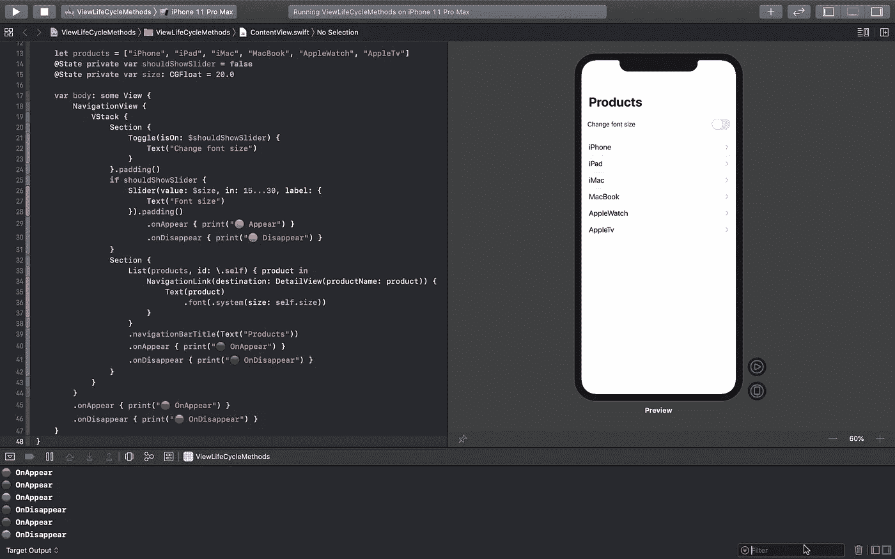

# SwiftUI 中的生命周期方法

> 原文：<https://betterprogramming.pub/view-life-cycle-methods-in-swiftui-b7fa9f0e8dfb>

## 丢失的手册

UIKit 开发人员可能听说过术语*视图生命周期*方法。好吧，如果你是 UIKit 开发人员，在我们深入主题之前，让我问几个问题。

你能在不接触 Xcode 的情况下列出 ViewController 中所有的视图循环方法吗？

另外，你能以正确的顺序列出在两个 ViewControllers 之间导航时的视图循环方法吗？😅

好的，如果你答对了上面的问题，这对你来说就很容易了。在 iPad 上以 PageSheet 或 FormSheet 的形式呈现 ViewController 时，您能列举出同样的事情吗？

有点复杂，对！也许至少对我来说是这样🤯

我们在 ViewControllers 中有许多视图生命周期方法，它们将根据我们的设计以不同的顺序被调用。当我们在单个屏幕上使用 **ContainerView** 定制 UI 时，这可能会更加复杂。

在 SwiftUI 中很简单。

# SwiftUI 中的生命周期方法

据我所知，苹果文档中有 ***没有官方的文字*** ，比如 SwiftUI 中视图的 View life 方法，但是我们确实有一些东西可以和 UIKit 生命周期方法相比。

好的，让我们看看 SwiftUI 中有哪些等价的东西，以及它有多简单。通常，每当视图在 UIKit 中出现或消失时，我们都会使用视图生命周期方法来做一些事情。*例如:API 命中或清除数据。*

在 SwiftUI 中，没有*视图控制器*，一切都是视图。*纯观点*。当用户打开你的 app 时，你会初始化一个视图，并显示在屏幕中；屏幕之间的导航由名为 ***NavigationView 的视图执行；*** 选项卡功能由一个名为**选项卡视图**等的视图管理

与 UIKit 不同，我们在 SwiftUI 中只有两个简单的实例方法，可以作为视图生命周期方法。它们是:

`.onAppear()
.onDisappear()`

内容视图. swift

请检查上述`ContentView.swift` 文件中的代码并继续。我为不同的视图添加了`onAppear()`和`onDisappear()`，并在控制台中添加了不同的表情符号进行视觉识别。

[Github 回购链接](https://github.com/karthironald/ViewLifeCycleMethods)用于工作演示。

🔴=导航视图
🟢 =列表视图
🟠 =滑动视图

# **。onAppear():**

当视图出现在屏幕上时，触发`.onAppea()`。

我们可以将这种方法与 UIKit 中的`viewDidAppear()`进行对比。每当视图出现时，我们可以使用这个方法来执行一个动作。从本地或远程数据库获取数据。

在`ContentView.swift`文件中有多个视图，但是只关注我添加了`onAppear()`和`onDisappear()`方法的视图。

我们有逻辑来展示三观(🔴🟢和🟠)在一个屏幕和两个视图中(🔴& 🟢)会在用户导航到屏幕时立即出现。所以，这两个可见视图中的`onAppear()`将立即按照`parent(🔴)` 到`children(🟢)`的顺序被调用。

3 号 view's(🟠) `onAppear()` 将仅在屏幕上可见时调用。我只在用户打开开关时显示了滑块。当开关关闭时，滑块在屏幕上不可见，因此它的`onAppear()`不会被调用。

如果我们连续打开和关闭切换开关，滑块 view's(🟠) `onAppear()`和`onDisappear()`将被多次调用。

# **。onDisappear():**

当视图从屏幕上消失时，触发`.onDisappear()`。

我们可以将这种方法与 UIKit 中的`viewDidDisappear()`进行对比。每当一个视图消失时，我们可以使用这个事件来执行一个动作。*例如:清除数据。*

我添加了一个演示，使用`NavigationView` 和`TabView` **从一个视图导航到另一个视图。**大多数子视图的`onAppear()`和`onDisappear()`在`NavigationView`和`TabView` 导航中的调用顺序相同。

但是，导航到 DetailsView 时不会调用 NavigationView 的`onDisappear()`，因为 NavigationView 仍然出现在 DetailsView 中。

# 推送视图:

当你使用导航视图推送到另一个视图时，目标视图的`onAppear()` 将被首先调用，然后源视图的`onDisappear()`将被调用。

# 展示观点:

当您使用工作表呈现另一个视图时，目标视图的`onAppear()` 将被调用，而源视图的`onDisappear()`将不会被调用，因为您在所呈现视图的背景中有源视图。

# 结论:

通过使用视图中的`onAppear()`和`onDisappear()`实例方法，我们可以实现视图在屏幕上出现或消失的需要。

当你在屏幕上有多个嵌套视图时，我们需要找到一个完美的视图来添加`onAppear()`和`onDisappear()` 动作来运行你的自定义逻辑。

SwiftUI 是一个比 UIKit 更有趣、超级容易开发 app 的框架。一有时间就玩玩。

[演示项目的 Github 回购链接](https://github.com/karthironald/ViewLifeCycleMethods)。

谢谢👨🏻‍💻