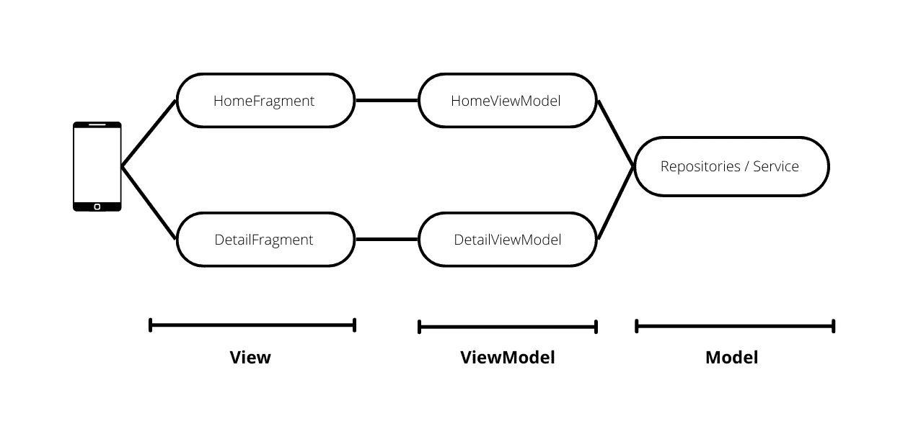
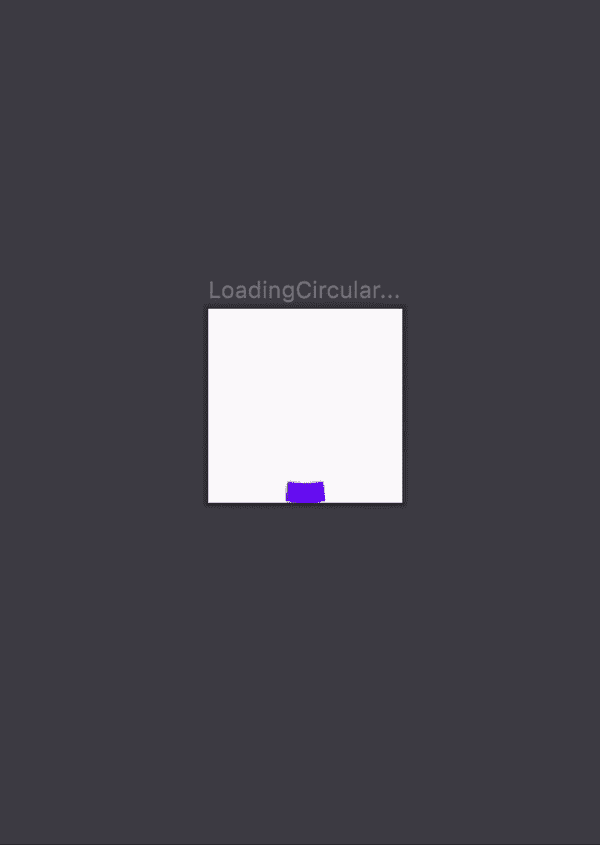
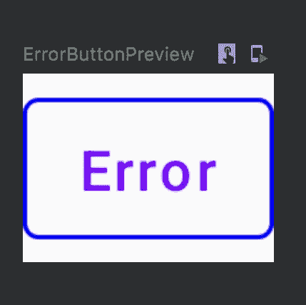

# 要在 Jetpack 撰写中查看的视图模型

> 原文：<https://betterprogramming.pub/viewmodel-to-view-in-jetpack-compose-7c7183b54fb5>

## 了解如何在 Jetpack Compose 中将 ViewModel 应用于 MVVM 架构视图

斯蒂芬·弗兰克在 [Unsplash](https://unsplash.com?utm_source=medium&utm_medium=referral) 上拍摄的照片

您可以在下面找到以前关于 Jetpack Compose 的教程:

*   [通过构建应用程序一瞥 Jetpack Compose](/a-glimse-into-jetpack-compose-by-building-an-app-a7869723d4e8)
*   [在 Jetpack 组合中布局](/layouting-in-jetpack-compose-8c16e687bfe5)
*   [在 Jetpack 中导航构成](/navigation-routes-in-jetpack-compose-ce2e0337ed28)
*   [在 Jetpack Compose 中开始使用 MVVM](/mvvm-in-jetpack-compose-part-4-fe757a1a1b84)

在本文中，我们将学习在 Jetpack Compose 中从`ViewModel`部分到`View` 部分的实现。

从我的上一篇文章中，我们学习了如何通过创建`ViewModel`和`Model`部分在我们的应用程序中实现 MVVM。让我们想想如何将`ViewModel`连接到`View`部分。

> 我们建议屏幕级组件使用`ViewModel`实例来提供对业务逻辑的访问，并成为其 UI 状态的真实来源。您不应该将`ViewModel`实例传递给其他组件。

使用规则，我们必须将`ViewModel`传递给一个屏幕级的可组合组件。通常，屏幕级可组合组件由活动或片段组成。因此，这就是我们在应用程序中实现`ViewModel`到`View`的方式。

从上图来看，每个片段都有自己的`ViewModel`。打开`HomeFragment.kt`和`DetailFragment.kt`，按照以下代码操作:

现在`HomeFragment.kt`可以访问`HomeViewModel.kt`并且`DetailFragment.kt`可以访问`DetailViewModel.kt`，它们都使用来自 Jetpack Compose API 的`viewmodel()`。

我们将在`HomeFragment.kt`中开始处理`HomeViewModel.kt`。`HomeFragment.kt`有`HomeScreen.kt`显示由`Games.kt`列表组成的`PagingList`，

打开`HomeFragment.kt`，按照下面的代码操作:

现在`HomeScreen.kt`有了由`HomeViewModel.kt`正在检索的`Games.kt`列表组成的`PagingList`。

打开`HomeScreen.kt`，复制下面的代码:

上面的代码有几点我们需要知道:

*   `gamesList`是使用分页 Jetpack 组合 API 的`LazyPagingItems`的一部分。
*   如果`gamesList`是`null`，这意味着它没有数据供我们显示，所以我们将在那里停止这个过程。如果不是`null`，那么我们将继续该过程。
*   `PagingList` `Games.kt`会因为`Paging`特性而继续添加数据。自然地，`PagingList`的价值`itemCount`会继续增加。
*   每个`PagingList`都会在`ProductCard.kt`列表中显示给我们。但是我们需要将细节解析成`ProductCard.kt`。由于`ProductCard.kt`是一个可组合的函数，除了`HomeScreen.kt`之外，它还可以在其他类中使用，并且内容可能不局限于`Games.kt`的`PagingList`，我们必须通过给出`ProductCard.kt`的一般参数来解析细节。
*   `gamesList`有`CombinedLoadStates`，每个状态包含`LoadState`，如`loading`和`error`。如果`gamesList`处于`loading`状态，我们只需向用户显示加载视图，如果`gamesList`处于`error`状态，则显示错误视图。如果`gamesList`不在`loading`状态，也不在`error`状态，我们将显示`ProductCard.kt`列表。
*   `ProductCard.kt`在`onClickProduct`中具有特征，在`Games.kt`中正确的`Id`将被解析为`DetailFragment.kt`的参数。

现在在`ProductCard.kt`中，遵循下面的代码:

这样，我们只解析`ProductCard.kt`需要什么。`ProductCard.kt`可以在`HomeScreen.kt`之外的任何地方使用，因为它接受`name`、`imageUrl`、`releaseData`和`onClickProduct`。这些是通用参数，可用于除`Games.kt`之外的任何列表。我们将按计划将该参数应用于`ProductCard.kt`。

回到`HomeScreen.kt`。我们将看看这一部分:

如上所述，`gamesList`具有包含`loading`状态和`error`状态的`CombinedLoadStates`。`CombinedLoadStates`也有三种主要状态:`Append`、`Prepend`和`Refresh`。

*   `Append`:滚动到屏幕底部执行的`CombinedLoadStates`的一部分。通常，这包括将内容滚动到底部，因为内容会不断添加到屏幕底部。
*   `Prepend`:滚动到屏幕上方执行的`CombinedLoadStates`的一部分。通常，这包括向上滚动页面以刷新页面，从而用新内容替换内容。
*   `Refresh`:由`append`、`prepend`或手动刷新执行的`CombinedLoadStates`的一部分。手动意味着让最终用户执行刷新页面的操作，例如按下刷新按钮来刷新页面，以便用新内容替换内容。

在这种情况下，如果 API 响应返回一个错误，我们只想让`Append`和`Refresh`状态用于滚动页面行为和刷新按钮行为。

我们需要向最终用户展示当 API 响应返回加载或错误时会发生什么。为此，我们将创建一个用于加载和出错的可组合函数。

创建`LoadingCircular.kt`。当 API 响应返回 loading 时，这个可组合函数将用于向最终用户显示。

创建`ErrorButton.kt`。这个可组合的函数将用于在 API 响应返回错误时向最终用户显示。

我们有一个用于加载和错误行为的可组合函数。让我们将其应用于`refresh`和`append`状态。

当 API 返回加载时，每个状态都配有`LoadingCircular.kt`，当 API 返回错误时配有`ErrorButton.kt`。当我们点击错误按钮时，将调用来自`LazyPagingItems.kt`的重试功能，因为该代码位于`LazyVerticalGrid.kt`T25 中。

我们的`HomeFragment.kt`应该有这样的行为。

现在，我们将重点放在`DetailFragment.kt`上。我们想在`Games.kt`中显示我们根据`Id`选择的详细游戏。复制下面的代码:

在`DetailViewModel.kt`的帮助下，我们可以调用`getDetailGames`来检索`Games.kt`的细节——基于`Games.kt`中的`Id`——并根据来自 API 的响应向最终用户显示可组合的功能。

如果 API 返回成功,`Games.kt`的细节将被解析为`DetailScreen.kt`。打开`DetailScreen.kt`。复制下面的代码:

我将根据下面的代码给出一些信息:

*   如果从响应 API 解析出的`DetailScreen.kt`的`games`为空，我们将不执行`DetailScreen.kt`。
*   我们将定义名为`name`、`imageUrl`、`releaseDate`、`description`、`listImageCarousel`的变量，并将它们分配给各自的可组合函数。
*   我们将把`backgroundImage`和`backgroundImageAdditional`添加到一个列表中，该列表将被解析为`ProductImageCarousel.kt`
*   由于`Games.kt`中的描述将包含 HTML 格式，如`<b>`、`<u>`。我们将使用`HtmlCompact`将 HTML 格式转换成具有粗体、下划线或无样式的文本。

现在我们只需调整`ProductHeader.kt`和`ProductCarousel.kt`。

打开`ProductHeader.kt`并遵循以下代码:

我们将`ProductHeader.kt`作为一个可组合的函数，可以在除`DetailScreen.kt`之外的任何地方使用。这就是为什么参数名应该尽可能通用的原因。我们解析`name`、`imageUrl`和`releaseDate`，并在各自的可组合函数中解析它们。

打开`ProductImageCarousel.kt`。遵循以下代码:

我们将利用`listImage`中的所有字符串显示在`ProductImageCarousel.kt`上的图像列表中。注意，如果 URL 是错误的或无效的，图像将在`drawable resource`中显示`ic_launcher_foreground`。

现在我们的应用程序中应该有这样的行为。

# 结论

我们已经学习了很多关于用 MVVM 架构实现 Jetpack Compose 中的`ViewModel Section`到`View`部分。

这篇文章的所有代码可以在[这里](https://github.com/SkyairOnline/Jetpack-Compose)查看。

在下一篇文章中，我将讲述如何在我们的应用程序中使用注入。

你可以在这里看到我的下一篇文章

 [## 依赖注入 Jetpack 组成使用手柄

### 创建松散耦合的干净代码的技巧

better 编程. pub](/dependencies-injection-jetpack-compose-using-hilt-bd4f76ac6c22)