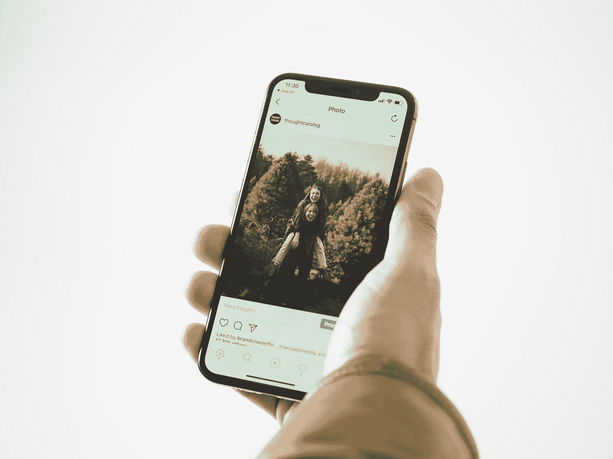
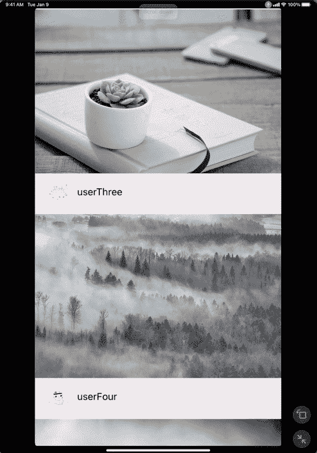
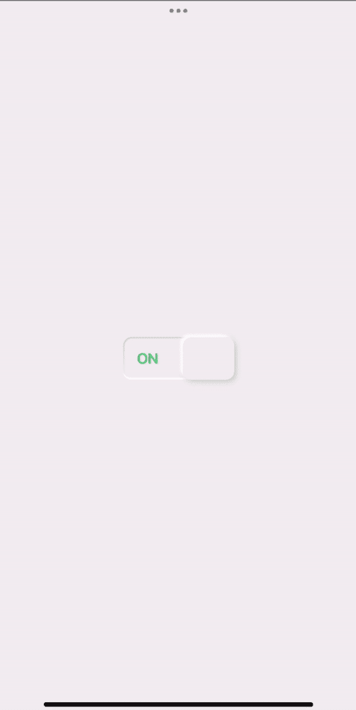
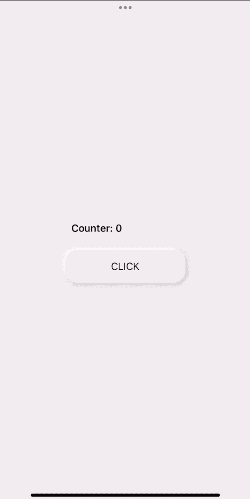

# SwiftUI 中的视图和语音控制可访问性

> 原文：<https://betterprogramming.pub/views-voice-control-accessibility-in-swiftui-520d212715b2>

## 通过滚动视图和自定义视图使用语音控制

照片由[思想目录](https://unsplash.com/@thoughtcatalog?utm_source=medium&utm_medium=referral)在 [Unsplash](https://unsplash.com?utm_source=medium&utm_medium=referral) 上拍摄

# 语音控制和滚动视图

为了展示如何为 scrollView 实现语音控制，我们将为媒体文章创建一个接口。让我们从下面的帖子的视图开始。

## 后视图

PostView 获取帖子并显示帖子的用户名、个人资料图片和图片帖子。检查下面的布局代码:

## 带有辅助功能操作的滚动视图

将`ScrollViewReader`嵌入`ScrollView`中。在 ForEach 中，遍历所有的帖子。给你的文章 id，以帮助我们使用 ScrollViewProxy 滚动到它们。使用`accessibilityScrollAction()`修改器检查用户想要滚动的方向，然后使用 ScrollViewReader 的代理滚动到下一篇或上一篇文章。

# 自定义视图和语音控制

## 自定义开关

在下面的文章中，我们制作了一个自定义的切换视图:

 [## SwiftUI 中的神经形态动画切换

### 如何创建可定制的切换视图

better 编程. pub](/neumorphic-animated-toggle-in-swiftui-af697ba17f5f) 

我们可以用一行代码轻松地为这个切换视图添加语音控制可访问性。在我们用作开关/切换的圆角矩形中，添加`AccessibilityLabel()`修改器。语音控制将监听标签“点击切换”来打开和关闭切换。检查下面的第 46 行:

## 自定义按钮

在下面的文章中，我们制作了一个自定义的按钮样式:

 [## SwiftUI 中的 Neumorphic 按钮样式

### 如何在 ButtonStyle 中动画显示按钮状态

better 编程. pub](/neumorphic-button-style-in-swiftui-f9a158bf4094) 

如果我们想让按钮的动画播放声音控制，我们需要做一些改变。首先，给我们的按钮添加`AccessibilityLabel()`和`AccessibilityAction()`修改器。`AccessibilityAction()`将覆盖我们按钮的动作。如果没有`AccessibilityAction()`修饰符，按钮的动作将在不播放按钮动画的情况下触发。

在`NeumorphicButtonStyle`中，添加一个布尔绑定变量。在 accessibility 操作中使用变量 change this 变量，并将其值传递给样式。使用 `OnChange()`修改器来播放我们的动画，并在 0.2 秒后反转，让按钮回到未按下的状态。参见下面的代码:

当用户说“点击”时，辅助功能动作和我们的动画将被触发

感谢您的阅读！