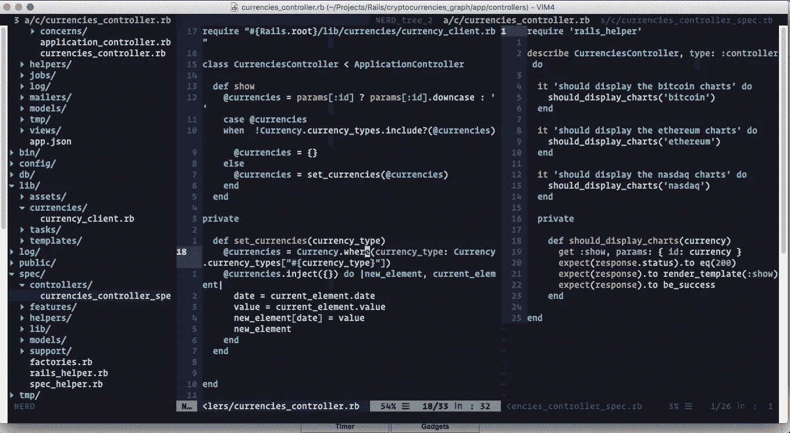
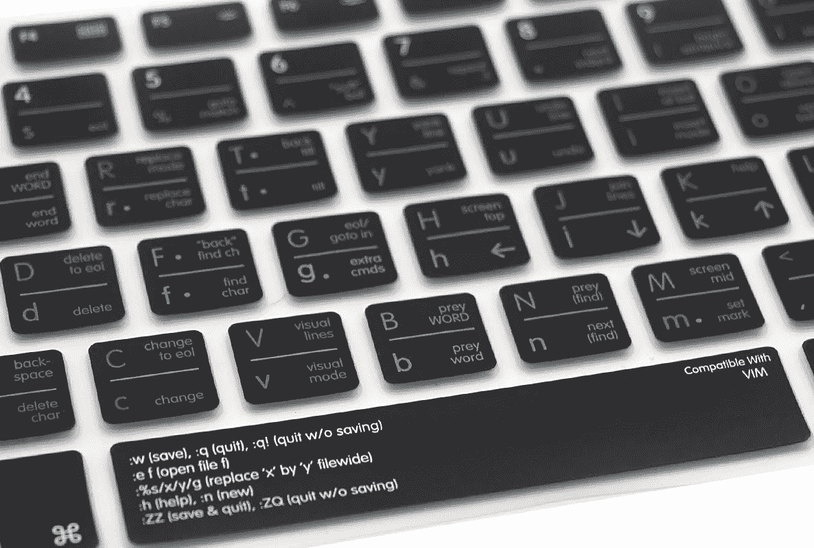
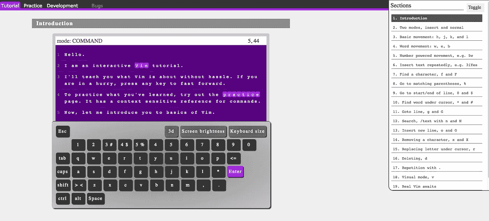
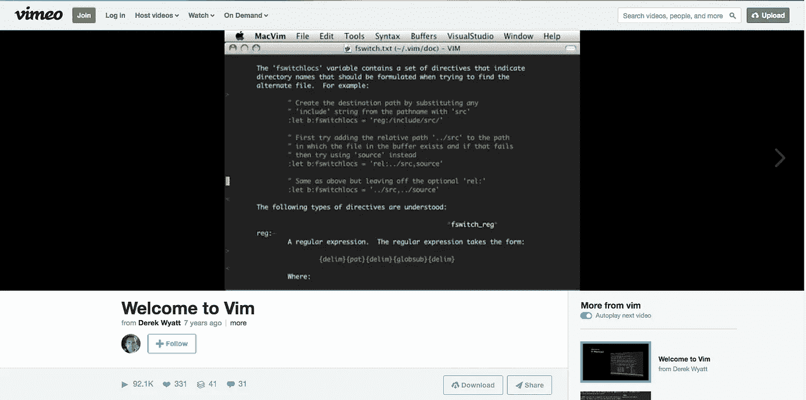
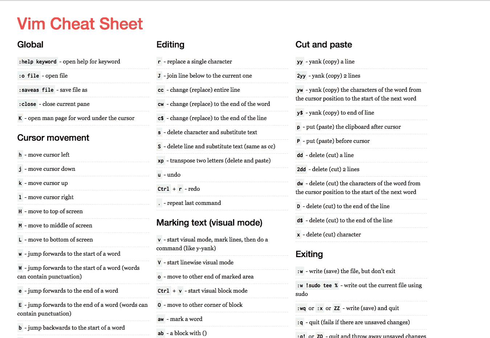

# 维姆没那么可怕

> 原文：<https://betterprogramming.pub/vim-isnt-that-scary-here-are-5-free-resources-you-can-use-to-learn-it-5bba109a7422>

## 这里有 5 个免费资源，你可以用来学习它

这是来自这个[开源](https://github.com/fatosmorina/cryptocurrencies_graphs)项目的视图，显示了比特币、以太坊和纳斯达克等加密货币的价值

未知的事物会令人恐惧，通常会引起反抗；Vim 也不例外。尽管事实上关于如何离开它的栈溢出问题已经被访问[超过一百万次](https://stackoverflow.blog/2017/05/23/stack-overflow-helping-one-million-developers-exit-vim/)，Vim 仍然是全世界开发者使用最多的[编辑器之一](https://insights.stackoverflow.com/survey/2019#technology-_-most-popular-development-environments)。

很多不使用 Vim 的人习惯了其他编辑器，认为不需要切换。他们不想离开他们的舒适区。他们认为 Vim 花费了太多的时间和精力去学习，而且它并没有带来多大的改变。

通过花时间阅读这篇文章，您已经表明您已经对 Vim 产生了某种兴趣。在我们看到一些使你更容易学习它的资源之前，让我们看看为什么我们应该考虑使用 1980 年代的文本编辑器。

# 为什么首先要学习 Vim？

图片:[http://amzn.to/2umsBaY](http://amzn.to/2umsBaY)

> "使用 Vim 是我在编程生涯中做出的最佳选择之一."— [卢卡斯·阿曼](https://stackoverflow.com/users/6726/lucas-oman)

可以理解的是，您可能需要一些学习 Vim 值得努力的理由。毕竟可能会影响到你的整个工作流程。也许学一些看起来不适合自己的东西，似乎不太合理。

几乎 thoughtbot 的所有人都在使用 Vim，这是湾区最受推荐的公司之一。这可能会让学习 it 看起来更有吸引力。还有很多其他原因值得一提。我们开始吧。

## 就像玩游戏一样

当你想开始玩一个游戏时，你不会因为它很难而退出。你会更有动力去玩它，因为它给你快乐。用 Vim 开发类似。当你开始看到它的快速和直观，你可能会开始享受这种体验。一旦你学会了一些更高级的命令来提高你的工作效率，你会对它更加着迷。

## 不需要鼠标

Vim 有许多在代码和文件中导航的快捷方式，这有助于完全摆脱使用鼠标。因此，您不需要将手指从键盘上拿开，这样可以加快编码速度。

换句话说，您可以像打字一样快地在 Vim 中编码。甚至“vim”这个词也意味着“能量”和“热情”

## 许多强大的命令

Vim 中的命令列表相当长。你不必学习每一个，你所要做的就是在开始时抓住几个，然后在进行中学习新的。在你上完第一课后的许多年里，你可能会在 Vim 中继续学习新的和重要的东西。

## 高度可定制

您可以根据自己的喜好使用和更改配置，还可以下载数百种配色方案。而且，还有大量的插件增强你的编辑器，让它像现代的 ide 一样强大。

## 它以文本为中心

现代的 ide 有很多内置特性。它们带有许多按钮和丰富的用户界面，使您更容易使用它们的所有功能。另一方面，Vim 通常以文本为中心。这使你更容易只关注代码，并去掉其他与代码无关的分散注意力的图标和选项。

## 每台 Linux 机器上都有

绝大多数服务器使用 Linux 作为操作系统。当您熟悉了 Vim 的基础知识后，您会对部署和服务器维护更加得心应手。

这些不是 Vim 值得您关注的唯一原因，但它们是一些最重要的原因。如果他们和你有共鸣，给学习 Vim 一个机会。

# 学习 Vim 的五个免费在线资源

这里有一些资源可以帮助你的学习之旅。不要以为一下子就能学会和 Vim 相关的所有东西。有些人已经使用 Vim 20 年了，他们仍然在学习新的东西。

## VimTutor

如果您使用的是基于 Unix 的机器，您可以在 shell 中键入“vimtutor”如果你在 Windows 上，你可以在这里看到一些打开它的方法。

这将给你一个极好的教程，帮助你在几分钟内学会 Vim 的基础知识。等你看完了，你就知道为什么 Vim 这么神奇了。

## [OpenVim](http://www.openvim.com/tutorial.html)

这是一个交互式教程，你可以用它来获得对基础知识的坚实理解。你也可以用它来测试你现有的技能。

## [维姆历险记](http://vim-adventures.com/)

如果你喜欢边玩游戏边学习，这是一个很好的资源。在这个游戏中，您可以学习使用 Vim 命令进行导航，这对您在迷宫中导航至关重要。您可以随时键入`:help`获得提示。

## [Vim 的基础知识](https://vimeo.com/album/2838732)

[德里克·怀亚特](https://vimeo.com/user1690209)准备了一个包含 13 段 Vim 教学视频的专辑。这些视频已经被观看了几千次，是非常宝贵的资源。如果你还在怀疑你是否应该学习 Vim，看看这些视频有更多的理由。

## [Vim 备忘单](https://vim.rtorr.com/)

打印这张小抄，放在你的桌子旁边。时不时地，花几秒钟浏览一下列表，试着从中使用一些东西。这样你可以随时记住新的命令，也可以巩固你已经知道的命令。

# 结论

如果您是 Vim 的新手，那么最好不要尝试在您的工作项目中立即使用它，因为您可能会感到沮丧，并且再也不会使用它。你应该只在你的全职工作中，当你感到相当舒适的时候才开始。

因此，尝试在一个兼职项目中使用 Vim 几天，看看效果如何。如果你喜欢它，你可能会成为 Vim 的终身用户。