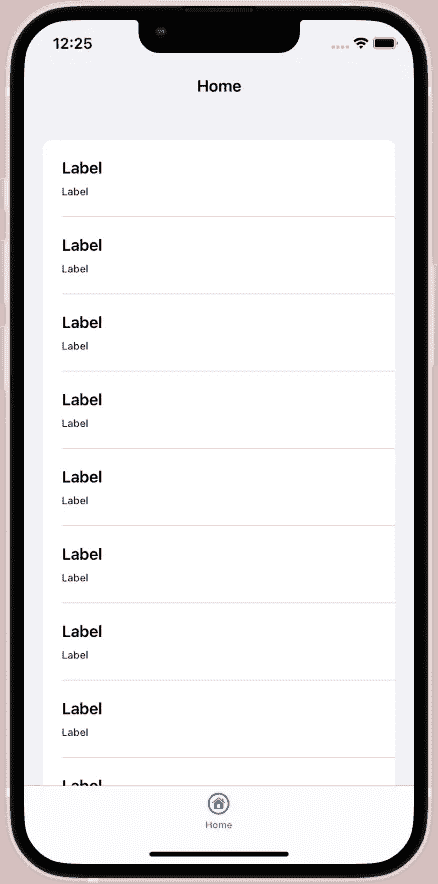
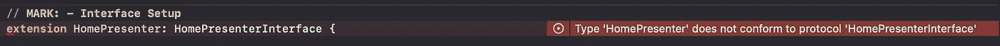
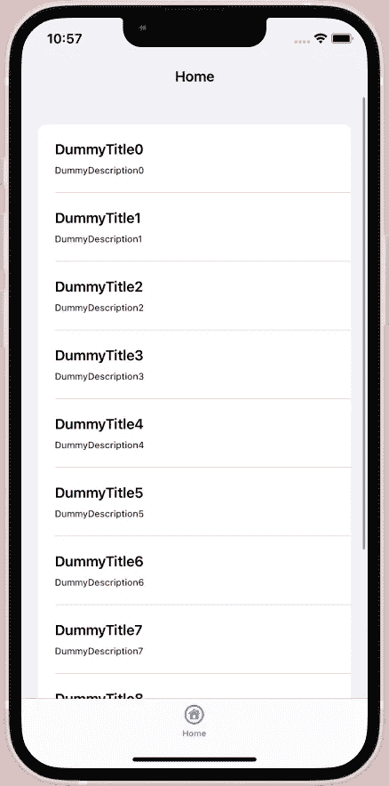
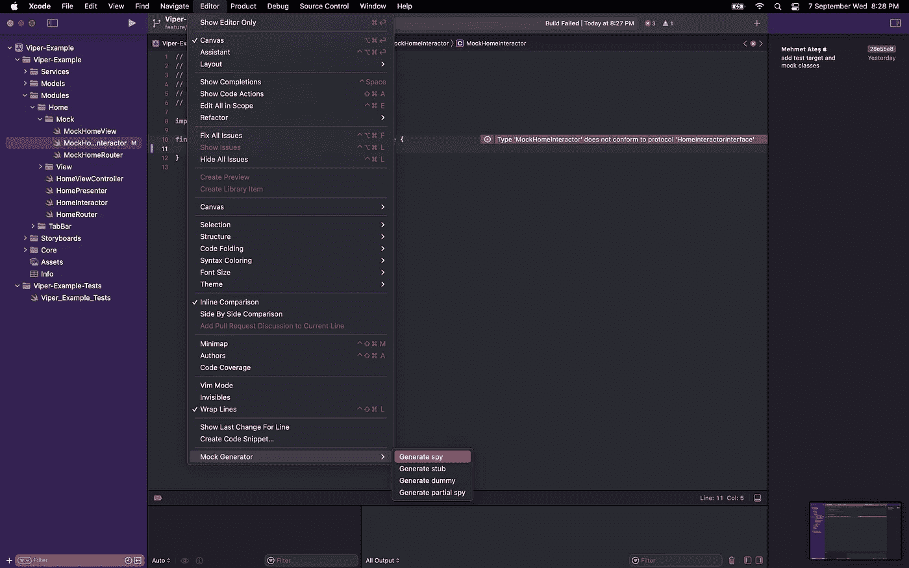
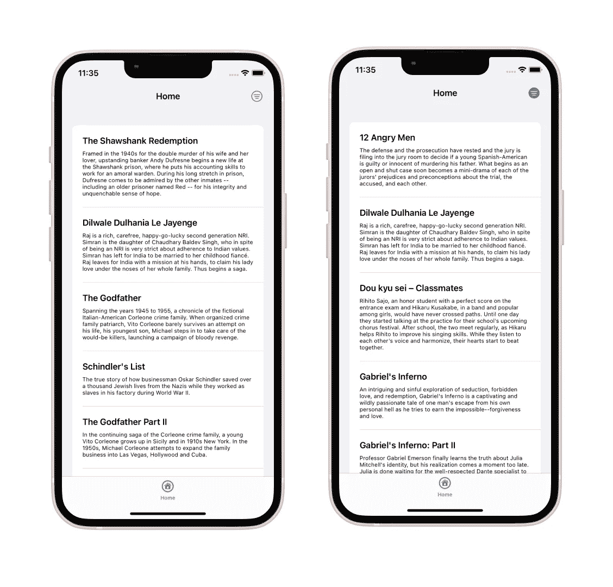

# 在 iOS 中实现 Viper 设计模式

> 原文：<https://betterprogramming.pub/viper-design-pattern-step-by-step-with-example-project-247b3d101a9e>

## 包含示例项目的分步指南


[拉拉·阿兹利](https://unsplash.com/@lazizli?utm_source=medium&utm_medium=referral)在 [Unsplash](https://unsplash.com?utm_source=medium&utm_medium=referral) 上的照片

设计模式！在软件世界中，它们对于我们能够在可持续的代码基础上工作是不可或缺的，这样可以防止我们自己编写代码。毒蛇呢？这是一种我们用来开发 iOS 应用程序的流行设计模式。所以，让我们更好地了解它，踏上长期的冒险之旅。

看来，还能是什么呢？包含用户界面元素并且只能与演示者通信的层。

作为交互者，这一层将我们与现实生活联系起来，同样只与演示者交流。

冤魂，毒蛇的掌上明珠。一切发生的那一层。简而言之，我们连接各层的桥梁。

Eentity(可选)，我们的型号。真的只有模特。我们的结构或类。

R 外，毒蛇的 bigbang。我们的勇敢层负责模块和所有层(包括它自己)的创建。

我们遇到了我们的层。是的，是的，他们也很高兴见到你。所以我们准备回答这个问题。

# **我为什么应该或不应该使用 Viper？**

这里没有诽谤或赞美。只有事实。

让我们从积极的方面开始。

*   Viper 非常容易测试。
*   Viper 很好地提供了代码布局。
*   可读性很高。

**我们来看看不好的一面。**

*   蝰蛇非常笨重。太多层次太多时间！
*   这很复杂。你可能会迷失在文件夹中。或者你找到确切的路径。

现在就来看看这些项目吧。

*   你想快速发布一个应用。非常快。例如使用 SwiftUI。最好不要用。
*   你已经开始了一个巨大的 UIKit 项目。需要测试。一定要用。

# 了解毒蛇

如果你从未做过面向协议的编程，Viper 是一个令人头疼的东西。但是一旦你习惯了，它就消失了。这篇文章正是为此而写的。让我们卷起袖子开始吧。

我为此编写了一个应用程序，当您阅读本文时，您可以检查它并了解代码是如何工作的。

[](https://github.com/devmehmetates/Viper-Example) [## GitHub-devmehmetates/Viper-示例

### 此时您不能执行该操作。您已使用另一个标签页或窗口登录。您已在另一个选项卡中注销，或者…

github.com](https://github.com/devmehmetates/Viper-Example) 

我认为我们的首要工作是完成我们一直在做的视图层。这里我使用`UICollectionView`的组合布局创建了一个简单的列表视图。即使这样做，我也需要**呈现器**，但是现在让我们在视图控制器中做。

# **查看**

下面你看到的代码肯定不适合**蝰蛇❌**



上面的代码给出了相同的输出。已经成功地创建了细胞，并且已经准备好了基础。现在让我们通过保持视图不变来将这段代码传递给 Viper。正如我前面提到的，Viper 非常积极地使用 P.O.P。因此，我们在视图界面的 presenter 中定义所有视图操作。这样做的目的是为了能够从演示者处访问。我们来看看剪辑版。

# **毒蛇解✅**

你正看着一大段代码，你可能不明白会有什么变化。首先，确保这段代码给出相同的输出。我们目前有一个演示者没有出现在背景中，这可能会令人困惑。但是不要担心！一切很快就会明朗。

*   第一个变化当然是协议。我们添加了 2 个函数，并在`ViewController`中定义。我们现在需要做的是在需要的地方调用它。这就是目前的`presenter.notifyViewDidLoad()`
*   第二个变化是`numberOf`功能。这些功能可能因服务器或本地服务而异。所以这个数字应该由服务器传递给视图。这样，如果有变化，视图可以知道它。
*   最后一个变化是`setTitle`功能。把这个转给演示者的原因其实是一样的。因为我们可以通过服务来设置。

如你所见，我们实际上正在做的是分离所有的逻辑操作。与此同时，我们已经为未来编写了代码。虽然这一开始会让它变慢，但以后会加快很多。记住。**视图尚未完成。**现在让我们编写一个服务并创建我们的交互层。

# 交互者、服务和实体

因为这些是相互关联的，所以最好将它们一起处理。Interactor 连接服务并为我们处理模型。我们将有一个非常简单的模型和一个负责读取它的服务。

如你所见，我们有一个相当简单的模型和注册系统。它有阅读和写作的功能。为了让大家理解这一点，请这样想，这是我们为后端操作进行通信的层。我们只发出了一个请求，我们正在获取一个数组。

如你所见，没什么复杂的。我们首先记录我们的数据，然后读取它。因此，互动者履行了自己的责任。现在让我们来看看所有东西的连接处，即`Presenter`。

> 重要提示:您可以忽略这里的第 16 行。它的唯一目的是在首次运行应用程序时为您创建一个数据。如果您愿意，分叉应用程序，运行一次并删除这一行。结果将是一样的。

# 提出者

我们真的来到了几乎所有事情都发生的那一层。这一层现在应该看起来像这样。

在这里慢下来！！这一层对蝰蛇来说是最重要的一层，我们有问题要问。这些是我们会问为什么的问题。让我们慢慢解释我们的层。

见协议。它拥有我们在视图控制器上使用的所有功能。它在界面设置中定义，很清楚它们做什么。完美！

看一下`NotifyViewDidLoad`函数。“看法？”我们看到了这些表情。这些实际上是我们一开始做的`viewController`界面中的功能。它们在演示者中被触发，效果很好。一切似乎都有了解释。现在让我们继续我们的问题:)

*   **为什么变量是私有的？**原因是变量代表我们的类。它希望我们对演示者执行毒蛇逻辑运算。如果我们将其留给公共访问，我们可以通过 ViewControler 直接访问路由器或交互器。我们不应该这样做。
*   **为什么视图弱而其他强？**原因是**保留周期。**演示者在视图控制器上被严格定义。如果我们也将视图定义为 presenter 上的 strong，这两个类将永远不会离开彼此。对于我们的内存管理来说，这是一次糟糕的经历。其他人呢？你认为这适用于互动者吗？`Presenter`甚至没有定义。如果我们保持它的虚弱，交互作用者将无法找到一个可以抓住的分支，并会消失
*   **嗯，我明白了类，但是为什么** `**datas**` **是私有的呢？**记住这是演示者的逻辑。这与我们的第一个问题相关但不完全相同。如果我们将这些数据作为公共数据打开，我们更有可能“无意中”在视图控制器上执行逻辑操作。比如获得第一批数据:)

我认为我们已经完成了工作中最困难的部分。如果你对保留周期感到困惑，我建议你研究一下。现在，我们可以创建最后的图层并进行最后的编辑。

# 路由器

这是整个页面开始的地方。它将创建所有的层，并给我们一个视图。现在应该是这样的。

**快点，这是什么？为什么协议是空的？为什么我们让它空着？**事实上，它完全可以在我们需要的时候随时使用，原因就在于此。请记住，演示者是通过界面创建的。经典的初始化操作和回退`viewController`。

**但是，路由器也可以。我将在哪里以及如何使用它？**我为你准备了一个标签栏控制器。当然，它也是用 viper 创建的。我们必须在标签栏控制器中做一些事情。比如初始化`ViewController`？

不要在这里混淆。**只关注第 18 行。我们看到了我们的路由器。我们已经运行了我们的功能。而我们开始了**蝰蛇流。现在我们写的所有代码都是活动的。****

# 最后润色

我们已经做了很多操作，但是我们仍然没有将我们的数据处理到视图中。现在是时候定义我们的观点了。为此，我们只需要做 2 个步骤。

*   第一种是在 presenter 中通过索引获取数据。
*   第二是在小区配置中使用该数据。

```
**protocol** HomePresenterInterface: AnyObject {
...
   **func** getDataByIndex(_ index: Int) -> BaseModel?
...
}
```

让我们在协议中添加这个函数。所以我们可以通过索引得到一个基础模型。Xcode 应该在我们加这个的那一刻就气疯了。



让我们在不进一步激怒 Xcode 的情况下完成函数。

```
**func** getDataByIndex(_ index: Int) -> BaseModel? {
   datas?[index]
}
```

好，现在让我们来看风景。

```
cell.configureLabels(with: presenter?.getDataByIndex(indexPath.row))
```

正如你所看到的，这是一条线，工作完美无缺。现在让我们打开我们的应用程序。我们应该会看到我们的数据。



太棒了。这样，我们就完成了我们的申请。当然，如果我们编写了 Viper，而不是如果我们没有为我们的应用程序编写测试。来吧，你不累。让我们也写我们的单元测试，这一切都结束了。

# 单元测试

我们将为这一部分做一些非常酷的事情。我想让你回顾一下这个[链接](https://github.com/seanhenry/SwiftMockGeneratorForXcode)。我想你可以轻松安装。这很简单。如果您已经成功完成了安装，让我们包括我们的项目并继续。在此之前，让我解释一下我们为什么这样做。

我们用 mock 概念复制要测试的类，由于我们已经设置了生成器，我们可以在协议的帮助下在几秒钟内执行测试操作。所以让我们开始吧。

我们是不是突然惊呆了？不要担心，这是一个您将自动创建的文件。所以它是由上面链接的模拟生成器创建的。

**如果你不明白这是怎么做到的:)**



现在让我们来谈谈我们为什么要创建它，以及我们将如何使用它。看一下 interactor 文件来记住。协议中只有一个变量。在模拟文件中，保存了测试所需的变量。在这里迷茫很正常。现在，当我创建一个单元测试并对其进行详细说明时，您将会非常清楚地理解它。

在这里，您可能会注意到其他类也有模拟类。仅演示者除外。我们把它命名为毒蛇的苹果，因为我们在这里做所有的事情。我们把它命名为毒蛇的苹果，因为我们在这里做所有的事情。

现在理解这个短语。通过将我们的模拟类提供给路由器，我们可以模拟 presenter 中定义的层。这样，通过 presenter 触发的视图类将被模仿，我们将能够测试它。因为单元测试的目的是检查一个函数是否触发了一个类。

太好了，现在让我们回顾一下我们的测试。首先，调用 presenter 函数并触发视图模拟类。因此，模拟类中的变量发生了变化，我们的测试成功了。让我们仔细看看这个函数。

```
**func** testNotifyViewDidLoad() {
   ** homePresenter.notifyViewDidLoad()**
    XCTAssertTrue(homeView.invokedSetupView)
    XCTAssertTrue(homeView.invokedSetTitle)
}
```

在我们的第一行中，我们从演示者那里触发一个函数。该函数如下所示:

```
**func** notifyViewDidLoad() {
    **view?.setupView()
    view?.setTitle(with: "Home")**
    fetchDatas()
}
```

如您所见，我们的函数是由视图中定义的两个函数触发的。下面是我们模拟类中的函数！出于这个原因，我们去检查我们的模拟类中的变量是否为真，这样我们就可以确保它被触发。这是我们的目标。为了更清楚地看到它并理解事件，您可以自己更新函数，如下所示，并重新测试。

```
**func** testNotifyViewDidLoad() {
 **XCTAssertFalse(homeView.invokedSetupView)
    XCTAssertFalse(homeView.invokedSetTitle)** 
    homePresenter.notifyViewDidLoad()
    XCTAssertTrue(homeView.invokedSetupView)
    XCTAssertTrue(homeView.invokedSetTitle)
}
```

测试仍然会成功

# 关闭

而你以飞快的脚步进入了毒蛇的世界。分叉项目，这样整篇文章就会浮现在脑海中。然后玩一玩，试着发现变化。

**我想让你经历一些情况。**

*   为了更好地理解演示者上弱的概念，添加和删除弱。用断点跟踪引用和对象。
*   编辑`Interactor`、`Entity`和`Service`。舞台是你的。可以这样从网上打印一个数据吗？如果事情可以分类就好了:)
*   创建排序算法。这将使你清楚如何使用演示者。

这一切都是你做的。你想确保它是正确的。别担心，我当然也考虑过这个问题。检查树枝！您将看到一个名为“高级”的分支。去结帐并检查您的解决方案。

# 注意



在高级分支中，应用程序将以这种状态出现。数据完全通过互联网来获取和更新。你还有很多可以改进的地方。可以试试:)

# 资源

一篇我明确推荐并作为[例子](https://medium.com/trendyol-tech/creating-an-ios-viper-module-step-by-step-guide-cd1f414b7dd3)的文章。

我还要感谢我的导师，他在我准备这篇文章的时候给了我支持，🥹