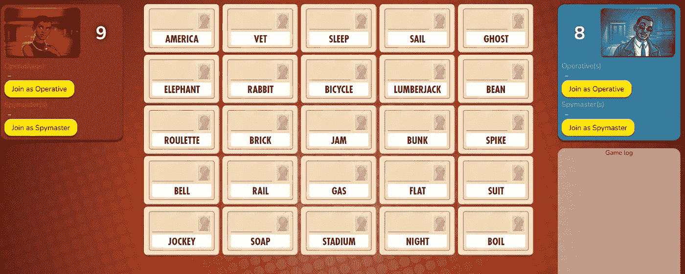
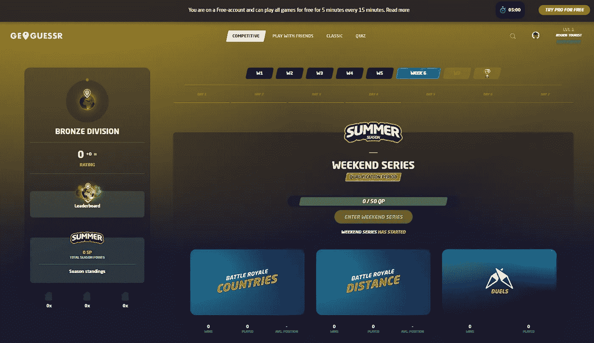
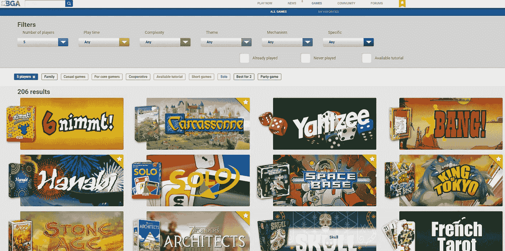
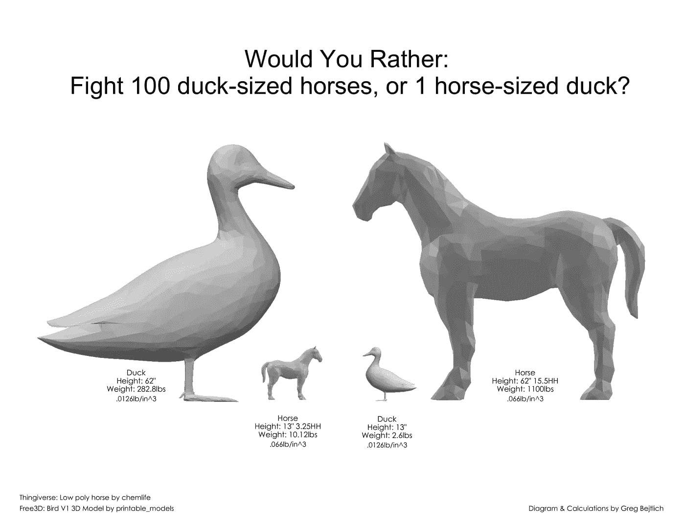

# 虚拟精神错乱——厌倦了你的团队建设活动？试试这些

> 原文：<https://betterprogramming.pub/virtual-insanity-tired-of-your-team-building-activities-try-these-5d00d1f06cfb>

## 你公司规定的娱乐时间已经开始了

准备好你的毛绒帽子，让果酱

科学表明[团队与](https://www.forbes.com/sites/amawson/2020/03/19/managing-the-switch-to-home-working/?sh=78e71ec85394)互动越多，[就越容易建立信任](https://journals.sagepub.com/doi/full/10.1177/0018726718818721)。逻辑表明，队友之间面对面的时间越多，他们就越能适应彼此的交流方式。

作为管理者和领导者，我们必须为这些互动创造空间，*尤其是在偏远的环境中*。以下是我最喜欢的远程团队团队建设活动。

请记住，你不能*强迫*开心，但是你*可以*为你的团队创造开心的时间和空间。远程活动应该有一个低门槛的进入，以获得最大的乐趣。任何远程活动的一些快速基本规则:

*   要包容。在开始之前，确保每个人都处于公平的竞争环境中
*   保持清淡。小心那些过度争强好胜的人，帮助他们远离任何爆发或尴尬
*   鼓励，但不要强迫参与。根据一天中的时间，有些人不会有兴趣参与，这完全没问题。与你的团队合作，找出如何让更多的人参与进来，并在一年中尝试不同的时间段

# 本周的第一次会议

我最喜欢的是我现在的团队每周做的有趣的事情。这是我们团队会议的前 10-15 分钟，涵盖两个主题。

1.  周末集锦
2.  您的缩放背景

《周末集锦》很容易理解，但是背景更加独特。每周我们轮流主持会议，谁主持会议，谁就为背景选择一个主题。类似于:

*   最被低估的电影
*   你长大后想做什么
*   你旅行时喜欢做的事情

有无穷无尽的主题。每个团队成员加载一个代表主题的背景，在他们的周末集锦之后，他们解释他们的背景。

这是一种有趣的方式，可以更多地了解团队中的每个人，并让我们做好准备，在会议中讨论任何其他事项。当人们有相似的兴趣或提出后续问题时，情况会变得更好。问一些后续的问题，保持好奇心，更多地了解你每天将一起工作的人。

**时间:**10–15 分钟
**参与者:** 3+

# 代号

Codenames 是一款很好的在线版棋盘游戏，容易上手，也能让人们畅所欲言。游戏代号为[。游戏代号为](https://codenames.game/)，这个游戏设定了一个间谍大师，他必须提供线索来帮助他们的团队猜测正确的单词以赢得游戏。

平托，5 岁。

加入进来，创建团队，看看人们是如何一起工作和思考的。团队如何得出结论，并根据单词集合理解释线索的含义，这是一半的乐趣，另一个团队也在玩一点花招。

**时间:**每回合 20 分钟左右
参与者:最多 8 人

# GeoGuessr

我有一个团队每周玩 GeoGuessr，这很有趣，因为它迫使你“旅行”并思考世界上的其他地区。这款游戏将你放在谷歌街景上的一个位置，并利用线索让你猜自己在哪里。

专业版给了你更多的选择，我相信只有一个人需要它来解锁更多的功能。作为每周的讨论点很棒，可以在一周内异步进行。

**时间:**异步，每周一次(所有回合约 15 分钟)
**参与者:**无限制

# 棋盘游戏竞技场

有了异步和现场游戏，[桌游竞技场](https://boardgamearena.com/welcome)为小团体游戏提供了数百个机会。异步功能很有趣，因为一个游戏可以持续一整周，让你在每周的互动中有话题可聊。

玩现场游戏同样有趣，因为你会得到所有的反应(甚至可能是一些轻垃圾话)，你不会从一个异步游戏。

它有最好的用户界面吗？绝对不是，但事实上有数百个游戏和过滤器来为你和你的团队找到合适的游戏是非常惊人的。

可在浏览器中玩，棋盘游戏竞技场使学习规则和直接玩游戏变得容易。如果至少有一个人知道规则会有所帮助，但这不是一个硬性要求。

**时间:** 10 分钟— 2 小时
**参与者:**2–12

# Jackbox 派对套装

一个经典的多人游戏集合， [Jackbox Party Pack](https://www.jackboxgames.com/party-pack-eight/) 从创造性的 Drawful 到琐事谋杀党的每一个琐事。

最棒的是，这一切都可以在你的手机上播放。游戏制作者会得到一个密码，玩家只需要输入密码就可以开始游戏。简单明了。

Jackbox 是最好的团体游戏之一，通常有利于欢笑和竞争。有*潜在的*让它变得有点脏，所以保持关注。

虽然这不是一个硬性要求，但 Jackbox 需要在第一次进行一些设置，以便每个人都可以听到声音/音乐，但在那之后，就一帆风顺了。请务必练习设置以获得最佳体验。

GameRant 列出了 18 款最佳 Jackbox 游戏的清单，这样你就可以选择购买其中一款。

**时间:**10–30 分钟
参与者:2–10

# 破冰船

"好的，亚历山大随时都会到，他到了我们就开始。"会议开始已经三点多了，人们一直在默默检查手机、手机等设备，因为会议的一个关键人物还没有到场。

你猜怎么着，你刚刚错过了三分钟的时间，在这三分钟里，你的团队可以更多地了解彼此。与其沉默地坐着，不如问一个破冰的问题。有太多的破冰者名单，我可能会在某个时候贴出我自己的一个，但现在有几个有趣的:

*   你可以带一本书、一本相册和一种食物去荒岛，它们是什么？
*   生活在哪个电视节目真人秀里最有趣？
*   你愿意打一百只鸭子大小的马还是一只马大小的鸭子？
*   世界上门和轮子哪个更多？
*   如果你有机会进行时间旅行，但只有 30%的机会回到你现在的时间，你会这样做吗？

从[r/工程名称](https://www.reddit.com/r/engineeringmemes/comments/hrrg71/calculated_weight_size_would_you_rather_fight_100/)

只要有一个人不介意问这个问题，你就可以走了。

**时间:**1–10 分钟
**参与者:** 2+

# 其他选项

*   [Shell Shockers](https://shellshock.io/) —基于浏览器的 Egg FPS(这个没有蛋黄)
*   [徒步旅行](https://arc.dev/w/remote-game)——“一次有点邪恶的择路探险”——需要一些准备，但是高度互动
*   [Kingmakers](https://kingmakersfun.com/) —俄亥俄州哥伦布市的一个有趣的支点在疫情期间，Kingmakers 从一个实体的棋盘游戏库变成了一个虚拟游戏主机。很多乐趣，即使对于庞大的群体。
*   猜猜冰箱——所有团队成员提前拍下他们冰箱的照片，并发送给游戏 meister。每次拿出一个，小组必须决定冰箱属于谁。
*   YouTube 晚会——使用 [Watch2Gether](https://w2g.tv/) ，你可以举办一个观看派对，任何人都可以添加到播放列表中。设置一些基本规则，也许设置一个主题，看看人们会提出什么。甚至可以用于更有教育意义的聚会(比如一起看 Ted 演讲)

有如此多的选择，那么你的远程团队还喜欢什么活动或游戏呢？